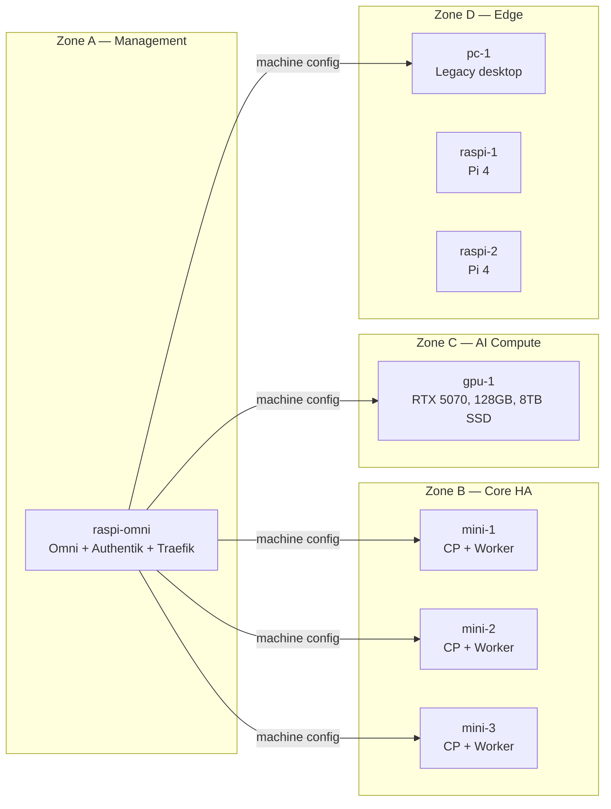
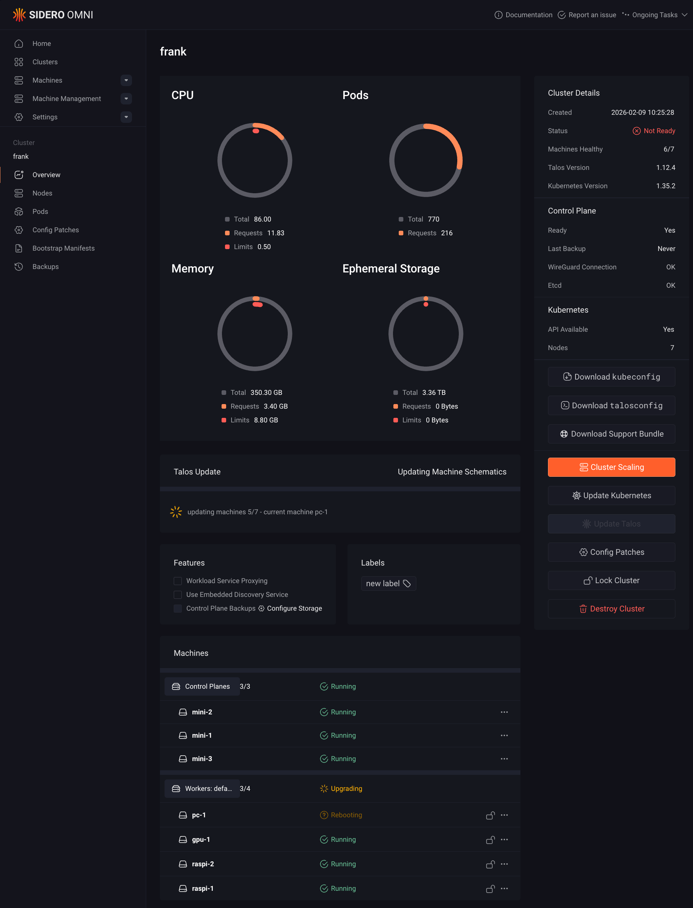

I knew Kubernetes from the cloud. EKS, GKE — they hand you a cluster with networking, storage, and GPU scheduling already wired. You push a manifest, it works, and you have no idea how. The abstraction is the point if your job is shipping features. But if your job is understanding infrastructure, the abstraction is the obstacle.

I wanted to know what happens between `kubectl apply` and a running pod. How does the CNI assign an IP? How does Longhorn replicate data without a SAN? How does an immutable OS manage disk mounts when there is no SSH and no shell? You can read about eBPF kube-proxy replacement or DRA-based GPU sharing all day. But you can also break it, fix it, and actually learn it.

The hardware was already sitting around. An i9 desktop retired from daily use. A stack of Intel NUCs. Two Raspberry Pi 4s gathering dust. The cluster turns idle machines into a platform. The goal was never "run a production cluster at home." It was to build one that *could* be production, so the skills transfer directly.

## The Shape That Emerged

What started as "throw Kubernetes on some boxes" became a four-zone design, driven less by planning and more by what each machine forced us to confront.

**Zone A** is a single Raspberry Pi 5 that lives outside the cluster. It runs Sidero Omni (machine lifecycle), Authentik (SSO), and Traefik (ingress). Putting management outside the cluster was a lesson learned the hard way — more on that in Missteps.

**Zone B** is three identical Intel NUCs (Ultra 5, 64GB, 1TB NVMe). They form the HA control plane. Because Talos lets control planes run workloads, these also host Longhorn storage and most cluster services. Identical hardware means predictable capacity. No surprises.

**Zone C** is one machine: a custom desktop with an i9, 128GB RAM, an RTX 5070, and two 4TB SATA SSDs. It is the single node that makes the cluster interesting — local LLM inference, diffusion models, agentic workloads. Everything GPU-related lands here.

**Zone D** is the rag-tag edge: a legacy desktop (pc-1) and two Raspberry Pi 4s. They run CI/CD pipelines, monitoring scrapers, DNS caches — workloads that need to be always-on but do not need a GPU or fast storage.

{{< screenshot src="homelab.png" alt="The Frank cluster in its natural habitat. The minis are hidden behind a patch panel. The GPU desktop stands to the left. The Raspberry Pis are in a horizontal rack kit alongside other network gear. The GPU did not fit in a rack-mountable case so it lives in a gaming case with LEDs that never turn off." caption="The Frank cluster in its natural habitat. The minis are hidden behind a patch panel. The GPU desktop stands to the left. The Raspberry Pis are in a horizontal rack kit alongside other network gear. The GPU did not fit in a rack-mountable case so it lives in a gaming case with LEDs that never turn off." >}}

## The Two-Layer Model That Makes It Work

The single most important design decision was separating machine config from workload config. It was not obvious at first. Early on, Omni and ArgoCD overlapped in confusing ways — Omni would install an OS extension, ArgoCD would try to manage the same resource, and neither knew about the other.

The fix was a clean boundary:

- **Layer 1 (Machine Config):** Sidero Omni manages Talos Linux machine configurations — OS extensions, kernel modules, disk mounts, network settings. Applied via `omnictl` config patches. Version-controlled in `clusters/frank/`.
- **Layer 2 (Workloads):** ArgoCD manages everything running *on* Kubernetes — CNI, storage, GPU drivers, applications. GitOps via `apps/` in the same repo.

Omni never touches workloads. ArgoCD never touches machine config. When a problem surfaces, you know which layer to debug.

## What the Series Covers

Each post in this series builds one layer on top of the last. The roadmap below shows the full sequence — the post you are reading sits at Layer 0, the motivation.



## What You Need to Follow This

- Familiarity with `kubectl` and basic Kubernetes concepts (Pod, Service, Deployment)
- A Talos-compatible machine (x86 or ARM64) to experiment on — even a single node is enough for most layers
- About 30 minutes per layer post

The series assumes you are building alongside. Each post ends with a running cluster state you can verify.

## Missteps

| What Happened | Why It Was Wrong | How We Fixed It | Commit |
|---------------|-----------------|-----------------|--------|
| **Management ran on mini-1** — Omni and Authentik shared the first control-plane node at boot | A control-plane reboot would take down management (Omni) and auth (Authentik) simultaneously, creating a circular dependency where nothing could restart without the other | Moved Omni and Authentik to a dedicated Raspberry Pi 5 outside the cluster | `frank-infrastructure.md` |
| **Zone D was originally just pc-1** — the Raspberry Pis were added months later as an afterthought | The cluster needed low-power edge nodes for always-on workloads (DNS caches, monitoring scrapers) without burning 65W x86 idle power | Added raspi-1 and raspi-2 as `tier: low-power` edge workers | `ce2fcd9e` |
| **No hardware photo for the first three months** — readers had diagrams of logical topology but no sense of the physical rack layout | The abstract diagrams made the cluster feel theoretical; the photo made it real | Added `homelab.png` showing the rack, minis, and gpu-1 workstation | `46673fde` |
| **Early drafts documented a manual kubeadm install on Ubuntu** — the entire bootstrap section described a flow that Omni later replaced | Omni support was added mid-series, making the documented approach obsolete and requiring a full revision of the foundation post | Rewrote to describe Omni-based bootstrap as the primary path | `ce2fcd9e` |

## References

- [Talos Linux](https://www.talos.dev/) — Immutable, secure, minimal Kubernetes OS
- [Sidero Omni](https://www.siderolabs.com/omni/) — SaaS-simple Kubernetes cluster management for Talos Linux
- [ArgoCD](https://argo-cd.readthedocs.io/en/stable/) — Declarative GitOps continuous delivery for Kubernetes
- [Cilium](https://docs.cilium.io/en/stable/) — eBPF-based networking, observability, and security
- [Longhorn](https://longhorn.io/) — Cloud-native distributed block storage for Kubernetes
- [NVIDIA GPU Operator](https://docs.nvidia.com/datacenter/cloud-native/gpu-operator/latest/) — GPU management in Kubernetes
