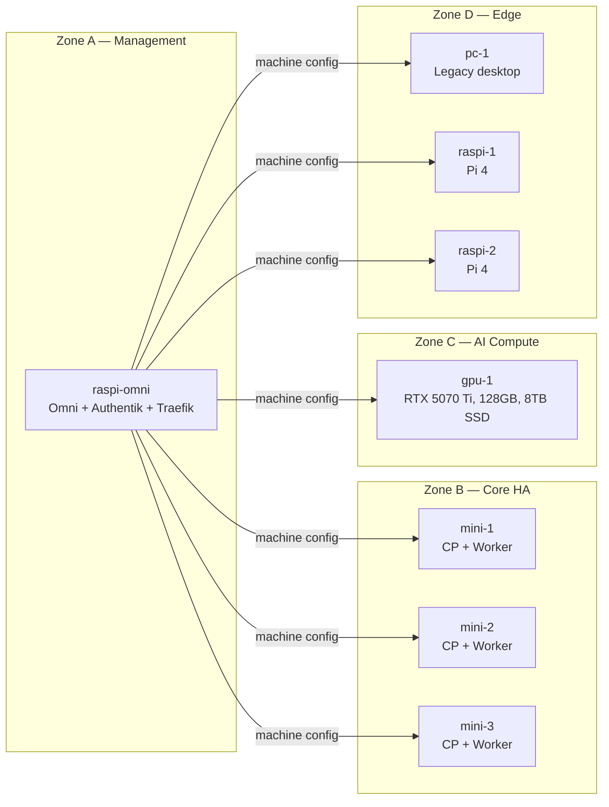
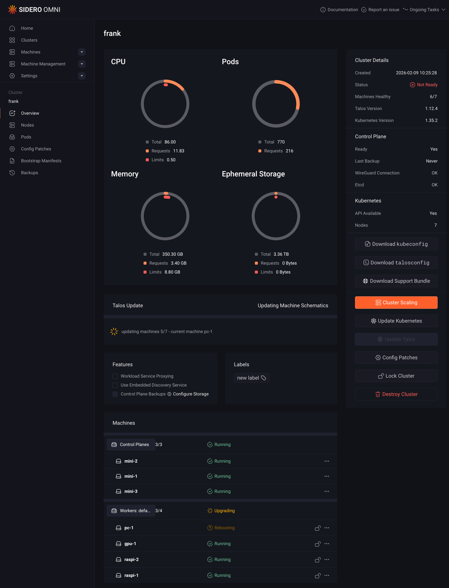

I knew Kubernetes from the cloud. ,  — they hand you a cluster with networking, storage, and GPU scheduling already wired. You push a manifest, it works, and you have no idea how. The abstraction is the point if your job is shipping features. But if your job is understanding infrastructure, the abstraction is the obstacle.

I wanted to know what happens between `kubectl apply` and a running pod. How does the  assign an IP? How does Longhorn replicate data without a SAN? How does an immutable OS manage disk mounts when there is no SSH and no shell? You can read about eBPF kube-proxy replacement or -based GPU sharing all day. But you can also break it, fix it, and actually learn it.

The hardware was already sitting around. An i9 desktop retired from daily use. A stack of Intel . Two Raspberry Pi 4s gathering dust. The cluster turns idle machines into a platform. The goal was never "run a production cluster at home." It was to build one that *could* be production, so the skills transfer directly.

## The Shape That Emerged

What started as "throw Kubernetes on some boxes" became a four-zone design, driven less by planning and more by what each machine forced us to confront.


```mermaid
flowchart LR
  subgraph M[Zone A — Management]
    omni[raspi-omni<br/>Omni + Authentik + Traefik]
  end
  subgraph C[Zone B — Core HA]
    n1[mini-1<br/>CP + Worker]
    n2[mini-2<br/>CP + Worker]
    n3[mini-3<br/>CP + Worker]
  end
  subgraph G[Zone C — AI Compute]
    gpu[gpu-1<br/>RTX 5070 Ti, 128GB, 8TB SSD]
  end
  subgraph E[Zone D — Edge]
    pc[pc-1<br/>Legacy desktop]
    r1[raspi-1<br/>Pi 4]
    r2[raspi-2<br/>Pi 4]
  end

  omni -->|machine config| n1
  omni -->|machine config| n2
  omni -->|machine config| n3
  omni -->|machine config| gpu
  omni -->|machine config| pc
  omni -->|machine config| r1
  omni -->|machine config| r2
```

**Zone A** was a single Raspberry Pi 5 living outside the cluster. It carried three jobs: Sidero Omni (machine lifecycle), a Docker Traefik acting as the public edge for every `*.frank.derio.net` name, and the Let's Encrypt minter for that zone. It did not run Authentik.  has always been an in-cluster ArgoCD app; the Pi only fronted its hostname. That distinction sounds pedantic until something dies, at which point "hosts the name" and "runs the service" fail in completely different ways.

Which is not hypothetical. On 2026-06-20 [the Pi failed outright](https://github.com/derio-net/frank/blob/main/docs/runbooks/frank-gotchas/omni.md), taking all three jobs with it. The cluster carried on: control plane and workers boot independently of Omni, every workload stayed `Ready`, and the LAN service IPs kept answering. Nothing paged either, because the health monitoring is in-cluster and the cluster was genuinely fine. What went was `kubectl` and `talosctl`, because the stored kubeconfig points at Omni's proxy and no break-glass credential for the real apiserver had ever been saved. Omni answers at its old hostname again, but the runbook's durable plan (an Ansible-managed Proxmox host with HA and a UPS, explicitly "not another Pi") is still open, and the `*.frank` names are being served by the in-cluster Traefik as a stopgap. Read the current arrangement as interim.

**Zone B** is three identical Intel NUCs (Ultra 5, 64GB, 1TB NVMe). They form the  control plane. Because Talos lets control planes run workloads, these also host Longhorn storage and most cluster services. Identical hardware means predictable capacity. No surprises.

**Zone C** is one machine: a custom desktop with an i9, 128GB RAM, an RTX 5070 Ti (16GB GDDR7), and two 4TB SATA SSDs. It is the single node that makes the cluster interesting — local  inference, diffusion models, agentic workloads. Everything GPU-related lands here.

**Zone D** is the rag-tag edge: a legacy desktop (pc-1) and two Raspberry Pi 4s. They run CI/CD pipelines, monitoring scrapers, DNS caches — workloads that need to be always-on but do not need a GPU or fast storage.

{{< screenshot src="homelab.png" alt="The Frank cluster in its natural habitat. The minis are hidden behind a patch panel. The GPU desktop stands to the left. The Raspberry Pis are in a horizontal rack kit alongside other network gear. The GPU did not fit in a rack-mountable case so it lives in a gaming case with LEDs that never turn off." caption="The Frank cluster in its natural habitat. The minis are hidden behind a patch panel. The GPU desktop stands to the left. The Raspberry Pis are in a horizontal rack kit alongside other network gear. The GPU did not fit in a rack-mountable case so it lives in a gaming case with LEDs that never turn off." >}}

## The Two-Layer Model That Makes It Work

The single most important design decision was separating machine config from workload config. With two declarative systems in play there are three arrangements available, and only one of them is comfortable. You can let both manage everything and rely on discipline to keep them apart. You can hand one of them everything and give up the other's strengths. Or you can draw a boundary and pay to defend it. The first is the default, because it requires no decision, and it is the one where an OS extension installed by Omni is also a resource ArgoCD is trying to reconcile, with neither aware of the other.

Frank runs the third:

- **Layer 1 (Machine Config):** Sidero Omni manages Talos Linux machine configurations: OS extensions, kernel modules, disk mounts, network settings. Applied via `omnictl` config patches, version-controlled in `patches/`.
- **Layer 2 (Workloads):** ArgoCD manages everything running *on* Kubernetes: CNI, storage, GPU drivers, applications. GitOps via `apps/` in the same repo.

Omni never touches workloads. ArgoCD never touches machine config. When a problem surfaces, you know which layer to debug.

The repo layout is asymmetric and it is worth knowing why before you go looking. A later multi-cluster restructure gave the Hop edge cluster its own `clusters/hop/` subtree, but never moved Frank; Frank is the default cluster, so its two directories stayed at the repo root. There is no `clusters/frank/`.



## Verify the boundary on your own cluster

A boundary is easy to describe and easy to violate, so check it rather than believe it. Three checks, each of which answers less than it looks like it answers, which is why there are three. Output below captured 2026-07-29.

Start with what the cluster reports about itself:

```console
$ kubectl get nodes -L zone,tier,accelerator
NAME      STATUS   ROLES           AGE    VERSION   ZONE         TIER        ACCELERATOR
gpu-1     Ready    <none>          148d   v1.35.3   ai-compute   standard    nvidia
mini-1    Ready    control-plane   148d   v1.35.3   core         standard    intel-igpu
mini-2    Ready    control-plane   148d   v1.35.3   core         standard    intel-igpu
mini-3    Ready    control-plane   148d   v1.35.3   core         standard    intel-igpu
pc-1      Ready    <none>          148d   v1.35.3   edge         standard
raspi-1   Ready    <none>          148d   v1.35.3   edge         low-power
raspi-2   Ready    <none>          148d   v1.35.3   edge         low-power
```

Be precise about what that establishes. It establishes that seven nodes exist, that they carry zone labels, and that Zone A is not among them: management has no node because it lives outside the cluster it manages, and the day it shows up here is the day the separation quietly collapsed. It establishes nothing whatsoever about *who set the labels*. A `kubectl label node` typed by hand produces output identical to the above, character for character. If you decide the boundary is intact on the strength of this command, you have decided it on the strength of a screenshot.

So trace a label back to the file that declares it:

```console
$ grep -rn 'zone: ai-compute' patches/ apps/
patches/phase01-node-config/03-labels-gpu-1.yaml:13:                zone: ai-compute
```

One hit, under `patches/`, nothing under `apps/`. That is worth exactly one string, one direction, one node. It says a machine fact has not leaked into the workload tree. It says nothing at all about traffic in the other direction, and the other direction is where Frank actually leaks. Ask it:

```console
$ git ls-files 'patches/**/*.yaml' | xargs grep -L 'omni.sidero.dev'
patches/phase02-cilium/cilium-values.yaml
patches/phase03-longhorn/longhorn-gpu-local-sc.yaml
patches/phase03-longhorn/longhorn-values.yaml
patches/phase04-gpu/gpu-operator-values.yaml
patches/phase13-auth/authn-config.yaml
```

Every genuine Omni resource declares a `type:` ending in `.omni.sidero.dev`, so anything in the machine-config tree without that string is either a false positive or a leak. One is a false positive: `authn-config.yaml` is a bare Kubernetes `AuthenticationConfiguration` that the API server reads by path, with no Omni envelope to carry — Layer 1 doing its job. The other four are Cilium's Helm values, Longhorn's Helm values, a Longhorn StorageClass, and the GPU Operator's Helm values. Four Layer 2 files, tracked, non-empty, sitting in the Layer 1 tree.

They are archaeology. That is how the cluster was installed before ArgoCD existed, `patches/README.md` says as much, and the live versions have lived at `apps/cilium/values.yaml`, `apps/longhorn/values.yaml`, `apps/longhorn/manifests/gpu-local-sc.yaml` and `apps/gpu-operator/values.yaml` for a long time. Nothing applies the old copies — though "nothing applies them" is a fact about the current state of the scripts, not a property of the files. They are also actively misleading. `patches/phase03-longhorn/longhorn-values.yaml` documents `helm install --version 1.11.0` against a path (`patches/phase3-longhorn/`) that a directory rename retired, and the cluster left 1.11.0 in June over an instance-manager memory leak. Three separate facts in one dead file, all wrong, none of them announcing it.

The decision procedure, then. Run all three against your own repo and read them as a set:

- **Labels present, grep clean, reverse check clean.** The boundary holds. Nothing to do.
- **Reverse check names files.** Open each one. If it is live, you have a real leak and the fix is to move it. If it is dead, delete it or say in the README that it is dead, because the next person to grep this tree will not know which.
- **Forward grep finds a node label inside a Helm chart.** This is the expensive one. The first question of every future debugging session ("which layer owns this?") no longer has an answer, and no amount of the other two checks passing will give it back.

## What the Series Covers

Each post in this series builds one layer on top of the last. The roadmap below shows the full sequence — the post you are reading sits at Layer 0, the motivation.



## What You Need to Follow This

- Familiarity with `kubectl` and basic Kubernetes concepts (Pod, Service, Deployment)
- A Talos-compatible machine (x86 or ARM64) to experiment on — even a single node is enough for most layers
- About 30 minutes per layer post

The series assumes you are building alongside. Each post ends with a running cluster state you can verify.

## Missteps

| What Happened | Why It Was Wrong | How We Fixed It | Evidence |
|---------------|-----------------|-----------------|----------|
| **Management was a single un-redundant board** — Omni, the public `*.frank` edge, and the zone's cert minter all on one Raspberry Pi 5 | Putting management outside the cluster was right; putting three roles on one un-HA'd board was a separate decision that nobody made deliberately. When it died there was no second copy of any of the three | `*.frank` names re-fronted onto the in-cluster Traefik; Omni's durable rehoming onto an HA Proxmox host is still open | [`frank-gotchas/omni.md`](https://github.com/derio-net/frank/blob/main/docs/runbooks/frank-gotchas/omni.md) |
| **No break-glass credential existed** — the only kubeconfig and talosconfig routed through Omni's proxy | The real apiserver on `192.168.55.21:6443` and the Talos API on `:50000` both stayed up and reachable on the LAN throughout the outage. They were unusable purely for want of a credential, and Omni, which mints them, was the dead thing | Not fixed. Recorded, so the next person does not discover it the same way | [`frank-gotchas/omni.md`](https://github.com/derio-net/frank/blob/main/docs/runbooks/frank-gotchas/omni.md) |
| **Helm values for Cilium, Longhorn and the GPU Operator were left under `patches/`** — the pre-ArgoCD install method, never deleted when ArgoCD took over | Four Layer 2 files in the Layer 1 tree, still tracked, quietly contradicting the boundary this post is about. One of them documents an install command with a stale chart version and a stale directory path | Named in the verify section above rather than swept up | `patches/phase0{2,3,4}-*/`, `patches/README.md` |
| **Management was described as running Authentik** — it never did; the Pi fronted `auth.frank.derio.net`, while the identity provider itself has been an in-cluster ArgoCD app since Layer 13 | "Hosts the name" and "runs the service" fail in different ways, so conflating them makes an outage harder to reason about at exactly the wrong moment | Zone A's description corrected above | `apps/authentik/`, commit `8e5da3f3` |

## References

- [Talos Linux](https://www.talos.dev/) — Immutable, secure, minimal Kubernetes OS
- [Sidero Omni](https://www.siderolabs.com/omni/) — SaaS-simple Kubernetes cluster management for Talos Linux
- [ArgoCD](https://argo-cd.readthedocs.io/en/stable/) — Declarative GitOps continuous delivery for Kubernetes
- [Cilium](https://docs.cilium.io/en/stable/) — eBPF-based networking, observability, and security
- [Longhorn](https://longhorn.io/) — Cloud-native distributed block storage for Kubernetes
- [NVIDIA GPU Operator](https://docs.nvidia.com/datacenter/cloud-native/gpu-operator/latest/) — GPU management in Kubernetes
