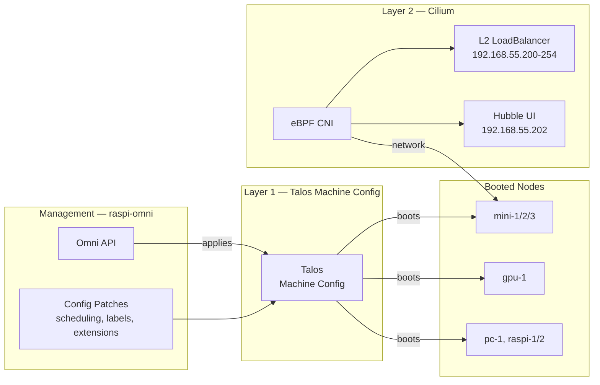
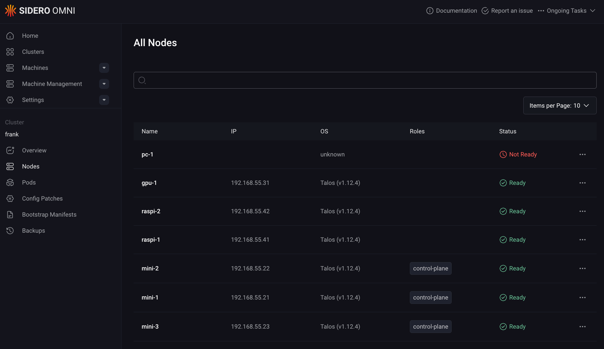
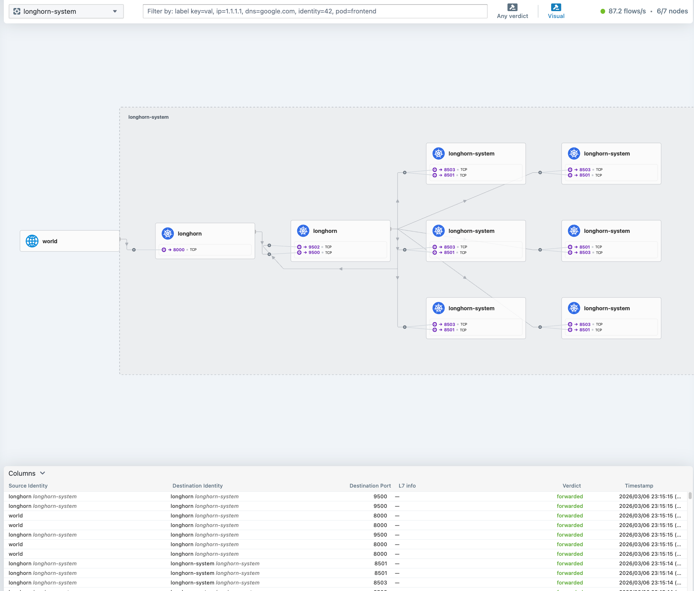

Every Kubernetes cluster starts with a choice of operating system. Most guides reach for Ubuntu Server and kubeadm — a general-purpose OS with Kubernetes installed on top. It works, but it carries an assumption you will SSH into your nodes, install packages, edit files, and maintain a general-purpose Linux system alongside your cluster. Over time, that OS layer accumulates drift: an apt upgrade here, a stale config file there. Reproducing any given node becomes an exercise in archaeology.

I did not want to manage seven operating systems. I wanted to manage one cluster.

This post covers three layers of that foundation: bootstrapping Talos Linux via Omni, organizing nodes into labeled zones, and replacing Flannel with Cilium for eBPF-based networking. By the end, the cluster has a working CNI with L2 LoadBalancer and Hubble observability — the substrate everything else builds on.



## The Talos Bet

Talos Linux is a purpose-built, immutable operating system designed to run Kubernetes and nothing else. There is no SSH. There is no shell. There is no package manager. The entire OS is defined by a single machine configuration document, applied through a gRPC API via `talosctl`. To change something about a node — add a kernel argument, enable a system extension, set a static IP — you modify the machine config and apply it. The node reconciles to match.

Three properties make this bet worth taking:

- **Reproducibility.** Every node's state is fully described by its machine config. Rebuild any node by re-applying the same document.
- **Security posture.** With no shell access and a read-only root filesystem, the attack surface is minimal. Nothing to harden because nothing extra is installed.
- **Declarative operations.** Updates, reboots, configuration changes — all API calls. Version-control the machine configs and treat them like any other IaC artifact.

The trade-off is real: when something goes wrong, you cannot SSH in and poke around. Debugging happens through `talosctl logs`, `talosctl dmesg`, and the Kubernetes API. It takes adjustment, but once you internalize the workflow, the operational simplicity is worth it.

## Bootstrapping with Omni

Sidero Omni sits on `raspi-omni` in Zone A and handles machine lifecycle: enrollment, configuration, upgrades, and cluster creation. It is a SaaS-like control plane for Talos — boot a machine with the Omni ISO, it phones home, and you assign it to a cluster through the Omni dashboard or API.



For this cluster, the bootstrap sequence was straightforward:

1. Flash each machine (minis, gpu-1, pc-1, Raspberry Pis) with the Omni Talos ISO.
2. Machines appear in the Omni inventory as unallocated.
3. Create the `frank` cluster in Omni, assign `mini-1`, `mini-2`, `mini-3` as control planes, the rest as workers.
4. Omni generates machine configs, pushes them to each node, and bootstraps etcd.

Omni lives outside this repo — it is Zone A infrastructure, managed manually on `raspi-omni`. Everything from Layer 1 onward is applied as **config patches** through `omnictl`, which layer on top of the base machine configs Omni generated. Each patch targets either the whole cluster or a specific machine by ID.

### Verifying the Bootstrap

```console
$ talosctl health --nodes 192.168.55.21 2>&1 | head -10
discovered nodes: ["192.168.55.31" "192.168.55.71" "192.168.55.41" "192.168.55.42" "192.168.55.21" "192.168.55.22" "192.168.55.23"]
waiting for etcd to be healthy: ...
waiting for etcd to be healthy: OK
waiting for all nodes to finish boot sequence: ...
waiting for all nodes to finish boot sequence: OK
```

Seven nodes, all healthy, all ready.

## Layer 1: Node Configuration

With the cluster bootstrapped and all seven nodes reporting Ready, the first order of business was making the cluster usable for a homelab workload mix. That means two things: letting workloads run on the control plane nodes, and labeling every node so scheduling decisions can be targeted later.

### Control Plane Scheduling

In a production environment, you keep workloads off the control plane. In a homelab with three control-plane nodes that are also the best hardware (Intel NUC-class minis with 64 GB RAM each), leaving them idle is wasteful. The following Omni config patch removes the default `NoSchedule` taint from all control-plane nodes:

```yaml
# patches/phase01-node-config/01-cluster-wide-scheduling.yaml
cluster:
    allowSchedulingOnControlPlanes: true
```

This is a cluster-scoped patch. Talos handles it at the config level rather than requiring `kubectl taint`. The result: `mini-1`, `mini-2`, and `mini-3` run both control-plane components and regular workloads — essential when those three nodes are also the Longhorn storage tier.

### Node Labels

Every node gets a set of labels applied through per-machine config patches. The labeling scheme encodes the zone architecture from Post 1:

```yaml
# patches/phase01-node-config/03-labels-mini-1.yaml
machine:
    nodeLabels:
        zone: core
        tier: standard
        accelerator: intel-igpu
        igpu: intel-arc
```

```yaml
# patches/phase01-node-config/03-labels-gpu-1.yaml
machine:
    nodeLabels:
        zone: ai-compute
        tier: standard
        accelerator: nvidia
        model-server: "true"
```

```yaml
# patches/phase01-node-config/03-labels-raspi-1.yaml
machine:
    nodeLabels:
        zone: edge
        tier: low-power
```

The pattern across all seven nodes:

| Label | Values | Purpose |
|-------|--------|---------|
| `zone` | `core`, `ai-compute`, `edge` | Physical zone architecture |
| `tier` | `standard`, `low-power` | Capable nodes vs Raspberry Pis |
| `accelerator` | `nvidia`, `intel-igpu` | GPU-equipped nodes for device plugin scheduling |
| `igpu` | `intel-arc` | Specific iGPU model (Intel DRA driver) |
| `model-server` | `"true"` | Flags gpu-1 for AI inference workloads |

These labels are applied via Talos machine config, not `kubectl label`. If a node reboots or is reprovisioned, the labels survive because they are part of the declarative machine state. Labels applied with `kubectl` are stored in the Kubernetes API and can drift if the node is recreated.

Each patch file targets a specific machine by its Omni machine ID (a UUID):

```yaml
metadata:
    labels:
        omni.sidero.dev/cluster: frank
        omni.sidero.dev/cluster-machine: ce4d0d52-6c10-bdc9-746c-88aedd67681b
```

This ID-based targeting ensures labels go to exactly the right node, every time.

## Layer 2: Cilium CNI

Talos ships with Flannel as the default CNI. Flannel works for basic pod networking, but it is a minimal overlay: no network policy, no built-in observability, no LoadBalancer implementation. For a cluster that needs to expose services on the local network and wants visibility into pod-to-pod traffic, Flannel runs out of runway fast.

Three features made the switch to Cilium inevitable:

- **eBPF kube-proxy replacement.** Cilium handles service load balancing in eBPF at the kernel level rather than through iptables chains. Faster, and eliminates the kube-proxy DaemonSet entirely.
- **L2 LoadBalancer announcements.** Cilium announces LoadBalancer IPs via ARP on the local network, giving services real IPs on the home subnet without MetalLB.
- **Hubble.** Built-in network observability with a UI showing every flow between pods — invaluable for debugging connectivity in a mixed-architecture cluster.

### The CNI Swap

Swapping the CNI on a running cluster is tense. There is a window between disabling Flannel and Cilium becoming ready where pods cannot communicate. On a fresh cluster this is less of an issue because you can apply the patch before deploying anything. But the principle matters: understand the gap before you jump.

Step one is telling Talos to stop managing the default CNI and disable kube-proxy:

```yaml
# patches/phase02-cilium/02-cluster-wide-cni-none.yaml
cluster:
    network:
        cni:
            name: none
    proxy:
        disabled: true
```

This patch does two things: sets `cni: none` so Talos does not install Flannel on new or rebooting nodes, and disables the built-in kube-proxy.

Before applying the patch, clean up the existing Flannel and kube-proxy DaemonSets:

```bash
kubectl delete ds kube-flannel -n kube-system
kubectl delete ds kube-proxy -n kube-system
```

The gotcha here: the kube-proxy DaemonSet does not disappear automatically after setting `proxy.disabled: true`. If you forget to delete it, both Cilium and kube-proxy fight over iptables rules, producing confusing connectivity issues.

### Installing Cilium

Cilium is installed via its Helm chart (v1.17.0). The values require several Talos-specific settings not obvious from the standard Cilium documentation:

```yaml
# apps/cilium/values.yaml (key sections)
kubeProxyReplacement: true
k8sServiceHost: 127.0.0.1
k8sServicePort: 7445

cgroup:
  autoMount:
    enabled: false
  hostRoot: /sys/fs/cgroup

hubble:
  enabled: true
  relay:
    enabled: true
  ui:
    enabled: true

operator:
  replicas: 2

l2announcements:
  enabled: true
externalIPs:
  enabled: true
```

The non-obvious settings are the ones most likely to cause failures:

- **`k8sServiceHost: 127.0.0.1` / `k8sServicePort: 7445`**: Talos runs a local API server proxy on every node at `127.0.0.1:7445`. Since Cilium replaces kube-proxy, it needs to reach the Kubernetes API directly without relying on `kubernetes.default` (which kube-proxy normally handles). This localhost proxy is Talos-specific.
- **`cgroup.autoMount.enabled: false`**: Talos already mounts cgroups. Letting Cilium try again causes conflicts on the read-only root filesystem. Set it to `false` and point `hostRoot` to `/sys/fs/cgroup`. If you miss this, Cilium agent pods fail with mount-related errors.
- **`operator.replicas: 2`**: With three control-plane nodes, two operator replicas provide HA without consuming a third node's resources.
- **`l2announcements.enabled: true`**: Activates Cilium's native L2 LoadBalancer mode, replacing MetalLB.

Beyond the Helm values, two additional manifests complete the L2 LoadBalancer setup:

```yaml
# apps/cilium/manifests/lb-ippool.yaml
apiVersion: "cilium.io/v2alpha1"
kind: CiliumLoadBalancerIPPool
metadata:
  name: default-pool
spec:
  blocks:
    - start: "192.168.55.200"
      stop: "192.168.55.254"
```

```yaml
# apps/cilium/manifests/l2-policy.yaml
apiVersion: "cilium.io/v2alpha1"
kind: CiliumL2AnnouncementPolicy
metadata:
  name: default-l2-policy
spec:
  interfaces:
    - ^eth[0-9]+
    - ^en[a-z0-9]+
  externalIPs: true
  loadBalancerIPs: true
```

The IP pool reserves `192.168.55.200-254` on the home subnet for LoadBalancer services. The L2 announcement policy tells Cilium to respond to ARP requests on any Ethernet interface matching the regex patterns — covering both `eth0` (Raspberry Pis) and `enp`-style names (x86 machines). Any service of type `LoadBalancer` automatically gets an IP from this pool and becomes reachable on the LAN.

Another gotcha that cost time: the Cilium agent requires explicit Linux capabilities to function on Talos (`IPC_LOCK`, `SYS_RESOURCE`, and others). The default Helm values do not include all of them. If Cilium pods are stuck in `CrashLoopBackOff` with permission errors, check the `securityContext.capabilities.ciliumAgent` list.

Verifying Cilium comes up healthy:

```console
$ cilium status --wait=false 2>&1 | head -10
    /¯¯\
 /¯¯\__/¯¯\    Cilium:             OK
 \__/¯¯\__/    Operator:           OK
 /¯¯\__/¯¯\    Envoy DaemonSet:    OK
 \__/¯¯\__/    Hubble Relay:       OK
    \__/       ClusterMesh:        disabled

DaemonSet              cilium                   Desired: 7, Ready: 7/7, Available: 7/7
Deployment             cilium-operator          Desired: 2, Ready: 2/2, Available: 2/2
Deployment             hubble-relay             Desired: 1, Ready: 1/1, Available: 1/1
Deployment             hubble-ui                Desired: 1, Ready: 1/1, Available: 1/1
```

### Exposing Hubble UI

Cilium deploys Hubble UI as a ClusterIP service by default — reachable only inside the cluster. For a homelab, you want it on the LAN. A LoadBalancer service with a fixed IP pins it to the network:

```yaml
# apps/cilium/manifests/hubble-ui-service.yaml
apiVersion: v1
kind: Service
metadata:
  name: hubble-ui-lb
  namespace: kube-system
  annotations:
    io.cilium/lb-ipam-ips: "192.168.55.202"
spec:
  type: LoadBalancer
  selector:
    k8s-app: hubble-ui
  ports:
    - name: http
      port: 80
      targetPort: 8081
```

The `io.cilium/lb-ipam-ips` annotation pins this service to `192.168.55.202`. Because this manifest lives in `apps/cilium/manifests/`, the existing `cilium-config` ArgoCD Application picks it up automatically. Hubble UI is then reachable at `http://192.168.55.202`.



## What We Have Now

- 7 nodes running Talos Linux, managed by Omni
- Labeled zones (Core, AI Compute, Edge) for workload placement
- Cilium CNI with eBPF kube-proxy replacement
- L2 LoadBalancer pool (192.168.55.200-254) for service exposure
- Hubble UI for network observability at `http://192.168.55.202`

The cluster has a networking substrate that will serve every layer above it — storage, GPU compute, ingress, and beyond.

## Missteps

| What Happened | Why It Was Wrong | How We Fixed It | Commit |
|---------------|-----------------|-----------------|--------|
| **MetalLB was installed first** — Cilium's native L2 LoadBalancer was discovered months later during a routine docs read | Running MetalLB alongside Cilium added an unnecessary dependency and a separate configuration surface | Switched to Cilium L2 with `CiliumLoadBalancerIPPool` and `CiliumL2AnnouncementPolicy`, removed MetalLB | `e97b7d25` |
| **Hubble and Longhorn UI had no LoadBalancer exposure** — only reachable via `kubectl port-forward` for months | Debugging required manual port-forwarding every session, adding friction to daily operations | Added `hubble-ui-service.yaml` and `longhorn-ui-lb.yaml` with `io.cilium/lb-ipam-ips` for fixed LAN IPs | `ac4255b1` |
| **Cilium canary plugin broke Argo Rollouts** — the `trafficRouterPlugin` config used Cilium HTTP route CRDs that were not installed | The plugin required CRDs the cluster did not have; pods got stuck in degraded state during canary deployments | Reverted to replica-count weighting for canary analysis, dropped the CRD-based router | `65dcabdb`, `b3f86231` |
| **High-cardinality node-meta labels flooded VictoriaMetrics** — default pod metadata created billions of unique series, causing OOMs | `node-meta` labels included pod IPs and container IDs — highly variable values that explode cardinality | Dropped high-cardinality labels via Cilium Helm value overrides | `193c3890` |

## References

- [Talos Linux](https://www.talos.dev/) — Immutable, secure, minimal Kubernetes OS
- [Talos Machine Configuration Reference](https://www.talos.dev/v1.11/) — Declarative machine config documentation
- [Sidero Omni](https://www.siderolabs.com/omni/) — Kubernetes cluster management for Talos
- [Deploying Cilium CNI on Talos](https://docs.siderolabs.com/kubernetes-guides/cni/deploying-cilium) — Official Cilium + Talos guide
- [Cilium — Kubernetes Without kube-proxy](https://docs.cilium.io/en/stable/network/kubernetes/kubeproxy-free/) — eBPF kube-proxy replacement
- [Cilium L2 Announcements](https://docs.cilium.io/en/stable/network/l2-announcements/) — L2 LoadBalancer docs
- [Hubble — Network Observability](https://docs.cilium.io/en/stable/observability/hubble/) — Cilium's observability platform

**Next: [Persistent Storage with Longhorn](/docs/building/03-storage)**
