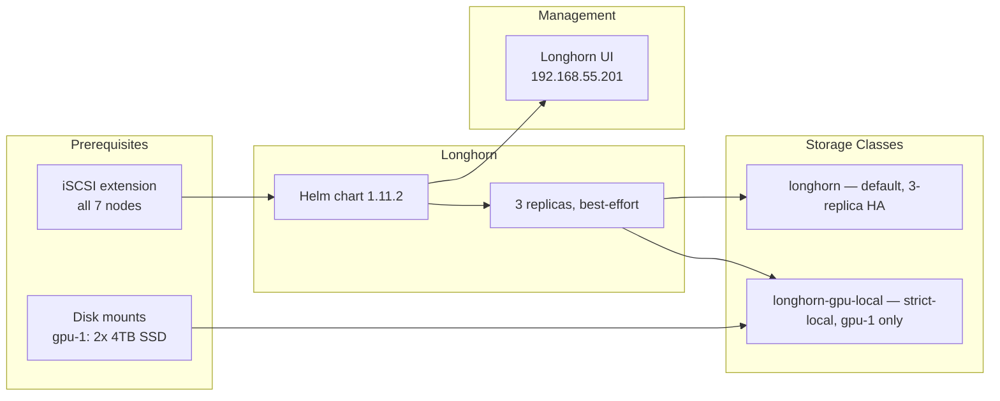
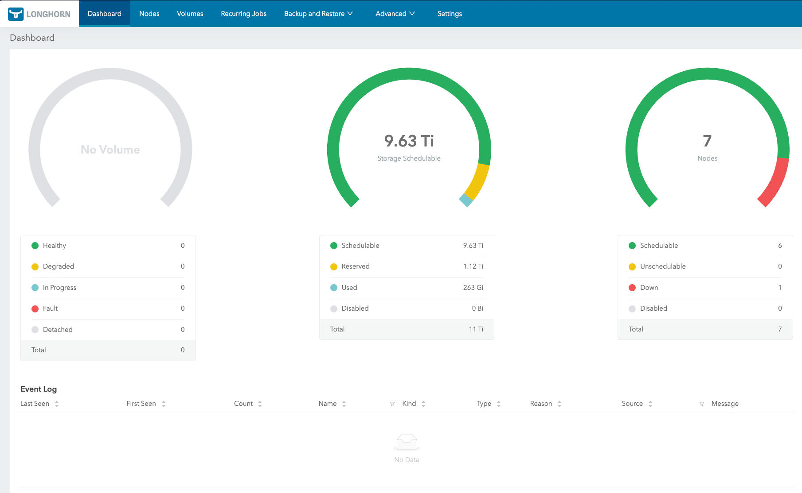

Pods are ephemeral. Their data cannot be. Every cluster needs persistent storage, but on Talos Linux the usual approach — SSH in, partition a disk, write an fstab entry, install `open-iscsi` — is not an option. The OS is immutable. There is no package manager. The root filesystem is read-only.

This forces a different workflow: every storage prerequisite must be declared as a machine config extension, every disk mount must be defined in a config patch, and every storage component must be deployable through GitOps. It is more deliberate than a standard Linux setup, but the result is fully reproducible — rebuild any node, and its storage capability comes back exactly as it was.

This post covers installing Longhorn as the cluster's distributed block storage layer: enabling iSCSI on Talos, mounting dedicated SSD storage on the GPU node, configuring replication and data locality, and creating a GPU-local StorageClass for AI workloads.



## Why Longhorn

The serious contender for Kubernetes storage is Rook-Ceph, and it is the wrong choice for a homelab. Ceph demands a minimum of three dedicated OSDs on separate nodes with raw disks, plus monitors, managers, and metadata servers. The control plane overhead in memory and CPU is substantial, and the operational model — PG placement groups, recovery semantics, CRUSH maps — is a full-time education.

Longhorn inverts the complexity. Each volume is an independent Linux process backed by a sparse file. Replication happens at the volume level, not the cluster level. A 3-replica volume is three copies of the data on three different nodes. That is the entire mental model.

Three decisions drove the choice:

- **No dedicated storage nodes.** Every node contributes its local disk. The three minis, gpu-1, pc-1, and both Raspberry Pis all participate.
- **Simple operations.** The Longhorn UI shows volume health, replica status, and node capacity. No CRUSH maps. No placement groups.
- **Flexible data locality.** Longhorn can spread replicas for redundancy or pin data to a specific node for performance — which is exactly what GPU workloads need.

## Prerequisite: iSCSI on Talos

Longhorn uses iSCSI to expose block devices to pods. On Ubuntu, you run `apt install open-iscsi`. On Talos, you add a system extension that gets baked into the boot image.

This cluster-scoped patch applies to all seven nodes:

```yaml
# patches/phase03-longhorn/400-cluster-iscsi-tools.yaml
metadata:
  type: ExtensionsConfigurations.omni.sidero.dev
  id: 400-cluster-iscsi-tools
  labels:
    omni.sidero.dev/cluster: frank
spec:
  extensions:
    - siderolabs/iscsi-tools
```

The `omni.sidero.dev/cluster: frank` label targets every machine. Omni rebuilds each node's boot image with the extension included, then performs a rolling reboot across the cluster.

This is not instant. Omni reboots nodes one at a time, waiting for each to rejoin before proceeding to the next. For seven nodes, expect 15–20 minutes. Do not apply this patch right before you need the cluster stable.

After the reboot, verify the extension loaded:

```bash
talosctl -n 192.168.55.21 get extensions
```

Look for `siderolabs/iscsi-tools`. If it is missing, check the Omni UI for image build status.

## Mounting the GPU Disks

Most nodes use their single internal disk for both the OS and Longhorn storage. The gpu-1 node is different — it has two Samsung 870 EVO 4TB SATA SSDs dedicated to storage. Eight terabytes of capacity for model caches, datasets, and diffusion outputs.

On a standard Linux system, you partition and mount these drives with `fdisk` and `fstab`. On Talos, disk management is declarative. This patch targets only gpu-1 (by its Omni machine UUID):

```yaml
# patches/phase03-longhorn/401-gpu1-extra-disks.yaml
metadata:
  type: ConfigPatches.omni.sidero.dev
  id: 401-gpu1-extra-disks
  labels:
    omni.sidero.dev/cluster: frank
    omni.sidero.dev/cluster-machine: 03ff0210-04e0-05b0-ab06-300700080009
spec:
  data: |
    machine:
      disks:
        - device: /dev/sda
          partitions:
            - mountpoint: /var/mnt/longhorn-sda
        - device: /dev/sdb
          partitions:
            - mountpoint: /var/mnt/longhorn-sdb
```

Key details:

- **Mount paths under `/var/mnt/`**. The root filesystem is read-only, but `/var/` is writable. Longhorn needs write access, so all custom mounts go under `/var/`.
- **Talos wipes the disks**. When it sees a disk declaration, it takes full ownership: existing partitions are destroyed, a new partition table is created, and the filesystem is formatted.
- **Scope via `cluster-machine`**. This patch targets gpu-1 only. Other nodes never see these mount points.

Verify after the node reboots:

```bash
talosctl -n 192.168.55.31 mounts | grep longhorn
```

```console
$ talosctl -n 192.168.55.31 mounts 2>&1 | grep "/var/mnt/longhorn-s"
192.168.55.31   /dev/sda1     3998.83  112.11  3886.72  2.80%  /var/mnt/longhorn-sda
192.168.55.31   /dev/sdb1     3998.83  163.48  3835.36  4.09%  /var/mnt/longhorn-sdb
```

Both SSDs mounted and ready.

## Installing Longhorn

With iSCSI available and disks mounted, Longhorn is deployed via Helm through ArgoCD. The Application references the upstream chart and a values file in the Git repo:

```yaml
# apps/root/templates/longhorn.yaml
spec:
  sources:
    - repoURL: https://charts.longhorn.io
      chart: longhorn
      targetRevision: "1.11.2"
      helm:
        releaseName: longhorn
        valueFiles:
          - $values/apps/longhorn/values.yaml
```

The values file overrides only what matters:

```yaml
# apps/longhorn/values.yaml
defaultSettings:
  defaultReplicaCount: 3
  storageMinimalAvailablePercentage: 15
  nodeDownPodDeletionPolicy: delete-both-statefulset-and-deployment-pod
  defaultDataLocality: best-effort

persistence:
  defaultClassReplicaCount: 3
  defaultClass: true
```

Each setting was chosen through experience, not by default:

**`defaultReplicaCount: 3`** — Every volume gets three replicas spread across different nodes. With seven nodes in the cluster, losing any two still leaves one healthy copy. This is the safety net for application databases and persistent state.

**`storageMinimalAvailablePercentage: 15`** — Longhorn stops scheduling new replicas on a node once it drops below 15% free. Prevents a single node filling up completely, which causes iSCSI target failures and degraded volumes.

**`nodeDownPodDeletionPolicy: delete-both-statefulset-and-deployment-pod`** — When a node goes down, Longhorn immediately deletes pods using volumes on that node. This lets Kubernetes reschedule them elsewhere rather than leaving them stuck in `Terminating`. In a homelab where nodes reboot for patches, this is the pragmatic choice.

**`defaultDataLocality: best-effort`** — Tries to keep one replica on the same node as the consuming pod. Improves read performance without blocking scheduling if the local node has no space.

**`defaultClass: true`** — The Longhorn StorageClass becomes the cluster default. Any PVC without an explicit StorageClass gets a Longhorn volume.

## GPU-Local StorageClass

The default three-replica, best-effort config is right for application databases. But GPU workloads have different requirements. When a training job reads a 50GB dataset, that data should be on a local disk — not fetched across the network from a replica on a Raspberry Pi.

A second StorageClass solves this:

```yaml
# apps/longhorn/manifests/gpu-local-sc.yaml
apiVersion: storage.k8s.io/v1
kind: StorageClass
metadata:
  name: longhorn-gpu-local
provisioner: driver.longhorn.io
reclaimPolicy: Delete
volumeBindingMode: Immediate
allowVolumeExpansion: true
parameters:
  numberOfReplicas: "1"
  dataLocality: strict-local
  diskSelector: "gpu-local"
```

Three parameters make this distinct:

**`numberOfReplicas: "1"`** — No point replicating GPU scratch data to other nodes. If gpu-1 goes down, the training job is gone regardless. A single replica doubles effective write throughput.

**`dataLocality: strict-local`** — A hard constraint. The replica must live on the same node as the consuming pod. If local placement is impossible, the volume attachment fails rather than falling back to a remote replica.

**`diskSelector: "gpu-local"`** — Volume placement is restricted to disks tagged with `gpu-local`. After Longhorn is running, tag gpu-1's SSDs in the Longhorn UI: navigate to the node, find `/var/mnt/longhorn-sda` and `/var/mnt/longhorn-sdb`, and add the `gpu-local` tag.

Workloads choose their storage class through the PVC spec. Standard application:

```yaml
apiVersion: v1
kind: PersistentVolumeClaim
metadata:
  name: app-data
spec:
  accessModes: ["ReadWriteOnce"]
  resources:
    requests:
      storage: 10Gi
```

GPU workload using the local class explicitly:

```yaml
apiVersion: v1
kind: PersistentVolumeClaim
metadata:
  name: model-cache
spec:
  storageClassName: longhorn-gpu-local
  accessModes: ["ReadWriteOnce"]
  resources:
    requests:
      storage: 200Gi
```

```console
$ kubectl get storageclass
NAME                 PROVISIONER          RECLAIMPOLICY   VOLUMEBINDINGMODE   ALLOWVOLUMEEXPANSION   AGE
longhorn (default)   driver.longhorn.io   Delete          Immediate           true                   48d
longhorn-cicd        driver.longhorn.io   Delete          Immediate           true                   22d
longhorn-gpu-local   driver.longhorn.io   Delete          Immediate           true                   48d
longhorn-static      driver.longhorn.io   Delete          Immediate           true                   48d
```

## Longhorn UI

The Longhorn UI shows volume health, replica status, and node capacity at a glance. By default it runs as a ClusterIP service. Using the same Cilium L2 LoadBalancer pattern established in the foundation layer:

```yaml
# apps/longhorn/manifests/ui-service.yaml
apiVersion: v1
kind: Service
metadata:
  name: longhorn-ui-lb
  namespace: longhorn-system
  annotations:
    io.cilium/lb-ipam-ips: "192.168.55.201"
spec:
  type: LoadBalancer
  selector:
    app: longhorn-ui
  ports:
    - name: http
      port: 80
      targetPort: http
```

Reachable at `http://192.168.55.201`.



## What We Have Now

- Distributed 3-replica block storage across all 7 nodes
- GPU-local StorageClass for single-node AI workloads on gpu-1
- Longhorn UI at `http://192.168.55.201` for storage management
- Automatic volume rebalancing and health monitoring

The storage layer is live. Anything that needs persistent data — databases, model caches, application state — has a place to put it.

## Missteps

| What Happened | Why It Was Wrong | How We Fixed It | Commit |
|---------------|-----------------|-----------------|--------|
| **Longhorn 1.11.0 heap leak on gpu-1** — instance manager process grew unbounded over days, OOM-killing volumes | Upstream bug (longhorn#12575) triggered by sustained I/O on large SSDs | Bumped chart to 1.11.2, which included the fix | `b99085af`, `78a6c45a` |
| **raspi-1 memory wedge** — Longhorn replicas consumed all 4GB RAM, node became unresponsive | Pi 4s have 4GB RAM; default cache settings exhaust this under write pressure | Excluded raspi-1/2 from Longhorn scheduling, added headroom alerting | `16385077` |
| **ArgoCD sync failures on backup manifests** — R2 backup target caused health check timeouts | Backup target validation needs external connectivity that ArgoCD health checks could not reach | Separated backup manifests into own Application with relaxed sync policy | `9fd060fc` |
| **No CI/CD StorageClass** — all CI pipeline pods consumed 3-replica volumes, wasting storage | CI artifacts are ephemeral; every pipeline run provisioned 3x the requested storage | Added `longhorn-cicd` with 1 replica and nodeSelector for CI nodes | `be9f5743` |
| **Default backup target pointed at nonexistent NAS** — config referenced a Synology path before the NAS was purchased | Planned infrastructure that was never bought; backup target was unreachable from day one | Switched default to Cloudflare R2, stubbed NAS as future improvement | `3df7c9ad` |

## References

- [Longhorn](https://longhorn.io/) — Cloud-native distributed block storage
- [Longhorn StorageClass Parameters](https://longhorn.io/docs/latest/references/storage-class-parameters/) — numberOfReplicas, dataLocality, diskSelector
- [Talos Linux Storage Guide](https://docs.siderolabs.com/kubernetes-guides/csi/storage) — iSCSI prerequisites on Talos
- [Talos System Extensions](https://github.com/siderolabs/extensions) — Official extension repository (iscsi-tools)
- [Kubernetes Persistent Volumes](https://kubernetes.io/docs/concepts/storage/persistent-volumes/) — PV and PVC documentation

**Next: [GPU Compute — NVIDIA and Intel](/docs/building/04-gpu-compute)**
