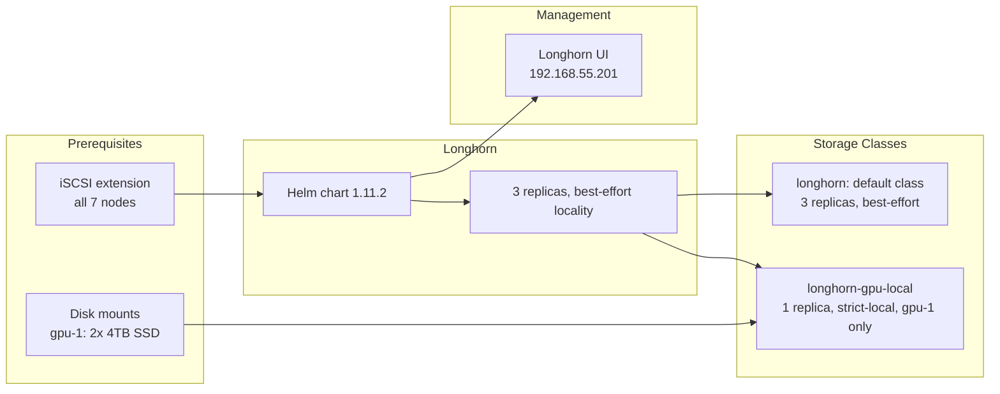
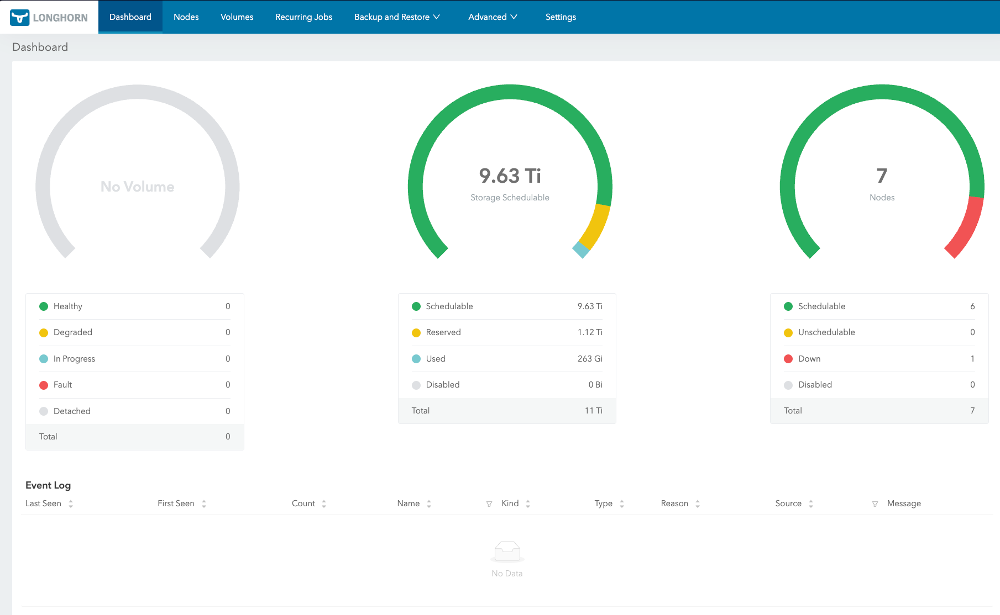

Pods are ephemeral. Their data cannot be. Every cluster needs persistent storage, but on Talos Linux you cannot get it the usual way: SSH in, partition a disk, write an fstab entry, install `open-iscsi`. The OS is immutable. There is no package manager. The root filesystem is read-only.

This forces a different workflow. Every storage prerequisite is declared as a machine config extension, every disk mount is defined in a config patch, and every storage component is deployable through GitOps. It is more deliberate than a standard Linux setup, and the result is fully reproducible: rebuild any node and its storage capability comes back exactly as it was.

This post covers installing Longhorn as the cluster's distributed block storage layer: enabling iSCSI on Talos, mounting dedicated SSD storage on the GPU node, configuring replication and data locality, and creating a GPU-local StorageClass for AI workloads.

## Why Longhorn

The serious contender for Kubernetes storage is Rook-Ceph, and it is the wrong choice for a homelab. Ceph demands a minimum of three dedicated  on separate nodes with raw disks, plus monitors, managers, and metadata servers. The control plane overhead in memory and CPU is substantial, and the operational model is a full-time education: PG placement groups, recovery semantics,  maps.

Longhorn inverts the complexity. Each volume is an independent Linux process backed by a sparse file. Replication happens at the volume level, not the cluster level. A 3-replica volume is three copies of the data on three different nodes. That is the entire mental model.

Three decisions drove the choice:

- **No dedicated storage nodes.** Every node contributes its local disk. The three minis, gpu-1, pc-1, and both Raspberry Pis all participate.
- **Simple operations.** One dashboard, one Linux process per volume. No CRUSH maps. No placement groups.
- **Flexible data locality.** Longhorn can spread replicas across nodes for redundancy, or pin a volume's data to one node for performance. That second mode is exactly what GPU workloads need, and it is the knob the rest of this post turns.

Those two locality modes have names, and both appear in the diagram below. **`best-effort`** tries to keep one replica on whichever node is running the pod, and gives up quietly if that node has no room. **`strict-local`** refuses to attach the volume at all unless the replica is local. The first is a preference, the second is a constraint.


```mermaid
flowchart LR
  subgraph Prerequisites[Prerequisites]
    ISCSI[iSCSI extension<br/>all 7 nodes]
    Disks[Disk mounts<br/>gpu-1: 2x 4TB SSD]
  end
  subgraph Longhorn[Longhorn]
    Helm[Helm chart 1.11.2]
    Values[3 replicas, best-effort locality]
  end
  subgraph Classes[Storage Classes]
    Default[longhorn: default class<br/>3 replicas, best-effort]
    GPU[longhorn-gpu-local<br/>1 replica, strict-local, gpu-1 only]
  end
  subgraph UI[Management]
    Dashboard[Longhorn UI<br/>192.168.55.201]
  end

  ISCSI --> Helm
  Disks --> GPU
  Helm --> Values
  Values --> Default
  Values --> GPU
  Helm --> Dashboard
```

## Prerequisite: iSCSI on Talos

Longhorn uses iSCSI to expose block devices to pods. On Ubuntu, you run `apt install open-iscsi`. On Talos, you add a system extension that gets baked into the boot image.

This cluster-scoped patch applies to all seven nodes:

```yaml
# patches/phase03-longhorn/400-cluster-iscsi-tools.yaml
metadata:
  type: ExtensionsConfigurations.omni.sidero.dev
  id: 400-cluster-iscsi-tools
  labels:
    omni.sidero.dev/cluster: frank
spec:
  extensions:
    - siderolabs/iscsi-tools
```

The `omni.sidero.dev/cluster: frank` label targets every machine. Omni rebuilds each node's boot image with the extension included, then performs a rolling reboot across the cluster.

This is not instant. Omni reboots nodes one at a time, waiting for each to rejoin before proceeding to the next. For seven nodes, expect 15–20 minutes. Do not apply this patch right before you need the cluster stable.

After the reboot, verify the extension loaded:

```bash
talosctl -n 192.168.55.21 get extensions
```

Look for `siderolabs/iscsi-tools`. If it is missing, check the Omni UI for image build status.

## Mounting the GPU Disks

Most nodes use their single internal disk for both the OS and Longhorn storage. The gpu-1 node is different. It has two Samsung 870 EVO 4TB SATA SSDs dedicated to storage: eight terabytes of capacity for model caches, datasets, and diffusion outputs.

On a standard Linux system, you partition and mount these drives with `fdisk` and `fstab`. On Talos, disk management is declarative. This patch targets only gpu-1 (by its Omni machine ):

```yaml
# patches/phase03-longhorn/401-gpu1-extra-disks.yaml
metadata:
  type: ConfigPatches.omni.sidero.dev
  id: 401-gpu1-extra-disks
  labels:
    omni.sidero.dev/cluster: frank
    omni.sidero.dev/cluster-machine: 03ff0210-04e0-05b0-ab06-300700080009
spec:
  data: |
    machine:
      disks:
        - device: /dev/sda
          partitions:
            - mountpoint: /var/mnt/longhorn-sda
        - device: /dev/sdb
          partitions:
            - mountpoint: /var/mnt/longhorn-sdb
```

Key details:

- **Mount paths under `/var/mnt/`**. The root filesystem is read-only, but `/var/` is writable. Longhorn needs write access, so all custom mounts go under `/var/`.
- **Talos wipes the disks**. When it sees a disk declaration, it takes full ownership: existing partitions are destroyed, a new partition table is created, and the filesystem is formatted.
- **Scope via `cluster-machine`**. This patch targets gpu-1 only. Other nodes never see these mount points.

Verify after the node reboots:

```bash
talosctl -n 192.168.55.31 mounts | grep longhorn
```

```console
$ talosctl -n 192.168.55.31 mounts 2>&1 | grep "/var/mnt/longhorn-s"
192.168.55.31   /dev/sda1     3998.83  112.11  3886.72  2.80%  /var/mnt/longhorn-sda
192.168.55.31   /dev/sdb1     3998.83  163.48  3835.36  4.09%  /var/mnt/longhorn-sdb
```

Both SSDs mounted and ready.

## Installing Longhorn

With iSCSI available and disks mounted, Longhorn is deployed via Helm through ArgoCD. The Application references the upstream chart and a values file in the Git repo:

```yaml
# apps/root/templates/longhorn.yaml
spec:
  sources:
    - repoURL: https://charts.longhorn.io
      chart: longhorn
      targetRevision: "1.11.2"
      helm:
        releaseName: longhorn
        valueFiles:
          - $values/apps/longhorn/values.yaml
```

The values file overrides only what matters:

```yaml
# apps/longhorn/values.yaml
defaultSettings:
  defaultReplicaCount: 3
  storageMinimalAvailablePercentage: 15
  storageOverProvisioningPercentage: 150
  nodeDownPodDeletionPolicy: delete-both-statefulset-and-deployment-pod
  defaultDataLocality: best-effort

persistence:
  defaultClassReplicaCount: 3
  defaultClass: true
```

Each setting was chosen through experience, not by default:

**`defaultReplicaCount: 3`** sends every volume to three replicas on three different nodes. With seven nodes in the cluster, losing any two still leaves one healthy copy. This is the safety net for application databases and persistent state.

**`storageMinimalAvailablePercentage: 15`** stops Longhorn scheduling new replicas on a node once its disk drops below 15% genuinely free. This is the *physical* guard: it counts bytes on the disk and prevents a node filling up completely, which causes iSCSI target failures and degraded volumes.

**`storageOverProvisioningPercentage: 150`** is a different mechanism with a confusingly similar name, and the two get conflated under pressure. It is the *accounting* guard, and it counts nothing physical at all. Longhorn adds up every replica's **declared** size on a disk, whether or not those bytes were ever written, and refuses new placement once that sum passes 150% of the disk's usable capacity. In `apps/longhorn/values.yaml` it sits at line 28 under a long comment, because it was raised from the chart default of 100 after that default made an expansion impossible on a half-empty disk. The [verify section](#verify-the-disks-and-check-headroom-before-you-expand) below is mostly about this one setting.

So: **15 is a percentage of real free space; 150 is a multiplier on declared capacity.** They can disagree, and when they do it is almost always the accounting guard that blocks you while `df` insists there is plenty of room.

**`nodeDownPodDeletionPolicy: delete-both-statefulset-and-deployment-pod`** makes Longhorn delete pods using volumes on a node the moment that node goes down. Kubernetes can then reschedule them elsewhere rather than leaving them stuck in `Terminating`. In a homelab where nodes reboot for patches, this is the pragmatic choice.

**`defaultDataLocality: best-effort`** tries to keep one replica on the same node as the consuming pod. It improves read performance without blocking scheduling when the local node has no space.

**`defaultClass: true`** makes the Longhorn StorageClass the cluster default. Any  without an explicit StorageClass gets a Longhorn volume.

## GPU-Local StorageClass

The default three-replica, best-effort config is right for application databases. GPU workloads have different requirements. When a training job reads a 50GB dataset, that data should be on a local disk, not fetched across the network from a replica on a Raspberry Pi.

A second StorageClass solves this:

```yaml
# apps/longhorn/manifests/gpu-local-sc.yaml
apiVersion: storage.k8s.io/v1
kind: StorageClass
metadata:
  name: longhorn-gpu-local
provisioner: driver.longhorn.io
reclaimPolicy: Delete
volumeBindingMode: Immediate
allowVolumeExpansion: true
parameters:
  numberOfReplicas: "1"
  dataLocality: strict-local
  diskSelector: "gpu-local"
```

Three parameters make this distinct:

**`numberOfReplicas: "1"`** because there is no point replicating GPU scratch data to other nodes. If gpu-1 goes down, the training job is gone regardless. A single replica doubles effective write throughput.

**`dataLocality: strict-local`** is a hard constraint, not the preference `best-effort` expresses. The replica must live on the same node as the consuming pod. If local placement is impossible, the volume attachment fails rather than falling back to a remote replica.

**`diskSelector: "gpu-local"`** restricts volume placement to disks tagged `gpu-local`. After Longhorn is running, tag gpu-1's SSDs in the Longhorn UI: navigate to the node, find `/var/mnt/longhorn-sda` and `/var/mnt/longhorn-sdb`, and add the `gpu-local` tag.

Workloads choose their storage class through the PVC spec. Standard application:

```yaml
apiVersion: v1
kind: PersistentVolumeClaim
metadata:
  name: app-data
spec:
  accessModes: ["ReadWriteOnce"]
  resources:
    requests:
      storage: 10Gi
```

GPU workload using the local class explicitly:

```yaml
apiVersion: v1
kind: PersistentVolumeClaim
metadata:
  name: model-cache
spec:
  storageClassName: longhorn-gpu-local
  accessModes: ["ReadWriteOnce"]
  resources:
    requests:
      storage: 200Gi
```

```console
$ kubectl get storageclass
NAME                 PROVISIONER          RECLAIMPOLICY   VOLUMEBINDINGMODE   ALLOWVOLUMEEXPANSION   AGE
longhorn (default)   driver.longhorn.io   Delete          Immediate           true                   48d
longhorn-cicd        driver.longhorn.io   Delete          Immediate           true                   22d
longhorn-gpu-local   driver.longhorn.io   Delete          Immediate           true                   48d
longhorn-static      driver.longhorn.io   Delete          Immediate           true                   48d
```

## Longhorn UI

The Longhorn UI shows volume health, replica status, and node capacity at a glance. By default it runs as a ClusterIP service. Using the same Cilium L2 LoadBalancer pattern established in the foundation layer:

```yaml
# apps/longhorn/manifests/ui-service.yaml
apiVersion: v1
kind: Service
metadata:
  name: longhorn-ui-lb
  namespace: longhorn-system
  annotations:
    io.cilium/lb-ipam-ips: "192.168.55.201"
spec:
  type: LoadBalancer
  selector:
    app: longhorn-ui
  ports:
    - name: http
      port: 80
      targetPort: http
```

Reachable at `http://192.168.55.201`.



## Verify the disks, and check headroom before you expand

Two things in this post fail quietly, and both are worth restating here rather than making you scroll back for them.

**Failure one: the `gpu-local` disk tag.** It is applied by hand in the Longhorn UI, so it is the single step no amount of GitOps will replay for you. Lose it and `diskSelector: "gpu-local"` has nothing to resolve against. The StorageClass still exists, still looks correct, and the damage shows up much later as a PVC stuck `Pending` for no visible reason.

**Failure two: the accounting ceiling.** Longhorn sums each replica's *declared* size rather than the bytes actually written, so a disk can be half empty and still refuse to grow a volume by a single GiB.

Three commands cover both, and the instruction at the end of this section means all three, not just the last one. Start with the settings themselves, because every number below is meaningless without them:

```console
$ kubectl -n longhorn-system get settings.longhorn.io \
    storage-minimal-available-percentage storage-over-provisioning-percentage \
    -o custom-columns=NAME:.metadata.name,VALUE:.value
NAME                                   VALUE
storage-minimal-available-percentage   15
storage-over-provisioning-percentage   150
```

Now the tags and the headroom, in one query that reads the over-provisioning value back out of the cluster and applies the multiplier itself. Do not print a raw ceiling and multiply it in your head afterwards. Arithmetic you perform once, by hand, in the middle of an incident is arithmetic you will get wrong at least once:

```console
$ OP=$(kubectl -n longhorn-system get settings.longhorn.io \
         storage-over-provisioning-percentage -o jsonpath='{.value}')
$ kubectl -n longhorn-system get nodes.longhorn.io -o json | jq -r --argjson op "$OP" '
    ["NODE","DISK","TAGS","SCHEDULED_GiB","CEILING_GiB","HEADROOM_GiB"],
    (.items[] | . as $n | .spec.disks | to_entries[] |
      (($n.status.diskStatus[.key].storageScheduled // 0) / 1073741824) as $s |
      ((($n.status.diskStatus[.key].storageMaximum // 0) - .value.storageReserved)
        / 1073741824 * $op / 100) as $c |
      [ $n.metadata.name, .key[0:24],
        (.value.tags | join(",") | if . == "" then "-" else . end),
        ($s|floor), ($c|floor), (($c - $s)|floor) ])
    | @tsv' | column -t
NODE     DISK                      TAGS       SCHEDULED_GiB  CEILING_GiB  HEADROOM_GiB
gpu-1    default-disk-10308000000  -          0              975          975
gpu-1    gpu-sda-4000000000000     gpu-local  529            5586         5057
gpu-1    gpu-sdb-4000000000000     gpu-local  588            5586         4998
mini-1   default-disk-10308000000  -          665            975          310
mini-2   default-disk-10308000000  -          640            975          335
mini-3   default-disk-10308000000  -          653            975          322
pc-1     default-disk-08240000000  -          60             60           0
raspi-1  default-disk-b3060000000  -          0              28           28
raspi-2  default-disk-b3060000000  -          0              28           28
```

The `gpu-local` tag sits on exactly the two 4TB SSDs and nowhere else, which is failure one answered. `HEADROOM_GiB` is failure two: it is the number of GiB of *declared* volume size each disk can still absorb, and an expansion needs that much headroom on **every** node holding a replica, not on average.

Read the pc-1 row before you move on. Zero headroom, sitting exactly on its ceiling. Then read this:

```console
$ kubectl -n longhorn-system get nodes.longhorn.io \
    -o custom-columns=NODE:.metadata.name,SCHEDULABLE:'.status.conditions[?(@.type=="Schedulable")].status'
NODE      SCHEDULABLE
gpu-1     True
mini-1    True
mini-2    True
mini-3    True
pc-1      True
raspi-1   True
raspi-2   True
```

pc-1 reports `Schedulable: True` while having nothing left to give. The condition flips only once a node is already **over** the line, so it is a lagging indicator and cannot be used as a pre-flight check. `HEADROOM_GiB` can.

Run all three of those before you expand a PVC, not after. If any node holding a replica lacks the headroom, Longhorn declines the expansion while the API server accepts your edit: the PVC stays `Bound`, ArgoCD stays Synced, and `status.capacity.storage` never changes. There is no error to go and find.

### When it does refuse

Confirm it first, because the symptom is an absence and absences are easy to imagine:

```console
$ kubectl -n <ns> get pvc <name> -o jsonpath='{.status.capacity.storage}'
```

If that is still the old value some minutes after the merge, the expansion was declined. The repo prescribes three fixes in order of preference, written up in full at [`docs/runbooks/frank-gotchas/storage-secrets-ssa.md`](https://github.com/derio-net/frank/blob/main/docs/runbooks/frank-gotchas/storage-secrets-ssa.md):

1. **Reclaim reservations.** Find volumes still declaring space for workloads that are scaled to zero or gone. A detached volume holds its full declared size forever. This only helps if those volumes have replicas on the *blocking* node, so check per node rather than per cluster.
2. **Raise the ceiling in git.** Bump `defaultSettings.storageOverProvisioningPercentage` in `apps/longhorn/values.yaml`. This is what Frank did, 100 to 150, and it is the reason the numbers above have room in them. It does not weaken safety: the 15% minimal-available floor still blocks scheduling on real disk pressure.
3. **Move the replica.** Delete the replica on the blocked node and let Longhorn rebuild it somewhere with room. Safe while the other two stay healthy, but imperative, and it leaves no trace in git.

A chart-level `defaultSettings` change does not always reach an already-created setting, so re-run the first command in this section afterwards and restart `longhorn-manager` if the value did not move.

## What transfers

Take one rule to whatever storage layer you run next, and it is not about Longhorn.

**A storage system's idea of "full" is an accounting policy, and it is not the same as your disk being full.** Longhorn counts declared replica size multiplied by an over-provisioning percentage. Thin-provisioned LVM, ZFS with reservations, and every cloud provider's volume quota do the same thing with different arithmetic. In all of them a half-empty disk can refuse to grow a volume, and none of them are lying to you: they are enforcing a promise made to volumes that have not written their bytes yet.

Two consequences follow, and they are what you actually keep:

The first is that the failure is silent by construction. There is nothing to catch, because nothing errors. The API server accepts the edit, the controller declines the work, and the object's *spec* matches git perfectly while its *status* never moves. Any dashboard comparing spec to git reports success. So **assert on `status`, never on `spec` and never on a sync tile.** That rule outlives Longhorn.

The second is that the evidence lives in the storage system's own CRDs, not in Kubernetes' view of them. `kubectl get pvc` cannot tell you why an expansion was refused, because the refusal happened a layer below in `nodes.longhorn.io`. When a storage operation fails inexplicably, go and read the operator's own objects before you read the ones Kubernetes gives you for free.

And a smaller one, cheap to act on: **any step you perform in a web UI is a step your GitOps repo cannot replay.** The `gpu-local` disk tag here is one click that no amount of `git push` will restore. Either automate it or write it down somewhere a rebuild will make you look.

## Missteps

| What Happened | Why It Was Wrong | How We Fixed It | Commit |
|---------------|-----------------|-----------------|--------|
| **Longhorn 1.11.0 heap leak on gpu-1** — instance manager process grew unbounded over days, -killing volumes | Upstream bug (longhorn#12575) triggered by sustained I/O on large SSDs | Bumped chart to 1.11.2, which included the fix | `b99085af`, `78a6c45a` |
| **raspi-1 memory wedge** — Longhorn replicas consumed all 4GB RAM, node became unresponsive | Pi 4s have 4GB RAM; default cache settings exhaust this under write pressure | Excluded raspi-1/2 from Longhorn scheduling, added headroom alerting | `16385077` |
| **ArgoCD sync failures on backup manifests** — R2 backup target caused health check timeouts | Backup target validation needs external connectivity that ArgoCD health checks could not reach | Separated backup manifests into own Application with relaxed sync policy | `9fd060fc` |
| **No CI/CD StorageClass** — all CI pipeline pods consumed 3-replica volumes, wasting storage | CI artifacts are ephemeral; every pipeline run provisioned 3x the requested storage | Added `longhorn-cicd` with 1 replica and nodeSelector for CI nodes | `be9f5743` |
| **Default backup target pointed at nonexistent ** — config referenced a Synology path before the NAS was purchased | Planned infrastructure that was never bought; backup target was unreachable from day one | Switched default to Cloudflare R2, stubbed NAS as future improvement | `3df7c9ad` |

## References

- [Longhorn](https://longhorn.io/) — Cloud-native distributed block storage
- [Longhorn StorageClass Parameters](https://longhorn.io/docs/latest/references/storage-class-parameters/) — numberOfReplicas, dataLocality, diskSelector
- [Talos Linux Storage Guide](https://docs.siderolabs.com/kubernetes-guides/csi/storage) — iSCSI prerequisites on Talos
- [Talos System Extensions](https://github.com/siderolabs/extensions) — Official extension repository (iscsi-tools)
- [Kubernetes Persistent Volumes](https://kubernetes.io/docs/concepts/storage/persistent-volumes/) —  and PVC documentation

**Next: [GPU Compute — NVIDIA and Intel](/docs/building/04-gpu-compute)**
