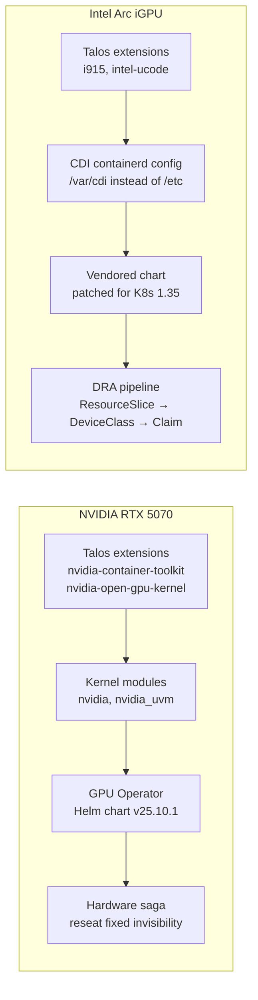

Two GPU stories converged on the same cluster, and neither was straightforward.

The NVIDIA side started with a card that booted fans and RGB but refused to appear on the PCIe bus. The RTX 5070 was physically installed, powered, seated — and completely invisible to the kernel. Diagnostics showed no vendor ID, no BAR regions, no device of any kind. The software stack was ready and waiting; the hardware just would not cooperate.

The Intel side was a different kind of challenge. The three mini nodes each have an integrated Arc GPU that shares system RAM. These are not suitable for LLM inference (memory bandwidth is the bottleneck), but they are perfect for media transcoding and vision workloads. The catch: Kubernetes 1.35 had removed the `v1beta1` DRA API that the upstream Intel driver chart depended on. Every chart template needed patching before it would work.

Both paths required Talos extensions, kernel-level config, and some chart surgery. This post walks through both.



## Part 1: NVIDIA GPU Operator

The plan for gpu-1 was straightforward: install NVIDIA's Talos extensions, load the kernel modules, deploy the GPU Operator via Helm, and start scheduling CUDA workloads. The infrastructure side worked. The hardware had other ideas.

### Talos Extensions for NVIDIA

Talos Linux uses a read-only, immutable root filesystem. You cannot `apt install` or `modprobe` anything at runtime. Instead, you bake system extensions into the node's image. For NVIDIA, two extensions are required:

- `nvidia-container-toolkit-production` — container runtime hooks for GPU access
- `nvidia-open-gpu-kernel-modules-production` — open-source NVIDIA kernel driver

On Omni, you declare extensions per machine:

```yaml
# patches/phase04-gpu/402-gpu1-nvidia-extensions.yaml
metadata:
    type: ExtensionsConfigurations.omni.sidero.dev
    id: 402-gpu1-nvidia-extensions
    labels:
        omni.sidero.dev/cluster: frank
        omni.sidero.dev/cluster-machine: 03ff0210-...
spec:
    extensions:
        - siderolabs/iscsi-tools
        - siderolabs/nvidia-container-toolkit-production
        - siderolabs/nvidia-open-gpu-kernel-modules-production
```

A critical gotcha: per-machine `ExtensionsConfiguration` resources in Omni **override** the cluster-wide config entirely — they do not merge. If the cluster already has `iscsi-tools` (needed for Longhorn), you must re-include it in the per-machine config or gpu-1 will lose iSCSI support.

Applying the extension triggers an image rebuild and a reboot. Once the node comes back, the second patch loads the kernel modules:

```yaml
# patches/phase04-gpu/04-gpu-nvidia-modules.yaml
spec:
    data: |
        machine:
            kernel:
                modules:
                    - name: nvidia
                    - name: nvidia_uvm
                    - name: nvidia_modeset
                    - name: nvidia_drm
```

Ordering matters: extensions must be in the image schematic *before* you try to load the modules. Apply the extension config first, wait for Ready, then apply the module patch.

### GPU Operator Helm Values

With the driver and toolkit baked into Talos, the GPU Operator's job shrinks. Most of its default components would try to install what Talos already provides:

```yaml
# apps/gpu-operator/values.yaml
driver:
  enabled: false

toolkit:
  enabled: false

operator:
  defaultRuntime: containerd
```

`driver.enabled: false` because Talos provides the kernel modules. `toolkit.enabled: false` because Talos provides the container toolkit. The operator still handles device discovery, the device plugin, GPU feature discovery, and the DCGM exporter — all the Kubernetes-level plumbing.

The ArgoCD Application uses NVIDIA's official Helm chart at `v25.10.1`:

```yaml
# apps/root/templates/gpu-operator.yaml
spec:
  sources:
    - repoURL: https://helm.ngc.nvidia.com/nvidia
      chart: gpu-operator
      targetRevision: "v25.10.1"
      helm:
        valueFiles:
          - $values/apps/gpu-operator/values.yaml
  syncPolicy:
    # Manual sync — GPU hardware not yet detected
```

Notice the sync policy: no `automated` block. This was intentional, and brings us to the hardware saga.

### The Hardware Saga

The RTX 5070 is physically installed in gpu-1. The Gigabyte Z790 Eagle AX motherboard has a PCIe 5.0 x16 slot. The card is seated, powered (dual 8-pin), and the fans spin on boot. The RGB on the case fans works fine.

Initially, the card was completely invisible to the PCIe bus — `lspci` showed nothing, no NVIDIA vendor ID `10de`, silence. The NVIDIA kernel modules would load without error and simply find no hardware to bind to. The GPU Operator deployed fine from a software perspective, but there was no GPU to operate on.

What was tried before the fix:

- **BIOS settings** — confirmed PCIe set to Auto/Gen5, CSM disabled, Above 4G Decoding enabled, Resizable BAR enabled.
- **Different BIOS versions** — updated from the factory BIOS (predating RTX 50-series) to the latest available. No change.
- **Power supply** — verified PSU rail stability with a multimeter on the PCIe power connectors.

The fix: reseating the card. Removing and firmly reinstalling the RTX 5070 in the x16 slot resolved the detection issue. The connection was making just enough contact to power the fans but not enough to establish PCIe signaling.

```console
$ talosctl -n 192.168.55.31 dmesg | grep "0000:01:00.0"
pci 0000:01:00.0: [10de:2c05] type 00 class 0x030000 PCIe Legacy Endpoint
pci 0000:01:00.0: BAR 1 [mem 0x4800000000-0x4bffffffff 64bit pref]
pci 0000:01:00.0: 32.000 Gb/s available PCIe bandwidth, limited by 2.5 GT/s PCIe x16 link
pci 0000:01:00.0: vgaarb: setting as boot VGA device
```

Vendor ID `10de` confirms the RTX 5070 is now visible. One quirk: the link negotiates at 2.5 GT/s (PCIe Gen 1) rather than 32 GT/s (Gen 5). This is a known issue with some Z790 boards and the RTX 50-series requiring a BIOS update to negotiate Gen 5 properly. For compute-bound workloads, the GPU runs at full speed regardless.

```console
$ talosctl -n 192.168.55.31 dmesg | grep NVRM
NVRM: loading NVIDIA UNIX Open Kernel Module for x86_64  570.211.01
```

```console
$ kubectl get node gpu-1 --show-labels | tr ',' '\n' | grep nvidia
extensions.talos.dev/nvidia-container-toolkit-production=570.211.01-v1.18.2
extensions.talos.dev/nvidia-open-gpu-kernel-modules-production=570.211.01-v1.12.4
nvidia.com/gpu.present=true
```

After the fix, the ArgoCD Application was updated to automated sync:

```yaml
syncPolicy:
  automated:
    prune: false
    selfHeal: true
```

```console
$ POD=$(kubectl get pod -n gpu-operator -l app=nvidia-dcgm-exporter -o jsonpath="{.items[0].metadata.name}"); kubectl exec -n gpu-operator "$POD" -c nvidia-dcgm-exporter -- nvidia-smi
Mon Apr 20 17:23:30 2026       
+-----------------------------------------------------------------------------------------+
| NVIDIA-SMI 570.211.01             Driver Version: 570.211.01     CUDA Version: 12.8     |
| GPU  Name                 Persistence-M | Bus-Id          Disp.A | Volatile Uncorr. ECC |
|   0  NVIDIA GeForce RTX 5070 Ti     Off |   00000000:01:00.0 Off |                  N/A |
|  0%   33C    P8             19W /  300W |    7956MiB /  16303MiB |      0%      Default |
+-----------------------------------------------------------------------------------------+
```

## Part 2: Intel Arc iGPU via DRA

The three mini nodes each have an Intel Core Ultra with an integrated Intel Arc GPU. These share system RAM instead of having dedicated VRAM — unsuitable for LLM inference, but excellent for hardware video transcode (Quick Sync), computer vision via OpenVINO, and OpenCL compute. More importantly, they gave us a reason to implement DRA — the replacement for the Kubernetes device plugin model.

### Why DRA Over Device Plugins

Kubernetes device plugins (since v1.10) expose hardware through opaque integers in `resources.limits` — `nvidia.com/gpu: 1`. It works, but it has limitations that become painful as hardware diversity grows:

- Devices are integers — you cannot express "I want a GPU with at least 4GB VRAM" or "same NUMA node as my CPU."
- Allocation is first-come-first-served with no structured claim semantics.
- No standard way for a device to be shared between containers in a pod.

Dynamic Resource Allocation (DRA), GA in Kubernetes 1.32, uses `resource.k8s.io/v1` and introduces three concepts:

**ResourceSlice** — Published by the driver on each node. It advertises available devices with structured attributes (device model, memory, features). Unlike a device plugin's flat integer, the slice carries enough information for the scheduler to match against capability requirements.

**DeviceClass** — A cluster-wide object that selects devices using CEL expressions:

```yaml
apiVersion: resource.k8s.io/v1
kind: DeviceClass
metadata:
  name: gpu.intel.com
spec:
  selectors:
  - cel:
      expression: device.driver == "gpu.intel.com"
```

**ResourceClaim** — The pod-side object. Instead of `resources.limits`, the pod declares a claim referencing the DeviceClass. The scheduler finds a matching device, binds the claim, and the kubelet plugin injects it via CDI.

```yaml
apiVersion: v1
kind: Pod
metadata:
  name: gpu-test
spec:
  containers:
  - name: test
    image: ubuntu
    command: ["ls", "-la", "/dev/dri/"]
    resources:
      claims:
      - name: gpu
  resourceClaims:
  - name: gpu
    deviceClassName: gpu.intel.com
```

### i915 Extensions on Talos

The Intel Arc iGPU needs the `i915` kernel driver and updated microcode. On Talos, these come as system extensions:

```yaml
# patches/phase05-mini-config/500-mini1-i915-extensions.yaml
metadata:
    type: ExtensionsConfigurations.omni.sidero.dev
    id: 500-mini1-i915-extensions
spec:
    extensions:
        - siderolabs/iscsi-tools
        - siderolabs/i915
        - siderolabs/intel-ucode
```

The same `iscsi-tools` gotcha applies: per-machine extension configs override the cluster-wide list. Re-include it.

There are three separate files — one per mini node — because all three are control-plane members. Applying an extension triggers a reboot. Apply all three simultaneously and you lose quorum. The safe sequence is serial:

```bash
omnictl apply -f patches/phase05-mini-config/500-mini1-i915-extensions.yaml
kubectl get node mini-1 -w   # wait for Ready

omnictl apply -f patches/phase05-mini-config/501-mini2-i915-extensions.yaml
kubectl get node mini-2 -w   # wait for Ready

omnictl apply -f patches/phase05-mini-config/502-mini3-i915-extensions.yaml
kubectl get node mini-3 -w   # wait for Ready
```

### CDI Containerd Configuration

DRA drivers inject devices into containers using the Container Device Interface (CDI). The Intel driver writes a CDI spec file to a directory on the host, and containerd reads it when starting a container. By default, the driver writes to `/etc/cdi/`.

On Talos, `/etc` is part of the read-only root filesystem. Writes to `/etc/cdi/` silently fail. The fix: tell both containerd and the driver to use `/var/cdi/` instead, since `/var` is writable:

```yaml
# patches/phase05-mini-config/05-mini-cdi-containerd.yaml
spec:
    data: |
        machine:
            files:
                - path: /etc/cri/conf.d/20-customization.part
                  op: create
                  content: |
                      [plugins."io.containerd.cri.v1.runtime"]
                        cdi_spec_dirs = ["/var/cdi/static", "/var/cdi/dynamic"]
```

Talos supports containerd config drop-ins at `/etc/cri/conf.d/`. Writing a customization part overrides the CDI spec directories without modifying the main containerd config. Containerd restarts automatically when this file appears — no node reboot required.

### Chart Vendoring for K8s 1.35

The Intel GPU resource driver's official Helm chart was built for Kubernetes 1.32-1.34. Our cluster runs Kubernetes 1.35, which removed the `resource.k8s.io/v1beta1` API. The upstream chart uses `v1beta1` for its DeviceClass and ValidatingAdmissionPolicy.

Rather than maintaining Kustomize overlays or post-render hooks, I vendored the chart into the repo and patched it directly at `apps/intel-gpu-driver/chart/` with version `0.7.0-k8s135`. Five patches were needed:

**1. DeviceClass API version** — `v1beta1` to `v1`:
```yaml
apiVersion: resource.k8s.io/v1
```

**2. ValidatingAdmissionPolicy** — policy API version and ResourceSlice API version:
```yaml
apiVersion: admissionregistration.k8s.io/v1
spec:
  matchConstraints:
    resourceRules:
    - apiGroups:   ["resource.k8s.io"]
      apiVersions: ["v1"]
      resources:   ["resourceslices"]
```

**3. Namespace PSA label** — the DRA driver DaemonSet uses `hostPath` volumes. Pod Security Admission blocks this by default:
```yaml
metadata:
  labels:
    pod-security.kubernetes.io/enforce: privileged
```

**4. CDI hostPath** — changed from `/etc/cdi` to `/var/cdi/dynamic`:
```yaml
volumes:
- name: cdi
  hostPath:
    path: /var/cdi/dynamic
```

**5. Image update** — upstream used Docker Hub `v0.7.0`. Updated to GHCR `v0.9.1` with `resource.k8s.io/v1` support:
```yaml
image:
  repository: ghcr.io/intel/intel-resource-drivers-for-kubernetes
  name: intel-gpu-resource-driver
  tag: "v0.9.1"
```

### Verifying It Works

```console
$ kubectl get pods -n intel-gpu-resource-driver -o wide
NAME                                            READY   NODE
intel-gpu-resource-driver-kubelet-plugin-xxxxx   1/1    mini-1
intel-gpu-resource-driver-kubelet-plugin-yyyyy   1/1    mini-2
intel-gpu-resource-driver-kubelet-plugin-zzzzz   1/1    mini-3
```

```console
$ kubectl get resourceslice -o wide
NAME                       DRIVER         NODE
mini-1-gpu-intel-com-...   gpu.intel.com  mini-1
mini-2-gpu-intel-com-...   gpu.intel.com  mini-2
mini-3-gpu-intel-com-...   gpu.intel.com  mini-3
```

```console
$ kubectl get deviceclass
NAME            AGE
gpu.intel.com   2d
```

A smoke-test pod that claims a GPU and lists DRI devices:

```yaml
apiVersion: v1
kind: Pod
metadata:
  name: gpu-smoke-test
spec:
  containers:
  - name: test
    image: ubuntu:24.04
    command: ["ls", "-la", "/dev/dri/"]
    resources:
      claims:
      - name: gpu
  resourceClaims:
  - name: gpu
    deviceClassName: gpu.intel.com
  restartPolicy: Never
```

```console
$ kubectl logs gpu-smoke-test
crw-rw---- 1 root video 226,   0 Mar  4 ... /dev/dri/card0
crw-rw---- 1 root render 226, 128 Mar  4 ... /dev/dri/renderD128
```

Both `card0` (display) and `renderD128` (compute/render) are present. The GPU is accessible through the DRA pipeline: ResourceSlice advertised the device, DeviceClass matched it, ResourceClaim requested it, the kubelet plugin injected it via CDI.

## What We Have Now

- Intel Arc iGPU exposed on mini-1/2/3 via DRA (ResourceSlice → ResourceClaim)
- NVIDIA RTX 5070 detected and operational on gpu-1, GPU Operator with automated sync
- GPU-local Longhorn storage on gpu-1 for AI workloads
- Vendored Intel driver chart patched for K8s 1.35, no upstream dependency

## Missteps

| What Happened | Why It Was Wrong | How We Fixed It | Commit |
|---------------|-----------------|-----------------|--------|
| **NVIDIA GPU Operator CDI mode broke Talos compatibility** — default operator config tried to write CDI specs to `/etc/cdi/` which is read-only on Talos | The operator's default CDI output path assumes a writable `/etc` filesystem; Talos root is immutable | Set `cdi.enabled: false` in operator values; Talos provides CDI through its own containerd config | `6d233df0` |
| **Intel DRA driver installed via unmodified upstream chart** — used `v1beta1` API that K8s 1.35 no longer serves | The upstream chart targeted K8s 1.32-1.34; K8s 1.35 removed `v1beta1` entirely, breaking the DeviceClass and ValidatingAdmissionPolicy templates | Vendored the chart and patched all API versions to `v1`, updated image to v0.9.1 from GHCR | `0aa749ee`, `1c459f57`, `4fe3936d` |
| **i915 extension applied to all three mini-nodes simultaneously** — applying extensions triggers a reboot, and three control-plane nodes rebooting together loses etcd quorum | Extensions require node reboot; applying three in parallel takes down the control plane | Applied extensions serially — one mini node at a time, waiting for Ready between each | documented in `frank-gotchas.md` |
| **GPU Operator sync policy left on manual** — ArgoCD showed the Application as OutOfSync/Missing for weeks after the GPU hardware was fixed | The sync policy was never updated from manual to automated after the RTX 5070 reseat fixed the hardware detection | Switched to `automated: { prune: false, selfHeal: true }` once GPU was confirmed operational | `d7a3bb2c` |

## References

- [NVIDIA GPU Operator](https://docs.nvidia.com/datacenter/cloud-native/gpu-operator/latest/) — Automated GPU management in Kubernetes
- [NVIDIA GPU Support on Talos Linux](https://docs.siderolabs.com/talos/v1.9/configure-your-talos-cluster/hardware-and-drivers/nvidia-gpu-proprietary) — Talos extensions for NVIDIA
- [Kubernetes Dynamic Resource Allocation](https://kubernetes.io/docs/concepts/scheduling-eviction/dynamic-resource-allocation/) — ResourceSlice, DeviceClass, ResourceClaim
- [Intel Resource Drivers for Kubernetes](https://github.com/intel/intel-resource-drivers-for-kubernetes) — DRA-based GPU resource driver
- [Container Device Interface (CDI)](https://github.com/cncf-tags/container-device-interface) — CNCF specification for runtime device injection

**Next: [GitOps Everything with ArgoCD](/docs/building/05-gitops)**
