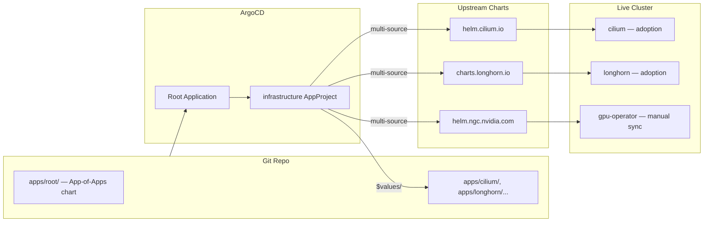
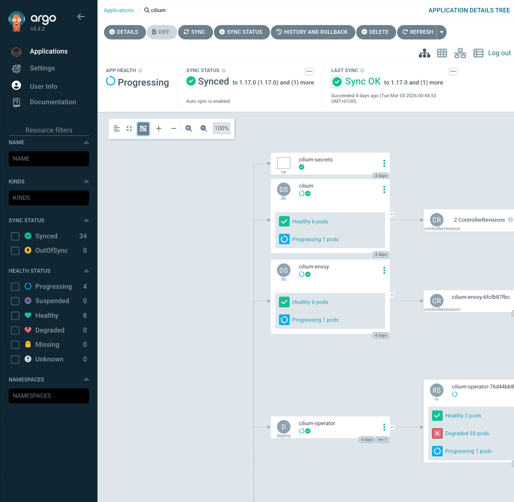

By Layer 5, the cluster had working networking, storage, and GPU compute — all installed by hand or via ad-hoc Helm commands. Cilium was a `helm install` I ran from a laptop that left no trace in Git. Longhorn was the same. If that laptop died, or if I needed to rebuild the cluster from scratch, I would have to reconstruct every `helm install` from memory.

That is not infrastructure. That is a collection of fragile coincidences.

GitOps means the Git repo is the single source of truth for everything running on the cluster. Not just application code — the entire infrastructure stack: CNI, storage, GPU drivers, ingress, observability. Every change goes through a pull request. Every sync is automated. Drift is detected and corrected.

This post covers the migration from Flux CD to ArgoCD, the Pulumi detour that did not work out, and building an App-of-Apps Helm chart to manage all workloads via GitOps — adopting Cilium and Longhorn in place without a single pod restart.



## The Pulumi Detour

The original plan was Pulumi. Write TypeScript, get state management, handle both machine and workload layers from one tool. The problem became clear within hours: no Pulumi provider exists for Sidero Omni.

The `@pulumiverse/talos` provider talks directly to the Talos API to manage machine configs. Omni already owns that layer. Running both would create a fight over machine configuration — Pulumi pushes a config, Omni detects drift and pushes its own, repeat forever.

Omni and Pulumi occupy the same layer. Since Omni was already managing all seven nodes, Pulumi had no role to play. The scaffolding in `infrastructure/pulumi/` was deleted, the design doc marked deprecated, and the search for a workload-layer tool continued.

## Why ArgoCD Over Flux

Flux CD was deployed first. It worked for about a day before breaking with a `kustomization path not found` error that proved stubborn to debug. But the real issues were architectural:

- **Flux has no UI.** Debugging sync failures means reading `kubectl` output and parsing YAML status conditions. ArgoCD ships a web dashboard showing the full resource tree, sync status, and diff for every application.
- **Multi-source support.** ArgoCD pulls a Helm chart from an upstream registry and overlays values from a Git repo — in a single Application CR. Flux requires separate `HelmRepository`, `HelmRelease`, and `Kustomization` resources.
- **App-of-Apps.** ArgoCD has a first-class pattern for bootstrapping a cluster from a single Helm chart that renders child Application CRs. One `kubectl apply` declares every workload.
- **Zero-downtime adoption.** ArgoCD takes ownership of existing resources through annotation-based tracking — no delete-and-recreate. Cilium and Longhorn were adopted in place.

Flux was uninstalled (`flux uninstall`), its namespace deleted, its CRDs cleaned up. None of this touched the running Cilium or Longhorn pods — those were standalone Helm releases continuing independently.

```bash
flux uninstall --silent
kubectl get ns flux-system
# Expected: NotFound
kubectl get crds | grep fluxcd | awk '{print $1}' | xargs kubectl delete crd
```

## App-of-Apps Pattern

The core idea: a single Helm chart whose only job is to render ArgoCD `Application` CRs. Install one root Application, ArgoCD renders the templates, discovers the children, and syncs them all.

```
root (Application)
  |
  +-- infrastructure (AppProject)
  |
  +-- cilium (Application)
  |     upstream: helm.cilium.io / cilium v1.17.0
  |     values:   apps/cilium/values.yaml
  |
  +-- cilium-config (Application)
  |     source: apps/cilium/manifests/   (L2 pool, L2 policy, Hubble UI LB)
  |
  +-- longhorn (Application)
  |     upstream: charts.longhorn.io / longhorn v1.11.0
  |     values:   apps/longhorn/values.yaml
  |
  +-- longhorn-extras (Application)
  |     source: apps/longhorn/manifests/  (GPU-local SC, Longhorn UI LB)
  |
  +-- gpu-operator (Application)
        upstream: helm.ngc.nvidia.com / gpu-operator v25.10.1
        values:   apps/gpu-operator/values.yaml
```

Each main app pulls its Helm chart from upstream. Each `-extras` or `-config` companion points at a `manifests/` directory for resources outside the chart — Cilium's `LoadBalancerIPPool`, Longhorn's `StorageClass`, LoadBalancer services at fixed IPs.

### Root Chart Structure

```yaml
# apps/root/Chart.yaml
apiVersion: v2
name: frank-infrastructure
version: 1.0.0
description: App-of-Apps for frank cluster infrastructure
```

Global values are three fields:

```yaml
# apps/root/values.yaml
repoURL: https://github.com/derio-net/frank.git
targetRevision: main
destination:
  server: https://kubernetes.default.svc
```

These are injected into every child Application template via `{{ .Values.repoURL }}`. Changing the repo URL or branch in one place updates everything.

```yaml
# apps/root/templates/project.yaml
apiVersion: argoproj.io/v1alpha1
kind: AppProject
metadata:
  name: infrastructure
  namespace: argocd
spec:
  sourceRepos:
    - '*'
  destinations:
    - namespace: '*'
      server: {{ .Values.destination.server }}
  clusterResourceWhitelist:
    - group: '*'
      kind: '*'
```

### Multi-Source Applications

Each Application CR declares two sources — the upstream Helm chart and a Git ref for local values:

```yaml
# apps/root/templates/cilium.yaml
apiVersion: argoproj.io/v1alpha1
kind: Application
metadata:
  name: cilium
  namespace: argocd
spec:
  project: infrastructure
  sources:
    - repoURL: https://helm.cilium.io/
      chart: cilium
      targetRevision: "1.17.0"
      helm:
        releaseName: cilium
        valueFiles:
          - $values/apps/cilium/values.yaml
    - repoURL: {{ .Values.repoURL }}
      targetRevision: {{ .Values.targetRevision }}
      ref: values
  destination:
    server: {{ .Values.destination.server }}
    namespace: kube-system
  syncPolicy:
    automated:
      prune: false
      selfHeal: true
    syncOptions:
      - ServerSideApply=true
      - RespectIgnoreDifferences=true
  ignoreDifferences:
    - group: ""
      kind: Secret
      jsonPointers:
        - /data
```

The second source uses `ref: values`. The first source references it as `$values/apps/cilium/values.yaml`. ArgoCD pulls the chart from one place and the values from another, all in a single Application.

Key decisions in every template:

- **`ServerSideApply=true`** — critical for adoption. Uses server-side apply semantics that merge fields rather than replacing entire objects. Prevents ArgoCD from blowing away fields set by other controllers.
- **`selfHeal: true`** — if someone manually edits a resource, ArgoCD reverts it within minutes. Git is the source of truth.
- **`prune: false`** — prevents ArgoCD from deleting resources that disappear from the chart. Cautious approach for infrastructure.
- **`ignoreDifferences` on Secrets** — prevents ArgoCD from flagging Cilium's auto-generated secrets as out of sync.

## Adopting Existing Workloads

This step had to go right. Cilium provides all pod networking, and Longhorn provides all persistent storage. Reinstalling either would mean cluster downtime.

The key is ArgoCD's **annotation-based resource tracking**. Instead of labels (which Helm already manages), ArgoCD writes its own annotation:

```yaml
# apps/argocd/values.yaml
configs:
  cm:
    application.resourceTrackingMethod: annotation
```

With this setting, ArgoCD does not conflict with existing Helm labels. When it syncs, it adds an `argocd.argoproj.io/tracking-id` annotation and begins managing the resource — no delete-and-recreate, no label overwrites.

The adoption sequence:

1. Install ArgoCD via Helm (one-time manual bootstrap).
2. Apply the root Application: `kubectl apply -f` the rendered root chart.
3. ArgoCD discovers child Applications and begins syncing.
4. For each child, ArgoCD compares desired state (chart + values) against live state.
5. Because chart versions and values match what was already deployed, ArgoCD finds minimal diff and reports Synced.



The entire process took under five minutes with zero pod restarts. Cilium agents kept routing packets, Longhorn kept serving volumes, and ArgoCD quietly attached its tracking annotations in the background.

## Self-Managing ArgoCD

ArgoCD has a chicken-and-egg problem: it cannot install itself. The initial deployment is a one-time manual Helm install:

```bash
helm repo add argo https://argoproj.github.io/argo-helm
helm install argocd argo/argo-cd \
  --namespace argocd --create-namespace \
  -f apps/argocd/values.yaml
```

After that, ArgoCD manages its own values:

```yaml
# apps/argocd/values.yaml
controller:
  replicas: 1
server:
  replicas: 1
  extraArgs:
    - --insecure
  service:
    type: LoadBalancer
    annotations:
      io.cilium/lb-ipam-ips: "192.168.55.200"
dex:
  enabled: false
global:
  affinity:
    nodeAffinity:
      type: hard
      matchExpressions:
        - key: zone
          operator: In
          values:
            - core
configs:
  params:
    server.insecure: true
  cm:
    application.resourceTrackingMethod: annotation
```

- **Single replicas** — homelab, not production SaaS.
- **`--insecure`** — Traefik handles TLS termination externally.
- **Cilium LoadBalancer IP** — pins ArgoCD to `192.168.55.200`.
- **Node affinity to `zone: core`** — keeps ArgoCD on the minis, not the GPU node or Raspberry Pis.
- **Dex disabled** — no SSO yet. Authentik integration planned.

## What We Have Now

- **Full GitOps via ArgoCD App-of-Apps** — one root chart bootstraps the entire infrastructure stack.
- **Multi-source Applications** — upstream Helm charts paired with local values, no chart vendoring.
- **Zero-downtime adoption** — Cilium and Longhorn absorbed with annotation-based tracking, no restarts.
- **Self-healing** — ArgoCD detects and corrects configuration drift via `selfHeal: true`.
- **Single repo** — machine config in `patches/`, workload config in `apps/`, same Git repo.

The two-layer split is clean: Omni owns the machines, ArgoCD owns the workloads. They never overlap.

## Missteps

| What Happened | Why It Was Wrong | How We Fixed It | Commit |
|---------------|-----------------|-----------------|--------|
| **ArgoCD scheduled on gpu-1** — the GPU node's taint toleration was missing, so ArgoCD server pods landed on the wrong node for weeks | Default scheduling placed ArgoCD on any available node; gpu-1 carried a `NoSchedule` taint but ArgoCD had no node affinity to avoid it | Added hard node affinity to `zone: core`, pinning ArgoCD to the mini NUCs | `b60d844c` |
| **50+ Application templates had explicit `prune: false`** — a cargo-cult default copy-pasted across every template | `prune: false` was set as a blanket default even for applications where pruning is safe and desired | Dropped `prune: false` from templates where auto-pruning is acceptable | `0bf146ac`, `62ca0e7c` |
| **Namespace ownership conflicts with Sympozium extras** — two ArgoCD Applications claimed the same Namespace resource, causing sync fights | Companion Applications (extras) sometimes overlapped with parent Applications on Namespace ownership | Added explicit `namespace: {{ .Release.Namespace }}` scoping or split contested namespaces into dedicated Applications | `edfef589` |
| **`ServerSideApply` not set initially** — early templates used client-side apply, which hit the 256KB annotation size limit on the large victoria-metrics chart | Client-side apply stores the entire last-applied-configuration in an annotation; large Helm charts exceed the annotation size limit | Switched all infrastructure templates to `ServerSideApply=true` | `83e2909f` |

## References

- [ArgoCD](https://argo-cd.readthedocs.io/en/stable/) — Declarative GitOps for Kubernetes
- [ArgoCD App-of-Apps Pattern](https://argo-cd.readthedocs.io/en/stable/operator-manual/cluster-bootstrapping/) — Cluster bootstrapping reference
- [ArgoCD Multi-Source Applications](https://argo-cd.readthedocs.io/en/latest/user-guide/multiple_sources/) — Multiple sources in a single Application
- [ArgoCD Resource Tracking](https://argo-cd.readthedocs.io/en/latest/user-guide/resource_tracking/) — Annotation-based vs label-based tracking
- [ArgoCD Sync Options](https://argo-cd.readthedocs.io/en/stable/user-guide/sync-options/) — ServerSideApply, selfHeal, prune

**Next: [Fun Stuff — Controlling Case LEDs from Kubernetes](/docs/building/06-fun-stuff)**
