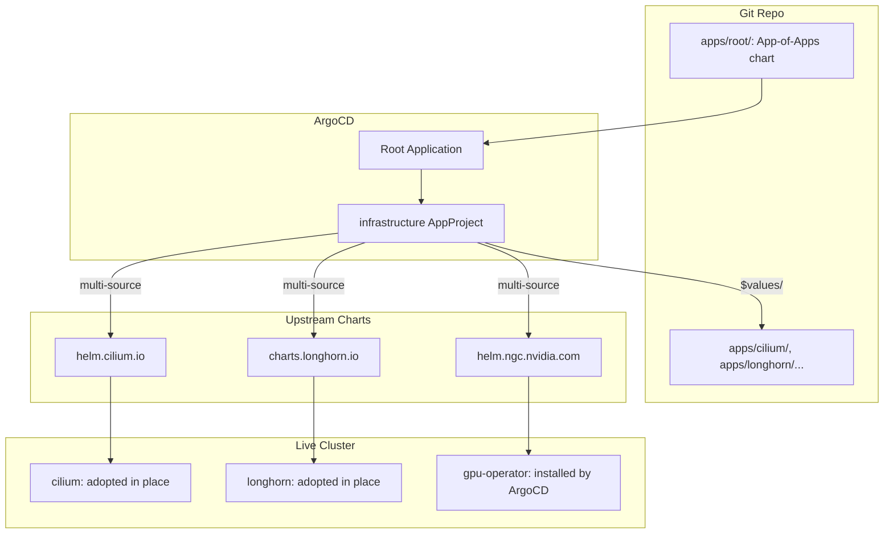
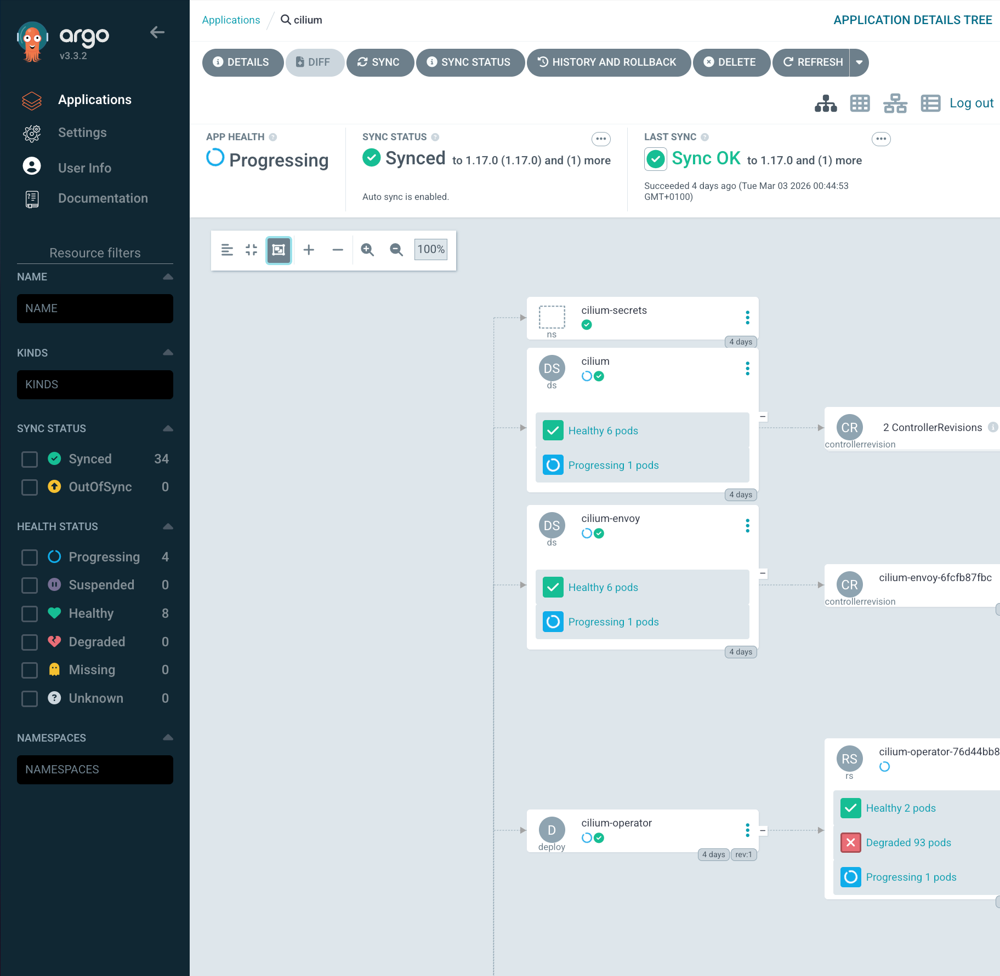

This blog builds one cluster in numbered layers, each layer a post. By the fifth of them, the cluster had working networking, storage and GPU compute, all of it installed by hand or through ad-hoc Helm commands. Cilium was a `helm install` I ran from a laptop that left no trace in Git. Longhorn was the same. If that laptop died, or if I needed to rebuild the cluster from scratch, I would have to reconstruct every `helm install` from memory.

That is not infrastructure. That is a collection of fragile coincidences.

GitOps means the Git repo is the single source of truth for everything running on the cluster, and not only for application code. The whole infrastructure stack goes in: , storage, GPU drivers, ingress, observability. Every change goes through a pull request. Every sync is automated. Drift is detected and corrected.

This post covers the migration from Flux CD to ArgoCD, the Pulumi detour that did not work out, and building an App-of-Apps Helm chart to manage all workloads via GitOps, adopting Cilium and Longhorn in place without a single pod restart.

One piece of ArgoCD notation appears in the diagram below before it is explained, so here it is early. **`$values/`** is a reference to a *second* source declared on the same Application. ArgoCD lets an Application list several sources; one of them can be tagged `ref: values`, and any other source may then address files inside it with the `$values/` prefix. That is how a chart pulled from `helm.cilium.io` reads its values file out of a GitHub repo it knows nothing about.


```mermaid
flowchart TD
  subgraph Git[Git Repo]
    Chart[apps/root/: App-of-Apps chart]
    Apps[apps/cilium/, apps/longhorn/...]
  end
  subgraph ArgoCD[ArgoCD]
    Root[Root Application]
    Project[infrastructure AppProject]
  end
  subgraph Upstream[Upstream Charts]
    CiliumCH[helm.cilium.io]
    LonghornCH[charts.longhorn.io]
    GPUCH[helm.ngc.nvidia.com]
  end
  subgraph Cluster[Live Cluster]
    Cilium[cilium: adopted in place]
    Longhorn[longhorn: adopted in place]
    GPU[gpu-operator: installed by ArgoCD]
  end

  Chart --> Root
  Root --> Project
  Project -->|multi-source| CiliumCH
  Project -->|multi-source| LonghornCH
  Project -->|multi-source| GPUCH
  Project -->|$values/| Apps
  CiliumCH --> Cilium
  LonghornCH --> Longhorn
  GPUCH --> GPU
```

The three boxes on the right are not doing the same thing. Cilium and Longhorn already existed as standalone Helm releases and had to be **adopted** without restarting a pod, which is most of the interesting work below. The GPU operator had no pre-existing release to adopt: ArgoCD installed it outright. All three end up with identical `selfHeal: true` sync policies, so the distinction is historical rather than operational.

## The Pulumi Detour

The original plan was Pulumi. Write TypeScript, get state management, handle both machine and workload layers from one tool. The problem became clear within hours: no Pulumi provider exists for Sidero Omni.

The `@pulumiverse/talos` provider talks directly to the Talos API to manage machine configs. Omni already owns that layer. Running both would create a fight over machine configuration — Pulumi pushes a config, Omni detects drift and pushes its own, repeat forever.

Omni and Pulumi occupy the same layer. Since Omni was already managing all seven nodes, Pulumi had no role to play. The scaffolding in `infrastructure/pulumi/` was deleted, the design doc marked deprecated, and the search for a workload-layer tool continued.

## Why ArgoCD Over Flux

Flux CD was deployed first. It worked for about a day before breaking with a `kustomization path not found` error that proved stubborn to debug. But the real issues were architectural:

- **Flux has no UI.** Debugging sync failures means reading `kubectl` output and parsing YAML status conditions. ArgoCD ships a web dashboard showing the full resource tree, sync status, and diff for every application.
- **Multi-source support.** ArgoCD pulls a Helm chart from an upstream registry and overlays values from a Git repo inside a single Application . Flux requires separate `HelmRepository`, `HelmRelease`, and `Kustomization` resources.
- **App-of-Apps.** ArgoCD has a first-class pattern for bootstrapping a cluster from a single Helm chart that renders child Application CRs. One `kubectl apply` declares every workload.
- **Zero-downtime adoption.** ArgoCD takes ownership of existing resources through annotation-based tracking, with no delete-and-recreate. Cilium and Longhorn were adopted in place.

Flux was uninstalled (`flux uninstall`), its namespace deleted, its  cleaned up. None of this touched the running Cilium or Longhorn pods — those were standalone Helm releases continuing independently.

```bash
flux uninstall --silent
kubectl get ns flux-system
# Expected: NotFound
kubectl get crds | grep fluxcd | awk '{print $1}' | xargs kubectl delete crd
```

## App-of-Apps Pattern

The core idea: a single Helm chart whose only job is to render ArgoCD `Application` CRs. Install one root Application, ArgoCD renders the templates, discovers the children, and syncs them all.

```
root (Application)
  |
  +-- infrastructure (AppProject)
  |
  +-- cilium (Application)
  |     upstream: helm.cilium.io / cilium v1.17.0
  |     values:   apps/cilium/values.yaml
  |
  +-- cilium-config (Application)
  |     source: apps/cilium/manifests/   (L2 pool, L2 policy, Hubble UI LB)
  |
  +-- longhorn (Application)
  |     upstream: charts.longhorn.io / longhorn v1.11.2
  |     values:   apps/longhorn/values.yaml
  |
  +-- longhorn-extras (Application)
  |     source: apps/longhorn/manifests/  (GPU-local SC, Longhorn UI LB)
  |
  +-- gpu-operator (Application)
        upstream: helm.ngc.nvidia.com / gpu-operator v25.10.1
        values:   apps/gpu-operator/values.yaml
```

Each main app pulls its Helm chart from upstream. Each `-extras` or `-config` companion points at a `manifests/` directory for the resources no upstream chart ships: Cilium's `LoadBalancerIPPool`, Longhorn's `StorageClass`, LoadBalancer services at fixed IPs.

### Root Chart Structure

```yaml
# apps/root/Chart.yaml
apiVersion: v2
name: frank-infrastructure
version: 1.0.0
description: App-of-Apps for frank cluster infrastructure
```

Global values are three fields:

```yaml
# apps/root/values.yaml
repoURL: https://github.com/derio-net/frank.git
targetRevision: main
destination:
  server: https://kubernetes.default.svc
```

These are injected into every child Application template via `{{ .Values.repoURL }}`. Changing the repo URL or branch in one place updates everything.

An `AppProject` is ArgoCD's permission boundary. Every Application must belong to one, and the project decides which repos that Application may read from, which namespaces and clusters it may write to, and which cluster-scoped resource kinds it may create at all. In a multi-tenant ArgoCD this is where you stop one team's Application from installing a `ClusterRole`. Frank has one tenant, so the project called `infrastructure` grants everything and exists only because ArgoCD requires it:

```yaml
# apps/root/templates/project.yaml
apiVersion: argoproj.io/v1alpha1
kind: AppProject
metadata:
  name: infrastructure
  namespace: argocd
spec:
  sourceRepos:
    - '*'
  destinations:
    - namespace: '*'
      server: {{ .Values.destination.server }}
  clusterResourceWhitelist:
    - group: '*'
      kind: '*'
```

Three wildcards is an honest description of a single-operator homelab and a bad default for anything else. If you copy this chart, the project is the first file to tighten.

### Multi-Source Applications

Each Application CR declares two sources: the upstream Helm chart, and a Git ref supplying local values.

```yaml
# apps/root/templates/cilium.yaml
apiVersion: argoproj.io/v1alpha1
kind: Application
metadata:
  name: cilium
  namespace: argocd
spec:
  project: infrastructure
  sources:
    - repoURL: https://helm.cilium.io/
      chart: cilium
      targetRevision: "1.17.0"
      helm:
        releaseName: cilium
        valueFiles:
          - $values/apps/cilium/values.yaml
    - repoURL: {{ .Values.repoURL }}
      targetRevision: {{ .Values.targetRevision }}
      ref: values
  destination:
    server: {{ .Values.destination.server }}
    namespace: kube-system
  syncPolicy:
    automated:
      selfHeal: true
    syncOptions:
      - ServerSideApply=true
      - RespectIgnoreDifferences=true
  ignoreDifferences:
    - kind: Secret
      jsonPointers:
        - /data
```

The second source uses `ref: values`. The first source addresses it as `$values/apps/cilium/values.yaml`. ArgoCD pulls the chart from one place and the values from another, all in a single Application.

Key decisions in every template:

- **`ServerSideApply=true`** is critical for adoption. It merges fields rather than replacing whole objects, which stops ArgoCD blowing away fields set by other controllers.
- **`selfHeal: true`** reverts any manual edit to a resource within minutes. Git is the source of truth.
- **No `prune` line at all.** Pruning stays off, which is the schema default. Writing `prune: false` explicitly says exactly the same thing and then causes a problem: ArgoCD normalises it back to absent, so the rendered manifest and the live object disagree forever and the parent Application never leaves `OutOfSync`. Say nothing and you get identical behaviour without the drift. `apps/root/values.yaml` carries the warning at the top of the file so nobody re-adds it: *"Application templates do NOT set automated.prune explicitly. The schema default (false) is our project-wide convention (manual pruning only). ArgoCD normalizes explicit `prune: false` to absent, which caused permanent drift on the root Application until we dropped the line from the templates."*
- **`ignoreDifferences` on Secrets** stops ArgoCD flagging Cilium's auto-generated secrets as out of sync.

## Adopting Existing Workloads

This step had to go right. Cilium provides all pod networking, and Longhorn provides all persistent storage. Reinstalling either would mean cluster downtime.

The key is ArgoCD's **annotation-based resource tracking**. Instead of labels (which Helm already manages), ArgoCD writes its own annotation:

```yaml
# apps/argocd/values.yaml
configs:
  cm:
    application.resourceTrackingMethod: annotation
```

With this setting, ArgoCD does not conflict with existing Helm labels. When it syncs, it adds an `argocd.argoproj.io/tracking-id` annotation and begins managing the resource. No delete-and-recreate, no label overwrites.

The adoption sequence:

1. Install ArgoCD via Helm (one-time manual bootstrap).
2. Apply the root Application: `kubectl apply -f` the rendered root chart.
3. ArgoCD discovers child Applications and begins syncing.
4. For each child, ArgoCD compares desired state (chart + values) against live state.
5. Because chart versions and values match what was already deployed, ArgoCD finds minimal diff and reports Synced.



The entire process took under five minutes with zero pod restarts. Cilium agents kept routing packets, Longhorn kept serving volumes, and ArgoCD quietly attached its tracking annotations in the background.

## Self-Managing ArgoCD

ArgoCD has a chicken-and-egg problem: it cannot install itself. The initial deployment is a one-time manual Helm install:

```bash
helm repo add argo https://argoproj.github.io/argo-helm
helm install argocd argo/argo-cd \
  --namespace argocd --create-namespace \
  -f apps/argocd/values.yaml
```

After that, ArgoCD manages its own values:

```yaml
# apps/argocd/values.yaml
controller:
  replicas: 1
server:
  replicas: 1
  extraArgs:
    - --insecure
  service:
    type: LoadBalancer
    annotations:
      io.cilium/lb-ipam-ips: "192.168.55.200"
dex:
  enabled: false
global:
  affinity:
    nodeAffinity:
      type: hard
      matchExpressions:
        - key: zone
          operator: In
          values:
            - core
configs:
  params:
    server.insecure: true
  cm:
    application.resourceTrackingMethod: annotation
```

- **Single replicas**, because this is a homelab and not production SaaS.
- **`--insecure`**, because Traefik handles  termination externally.
- **Cilium LoadBalancer IP** pins ArgoCD to `192.168.55.200`.
- **Node affinity to `zone: core`** keeps ArgoCD on the minis, off the GPU node and off the Raspberry Pis.
- **Dex disabled.**  arrived later and did not need it: Layer 13 wired ArgoCD straight to Authentik through `configs.cm.oidc.config`, so the login page hands off to `auth.frank.derio.net` and Dex never enters the picture.

## Verify the loop, and read the sync status honestly

The App-of-Apps either works or it does not, and the check is a single count. Start there:

```console
$ kubectl get applications -n argocd --no-headers | wc -l
      69
```

Sixty-nine: the root Application, plus the sixty-eight it templates. You can prove that split rather than take my word for it, because every child carries a tracking annotation naming its parent:

```console
$ kubectl -n argocd get applications -o json | jq -r \
    '[.items[] | select(.metadata.annotations."argocd.argoproj.io/tracking-id" // "" | startswith("root:"))] | length'
68
```

Sixty-eight is *my* number, not a target. Run that command on a healthy day, write the result down next to your runbook, and re-derive it whenever you add or remove an Application. What matters is the drop: if the count falls without a matching commit, root has stopped templating and nothing below it is being reconciled any more. The count you compare against is the one you recorded, and a count nobody ever recorded is a check nobody can perform.

Now the aggregate, which is more interesting than the count:

```console
$ kubectl get applications -n argocd \
    -o custom-columns=NAME:.metadata.name,SYNC:.status.sync.status,HEALTH:.status.health.status \
    --no-headers | awk '{print $2, $3}' | sort | uniq -c | sort -rn
  62 Synced Healthy
   5 OutOfSync Healthy
   1 Synced Suspended
   1 OutOfSync Missing
```

Sixty-two of sixty-nine green, and I am not going to pretend the other seven are a rounding error. `OutOfSync Healthy` means the workload is running fine while git and the cluster disagree about something. `Synced Suspended` is a deliberately scaled-down app. `OutOfSync Missing` is an app whose resources are not there at all.

### Deciding whether an OutOfSync app is your problem

Knowing what those statuses *can* mean is not the same as knowing which kind you are looking at, and only the second one helps at the moment you need it. The status column cannot tell you: `OutOfSync` is the same word for "a controller added a field git never mentioned" and "the thing you merged an hour ago never landed". Two more commands separate them.

First, ask the Application which of its own resources disagree. Every Application carries a per-resource verdict in `.status.resources`, and it names the offenders:

```console
$ kubectl -n argocd get application root -o json | jq -r \
    '.status.resources[] | select(.status=="OutOfSync") | "\(.kind)/\(.name)"'
Application/gpu-operator
Application/longhorn
Application/sympozium
```

That already changes the question from "root is unhealthy" to "three of root's sixty-eight children differ, and here they are". Sympozium, which also turns up in the missteps table below, is the agentic control plane added in a later layer, where every agent is a Pod and every policy a CRD. Nothing about what it does matters here. It matters only that its Application is one of the three.

Second, ask what the difference actually *is*. `argocd app diff` renders the desired manifest and diffs it against live. It normally wants a logged-in API server, but `--core` skips the server entirely and talks to Kubernetes through your kubeconfig, which is what you want from a laptop mid-incident:

```console
$ argocd app diff root --core
===== argoproj.io/Application argocd/gpu-operator ======
11,12d10
<   - post-delete-finalizer.argocd.argoproj.io
<   - post-delete-finalizer.argocd.argoproj.io/cleanup

===== argoproj.io/Application argocd/longhorn ======
10,11d9
<   - pre-delete-finalizer.argocd.argoproj.io
<   - pre-delete-finalizer.argocd.argoproj.io/cleanup

===== argoproj.io/Application argocd/sympozium ======
10,11d9
<   - pre-delete-finalizer.argocd.argoproj.io
<   - pre-delete-finalizer.argocd.argoproj.io/cleanup
```

And there is the answer. Every one of root's differences is a pair of Helm cleanup finalizers that ArgoCD's own machinery attached to the live object and that git never declared. Nothing I wrote is being ignored, and nothing is drifting away from the repo. Note also that the difference survives syncing: `longhorn`'s last sync operation finished the day before I ran that diff and the finalizers are still there, which is what tooling exhaust looks like rather than a stuck sync. It can wait.

Compare that with a diff showing an image tag, a replica count or a resource limit that does not match your last merge. Same status column, entirely different afternoon. **`OutOfSync` is not a severity, it is a prompt to run the diff.**

One trap with `--core`: it reads its configuration from the ConfigMap `argocd-cm` in whatever namespace your kubeconfig context currently points at. Point it anywhere else and you get `configmap "argocd-cm" not found`, which reads like a broken install rather than a wrong namespace. Set the context first:

```console
$ kubectl config set-context --current --namespace=argocd
Context "omni-frank" modified.
```

### What `Synced` does not mean

What you must not do is treat `Synced` as proof a change landed. It means the repo-server's view of the manifest matches the live object, and that view can be stale.

This is not a hypothetical. On 2026-07-27, minutes after merging a values change that added `defaultSettings.storageOverProvisioningPercentage: 150`, the `longhorn` Application reported `Synced/Healthy` while the live `longhorn-default-setting` ConfigMap simply did not contain the key. The neighbouring settings from the same file (`storage-minimal-available-percentage: "15"`, `default-replica-count: "3"`) were all present, so the mechanism was working perfectly, just not for that commit. A `refresh: hard` annotation did not clear it. An explicit sync operation cleared it in seconds. The same session produced a second instance on a different app, where a PVC merged at `40Gi` sat live at `20Gi` under a green tile.

Both were multi-source Applications: an upstream chart plus a `$values` ref into this repo. That shape appears to be the exposed one, because the values half can be served from cache while the app compares clean against it.

So before you blame ArgoCD, prove the desired state contains what you think it does, since a chart silently dropping an unrecognised key looks identical from the cluster and is more common:

```console
$ helm template lh longhorn/longhorn --version 1.11.2 -f apps/longhorn/values.yaml \
    | grep -A14 'name: longhorn-default-setting'
  name: longhorn-default-setting
  namespace: default
  labels:
    app.kubernetes.io/name: longhorn
    helm.sh/chart: longhorn-1.11.2
    app.kubernetes.io/managed-by: Helm
    app.kubernetes.io/instance: lh
    app.kubernetes.io/version: v1.11.2
data:
  default-setting.yaml: |-
    storage-over-provisioning-percentage: "150"
    storage-minimal-available-percentage: "15"
    default-replica-count: "3"
    default-data-locality: "best-effort"
    priority-class: "longhorn-critical"
```

Count your context lines generously. The ConfigMap's labels eat the first eight, so a `grep -A5` shows you the object and none of its data, which looks a lot like the key is missing.

If the key renders locally and is absent live while the app claims `Synced`, it is the sync. Force it, passing the sync options explicitly, because a manually-triggered sync does **not** inherit `spec.syncPolicy.syncOptions`:

```console
$ kubectl -n argocd patch application <app> --type=merge \
    -p '{"operation":{"sync":{"revision":"HEAD","syncOptions":["ServerSideApply=true","RespectIgnoreDifferences=true"]}}}'
```

### The failure that hits every app at once

There is one failure that does *not* show up as a per-app problem, and it is the worst one, so check it separately:

```console
$ find . -type l -lname '*../../..*' -not -path './.git/*'
$ kubectl -n argocd get applications -o json \
    | jq -r '.items[] | select(.status.conditions[]? | .type=="ComparisonError") | .metadata.name'
```

Both silent, which is the healthy answer. A single symlink that escapes the repo root raises `ComparisonError` on *every* Application at once and drops them all to sync status `Unknown`, because the repo-server gives up on rendering the tree rather than on one file in it. That happened here on 2026-05-13: a `.claude/skills` symlink with one `..` too many took the whole GitOps loop down for about fourteen hours before anyone noticed, because a cluster that has stopped reconciling looks exactly like a cluster with nothing to do. Run the pair after any commit that adds a symlink.

## What transfers

One rule, and it is smaller and stranger than "use GitOps".

**Never write down a value your controller normalises away, even when it is the value you want.** Fifty-odd Application templates here carried `automated.prune: false`. False is correct. False is what those apps should do. And writing it cost the root Application months of permanent `OutOfSync`, because ArgoCD stores an absent `prune` and an explicit `false` as the same thing, then renders only one of them. The manifest and the live object could never agree, and the fix was deleting fifty lines that did nothing.

The generalisation is worth more than the ArgoCD specifics. Any declarative system with defaulting has this shape: Kubernetes webhooks that fill in fields, Terraform providers that normalise casing, Helm charts that omit empty values. Wherever a controller can rewrite what you wrote, **stating the default is not a harmless clarification, it is a permanent diff.** Two consequences you can act on today:

- When something is `OutOfSync` and nothing you changed is in the diff, suspect a field the controller owns before you suspect yourself. The `argocd app diff --core` output above is that exact case: finalizers the tooling added, forever different from a repo that never mentioned them.
- Keep the comment where the mistake would recur. The note in `apps/root/values.yaml` exists because the *absence* of a line is invisible to the next person, and an invisible convention gets helpfully re-added by someone tidying up.

And the sharper edge of the same idea: a green sync tile means ArgoCD believes live matches **what it fetched**, not that live matches `main`. Assert on the artefact you changed. That habit costs one command and it is the difference between deploying a config and believing you did.

## Missteps

| What Happened | Why It Was Wrong | How We Fixed It | Commit |
|---------------|-----------------|-----------------|--------|
| **ArgoCD scheduled on gpu-1** — the GPU node's taint toleration was missing, so ArgoCD server pods landed on the wrong node for weeks | Default scheduling placed ArgoCD on any available node; gpu-1 carried a `NoSchedule` taint but ArgoCD had no node affinity to avoid it | Added hard node affinity to `zone: core`, pinning ArgoCD to the mini  | `b60d844c` |
| **50+ Application templates had explicit `prune: false`** — and the root Application sat permanently `OutOfSync` because of it | ArgoCD normalises `prune: false` to absent, so the rendered child manifest never matched the live object. The value was right; writing it down was the bug | Canaried the deletion on one template (`argo-rollouts`), confirmed root dropped it from the OutOfSync list, then removed the line from the remaining 50. Pruning behaviour did not change: absent means false | `0bf146ac`, `62ca0e7c` |
| **Namespace ownership conflicts with Sympozium extras** — two ArgoCD Applications claimed the same Namespace resource, causing sync fights | Companion Applications (extras) sometimes overlapped with parent Applications on Namespace ownership | Added explicit `namespace: {{ .Release.Namespace }}` scoping or split contested namespaces into dedicated Applications | `edfef589` |
| **`ServerSideApply` not set initially** — early templates used client-side apply, which hit the 256KB annotation size limit on the large victoria-metrics chart | Client-side apply stores the entire last-applied-configuration in an annotation; large Helm charts exceed the annotation size limit | Switched all infrastructure templates to `ServerSideApply=true` | `83e2909f` |

## References

- [ArgoCD](https://argo-cd.readthedocs.io/en/stable/) — Declarative GitOps for Kubernetes
- [ArgoCD App-of-Apps Pattern](https://argo-cd.readthedocs.io/en/stable/operator-manual/cluster-bootstrapping/) — Cluster bootstrapping reference
- [ArgoCD Multi-Source Applications](https://argo-cd.readthedocs.io/en/latest/user-guide/multiple_sources/) — Multiple sources in a single Application
- [ArgoCD Resource Tracking](https://argo-cd.readthedocs.io/en/latest/user-guide/resource_tracking/) — Annotation-based vs label-based tracking
- [ArgoCD Sync Options](https://argo-cd.readthedocs.io/en/stable/user-guide/sync-options/) — ServerSideApply, selfHeal, prune

**Next: [Fun Stuff — Controlling Case LEDs from Kubernetes](/docs/building/06-fun-stuff)**
