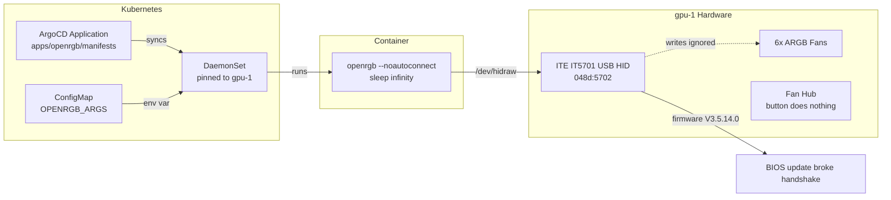

Every serious infrastructure project needs a completely unnecessary feature. This was ours: controlling the ARGB LED fans on gpu-1 from a Kubernetes DaemonSet, managed by ArgoCD, triggered by a git push. GitOps for RGB.

It does not work. We know exactly why, we know what it would take to fix it, and we have not fixed it yet. This is the honest version of that story.



## The Hardware

The gpu-1 node lives in a FOIFKIN F1 case with six pre-installed PWM ARGB fans connected through an internal hub. The hub has a button that does nothing useful in a headless rack. The fans light up on boot in whatever rainbow pattern the hub feels like, and they stay that way until you take software control.

The motherboard is a Gigabyte Z790 Eagle AX. Buried on it is an ITE IT5701 USB RGB controller (vendor `048D`, product `5702`) that manages the motherboard's addressable LED headers — and therefore the fans connected through the hub. This controller exposes itself as a USB HID device at `/dev/hidraw0`.

## USB HID vs I2C

The original plan was I2C/SMBus. Gigabyte boards typically expose RGB controllers on the SMBus, and OpenRGB supports that route well. The plan called for loading `i2c-dev` and `i2c-i801` kernel modules via a Talos machine config patch, adding `acpi_enforce_resources=lax` as a kernel argument, and probing the I2C bus.

That plan lasted ten minutes. Talos Linux does not compile `CONFIG_I2C_CHARDEV` into the kernel, so `i2c-dev` cannot load. No `/dev/i2c-*` devices, no SMBus access.

But while checking `dmesg` for I2C clues, the USB HID device was right there:

```text
hid-generic 0003:048D:5702.0001: hidraw0: USB HID v1.12 Device [ITE Tech. Inc. ITE Device]
```

Talos ships with `CONFIG_HIDRAW=y` and `CONFIG_USB_HID=y` built-in. No kernel modules to load, no Talos patches. The device is just there at `/dev/hidraw0`, ready for OpenRGB. The USB HID path is also safer than I2C — no risk of accidentally probing dangerous SMBus addresses.

## Discovery

Before writing manifests, a one-shot discovery pod on gpu-1 revealed the hardware:

```bash
kubectl run openrgb-discovery --rm -it --restart=Never \
  --image=swensorm/openrgb:release_0.9 \
  --overrides='{
    "spec": {
      "nodeSelector": {"kubernetes.io/hostname": "gpu-1"},
      "tolerations": [{"key": "nvidia.com/gpu", "operator": "Exists", "effect": "NoSchedule"}],
      "containers": [{
        "name": "openrgb-discovery",
        "image": "swensorm/openrgb:release_0.9",
        "command": ["/usr/app/openrgb", "--list-devices"],
        "securityContext": {"privileged": true},
        "volumeMounts": [{"name": "dev", "mountPath": "/dev"}]
      }],
      "volumes": [{"name": "dev", "hostPath": {"path": "/dev"}}]
    }
  }' -- /usr/app/openrgb --list-devices
```

One device: `Z790 EAGLE AX (IT5701-GIGABYTE)` at index 0, with three zones (D_LED1 Bottom, D_LED2 Top, Motherboard), eight LEDs total, and six modes (Direct, Static, Breathing, Blinking, Color Cycle, Flashing).

## The OpenRGB DaemonSet

The deployment is a DaemonSet pinned to gpu-1. A single container runs `openrgb --noautoconnect $OPENRGB_ARGS` at startup, then `sleep infinity` to stay alive.

The `--noautoconnect` flag is the key detail. It runs OpenRGB in standalone mode without starting a local server. The IT5701 controller saves its last color to non-volatile memory. When OpenRGB starts a server, the server's device initialization restores that saved state — overwriting whatever the config just applied. Standalone mode applies the config and exits cleanly.

The pod runs privileged with `/dev` mounted from the host for HID access. The gpu-1 node carries a `nvidia.com/gpu=present:NoSchedule` taint, so the DaemonSet needs a matching toleration.

```yaml
apiVersion: apps/v1
kind: DaemonSet
metadata:
  name: openrgb
  namespace: openrgb
spec:
  selector:
    matchLabels:
      app: openrgb
  template:
    spec:
      nodeSelector:
        kubernetes.io/hostname: gpu-1
      tolerations:
        - key: nvidia.com/gpu
          operator: Exists
          effect: NoSchedule
      containers:
        - name: openrgb
          image: ghcr.io/derio-net/openrgb:1.0rc2
          command: ["/bin/sh", "-c"]
          args:
            - |
              sleep 5
              /usr/app/openrgb --noautoconnect $OPENRGB_ARGS
              sleep infinity
          env:
            - name: OPENRGB_ARGS
              valueFrom:
                configMapKeyRef:
                  name: openrgb-config
                  key: OPENRGB_ARGS
          securityContext:
            privileged: true
          volumeMounts:
            - name: dev
              mountPath: /dev
          resources:
            requests:
              memory: "32Mi"
              cpu: "10m"
      volumes:
        - name: dev
          hostPath:
            path: /dev
```

A note on the image: no pre-built container exists for OpenRGB 1.0rc2. We build our own from the Codeberg source via a GitHub Actions workflow that pushes to `ghcr.io/derio-net/openrgb:1.0rc2`.

### The Server Detour

The original implementation used a two-container design: an init container to apply the config, and a main container running `openrgb --server` as a keepalive. It appeared to work.

It stopped appearing to work during an unrelated hardware session — reseating the RTX 5070, resetting the CMOS battery, and rebooting several times. The LEDs came back as green, then blue, then purple. Each reboot a different color. The server was the culprit: it reinitializes the device on every pod start, and initialization restores the controller's non-volatile saved state from the *last write* — which varied depending on which OpenRGB invocation had touched it most recently.

The fix is the standalone design above. `sleep infinity` does the same keepalive job without touching the device.

## ConfigMap-Driven LED Config

```yaml
apiVersion: v1
kind: ConfigMap
metadata:
  name: openrgb-config
  namespace: openrgb
data:
  OPENRGB_ARGS: "-d 0 -m Static -c 000000"
```

`-d 0` selects the device, `-m Static` sets the mode, `-c 000000` sets the color — black (LEDs off). The workflow to change the LED color:

1. Edit `apps/openrgb/manifests/configmap.yaml`
2. Commit and push
3. ArgoCD syncs
4. DaemonSet pod restarts, applies new config on startup
5. The fans stay exactly as they are

That is a five-stage pipeline that terminates in nothing.

## The Firmware Detour

After getting the DaemonSet running and confirming the pod was Synced/Healthy in ArgoCD, the fans were still rainbow. OpenRGB reported success. The HID device accepted every write. The LEDs ignored all of it.

A privileged pod ran Python directly against `/dev/hidraw2` using the correct `HIDIOCSFEATURE` ioctl (`0xC0404806`). Readback via `HIDIOCGFEATURE` confirmed the device was storing the writes — register state changed exactly as expected. 245 rapid write cycles. Zero effect on the physical LEDs.

The culprit is a BIOS update. The Z790 Eagle AX shipped with IT5701 firmware that OpenRGB supported. Somewhere between the original installation and now, a BIOS update (F3 → F6) swapped in IT5701 firmware version `V3.5.14.0`. This firmware version requires an unlock handshake before it will apply LED writes — a handshake that is not in OpenRGB 0.9 or 1.0rc2 for this specific PID (`0x5702`).

The device is not broken. It is not a permissions problem (udev rules verified). It is not USB autosuspend. The IT5701 simply will not apply color writes until someone sends the right initialization sequence, and that sequence is not public. The only reliable way to reverse-engineer it is to capture USB traffic from the Windows RGB Fusion application while it successfully changes the color.

KubeVirt is on the roadmap. When it arrives, a Windows VM with USB passthrough for `048d:5702` will let us capture that traffic. For now, the fans are rainbow, the pod is Synced/Healthy, and the ConfigMap is aspiration.

## ArgoCD Integration

The ArgoCD side follows the same plain-manifests pattern as `longhorn-extras` — no Helm chart, just a directory of YAML files:

```yaml
apiVersion: argoproj.io/v1alpha1
kind: Application
metadata:
  name: openrgb
  namespace: argocd
spec:
  project: infrastructure
  source:
    repoURL: {{ .Values.repoURL }}
    targetRevision: {{ .Values.targetRevision }}
    path: apps/openrgb/manifests
  destination:
    server: {{ .Values.destination.server }}
    namespace: openrgb
  syncPolicy:
    automated:
      prune: false
      selfHeal: true
```

Your LED colors are now protected by GitOps from a threat that does not exist.

## What We Have Now

To control six case fans we: ruled out I2C, ran a discovery pod, wrote a DaemonSet and ConfigMap, registered an ArgoCD Application, set up a namespace with PSA labels, built a custom container image with a GitHub Actions pipeline, ran 245 HID feature report writes with correct ioctls and verified register state, and reverse-engineered enough of the IT5701 protocol to know exactly why it does not work.

The fans are rainbow. They were rainbow when we started. They are rainbow now.

The pod requests 10 millicores of CPU and 32Mi of memory. It is Synced/Healthy. It runs `sleep infinity` approximately full-time. The LEDs ignore it completely.

But we now know more about HID feature reports, IT5701 firmware versioning, and Talos udev rule syntax than any reasonable person should. And when KubeVirt arrives and we finally capture that Windows USB traffic, we will have the best-documented RGB setup in any homelab that has never successfully changed an LED color on demand.

## Missteps

| What Happened | Why It Was Wrong | How We Fixed It | Commit |
|---------------|-----------------|-----------------|--------|
| **I2C/SMBus chosen first** — the I2C approach was planned before verifying Talos kernel config | Talos does not compile `CONFIG_I2C_CHARDEV`; the `i2c-dev` module cannot load on this OS | Switched to USB HID path, which Talos supports natively with `CONFIG_HIDRAW=y` | `51b12ece` |
| **OpenRGB `--server` mode kept restoring saved state** — the server reinitialized the device on startup, overwriting whatever color the init container had just applied | The IT5701 saves its last color to NVM; server initialization restores that saved state | Dropped the server container, use `--noautoconnect` standalone mode, `sleep infinity` for keepalive | documented in investigation notes |
| **Firmware version not checked before deployment** — BIOS update from F3 to F6 silently upgraded IT5701 firmware to V3.5.14.0, which requires an unlock handshake OpenRGB does not have for PID 0x5702 | The RGB controller accepted writes at the HID level (register state changed) but would not apply them to physical LEDs without the unlock sequence | Documented the firmware dependency; fix deferred to KubeVirt + USB passthrough to capture the unlock handshake from Windows RGB Fusion | investigation doc linked |

## References

- [OpenRGB](https://openrgb.org/) — Open-source RGB lighting control
- [OpenRGB GitLab Repository](https://gitlab.com/CalcProgrammer1/OpenRGB) — Source and device compatibility
- [Linux HID Subsystem](https://www.kernel.org/doc/html/latest/hid/index.html) — Kernel docs for USB HID and hidraw
- [IT5701 Investigation Notes](https://github.com/derio-net/frank/blob/main/docs/superpowers/plans/2026-03-09-openrgb-it5701-investigation.md) — Full analysis of the firmware write lock

**Next: [Observability — Metrics and Logs with VictoriaMetrics](/docs/building/07-observability)**
