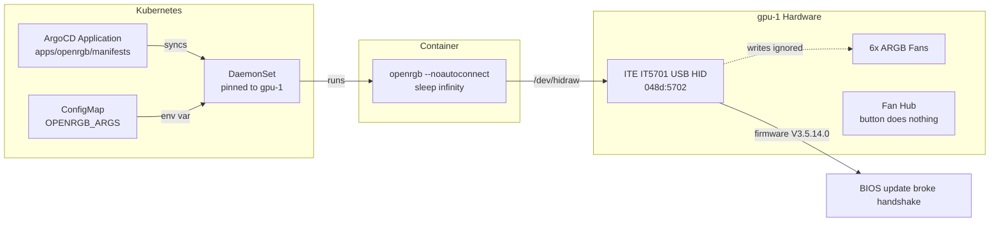

Every serious infrastructure project needs a completely unnecessary feature. This was ours: controlling the ARGB LED fans on gpu-1 from a Kubernetes DaemonSet, managed by ArgoCD, triggered by a git push. GitOps for RGB.

It does not work. We know exactly why, we know what it would take to fix it, and we have not fixed it yet.

## The Hardware

The gpu-1 node lives in a FOIFKIN F1 case with six pre-installed PWM ARGB fans connected through an internal hub. The hub has a button that does nothing useful in a headless rack. The fans light up on boot in whatever rainbow pattern the hub feels like, and they stay that way until you take software control.

The motherboard is a Gigabyte Z790 Eagle AX. Buried on it is an ITE IT5701 USB RGB controller (vendor `048D`, product `5702`) that manages the motherboard's addressable LED headers, and therefore the fans connected through the hub. This controller exposes itself as a USB HID device at `/dev/hidraw0`.

That is the whole system in one picture, ending included:


```mermaid
flowchart LR
  subgraph Hardware[gpu-1 Hardware]
    Fans[6x ARGB Fans]
    Hub[Fan Hub<br/>button does nothing]
    IT5701[ITE IT5701 USB HID<br/>048d:5702]
  end
  subgraph K8s[Kubernetes]
    DS[DaemonSet<br/>pinned to gpu-1]
    CM[ConfigMap<br/>OPENRGB_ARGS]
    App[ArgoCD Application<br/>apps/openrgb/manifests]
  end
  subgraph Image[Container]
    OpenRGB[openrgb --noautoconnect<br/>sleep infinity]
  end

  App -->|syncs| DS
  CM -->|env var| DS
  DS -->|runs| OpenRGB
  OpenRGB -->|/dev/hidraw| IT5701
  IT5701 -.->|writes ignored| Fans
  IT5701 -->|firmware V3.5.14.0| Block[BIOS update broke handshake]
```

Every arrow in that diagram works except the dotted one. The rest of this post is how each solid arrow was built and how the dotted one was diagnosed.

## Choosing a bus: why USB HID and not I2C

An RGB controller on a consumer motherboard is reachable two ways, and picking between them is the first real decision. Gigabyte boards typically expose theirs on the **SMBus**, addressed through I2C, which is the route OpenRGB supports best and the route most guides assume. The alternative is **USB HID**, where the controller presents itself as a human-interface device and takes feature reports.

The I2C plan was the obvious one: load `i2c-dev` and `i2c-i801` via a Talos machine config patch, add `acpi_enforce_resources=lax` as a kernel argument, probe the bus. It is unavailable on this OS. Talos Linux does not compile `CONFIG_I2C_CHARDEV` into its kernel, so `i2c-dev` cannot load at all, and without it there are no `/dev/i2c-*` devices and no SMBus access. Nothing about that is fixable from a machine config patch, because the constraint is in the kernel build.

Check for the chardev before you plan around I2C. It costs one command and it is the difference between a route and a dead end.

USB HID turned out to be present all along. While reading `dmesg` for I2C clues, the device announced itself:

```text
hid-generic 0003:048D:5702.0001: hidraw0: USB HID v1.12 Device [ITE Tech. Inc. ITE Device]
```

Talos ships `CONFIG_HIDRAW=y` and `CONFIG_USB_HID=y` built in. No kernel modules to load, no Talos patches, no kernel arguments. The device is simply there at `/dev/hidraw0`. The HID path also carries less risk than I2C, where a careless probe can write to an address that matters.

## Discovery

Before writing manifests, a one-shot discovery pod on gpu-1 revealed the hardware:

```bash
kubectl run openrgb-discovery --rm -it --restart=Never \
  --image=swensorm/openrgb:release_0.9 \
  --overrides='{
    "spec": {
      "nodeSelector": {"kubernetes.io/hostname": "gpu-1"},
      "tolerations": [{"key": "nvidia.com/gpu", "operator": "Exists", "effect": "NoSchedule"}],
      "containers": [{
        "name": "openrgb-discovery",
        "image": "swensorm/openrgb:release_0.9",
        "command": ["/usr/app/openrgb", "--list-devices"],
        "securityContext": {"privileged": true},
        "volumeMounts": [{"name": "dev", "mountPath": "/dev"}]
      }],
      "volumes": [{"name": "dev", "hostPath": {"path": "/dev"}}]
    }
  }' -- /usr/app/openrgb --list-devices
```

One device: `Z790 EAGLE AX (IT5701-GIGABYTE)` at index 0, with three zones (D_LED1 Bottom, D_LED2 Top, Motherboard), eight LEDs total, and six modes (Direct, Static, Breathing, Blinking, Color Cycle, Flashing).

## The OpenRGB DaemonSet

The deployment is a DaemonSet pinned to gpu-1. A single container runs `openrgb --noautoconnect $OPENRGB_ARGS` at startup, then `sleep infinity` to stay alive.

The `--noautoconnect` flag is the key detail. It runs OpenRGB in standalone mode without starting a local server. The IT5701 controller saves its last color to non-volatile memory. When OpenRGB starts a server, the server's device initialization restores that saved state — overwriting whatever the config just applied. Standalone mode applies the config and exits cleanly.

The pod runs privileged with `/dev` mounted from the host for HID access. The gpu-1 node carries a `nvidia.com/gpu=present:NoSchedule` taint, so the DaemonSet needs a matching toleration.

```yaml
apiVersion: apps/v1
kind: DaemonSet
metadata:
  name: openrgb
  namespace: openrgb
spec:
  selector:
    matchLabels:
      app: openrgb
  template:
    spec:
      nodeSelector:
        kubernetes.io/hostname: gpu-1
      tolerations:
        - key: nvidia.com/gpu
          operator: Exists
          effect: NoSchedule
      containers:
        - name: openrgb
          image: ghcr.io/derio-net/openrgb:1.0rc2
          command: ["/bin/sh", "-c"]
          args:
            - |
              sleep 5
              /usr/app/openrgb --noautoconnect $OPENRGB_ARGS
              sleep infinity
          env:
            - name: OPENRGB_ARGS
              valueFrom:
                configMapKeyRef:
                  name: openrgb-config
                  key: OPENRGB_ARGS
          securityContext:
            privileged: true
          volumeMounts:
            - name: dev
              mountPath: /dev
          resources:
            requests:
              memory: "32Mi"
              cpu: "10m"
      volumes:
        - name: dev
          hostPath:
            path: /dev
```

A note on the image: no pre-built container exists for OpenRGB 1.0rc2. We build our own from the Codeberg source via a GitHub Actions workflow that pushes to `ghcr.io/derio-net/openrgb:1.0rc2`.

### Why a keepalive server is the wrong shape for a device with saved state

The original implementation used a two-container design: an init container to apply the config, and a main container running `openrgb --server` as a keepalive. It appeared to work.

It stopped appearing to work during an unrelated hardware session that involved reseating the RTX 5070, resetting the CMOS battery and rebooting several times. The LEDs came back green, then blue, then purple. Each reboot a different color. The server was the culprit: it reinitializes the device on every pod start, and initialization restores the controller's non-volatile saved state from whichever write touched it most recently.

The lesson generalises past LEDs. **When a device persists state across power cycles, a process that "initializes" it on every start is not a keepalive, it is a second writer**, and it will race whatever you configured. Anything holding non-volatile settings behaves this way: BMCs, managed switches, firmware-configurable NICs. If all you need is for the pod to stay alive, keep it alive with something that does not touch the hardware at all. `sleep infinity` does that job perfectly.

## ConfigMap-Driven LED Config

```yaml
apiVersion: v1
kind: ConfigMap
metadata:
  name: openrgb-config
  namespace: openrgb
data:
  OPENRGB_ARGS: "-d 0 -m Static -c 000000"
```

`-d 0` selects the device, `-m Static` sets the mode, `-c 000000` sets the color to black, meaning LEDs off. The workflow to change the LED color:

1. Edit `apps/openrgb/manifests/configmap.yaml`
2. Commit and push
3. ArgoCD syncs
4. DaemonSet pod restarts, applies new config on startup
5. The fans stay exactly as they are

That is a five-stage pipeline that terminates in nothing.

## Diagnosing a device that accepts writes and does nothing

After getting the DaemonSet running and confirming the pod was Synced/Healthy in ArgoCD, the fans were still rainbow. OpenRGB reported success. The HID device accepted every write. The LEDs ignored all of it.

This is a specific and unpleasant failure class, because every layer above the hardware reports success. Work it in this order, cheapest first.

**Rule out permissions.** A write that silently does nothing and a write refused by the kernel look different at the syscall level and identical in a log line that only checks for exceptions. Verify the udev rules, and read the ioctl's return value rather than trusting the library wrapping it.

**Rule out USB autosuspend.** A suspended device accepts a write into a buffer nobody drains. This is the most common cause of "I wrote it and nothing happened" on USB peripherals and it costs one `/sys` read to eliminate.

**Then read the state back.** This is the step that turns guessing into evidence. A privileged pod ran Python directly against `/dev/hidraw2` using the `HIDIOCSFEATURE` ioctl (`0xC0404806`), then read the register back with `HIDIOCGFEATURE`. The device was storing the writes: register state changed exactly as commanded, over 245 rapid write cycles, with zero effect on the physical LEDs.

That readback is the whole diagnosis. The controller is receiving instructions, storing them, and declining to act on them. Nothing above the firmware can cause that.

Which points at what changed underneath. The Z790 Eagle AX shipped with IT5701 firmware that OpenRGB drove happily. A BIOS update from F3 to F6 swapped in firmware `V3.5.14.0`, and writes stopped taking effect from that point.

I want to be careful about how strongly I state the next part, because it is the difference between a finding and a story. What is **observed** is that writes are accepted and stored, that the physical LEDs do not change, and that this began with the firmware change. What is **inferred**, and still labelled a hypothesis in the [investigation notes](https://github.com/derio-net/frank/blob/main/docs/superpowers/implemented/investigations/2026-03-09--fun--openrgb-it5701-investigation.md), is the mechanism: that `V3.5.14.0` enters a write-locked state whose exit sequence OpenRGB does not send for this specific PID (`0x5702`). The investigation's supporting evidence is that the sibling IT5711 (`0x5711`) takes an entirely separate code path in OpenRGB 1.0rc2 and received the newer firmware compatibility work, while the IT5701 path did not. That is a good hypothesis. It is not a captured packet.

The way to settle it is to watch a client that succeeds. KubeVirt is on the roadmap; when it arrives, a Windows VM with USB passthrough for `048d:5702` can capture what RGB Fusion sends while it changes a color, and the answer is in that trace. Until someone runs it, the pod is Synced/Healthy and the ConfigMap is aspiration.

## ArgoCD Integration

The ArgoCD side follows the same plain-manifests pattern as `longhorn-extras` — no Helm chart, just a directory of YAML files:

```yaml
apiVersion: argoproj.io/v1alpha1
kind: Application
metadata:
  name: openrgb
  namespace: argocd
spec:
  project: infrastructure
  source:
    repoURL: {{ .Values.repoURL }}
    targetRevision: {{ .Values.targetRevision }}
    path: apps/openrgb/manifests
  destination:
    server: {{ .Values.destination.server }}
    namespace: openrgb
  syncPolicy:
    automated:
      selfHeal: true
```

Your LED colors are now protected by GitOps from a threat that does not exist.

## Why there is no verification section

There is no verification section at the end of this one, and that is deliberate rather than an omission. Every other layer here closes with commands you can run when something looks wrong. This layer has no alert rule watching it, no entry in the manual-operations runbook, and no test guarding it, because there is no failure it could have that anyone would need to catch. The write lock does not intermittently fail. Changing the ConfigMap is inert by design, and a section pretending otherwise would be a section I made up.

For the record, the full inventory required to control six case fans: rule out I2C, run a discovery pod, write a DaemonSet and ConfigMap, register an ArgoCD Application, set up a namespace with  labels, build a custom container image with a GitHub Actions pipeline, issue 245 HID feature report writes with correct ioctls, verify register state, and learn enough of the IT5701 protocol to know exactly why none of it works.

The fans are rainbow. They were rainbow when we started. They are rainbow now. The pod requests 10 millicores and 32Mi, is Synced/Healthy, and runs `sleep infinity` approximately full-time.

## What transfers

**When a device accepts your writes and physically does nothing, the bug is almost never in your code, and the order you eliminate causes in decides whether you lose an afternoon or a week.**

Check permissions first, then power management, then read the register back. Those three take minutes and between them they separate "my write never arrived" from "my write arrived and was ignored". The readback is the pivot: once you can show the device stored the value and did not act on it, every software-side explanation is dead and you can stop testing them. Here it killed the udev theory, the autosuspend theory and the wrong-ioctl theory in one measurement.

What is left after that is a **handshake you are not sending**, and the most likely reason you are not sending it is that something underneath you changed while you were not looking. Firmware ships inside BIOS updates. Nobody announces it, no package manager records it, and the version you are talking to today is not necessarily the version the tool was written against. **Read the firmware version before you read the source of the driver.** It is one line in `dmesg` and it reframes the entire investigation.

The last piece is knowing when to stop. Reverse-engineering an undocumented protocol from the outside is unbounded work; capturing it from a client that already succeeds is bounded work. If a working implementation exists on some other operating system, the cheapest remaining move is usually to run that implementation and watch the wire, not to keep guessing at the bytes.

And one for the GitOps enthusiasts specifically: **a pipeline can be green end to end and still terminate in nothing.** Every stage here reports success. The Application syncs, the pod runs, the write returns zero. Success at each stage says nothing about effect at the end of the chain, which is why the only honest test of this layer is a human looking at a fan.

We now know more about HID feature reports, IT5701 firmware versioning and Talos udev rule syntax than any reasonable person should. And when KubeVirt arrives and we finally capture that Windows USB traffic, we will have the best-documented RGB setup in any homelab that has never successfully changed an LED color on demand.

## Missteps

| What Happened | Why It Was Wrong | How We Fixed It | Commit |
|---------------|-----------------|-----------------|--------|
| **I2C/SMBus chosen first** — the I2C approach was planned before verifying Talos kernel config | Talos does not compile `CONFIG_I2C_CHARDEV`; the `i2c-dev` module cannot load on this OS | Switched to USB HID path, which Talos supports natively with `CONFIG_HIDRAW=y` | `51b12ece` |
| **OpenRGB `--server` mode kept restoring saved state** — the server reinitialized the device on startup, overwriting whatever color the init container had just applied | The IT5701 saves its last color to NVM; server initialization restores that saved state | Dropped the server container, use `--noautoconnect` standalone mode, `sleep infinity` for keepalive | documented in investigation notes |
| **Firmware version not checked before deployment** — BIOS update from F3 to F6 silently upgraded IT5701 firmware to V3.5.14.0, which requires an unlock handshake OpenRGB does not have for PID 0x5702 | The RGB controller accepted writes at the HID level (register state changed) but would not apply them to physical LEDs without the unlock sequence | Documented the firmware dependency; fix deferred to KubeVirt + USB passthrough to capture the unlock handshake from Windows RGB Fusion | investigation doc linked |

## References

- [OpenRGB](https://openrgb.org/) — Open-source RGB lighting control
- [OpenRGB GitLab Repository](https://gitlab.com/CalcProgrammer1/OpenRGB) — Source and device compatibility
- [Linux HID Subsystem](https://www.kernel.org/doc/html/latest/hid/index.html) — Kernel docs for USB HID and hidraw
- [IT5701 Investigation Notes](https://github.com/derio-net/frank/blob/main/docs/superpowers/implemented/investigations/2026-03-09--fun--openrgb-it5701-investigation.md) — Full analysis of the firmware write lock, including the rejected timing hypothesis

**Next: [Observability — Metrics and Logs with VictoriaMetrics](/docs/building/07-observability)**
