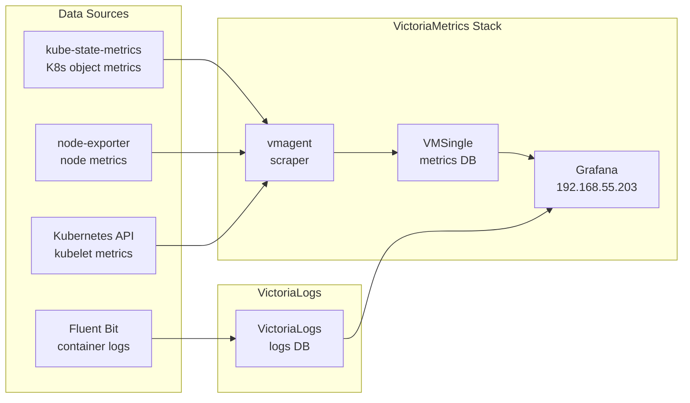

A cluster without observability is a box of mystery. Pods crash silently. Memory leaks hide behind restart counts. Network blips become finger-pointing exercises. Layer 7 fixes that: a full metrics and logging stack built around VictoriaMetrics, VictoriaLogs, and Grafana, managed by ArgoCD, backed by Longhorn storage.

But three things went wrong during the deployment. A stale webhook from a reinstall completely broke resource reconciliation — objects existed but nothing happened to them. A wrong service hostname had Fluent Bit retrying silently, producing zero log data with no errors. And a Helm chart composition issue made `additionalDataSources` silently ignored. Each of these cost about an hour to diagnose. Documenting them here so you do not lose that hour.



## Why VictoriaMetrics Instead of Prometheus

The standard choice is `kube-prometheus-stack` — Prometheus, Alertmanager, Grafana, and a bundle of exporters. It works well, but it is heavy. On a homelab where control-plane nodes also run workloads, baseline resource consumption matters.

| Component | kube-prometheus-stack | victoria-metrics-k8s-stack |
|---|---|---|
| Prometheus / VMSingle | ~1–2 GB RAM | ~50–150 MB RAM |
| Full stack baseline | ~2–4 GB RAM | ~200–400 MB RAM |
| Storage format | TSDB (per-sample blocks) | custom compressed format |
| Long-term retention | needs Thanos / Cortex | built-in, single binary |

VictoriaMetrics is not a drop-in replacement in the sense that it requires rethinking the architecture — but the `victoria-metrics-k8s-stack` Helm chart is deliberately structured to be familiar to anyone who has used `kube-prometheus-stack`. It ships the same CRD patterns (`VMServiceMonitor`, `VMPodMonitor`), the same Grafana dashboards, and the same exporters.

## The Stack

Four ArgoCD Applications make up the observability layer:

**`victoria-metrics`** — Core chart (`victoria-metrics-k8s-stack` v0.72.4). Deploys:
- `VMSingle` — single-node time-series DB with 20Gi Longhorn PVC, 1-month retention
- `vmagent` — metrics scraper; reads `VMServiceMonitor` and `VMPodMonitor` CRDs
- `node-exporter` — DaemonSet on all nodes
- `kube-state-metrics` — Kubernetes object metrics
- Grafana — with 1Gi Longhorn PVC, exposed at `192.168.55.203`

**`victoria-logs`** — Separate chart (`victoria-logs-single` v0.11.28). Single-node log storage with 20Gi Longhorn PVC, 14-day retention.

**`fluent-bit`** — DaemonSet on all nodes. Ships container logs to VictoriaLogs via HTTP jsonline.

**Note:** `vmalert` and `alertmanager` are disabled in this layer. Alerting is planned for later after rules are properly tuned.

### Deployment Details

All three Applications follow the same dual-source pattern: upstream Helm chart + Git repo for values:

```yaml
# apps/root/templates/victoria-metrics.yaml
apiVersion: argoproj.io/v1alpha1
kind: Application
metadata:
  name: victoria-metrics
  namespace: argocd
  finalizers:
    - resources-finalizer.argocd.argoproj.io
spec:
  project: infrastructure
  sources:
    - repoURL: https://victoriametrics.github.io/helm-charts/
      chart: victoria-metrics-k8s-stack
      targetRevision: "0.72.4"
      helm:
        releaseName: victoria-metrics
        valueFiles:
          - $values/apps/victoria-metrics/values.yaml
    - repoURL: {{ .Values.repoURL }}
      targetRevision: {{ .Values.targetRevision }}
      ref: values
  destination:
    server: {{ .Values.destination.server }}
    namespace: monitoring
  syncPolicy:
    automated:
      prune: false
      selfHeal: true
    syncOptions:
      - ServerSideApply=true
      - RespectIgnoreDifferences=true
  ignoreDifferences:
    - group: ""
      kind: Secret
      jsonPointers:
        - /data
```

Two sync options matter. `ServerSideApply=true` avoids the 256KB annotation size limit that client-side apply hits with large Helm charts. `RespectIgnoreDifferences=true` works with the `ignoreDifferences` block to stop flagging Grafana's auto-generated credentials Secret as drifted.

Values:

```yaml
# apps/victoria-metrics/values.yaml
vmalert:
  enabled: false
alertmanager:
  enabled: false
kubeControllerManager:
  enabled: false   # service name exceeded 63 chars

vmsingle:
  spec:
    retentionPeriod: "1"
    storage:
      storageClassName: longhorn
      accessModes:
        - ReadWriteOnce
      resources:
        requests:
          storage: 20Gi

grafana:
  enabled: true
  service:
    type: LoadBalancer
    loadBalancerIP: 192.168.55.203
  persistence:
    enabled: true
    storageClassName: longhorn
    size: 1Gi
  plugins:
    - victoriametrics-logs-datasource
```

The `kubeControllerManager` scrape is disabled for an unglamorous reason: the generated service name (`victoria-metrics-victoria-metrics-k8s-stack-kube-controller-manager`) is 65 characters. Kubernetes allows 63.

## Gotcha 1: The Stale ValidatingWebhookConfiguration

This one cost about an hour.

### Symptom

After initial sync, `VMSingle` came up healthy. But `vmagent` never appeared — no Deployment, no pods, no events. ArgoCD showed `Synced/Degraded` with a cryptic error. `kubectl get vmagent -n monitoring` showed the object existed. `kubectl describe` showed nothing obviously wrong.

### Diagnosis

The victoria-metrics operator uses a `ValidatingWebhookConfiguration` to validate its custom resources. The sequence:

1. First install: operator deployed, registered webhook with its own CA bundle
2. Something went wrong mid-install (the 63-char service name issue)
3. Application was deleted and reinstalled
4. The old `ValidatingWebhookConfiguration` remained — not owned by the Helm release
5. The stale webhook pointed at the old operator's TLS certificate
6. Every API call to reconcile the `VMAgent` resource hit the webhook, TLS handshake failed, reconciliation silently dropped

The giveaway:

```text
Warning  FailedCreate  validatingwebhookconfiguration/victoria-metrics-victoria-metrics-operator-admission
  x509: certificate signed by unknown authority
```

### Fix

Delete the stale webhook. The operator re-registers within seconds:

```bash
kubectl delete validatingwebhookconfiguration \
  victoria-metrics-victoria-metrics-operator-admission
```

The lesson: when an operator uses admission webhooks and the install/reinstall cycle is not clean, check for stale `ValidatingWebhookConfiguration` objects. They survive Helm releases and cause ghost-in-the-machine behavior where objects exist but nothing happens.

## Gotcha 2: The Fluent Bit Hostname

### Symptom

Fluent Bit DaemonSet was running on all nodes. No errors in logs. But VictoriaLogs showed zero documents. Fluent Bit showed continuous retry loops: `[engine] flush chunk ... retry=true`.

### Diagnosis

Fluent Bit's `[OUTPUT]` block uses an HTTP plugin to forward logs. The `Host` field must resolve in-cluster. The initial config used:

```text
Host  victoria-logs-victoria-logs-single.monitoring.svc.cluster.local
```

That hostname does not exist. The `victoria-logs-single` chart names its Service with a `-server` suffix: the actual name is `victoria-logs-victoria-logs-single-server`. The chart does not document this clearly.

To find the correct name:

```bash
kubectl get svc -n monitoring | grep victoria-logs
```

```text
victoria-logs-victoria-logs-single-server   ClusterIP   10.96.x.x   <none>   9428/TCP
```

### Fix

```yaml
# apps/fluent-bit/values.yaml
config:
  outputs: |
    [OUTPUT]
        Name            http
        Match           kube.*
        Host            victoria-logs-victoria-logs-single-server.monitoring.svc.cluster.local
        Port            9428
        URI             /insert/jsonline?_stream_fields=stream,kubernetes_pod_name,kubernetes_namespace_name,kubernetes_container_name&_msg_field=log&_time_field=time
        Format          json_lines
        Json_Date_Key   time
        Json_Date_Format iso8601
        Retry_Limit     False
```

The lesson: DNS failures in Kubernetes are silent killers. Fluent Bit does not differentiate between "server returned error" and "DNS lookup failed" in its retry output. When a log shipper shows retries with no error detail, the first check is whether the destination hostname resolves.

The Fluent Bit DaemonSet tolerates control-plane and GPU node taints to run everywhere:

```yaml
tolerations:
  - key: node-role.kubernetes.io/control-plane
    operator: Exists
    effect: NoSchedule
  - key: nvidia.com/gpu
    operator: Exists
    effect: NoSchedule
```

## Gotcha 3: additionalDataSources Does Not Work

### Symptom

After deploying both VictoriaMetrics and VictoriaLogs, Grafana had VictoriaMetrics pre-configured (handled by the chart), but VictoriaLogs was absent. Adding it via `grafana.additionalDataSources` in the victoria-metrics values had no effect regardless of how many times the Application was synced.

### Diagnosis

The `victoria-metrics-k8s-stack` chart manages Grafana datasource provisioning through its own ConfigMap — `victoria-metrics-victoria-metrics-k8s-stack-grafana-ds` — rather than delegating to the Grafana subchart's provisioning mechanism. `grafana.additionalDataSources`, which works by adding entries to the Grafana subchart's own ConfigMap, is never consulted.

### Fix

A standalone provisioning ConfigMap mounted into Grafana via `extraConfigmapMounts`:

```yaml
# apps/victoria-metrics/manifests/grafana-victorialogs-ds.yaml
apiVersion: v1
kind: ConfigMap
metadata:
  name: grafana-victorialogs-datasource
  namespace: monitoring
data:
  victorialogs-datasource.yaml: |
    apiVersion: 1
    datasources:
      - name: VictoriaLogs
        type: victoriametrics-logs-datasource
        access: proxy
        url: http://victoria-logs-victoria-logs-single-server.monitoring.svc.cluster.local:9428
        isDefault: false
        editable: false
```

Mounted via:

```yaml
grafana:
  extraConfigmapMounts:
    - name: victorialogs-datasource
      mountPath: /etc/grafana/provisioning/datasources/victorialogs.yaml
      subPath: victorialogs-datasource.yaml
      configMap: grafana-victorialogs-datasource
      readOnly: true
```

The lesson: Helm chart composition is leaky. When chart A embeds chart B as a subchart, chart A can intercept anything chart B would have done. The escape hatch is `extraConfigmapMounts` — it operates at the Pod level and is independent of the chart's own provisioning logic.

## What Is Visible Now

**Grafana at `http://192.55.203`** ships dashboards:
- Node Exporter Full — per-node CPU, memory, disk I/O, network
- Kubernetes / Compute Resources / Cluster — cluster-wide CPU/memory requests vs usage
- Kubernetes / Compute Resources / Namespace — same per namespace
- VMAgent — internal scraping metrics



**VictoriaLogs** is queryable via Grafana Explore:

```text
# All logs from argocd
{kubernetes_namespace_name="argocd"}

# Specific pod
{kubernetes_pod_name=~"victoria-metrics.*"}

# Error lines across cluster
{kubernetes_namespace_name=~".+"} |= "error"
```

## Missteps

| What Happened | Why It Was Wrong | How We Fixed It | Commit |
|---------------|-----------------|-----------------|--------|
| **Stale ValidatingWebhookConfiguration from reinstall** — deleting and recreating the Application left the old webhook pointing at a nonexistent operator TLS cert | The webhook was not owned by the Helm release; Helm did not clean it up on uninstall | Manual `kubectl delete validatingwebhookconfiguration`; operator re-registered with fresh cert | `edec8a48` |
| **Fluent Bit hostname missing `-server` suffix** — the VictoriaLogs chart appends `-server` to its Service name, which is not documented in the chart README | Wrong DNS name caused silent retry loops with no error output; Fluent Bit retries on any transport failure without differentiating DNS from HTTP errors | Corrected `Host` to `victoria-logs-victoria-logs-single-server.monitoring.svc.cluster.local` | `83dfb68a` |
| **`grafana.additionalDataSources` silently ignored** — the victoria-metrics chart overrides Grafana's datasource provisioning with its own ConfigMap, making the subchart value a no-op | Helm chart composition is leaky; the parent chart intercepts the subchart's provisioning mechanism | Used `extraConfigmapMounts` to mount a standalone provisioning ConfigMap at the Pod level | `bbc93d3b` |
| **High-cardinality node-meta labels flooded VictoriaMetrics** — Cilium's default pod metadata labels exploded metric cardinality, causing OOMs | `node-meta` labels include pod IPs and container IDs — billions of unique series | Dropped high-cardinality labels via Cilium Helm value overrides | `193c3890` |
| **Grafana deployment strategy defaulted to RollingUpdate** — persistent PVC sometimes stuck during rolling updates due to ReadWriteOnce access mode | Grafana's PVC is RWO; a rolling update can leave the old pod terminating while the new pod is pending, neither able to mount | Set `Grafana.deploymentStrategy` to `Recreate` | `e40c952d` |

## References

- [VictoriaMetrics Helm Charts](https://github.com/VictoriaMetrics/helm-charts) — victoria-metrics-k8s-stack and victoria-logs-single
- [VictoriaLogs Documentation](https://docs.victoriametrics.com/victorialogs/) — Ingestion API, query language, retention
- [Fluent Bit Documentation](https://docs.fluentbit.io/) — Input/filter/output plugin reference
- [victoria-metrics-k8s-stack Chart](https://github.com/VictoriaMetrics/helm-charts/tree/master/charts/victoria-metrics-k8s-stack) — CRDs, values, components

**Next: [Backup and Disaster Recovery](/docs/building/08-backup)**
