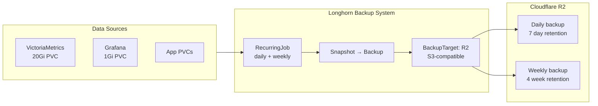

A cluster without backups is a disaster waiting to happen. But the scope depends on what you already have in source control.

Frank is fully GitOps-managed. If the cluster evaporates tonight, ArgoCD restores every Deployment, Service, ConfigMap, and StorageClass in under ten minutes. The one thing it cannot restore is the *contents* of PersistentVolumes: the VictoriaMetrics time-series, Grafana dashboards, application state. Layer 8 protects that data.

But three Longhorn 1.11 bugs and limitations turned what should have been a simple BackupTarget + RecurringJob config into a week of workarounds. SOPS-encrypted secrets cannot live in ArgoCD manifest paths. RecurringJobs have no `backupTargetName` field — you cannot route jobs to specific targets. And the NFS backup target is broken by a mount-path formatting bug that will not be fixed until Longhorn 1.13.



## Why Not Velero

The default answer to "Kubernetes backup" is Velero. It backs up API objects and PVC data, handles restores, and has broad ecosystem support. For clusters where workload configuration is not in source control, it is genuinely the right tool.

For Frank, Velero's job overlaps almost entirely with what git and ArgoCD already provide. That leaves only PVC data backup — which Longhorn handles natively, with a richer snapshot model, first-class UI, and no extra control-plane components. No Velero. Longhorn does the work.

## The Backup Architecture

Longhorn uses two CRDs for backup:

- **`BackupTarget`** — defines where backups are stored (NFS or S3-compatible endpoint)
- **`RecurringJob`** — defines a schedule applied to a group of volumes

Both live in `longhorn-system` and are picked up by the existing `longhorn-extras` ArgoCD Application. No new app needed.

The original plan was dual-target: a local NAS (NFS) for fast daily restores, and Cloudflare R2 for offsite weekly backups. Execution surfaced three Longhorn 1.11 limitations that changed the final shape.

## Gotcha 1: SOPS Secrets vs ArgoCD ServerSideApply

The R2 API credentials need to be a Kubernetes Secret. The repo uses SOPS/age encryption — files matching `*.yaml` have their `data` and `stringData` fields encrypted at rest.

The natural instinct is to drop `r2-secret.yaml` into `apps/longhorn/manifests/` alongside the other Longhorn CRs. This fails:

```text
failed to create typed patch object (longhorn-system/longhorn-r2-secret; /v1, Kind=Secret):
.sops: field not declared in schema
```

ArgoCD's `ServerSideApply=true` mode strictly validates against the resource schema. The SOPS metadata — `.sops.creation_rules`, `.sops.mac` — is not in the Kubernetes Secret schema. Server-side apply rejects it.

The fix: move the encrypted secret outside the ArgoCD-managed path. It lives at `secrets/longhorn/r2-secret.yaml` — in git, encrypted, but applied manually:

```bash
sops --decrypt secrets/longhorn/r2-secret.yaml | kubectl apply -f -
```

The `longhorn-extras` Application gets `ignoreDifferences` on the Secret's `/data` field so ArgoCD does not fight over the difference between encrypted-in-git and decrypted-in-cluster:

```yaml
ignoreDifferences:
  - group: ""
    kind: Secret
    name: longhorn-r2-secret
    namespace: longhorn-system
    jsonPointers:
      - /data
```

The lesson: SOPS-encrypted secrets and ArgoCD ServerSideApply do not mix in a raw manifest path. Encrypted secrets need to be applied out-of-band, or a SOPS decryption plugin (KSOPS) needs to be wired into ArgoCD.

## Gotcha 2: RecurringJob Has No `backupTargetName`

The original plan had two `RecurringJob` CRs: `daily-nas` pointing at the NAS, `weekly-r2` pointing at R2. The manifests included `spec.backupTargetName` to route each job to its respective target.

ArgoCD rejected both:

```text
failed to create typed patch object:
.spec.backupTargetName: field not declared in schema
```

Querying the CRD confirms it:

```bash
kubectl get crd recurringjobs.longhorn.io -o json \
  | jq '[.spec.versions[] | select(.name=="v1beta2") | .schema.openAPIV3Schema.properties.spec.properties | keys] | flatten'
```

```json
["concurrency", "cron", "groups", "labels", "name", "parameters", "retain", "task"]
```

No `backupTargetName`. RecurringJobs in Longhorn 1.11 always use the `default` BackupTarget — there is no per-job target selection. Filed as GitHub issue #11392. No resolution timeline.

The fix: remove `backupTargetName` from both manifests. Both jobs target `default`, whatever that points to.

## Gotcha 3: NFS Backup Target Broken in Longhorn 1.11

With the RecurringJob fix in place, attention shifted to the NFS `BackupTarget`. The NAS was configured, the NFS export verified with `showmount`, permissions set for the subnet. The BackupTarget still showed `AVAILABLE: false`.

```text
mount.nfs4: remote share not in 'host:dir' format
```

The mount command Longhorn generates:

```text
mount -t nfs4 -o nfsvers=4.2,actimeo=1,soft,timeout=300,retry=2
  192.168.50.42/volume1/frank-backup
  /var/lib/longhorn-backupstore-mounts/...
```

The share argument is `192.168.50.42/volume1/frank-backup`. The `mount.nfs4` utility requires `host:/path` format — a colon, not a slash. This is a confirmed bug in Longhorn's NFS backup store driver (GitHub #11412), targeted for Longhorn 1.13. No backport to 1.11.x.

The NAS target is stubbed out, ready to re-enable when 1.13 ships:

```yaml
## NFS backup target — disabled pending Longhorn bug fix
## https://github.com/longhorn/longhorn/issues/11412
#
# apiVersion: longhorn.io/v1beta2
# kind: BackupTarget
# metadata:
#   name: nas
# spec:
#   backupTargetURL: "nfs://192.168.50.42/volume1/frank-backup"
```

## What Actually Got Deployed

Two RecurringJobs, one working BackupTarget, both jobs pointing at R2:

```bash
kubectl get backuptargets -n longhorn-system
# NAME      URL                                 CREDENTIAL           AVAILABLE
# default   s3://frank-longhorn-backups@auto/   longhorn-r2-secret   true

kubectl get recurringjobs -n longhorn-system
# NAME        GROUPS        TASK     CRON        RETAIN   CONCURRENCY
# daily-nas   ["default"]   backup   0 2 * * *   7        2
# weekly-r2   ["default"]   backup   0 3 * * 0   4        1
```

`daily-nas` and `weekly-r2` keep their original names — they describe intent, not current routing. When NAS support lands in Longhorn 1.13, the default target switches back to NAS.

## Cloudflare R2

R2's free tier includes 10 GB storage and 1 million Class A operations per month. The cluster's actual data footprint — VictoriaMetrics time-series, Grafana config, a handful of application PVCs — is a few gigabytes. Monthly cost: zero.

## What Is Protected Now

Every volume in the `default` group gets:

- Daily backup to R2 at 02:00, 7 recovery points (one week)
- Weekly backup to R2 on Sunday at 03:00, 4 recovery points (one month)

| Scenario | Recovery path | RTO |
|----------|--------------|-----|
| Volume corruption | Longhorn UI → restore from latest daily | ~10 min |
| Node failure | Longhorn replicas absorb it | 0 |
| Full cluster loss | ArgoCD re-applies resources, restore PVCs from R2 | ~30–60 min |

## Missteps

| What Happened | Why It Was Wrong | How We Fixed It | Commit |
|---------------|-----------------|-----------------|--------|
| **SOPS-encrypted secret in ArgoCD manifest path** — ServerSideApply rejected the `.sops` metadata not in the Secret schema | The file was placed in `apps/longhorn/manifests/` where ArgoCD tries to server-side-apply it; SOPS metadata violates the schema | Moved encrypted secrets to `secrets/longhorn/`, applied out-of-band with `sops --decrypt \| kubectl apply -f -`, added `ignoreDifferences` on `/data` | `cea0dad8` |
| **RecurringJob lacked `backupTargetName` field** — the CRD does not support per-job target selection, so two distinct targets were impossible | The field was assumed to exist based on the `BackupTarget` CRD pattern; Longhorn 1.11's RecurringJob CRD simply does not have it | Removed `backupTargetName` from both manifests; both jobs target the `default` BackupTarget | `9fd060fc` |
| **NFS backup target broken by slash vs colon in mount path** — Longhorn generates `192.168.50.42/path` instead of `192.168.50.42:/path` | Confirmed upstream bug (longhorn#11412) in the NFS backup store driver; fix targeted for Longhorn 1.13 | Stubbed the NFS target as commented manifest; switched default to Cloudflare R2 | `3df7c9ad` |

## References

- [Longhorn Backup Documentation](https://longhorn.io/docs/latest/snapshots-and-backups/) — BackupTarget and RecurringJob CRD reference
- [Longhorn issue #11392](https://github.com/longhorn/longhorn/issues/11392) — RecurringJob lacks backupTargetName
- [Longhorn issue #11412](https://github.com/longhorn/longhorn/issues/11412) — NFS mount path bug, targeted for v1.13.0
- [Cloudflare R2 Documentation](https://developers.cloudflare.com/r2/) — bucket setup, S3 compatibility
- [SOPS Documentation](https://github.com/getsops/sops) — age encryption, `.sops.yaml` config

**Next: [Secrets Management — Infisical + External Secrets Operator](/docs/building/09-secrets)**
