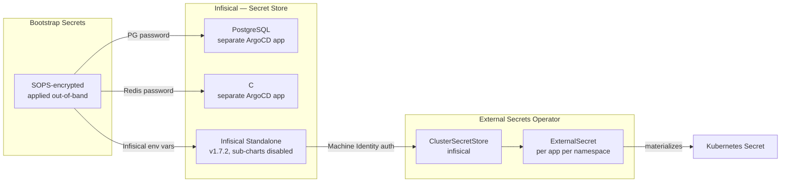

Layer 8 established that SOPS-encrypted secrets cannot live in ArgoCD-managed manifest paths. The fix — apply them out-of-band with `sops --decrypt | kubectl apply` — works for bootstrap secrets that exist before anything else runs. It does not work for runtime secrets that applications consume daily.

Layer 9 replaces the runtime half. The goal: secrets live in a versioned, audited store; applications consume them as standard Kubernetes Secrets; no engineer ever touches a plaintext credential. The tooling is Infisical for the store and External Secrets Operator (ESO) to materialize secrets into the cluster.

But deploying Infisical's standalone chart surfaced three bugs in quick succession — duplicate environment variables, hardcoded Redis password paths, and Bitnami image registry issues — that forced splitting one ArgoCD application into three.



## The Architecture

Two components:

**Infisical** is a self-hosted secret manager. Secrets live in projects, scoped to environments (`dev`, `staging`, `prod`). Access is controlled per Machine Identity. There is an audit log. The self-hosted version is free.

**External Secrets Operator** (ESO) reads from external secret stores and materializes them as native Kubernetes Secrets. It watches `ExternalSecret` resources — an app declares what it needs, ESO fetches it from Infisical and creates the Secret. The app sees a normal Secret with no SDK, no sidecar.

```
Infisical (192.168.55.204:8080)
  └── frank-cluster project / prod environment
        └── secrets (KEY = value)

ESO ClusterSecretStore "infisical"
  └── authenticates via Machine Identity (Universal Auth)

ExternalSecret (per app, per namespace)
  └── references ClusterSecretStore + secret key
        └── ESO materializes → K8s Secret
```

## Deploying Infisical: Three Apps, Not One

The `infisical-standalone` chart bundles PostgreSQL and Redis as sub-charts. Deploying it as a single ArgoCD app surfaced three bugs.

### Bug 1: Duplicate `DB_CONNECTION_URI`

The chart has two independent conditions that inject `DB_CONNECTION_URI`:

1. `postgresql.enabled: true` — the bundled PostgreSQL sub-chart injects it
2. `useExistingPostgresSecret.enabled: true` — the external secret path also injects it

There is no `else` branch. Enable the external secret path while disabling bundled PostgreSQL, both conditions fire, and the env var appears twice. Kubernetes accepts duplicate env vars without error — but the second value silently wins.

The fix: split PostgreSQL into a separate ArgoCD app (`infisical-postgresql`) using the OCI Bitnami chart. With `postgresql.enabled: false` in the main `infisical` app, only the external secret path fires.

### Bug 2: Redis Password Hardcoded

The chart builds `REDIS_URL` using a Helm helper that reads `.Values.redis.auth.password` — a plain Helm value, not a secret reference. Setting `redis.auth.existingSecret` has no effect on `REDIS_URL` construction. The Redis pod uses the password from the secret, but the Infisical pod builds its `REDIS_URL` using the hardcoded Helm value. Connection refused.

The fix: split Redis into a separate ArgoCD app (`infisical-redis`). With `redis.enabled: false` in the main chart, `REDIS_URL` comes from the `infisical-secrets` Secret via `envFrom`.

### Bug 3: Bitnami Image Registry

The Bitnami PostgreSQL chart from `charts.bitnami.com/bitnami` pulls images from `docker.io/bitnami/postgresql`. Recent tags are unavailable there for architecture reasons. The Infisical chart itself uses `mirror.gcr.io/bitnamilegacy/postgresql` — a GCR-hosted mirror. Using the OCI chart source (`registry-1.docker.io/bitnamicharts`) and pinning to the same image mirror resolves pull failures.

A secondary issue: Bitnami chart versions 16.x+ validate non-default image registry overrides. Staying on `postgresql 14.1.10` avoids that check.

### The Final Shape

Three ArgoCD apps, all in the `infisical` namespace:

| App | Chart | Purpose |
|-----|-------|---------|
| `infisical-postgresql` | OCI Bitnami postgresql 14.1.10 | PostgreSQL, image from `mirror.gcr.io/bitnamilegacy` |
| `infisical-redis` | OCI Bitnami redis 18.14.1 | Redis standalone, same image mirror |
| `infisical` | infisical-standalone 1.7.2 | Infisical app only, sub-charts disabled |

Bootstrap secrets — PostgreSQL password, Redis password, Infisical env vars — are SOPS-encrypted and applied out-of-band, matching the Layer 8 pattern.

## Connecting ESO to Infisical

ESO authenticates to Infisical using a Machine Identity with Universal Auth. The credentials are SOPS-encrypted in `secrets/infisical/eso-credentials.yaml`, applied out-of-band.

The `ClusterSecretStore` ties it together:

```yaml
apiVersion: external-secrets.io/v1
kind: ClusterSecretStore
metadata:
  name: infisical
spec:
  provider:
    infisical:
      auth:
        universalAuthCredentials:
          clientId:
            name: infisical-credentials
            namespace: external-secrets
            key: clientId
          clientSecret:
            name: infisical-credentials
            namespace: external-secrets
            key: clientSecret
      hostAPI: http://192.168.55.204:8080/api
      secretsScope:
        projectSlug: frank-cluster-iwpg
        environmentSlug: prod
        secretsPath: /
```

This is deployed as a raw manifest via `infisical-extras` ArgoCD app, syncing `apps/infisical/manifests/`.

### The Project Slug Surprise

The `ClusterSecretStore` needs a `projectSlug`. The intuitive value is the project name — `frank-cluster`. This returns a 404. Infisical auto-generates a URL-safe slug that differs from the display name. The actual slug is visible at Project Settings → General. The `eso-cluster-reader` Machine Identity has Viewer access but Viewer cannot call the workspace-list API, so the slug cannot be retrieved programmatically with the same credentials.

### ESO v1 Schema Changes

ESO 2.x promoted the API to `external-secrets.io/v1`. Two schema changes bit the initial manifests:

- **`ClusterSecretStore` credentials**: In `v1beta1`, `clientId` and `clientSecret` were wrapped in a `secretRef:` key. In v1, they are direct `SecretKeySelector` objects.
- **`ExternalSecret` remoteRef**: The `metaData:` block under `remoteRef` is gone; scope is declared once in `ClusterSecretStore.spec.provider.infisical.secretsScope`.

## The Smoke Test

With the ClusterSecretStore validated (`READY=True`):

```bash
kubectl get externalsecret cluster-test -n secrets-test
# NAME           STORETYPE            STORE       REFRESH INTERVAL   STATUS         READY
# cluster-test   ClusterSecretStore   infisical   30s                SecretSynced   True

kubectl get secret cluster-test-secret -n secrets-test \
  -o jsonpath='{.data.testValue}' | base64 -d
# hello-from-infisical
```

## What Changed

Before Layer 9, adding a runtime secret meant: write plaintext YAML, `sops` encrypt, commit, manually `kubectl apply`, update every consumer's deployment. Now: add the secret in the Infisical UI, declare an `ExternalSecret` in the app's namespace, ESO syncs within the `refreshInterval`. Rotation is a UI operation — no pod restart, no git commit.

SOPS stays for bootstrap secrets: the credentials Infisical and ESO themselves need to start. Everything above that layer moves to Infisical.

## Missteps

| What Happened | Why It Was Wrong | How We Fixed It | Commit |
|---------------|-----------------|-----------------|--------|
| **Duplicate `DB_CONNECTION_URI` env var** — the chart has no `else` branch between bundled PostgreSQL and external secret path, both inject the same env var | Two independent conditions fire regardless of which is enabled; Kubernetes silently accepts duplicates, second value wins | Split PostgreSQL into separate ArgoCD app, disabled bundled sub-chart | `446dab7a`, `9a00f46c` |
| **Redis password hardcoded in Helm helper** — `REDIS_URL` is built from `.Values.redis.auth.password` not the actual secret value | Setting `redis.auth.existingSecret` has no effect on `REDIS_URL` construction; the helper ignores it | Split Redis into separate app, set `REDIS_URL` via `envFrom` on the actual secret | `95f31f96` |
| **Wrong Infisical project slug** — `frank-cluster` returns 404; the auto-generated slug is `frank-cluster-iwpg` | The display name and URL-safe slug differ; Viewer permissions cannot query the workspace-list API to discover the slug | Read the slug from the UI once, committed to `cluster-secret-store.yaml` | `aefa7916` |
| **ClusterSecretStore schema mismatch for ESO v2.1.0** — `v1beta1` credential wrapper syntax used instead of direct `SecretKeySelector` | Upgrade from `v1beta1` to `v1` removed the `secretRef:` wrapper; initial manifests used old syntax | Corrected ClusterSecretStore to v1 schema | `6fe95a3f`, `b228e2b5` |

## References

- [Infisical Documentation](https://infisical.com/docs) — self-hosted setup, Machine Identities, Universal Auth
- [External Secrets Operator Documentation](https://external-secrets.io/latest/) — ClusterSecretStore, ExternalSecret v1 API
- [ESO Infisical Provider](https://external-secrets.io/latest/provider/infisical/) — provider-specific config
- [Bitnami OCI Charts](https://registry-1.docker.io/bitnamicharts) — postgresql, redis

**Next: [Local Inference — Ollama, LiteLLM, and OpenRouter](/docs/building/10-local-inference)**
