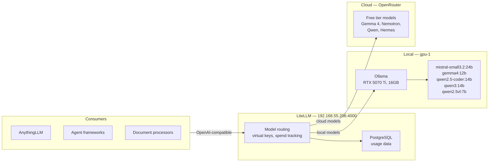

The cluster has a GPU. Layer 4 installed the NVIDIA operator. Layer 5 gave the mini nodes their Intel iGPUs. But none of that is useful until something actually runs inference.

Layer 10 wires up a unified LLM gateway. Any tool on the network — agentic frameworks, document processors, coding assistants — talks to one OpenAI-compatible endpoint at `192.168.55.206:4000`. Behind that endpoint, requests route to either a local model on gpu-1's RTX 5070 Ti or a free cloud model via OpenRouter. The consumer never needs to know which.



## Why Not Just Ollama

Ollama alone handles local models well. But the moment you want cloud fallback, multiple consumers with different keys, or spend tracking, you need a routing layer. LiteLLM adds that without changing how consumers connect. It also means model migration is invisible — if a cloud model is retired or a better local model appears, you update LiteLLM's config, and no consumer reconfigures.

## Local Models: What Fits in 16GB

The RTX 5070 Ti has 16GB of GDDR7. That is the hard constraint. Five models in the current lineup, each chosen to fit alongside ~1.5GB of KV cache:

| Alias | Tag | Quant | VRAM | Context | Best For |
|-------|-----|-------|------|---------|----------|
| `mistral-small-24b` | `mistral-small3.2:24b` | Q4_K_M | ~14 GB | 128K | Default, function calling |
| `gemma-12b` | `gemma4:12b` | Q4_K_M | ~9 GB | 256K | Multimodal — general vision |
| `qwen-vl-7b` | `qwen2.5vl:7b-q8_0` | Q8_0 | ~9 GB | 128K | Multimodal — OCR, tables |
| `qwen-coder-14b` | `qwen2.5-coder:14b-instruct-q6_K` | Q6_K | ~12 GB | 32K | Code generation |
| `qwen-think-14b` | `qwen3:14b` | Q4_K_M | ~10 GB | 32K | Reasoning with thinking mode |

Only one model stays loaded at a time (`OLLAMA_MAX_LOADED_MODELS=1`). The default is kept warm for 24 hours (`OLLAMA_KEEP_ALIVE=24h`). Switching takes ~5 seconds — Ollama unloads one and loads the other from the Longhorn PVC.

### Why Two Multimodal Models

`gemma-12b` and `qwen-vl-7b` are both vision models, but their strengths differ. Gemma 4's vision tower excels at "what is in this picture" — general visual reasoning, screenshots. Qwen2.5-VL was trained on structured visual content — tables, charts, scanned documents — and produces noticeably better OCR. Picking one forces every vision request through a model wrong for half the cases.

### Why Q6 for the Coder

At Q4_K_M, 14B-class coding models produce more syntax errors and forget API surface details. At Q6_K the model uses ~3GB more VRAM but error rates drop noticeably. The 16GB budget makes that trade-off available.

## Cloud Models: The Free Tier

OpenRouter aggregates providers with free tiers for many models. The catch: availability shifts constantly. Models get promoted, retired, or rate-limited without notice. The current roster is verified against the live API (`/api/v1/models`), not the marketing page.

The cluster later dropped OpenRouter free models entirely — local Ollama or a paid frontier key only. The free tier's churn and data-policy fine print stopped being worth the maintenance. The pattern of verifying against the live API outlived the command.

## Deploying Ollama

Ollama uses the community Helm chart via ArgoCD:

```yaml
# apps/ollama/values.yaml
ollama:
  gpu:
    enabled: true
    type: nvidia
    number: 1
  models:
    pull: []
    run: []

extraEnv:
  - name: OLLAMA_KEEP_ALIVE
    value: "24h"
  - name: OLLAMA_MAX_LOADED_MODELS
    value: "1"

persistentVolume:
  enabled: true
  size: 200Gi
  storageClass: longhorn

tolerations:
  - key: nvidia.com/gpu
    operator: Exists
    effect: NoSchedule
```

The GPU resource request and toleration ensure Ollama lands on gpu-1.

## Deploying LiteLLM

Two ArgoCD apps — one for the Helm chart, one for the ExternalSecret:

| App | Source | Purpose |
|-----|--------|---------|
| `litellm` | OCI Helm chart (`docker.litellm.ai/berriai/litellm-helm`) | Gateway + PostgreSQL |
| `litellm-extras` | `apps/litellm/manifests/` | ExternalSecret for API keys |

The model routing config maps aliases to backends:

```yaml
proxy_config:
  model_list:
    - model_name: mistral-small-24b
      litellm_params:
        model: ollama/mistral-small3.2:24b
        api_base: http://ollama.ollama.svc.cluster.local:11434

    - model_name: qwen-coder-480b
      litellm_params:
        model: openrouter/qwen/qwen3-coder:free
        api_key: os.environ/OPENROUTER_API_KEY
```

Secrets flow from Infisical through ExternalSecret to pod env vars — no plaintext in the repo.

## Gotchas

### Ollama PostStart Model Pull

Initial deployment used a `postStart` lifecycle hook to pull models on startup. This caused `CrashLoopBackOff` — the hook holds the container in a waiting state, and if the pull takes too long (a 14GB model download), Kubernetes kills and restarts it. Models are pulled on first request via LiteLLM instead.

### LiteLLM Image Tags

The Helm chart generates an image tag from the chart version (e.g., `main-v1.81.13`). That tag does not exist on GHCR. Override it explicitly:

```yaml
image:
  repository: ghcr.io/berriai/litellm-database
  tag: main-stable
  pullPolicy: Always
```

### LoadBalancer IP Pinning

The LiteLLM chart does not expose a `service.loadBalancerIP` field. Use a Cilium annotation:

```yaml
service:
  type: LoadBalancer
  annotations:
    lbipam.cilium.io/ips: "192.168.55.206"
```

### Tool Calling Compatibility

The Ollama API uses `ollama_chat/` prefix for native stream-safe tool calling. The `ollama/` prefix works for basic chat but produces malformed tool calls under streaming. LiteLLM aliases must use `ollama_chat/` for any model that uses function calling.

## What Is Running

Any consumer on the network can use `192.168.55.206:4000` — local GPU models, multimodal vision, and frontier-scale reasoning all behind one OpenAI-compatible endpoint. The gateway handles virtual keys and spend tracking. Model migration is invisible to consumers.

## Missteps

| What Happened | Why It Was Wrong | How We Fixed It | Commit |
|---------------|-----------------|-----------------|--------|
| **Ollama PostStart model pull caused CrashLoopBackOff** — lifecycle hook holds container waiting; pulling a 14GB model exceeded the startup grace period | Kubernetes kills and restarts containers stuck in PostStart; the pull would never complete | Removed PostStart hook; models pulled lazily on first request via LiteLLM | `7c88dcc4` |
| **Ollama missing `nvidia` runtimeClassName** — Talos requires explicit GPU runtime selection; pods without it cannot access the GPU | Default containerd runtime does not expose NVIDIA devices; Talos needs `nvidia` runtime class | Added `runtimeClassName: nvidia` to ollama values | `c84049be` |
| **LiteLLM image tag `main-v1.81.13` does not exist** — chart auto-generates a tag from chart version that has no matching GHCR image | The chart's tag template does not match the publishing convention on GHCR | Overrode with `main-stable` explicitly | `187d3689` |
| **LiteLLM aliases used `ollama/` prefix, breaking streaming tool calls** — the `ollama/` provider produces malformed tool call JSON under `stream: true` | Ollama has two API paths: `/api/chat` (native) and `/v1/chat/completions` (OpenAI-compat); LiteLLM's `ollama/` uses the compat path which mishandles streaming | Changed aliases to `ollama_chat/` prefix for native stream-safe tool calling | `8277c154` |
| **LiteLLM canary broken by Cilium traffic router plugin** — Argo Rollouts Cilium plugin was not installed; canary traffic splitting failed | The Cilium HTTP route CRD was not present; canary analysis got stuck in degraded state | Reverted to replica-count weighting for canary | `65dcabdb`, `b3f86231` |
| **OpenRouter free models churned during deployment** — 4 of 6 selected models were already retired from free tier between config authoring and deploy | Free model availability on OpenRouter shifts without notice | Verified list against live `/api/v1/models` instead of marketing page | `1d3c74d8` |

## References

- [Ollama](https://ollama.com) — Local LLM runtime
- [LiteLLM](https://litellm.ai) — OpenAI-compatible gateway with model routing
- [OpenRouter](https://openrouter.ai) — Multi-provider model aggregation

**Next: [Agentic Control Plane — Sympozium](/docs/building/11-agentic-control-plane)**
