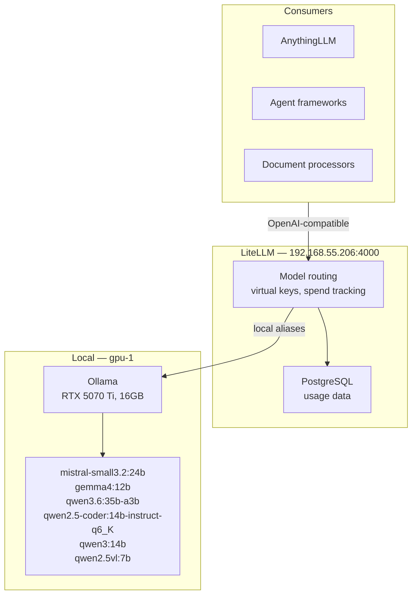

The cluster has a GPU. Layer 4 installed the NVIDIA operator. Layer 5 gave the mini nodes their Intel iGPUs. But none of that is useful until something actually runs inference.

Layer 10 wires up a unified  gateway. Any tool on the network — agentic frameworks, document processors, coding assistants — talks to one OpenAI-compatible endpoint at `192.168.55.206:4000`. Behind that endpoint, requests route to a model alias, and the consumer never needs to know which backend serves it.

The layer originally routed to two places: local models on gpu-1's RTX 5070 Ti, and free cloud models via OpenRouter. The free tier was dropped on 2026-06-04 (see *Cloud Models* below), so the live routing table is local-only. The diagram shows what the config declares today:


```mermaid
flowchart TD
  subgraph Consumers[Consumers]
    AGI[AnythingLLM]
    Agent[Agent frameworks]
    Doc[Document processors]
  end
  subgraph Gateway[LiteLLM — 192.168.55.206:4000]
    Router[Model routing<br/>virtual keys, spend tracking]
    PG[PostgreSQL<br/>usage data]
  end
  subgraph Local[Local — gpu-1]
    Ollama[Ollama<br/>RTX 5070 Ti, 16GB]
    Models[mistral-small3.2:24b<br/>gemma4:12b<br/>qwen3.6:35b-a3b<br/>qwen2.5-coder:14b-instruct-q6_K<br/>qwen3:14b<br/>qwen2.5vl:7b]
  end

  Consumers -->|OpenAI-compatible| Router
  Router -->|local aliases| Ollama
  Ollama --> Models
  Router --> PG
```

## Why Not Just Ollama

Ollama alone handles local models well. But the moment you want cloud fallback, multiple consumers with different keys, or spend tracking, you need a routing layer. LiteLLM adds that without changing how consumers connect. It also means model migration is invisible — if a cloud model is retired or a better local model appears, you update LiteLLM's config, and no consumer reconfigures.

## Local Models: What Fits in 16GB

The RTX 5070 Ti has 16GB of . That is the hard constraint. Six base models, each chosen to fit alongside its  cache:

| Alias | Tag | Quant |  | Context | Best For |
|-------|-----|-------|------|---------|----------|
| `mistral-small-24b` | `mistral-small3.2:24b` | Q4_K_M | ~14 GB | 128K | Default, function calling |
| `gemma-12b` | `gemma4:12b` | Q4_K_M | ~9 GB | 256K | Multimodal — general vision |
| `qwen-vl-7b` | `qwen2.5vl:7b` | Q4_K_M | ~12 GB | 128K | Multimodal — OCR, tables |
| `qwen-coder-14b` | `qwen2.5-coder:14b-instruct-q6_K` | Q6_K | ~12 GB | 32K | Code generation |
| `qwen-think-14b` | `qwen3:14b` | Q4_K_M | ~10 GB | 32K | Reasoning with thinking mode |
| `qwen36-a3b` | `qwen3.6:35b-a3b` | Q4_K_M | ~11 GB VRAM + ~15 GB host RAM | 256K | MoE flagship, general reasoning |

Those six models, plus two derived tags, carry twelve aliases. The extras are not new models: `gemma-12b-nothin` and `qwen36-a3b-nothin` point at the same backend with `think: false` in `extra_body`, and `gemma-12b-64k` / `qwen36-a3b-64k` point at derived Ollama tags whose Modelfile sets `PARAMETER num_ctx 65536` (`apps/ollama/values.yaml`) — each of which also has its own `-nothin` variant. That last pair exists because LiteLLM cannot pass `num_ctx` per request to `ollama_chat` ([litellm#12930](https://github.com/BerriAI/litellm/issues/12930), closed not-planned), so a per-model tag is the only escape hatch from the server-wide `OLLAMA_CONTEXT_LENGTH`.

`qwen36-a3b` is the one model that does not fit. At Q4_K_M it is ~24GB on disk, so Ollama offloads inactive experts to gpu-1's 128GB of host RAM. Measured at `num_ctx=4096`: a 41% CPU / 59% GPU split, ~20 tok/s generation. Mixture-of-experts routing keeps that usable because only ~3B weights are active per token; a dense 35B at the same split would be far slower.

Only one model stays loaded at a time (`OLLAMA_MAX_LOADED_MODELS=1`). The default is kept warm for 24 hours (`OLLAMA_KEEP_ALIVE=24h`). Switching takes ~5 seconds — Ollama unloads one and loads the other from the Longhorn .

### Why Two Multimodal Models

`gemma-12b` and `qwen-vl-7b` are both vision models, but their strengths differ. Gemma 4's vision tower excels at "what is in this picture" — general visual reasoning, screenshots. Qwen2.5-VL was trained on structured visual content — tables, charts, scanned documents — and produces noticeably better OCR. Picking one forces every vision request through a model wrong for half the cases.

`qwen-vl-7b` was first pinned to the `q8_0` tag, on the reasoning that OCR fidelity is worth the extra bits at only 7B. That was a budgeting error. The tag is 9.4GB on disk, and once the 128K-context KV cache and the vision tower load alongside it, the total pushed past 16GB and Ollama refused with `model requires more system memory`. The default Q4_K_M fits in ~12GB with headroom. OCR fidelity is slightly lower; `gemma-12b` remains the heavier option in the same multimodal slot. Weights are not the whole budget — KV cache and a vision tower are the rest of it.

### Why Q6 for the Coder

At Q4_K_M, 14B-class coding models produce more syntax errors and forget API surface details. At Q6_K the model uses ~3GB more VRAM but error rates drop noticeably. The 16GB budget makes that trade-off available.

## Cloud Models: The Free Tier

OpenRouter aggregates providers with free tiers for many models. The catch: availability shifts constantly. Models get promoted, retired, or rate-limited without notice. The roster had to be verified against the live API (`/api/v1/models`), never the marketing page — four of the six models chosen for the initial config were already retired by the time it deployed.

On 2026-06-04 the free tier was removed entirely. The policy is now local Ollama, or a paid frontier key if frontier scale is ever needed, and never a `:free` entry. The churn above was half the reason; the data-policy fine print on free inference was the other half. `apps/litellm/values.yaml` records the rule at the top of the file, and the `OPENROUTER_API_KEY` entry came out of the ExternalSecret with it.

The pattern of verifying against the live API outlived the command that motivated it.

## Deploying Ollama

Ollama uses the community Helm chart via ArgoCD:

```yaml
# apps/ollama/values.yaml
ollama:
  gpu:
    enabled: true
    type: nvidia
    number: 1
  models:
    pull: []
    run: []

extraEnv:
  - name: OLLAMA_KEEP_ALIVE
    value: "24h"
  - name: OLLAMA_MAX_LOADED_MODELS
    value: "1"
  # Server-wide default context window. Per-request num_ctx does not
  # survive LiteLLM's ollama_chat path — see litellm#12930.
  - name: OLLAMA_CONTEXT_LENGTH
    value: "16384"

persistentVolume:
  enabled: true
  size: 200Gi
  storageClass: longhorn

tolerations:
  - key: nvidia.com/gpu
    operator: Exists
    effect: NoSchedule

nodeSelector:
  kubernetes.io/hostname: gpu-1
```

Those last two blocks do different jobs, and conflating them is an easy way to end up debugging a pod on the wrong node. The toleration only *permits* scheduling onto gpu-1, which carries an `nvidia.com/gpu:NoSchedule` taint — it grants no preference. What actually pins the pod is the `nodeSelector`. The GPU resource request would also constrain placement to nodes advertising `nvidia.com/gpu`, but gpu-1 is the only such node, so the selector is what makes the intent explicit rather than incidental.

## Deploying LiteLLM

Two ArgoCD apps — one for the Helm chart, one for the raw manifests:

| App | Source | Purpose |
|-----|--------|---------|
| `litellm` |  Helm chart (`docker.litellm.ai/berriai/litellm-helm`) | Gateway + PostgreSQL |
| `litellm-extras` | `apps/litellm/manifests/` | ExternalSecret, Argo Rollouts canary, AnalysisTemplate scaffold |

That second app is worth naming precisely, because it holds more than the secret. `rollout.yaml` declares an Argo Rollouts canary with `replicas: 5` and a `workloadRef` wrapping the chart's Deployment. The Rollout owns the pods; the chart Deployment gets scaled to zero. That is also why the `litellm` Application carries an `ignoreDifferences` entry on the Deployment's `/spec/replicas` — without it, ArgoCD and the Rollout controller would fight over the replica count forever. It matters operationally too, in a way that looks alarming the first time (see *Verifying the gateway* below).

The model routing config maps aliases to backends:

```yaml
proxy_config:
  model_list:
    - model_name: mistral-small-24b
      litellm_params:
        model: ollama_chat/mistral-small3.2:24b
        api_base: http://ollama.ollama.svc.cluster.local:11434

    - model_name: qwen36-a3b-64k-nothin
      litellm_params:
        model: ollama_chat/qwen3.6:35b-a3b-64k
        api_base: http://ollama.ollama.svc.cluster.local:11434
        extra_body:
          think: false
```

Every entry in the live config now has this shape: an `ollama_chat/` model and an in-cluster `api_base`. No provider keys, no `api_key` lines. The ExternalSecret still exists — it carries `LITELLM_MASTER_KEY` from Infisical, so no plaintext lands in the repo — but the `OPENROUTER_API_KEY` entry it used to hold was removed with the cloud section.

## Gotchas

### Ollama PostStart Model Pull

Initial deployment used a `postStart` lifecycle hook to pull models on startup. This caused `CrashLoopBackOff` — the hook holds the container in a waiting state, and if the pull takes too long (a 14GB model download), Kubernetes kills and restarts it. Models are pulled on first request via LiteLLM instead.

### LiteLLM Image Tags

The Helm chart generates an image tag from the chart version (e.g., `main-v1.81.13`). That tag does not exist on . Override it explicitly.

The first override was the floating `main-stable` with `pullPolicy: Always`, which fixed the immediate breakage and introduced a slower one: the running image could change under a pod restart with no repo change to explain it. It did. A later `main-v1.83.14-stable` pull landed a broken arm64 layer, which mattered because the chart's PreSync migration Job had no scheduling constraints and defaulted onto a Raspberry Pi. The current pin is exact, and the pull policy no longer re-resolves it:

```yaml
image:
  repository: ghcr.io/berriai/litellm-database
  tag: "main-v1.83.14-stable.patch.1"
  pullPolicy: IfNotPresent
```

`main-stable` is the right first move under an outage and the wrong steady state. A floating tag plus `Always` means the version you are running is decided by whenever the pod last restarted, which is exactly the fact you need when something breaks.

### LoadBalancer IP Pinning

The LiteLLM chart does not expose a `service.loadBalancerIP` field. Use a Cilium annotation:

```yaml
service:
  type: LoadBalancer
  annotations:
    lbipam.cilium.io/ips: "192.168.55.206"
```

### Tool Calling Compatibility

The Ollama API uses `ollama_chat/` prefix for native stream-safe tool calling. The `ollama/` prefix works for basic chat but produces malformed tool calls under streaming. LiteLLM aliases must use `ollama_chat/` for any model that uses function calling.

## Verifying the gateway

Day-to-day operations for this layer live in the companion post, [Operating on Frank — Inference](/docs/operating/07-inference): pod status, `ollama ps`, `nvidia-smi`, log reading, model pulls, and the recovery paths. This section covers only the four things that are specific to *how this layer is deployed*, and that will mislead you if you do not know them in advance.

**1. Do not count Ready pods. Ask the Rollout.**

This is the one that looks like a disaster and is not. Because the Rollout's `workloadRef` owns the pods, the Deployment reads as if nothing is running at all (captured 2026-08-02):

```console
$ kubectl -n litellm get deploy litellm
NAME      READY   UP-TO-DATE   AVAILABLE   AGE
litellm   0/0     0            0           145d
```

`kubectl -n litellm get pods` is no kinder: at that same moment it listed 18 pods, only 6 of them Running — and one of those six is `litellm-postgresql-0`, so five are actually serving. The other 12 sit in phase `Succeeded`, which Kubernetes does not garbage-collect. Their `status.reason` and `status.message` are both empty, so the objects do not record why they ended; I can tell you what they are, not what put them there. Both readings are correct and the gateway is healthy. The instinct to count Ready pods reports a catastrophe on a working system.

Ask the resource that actually owns the replicas:

```console
$ kubectl -n litellm get rollout litellm
NAME      DESIRED   CURRENT   UP-TO-DATE   AVAILABLE   AGE
litellm   5         5         1            5           128d
```

`AVAILABLE` is the number to read. If it is below `DESIRED`, you have a real problem. `UP-TO-DATE 1` is not one: the Rollout is paused mid-canary at `CanaryPauseStep`, step 1, and has been since 2026-07-25. There is no AnalysisTemplate wired into the steps, so every pause is an indefinite manual gate — the operator *is* the analysis run. A paused canary here means someone needs to promote it, not that something failed.

**2. Prove the gateway end to end.**

This depends on none of the above, which is what makes it the check worth reaching for first:

```console
$ curl -s http://192.168.55.206:4000/health/readiness
{"status":"healthy","db":"connected","cache":null,"litellm_version":"1.83.14", ...}
```

`status` and `db` are the decision. A healthy gateway with `db` disconnected still serves inference but loses spend tracking and virtual-key enforcement, which is a different repair than a dead gateway. The `litellm_version` field is also the honest answer to "what image is actually running", which the pinned tag should now match.

**3. Check who holds the GPU before you debug a model call.**

gpu-1 is time-shared: Ollama and ComfyUI are scaled up and down against each other, so a model request can fail for a reason that has nothing to do with LiteLLM.

```console
$ kubectl get deploy -A -o custom-columns=NS:.metadata.namespace,NAME:.metadata.name,\
DESIRED:.spec.replicas,READY:.status.readyReplicas | grep -E 'ollama|comfyui'
comfyui     comfyui   0   <none>
ollama      ollama    1   1
```

Ollama holds the GPU here; ComfyUI is scaled to zero. (`<none>` rather than `0` in the READY column is just an absent `status.readyReplicas` field, not an error.) If Ollama reads 0, every alias will fail and the gateway is not at fault — nothing is listening behind it. Restore the tenancy before investigating anything upstream.

**4. Reconcile aliases against tags that exist.**

A LiteLLM alias is a string pointing at an Ollama tag. Nothing validates that the tag is present, so a typo or a removed model surfaces as a runtime routing error, not a config error:

```console
$ kubectl -n ollama exec deploy/ollama -- ollama list
NAME                               ID              SIZE      MODIFIED
qwen3.6:35b-a3b-64k                3aa50f3c753f    23 GB     11 hours ago
gemma4:12b-64k                     83a3720fa536    7.6 GB    11 hours ago
gemma4:12b                         4eb23ef187e2    7.6 GB    8 weeks ago
qwen3.6:35b-a3b                    07d35212591f    23 GB     2 months ago
qwen2.5vl:7b                       5ced39dfa4ba    6.0 GB    2 months ago
qwen3:14b                          bdbd181c33f2    9.3 GB    2 months ago
qwen2.5-coder:14b-instruct-q6_K    8c4e48ce02e2    12 GB     2 months ago
mistral-small3.2:24b               5a408ab55df5    15 GB     2 months ago
```

Eight tags, matching the six base models plus the two derived 64k tags. Every `model:` value in `proxy_config` must appear in this list. If an alias names a tag that is missing, the fix is a pull or a config correction — not a gateway restart.

## What Is Running

Any consumer on the network can use `192.168.55.206:4000` — local GPU models, multimodal vision, and a partially-offloaded 35B reasoning model, all behind one OpenAI-compatible endpoint. The gateway handles virtual keys and spend tracking. Model migration is invisible to consumers.

## Missteps

| What Happened | Why It Was Wrong | How We Fixed It | Evidence |
|---------------|-----------------|-----------------|----------|
| **Ollama PostStart model pull caused CrashLoopBackOff** — lifecycle hook holds container waiting; pulling a 14GB model exceeded the startup grace period | Kubernetes kills and restarts containers stuck in PostStart; the pull would never complete | Removed PostStart hook; models pulled lazily on first request via LiteLLM | `7c88dcc4` |
| **Ollama missing `nvidia` runtimeClassName** — Talos requires explicit GPU runtime selection; pods without it cannot access the GPU | Default containerd runtime does not expose NVIDIA devices; Talos needs `nvidia` runtime class | Added `runtimeClassName: nvidia` to ollama values | `c84049be` |
| **LiteLLM image tag `main-v1.81.13` does not exist** — chart auto-generates a tag from chart version that has no matching GHCR image | The chart's tag template does not match the publishing convention on GHCR | Overrode with `main-stable` explicitly | `187d3689` |
| **LiteLLM aliases used `ollama/` prefix, breaking streaming tool calls** — the `ollama/` provider produces malformed tool call JSON under `stream: true` | Ollama has two API paths: `/api/chat` (native) and `/v1/chat/completions` (OpenAI-compat); LiteLLM's `ollama/` uses the compat path which mishandles streaming | Changed aliases to `ollama_chat/` prefix for native stream-safe tool calling | `8277c154` |
| **LiteLLM canary broken by Cilium traffic router plugin** — Argo Rollouts Cilium plugin was not installed; canary traffic splitting failed | The Cilium HTTP route  was not present; canary analysis got stuck in degraded state | Reverted to replica-count weighting for canary | `65dcabdb`, `b3f86231` |
| **OpenRouter free models churned during deployment** — 4 of 6 selected models were already retired from free tier between config authoring and deploy | Free model availability on OpenRouter shifts without notice | Verified list against live `/api/v1/models` instead of marketing page | `1d3c74d8` |
| **`main-stable` left the running version undecidable** — a floating tag with `pullPolicy: Always` re-resolves on every pod restart | The image in production could change with no repo change to explain it; one such pull carried a broken arm64 layer | Pinned the exact tag `main-v1.83.14-stable.patch.1` with `pullPolicy: IfNotPresent` | `apps/litellm/values.yaml` |
| **`qwen-vl-7b` pinned to `q8_0` exceeded the VRAM budget** — 9.4GB of weights plus a 128K KV cache and vision tower did not fit in 16GB | Sized the model by weights alone; Ollama refused to load with `model requires more system memory` | Dropped to the default Q4_K_M, ~12GB loaded, ~4GB headroom | `apps/litellm/values.yaml` |
| **Free-tier cloud routing removed entirely** — churn plus the data-policy fine print on free inference outweighed the benefit | Every consumer alias was one silent upstream retirement away from breaking | Purged the cloud section and the `OPENROUTER_API_KEY` secret entry; policy is now local-only or a paid key | `46f19ca2` |

## What Transfers

The gateway pattern is the portable part: put one OpenAI-compatible endpoint in front of your models, and backend churn stops being a consumer-visible event. Dropping an entire cloud provider from this layer changed one config file and broke nothing downstream.

Three lessons generalize past inference:

- **Size a model by what is resident, not by what is on disk.** Weights, KV cache, and any vision tower share the same card. The `q8_0` mistake above is what happens when you budget for the first and forget the other two.
- **A floating tag is a debugging tax you pay later.** `main-stable` fixes an outage in thirty seconds and then makes "what is actually running?" unanswerable from the repo. Pin exactly once the fire is out.
- **Know which controller owns your replicas.** Once a Rollout wraps a Deployment, the Deployment lies by design. Any health check you write against the wrong object will be confidently, permanently wrong.

## References

- [Ollama](https://ollama.com) — Local LLM runtime
- [LiteLLM](https://litellm.ai) — OpenAI-compatible gateway with model routing
- [OpenRouter](https://openrouter.ai) — Multi-provider model aggregation (retired from this layer 2026-06-04)
- Companion: [Operating on Frank — Inference](/docs/operating/07-inference) — health checks, model management, recovery
- [litellm#12930](https://github.com/BerriAI/litellm/issues/12930) — why per-model 64k tags exist

**Next: [Agentic Control Plane — Sympozium](/docs/building/11-agentic-control-plane)**
