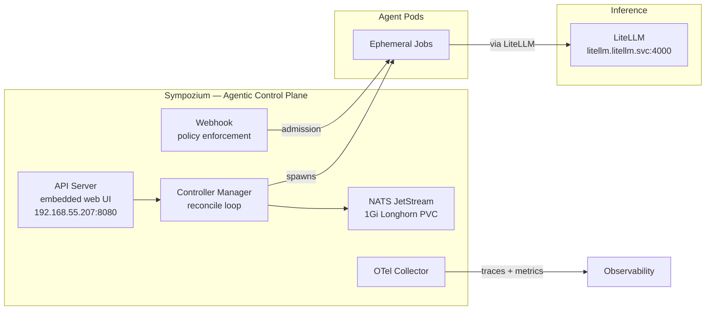

The cluster can serve models. Layer 10 wired up Ollama and LiteLLM so anything on the network can call an OpenAI-compatible endpoint. But models behind an API are passive — they wait and respond. They do not act.

Layer 11 makes them act. [Sympozium](https://sympozium.ai/) is a Kubernetes-native agentic control plane. Agents are Pods, policies are CRDs, and every execution is a Job. It maps agentic concepts to Kubernetes primitives that the cluster already knows how to manage.

## The Architecture

Five components in `sympozium-system`:



| Component | CRD / Primitive | Purpose |
|-----------|----------------|---------|
| Controller Manager | AgentRun → Pod | Watches for AgentRun CRs, spawns ephemeral Jobs |
| Webhook | SympoziumPolicy | Intercepts AgentRun creation, enforces policy at admission |
| NATS JetStream | StatefulSet + 1Gi Longhorn PVC | Durable event bus — agent status, skill invocations, inter-agent messages |
| OTel Collector | DaemonSet | Ships traces and metrics from agent runs |
| API Server | Deployment + LoadBalancer | REST API + web dashboard |

The load-bearing design choice: the controller reads its namespace from the downward API and creates all agent Jobs there. There is no `agentNamespace` configuration. That matters when PodSecurity standards collide with agent capabilities.

## Prerequisites

- **cert-manager** (sync wave `-1` so it deploys before Sympozium) — the webhook needs TLS certificates
- **LiteLLM** from Layer 10 — agents route through the inference gateway
- **Longhorn** default StorageClass — NATS persistence uses a 1Gi PVC

## Deploying the Core

Three ArgoCD apps:

| App | Source | Purpose |
|-----|--------|---------|
| `cert-manager` | Helm (jetstack) | Webhook TLS |
| `sympozium` | Git (`https://github.com/AlexsJones/sympozium.git`, `charts/sympozium`) | Core control plane |
| `sympozium-extras` | Raw manifests under `apps/sympozium-extras/manifests/` | Policies, PersonaPacks, ExternalSecret, LoadBalancer |

### cert-manager

```yaml
# apps/root/templates/cert-manager.yaml
apiVersion: argoproj.io/v1alpha1
kind: Application
metadata:
  name: cert-manager
  annotations:
    argocd.argoproj.io/sync-wave: "-1"
```

### sympozium (Git-Sourced Chart)

The Sympozium chart is **not published** to any OCI or Helm registry. ArgoCD must source it directly from GitHub:

```yaml
sources:
  - repoURL: https://github.com/AlexsJones/sympozium.git
    targetRevision: v0.1.3
    path: charts/sympozium
```

**Image tag override.** The chart's `appVersion` is `0.1.1` but images tagged `v0.1.3` include a critical webhook fix — the `PolicyEnforcer.Decoder` field was uninitialized, causing a nil-pointer panic on every AgentRun admission. Override:

```yaml
# apps/sympozium/values.yaml
image:
  tag: v0.1.3
certManager:
  enabled: true
crds:
  install: true
nats:
  persistence:
    enabled: true
    storageClass: longhorn
    size: 1Gi
networkPolicies:
  enabled: true
observability:
  enabled: true
defaultPersonas:
  enabled: false   # we deploy our own in sympozium-extras
```

### sympozium-extras

The chart's apiserver service template hardcodes ClusterIP with no `type` or `annotations` overrides. A separate LoadBalancer manifest:

```yaml
# apps/sympozium-extras/manifests/service-lb.yaml
apiVersion: v1
kind: Service
metadata:
  name: sympozium-apiserver-lb
  namespace: sympozium-system
  annotations:
    lbipam.cilium.io/ips: "192.168.55.207"
spec:
  type: LoadBalancer
  selector:
    app.kubernetes.io/component: apiserver
  ports:
    - name: http
      port: 8080
      targetPort: http
```

**Verify it works:**

```bash
kubectl get svc -n sympozium-system sympozium-apiserver-lb
# NAME                     TYPE           CLUSTER-IP     EXTERNAL-IP       PORT(S)
# sympozium-apiserver-lb   LoadBalancer   10.43.143.40   192.168.55.207    8080:31717/TCP

curl -s http://192.168.55.207:8080/api/health | jq .
# {"status":"ok"}
```

## Wiring LiteLLM Through Auth Secrets

Agent Pods must route through the LiteLLM gateway, not directly to `api.openai.com`. The PersonaPack CRD has no `baseURL` field — generated SympoziumInstances cannot set it. Manually created instances can (`spec.agents.default.baseURL`), but PersonaPack-generated ones cannot.

The fix: the controller injects auth credentials into agent pods via `envFrom` with `SecretRef` — the **entire Secret** is projected as environment variables. Adding `OPENAI_BASE_URL` alongside `OPENAI_API_KEY` in the auth Secret makes every agent pod discover the LiteLLM endpoint automatically:

```yaml
# apps/sympozium-extras/manifests/external-secret.yaml
apiVersion: external-secrets.io/v1
kind: ExternalSecret
metadata:
  name: sympozium-llm-key
  namespace: sympozium-system
spec:
  secretStoreRef:
    name: infisical
    kind: ClusterSecretStore
  target:
    name: sympozium-llm-key
    template:
      data:
        OPENAI_API_KEY: "{{ .OPENAI_API_KEY }}"
        OPENAI_BASE_URL: "http://litellm.litellm.svc:4000"
  data:
    - secretKey: OPENAI_API_KEY
      remoteRef:
        key: SYMPOZIUM_LITELLM_KEY
```

The ExternalSecret `template` merges the Infisical-sourced API key with a static base URL. No plaintext secrets in the repo — only the endpoint URL is hardcoded, and the actual key refreshes every 5 minutes from Infisical.

## PersonaPacks

PersonaPacks bundle identity, policy, skills, and schedule into a single CRD. The controller stamps out individual SympoziumInstances from the pack.

### Platform Team

| Persona | Policy | Schedule | Tools |
|---------|--------|----------|-------|
| `sre-agent` | default-policy | Hourly heartbeat | `k8s-ops` + `llmfit` |
| `incident-responder` | default-policy | On-demand | `k8s-ops` |

The `sre-watchdog` persona uses `llmfit` for hardware-aware model placement recommendations — it reads `/proc`, `/sys`, `/dev`, and `/run/udev` via sidecar injection.

### DevOps Essentials

| Persona | Policy | Schedule | Tools |
|---------|--------|----------|-------|
| `code-reviewer` | restrictive-policy | On-demand | read + list only |

### Developer Team (7-Persona)

The chart ships with a built-in `developer-team` PersonaPack — a 2-pizza dev team of seven agents. The cluster deploys a customised version with `authRefs`, `policyRef`, `model: qwen3.5`, and homelab-appropriate intervals (the default is 5 minutes for all agents, which saturates the RTX 5070):

| Persona | Interval | Purpose |
|---------|----------|---------|
| `tech-lead` | 30m | PR review, issue triage, merge |
| `backend-dev` | 1h sweep | Implement backend issues |
| `frontend-dev` | 1h sweep | Implement frontend/UI issues |
| `qa-engineer` | 1h sweep | Test coverage, bug discovery |
| `code-reviewer` | 30m sweep | Security/correctness/performance |
| `devops-engineer` | 2h sweep | CI/CD health, CVE patching |
| `docs-writer` | 2h | Documentation drift, changelogs |

## Policy Enforcement

Two policy presets. The webhook enforces them at admission time — an AgentRun referencing a restrictive-policy persona that attempts `write_file` is rejected before the Pod starts.

```yaml
# default-policy — trusted ops agents
toolGating:
  defaultAction: allow
  rules:
    - tool: execute_command
      action: ask
sandboxPolicy:
  required: false
networkPolicy:
  denyAll: false

# restrictive-policy — dev-facing agents
toolGating:
  defaultAction: deny
  rules:
    - tool: read_file
      action: allow
    - tool: list_directory
      action: allow
sandboxPolicy:
  required: true
  maxCPU: "2"
  maxMemory: 4Gi
networkPolicy:
  denyAll: true
```

## Gotchas

### Git-Sourced Chart, Not OCI

The chart lives at `https://github.com/AlexsJones/sympozium.git`, `path: charts/sympozium`. There is no Helm or OCI registry. ArgoCD Application sources must use `repoURL` + `path` instead of `chart`. This is the same pattern as the vendored Intel GPU DRA driver.

### Image Tag Lags Behind Releases

The chart's `appVersion` (`0.1.1`) trails the latest tag (`v0.1.3`). The v0.1.3 images fix a nil-pointer panic in the webhook's `PolicyEnforcer` (`Decoder` field uninitialized). Without the override, every AgentRun admission produces:

```
invalid memory address or nil pointer dereference
```

### PodSecurity Standard Blocks llmfit Sidecars

The `llmfit` SkillPack injects sidecars that require `hostPID: true` and `hostPath` volumes for `/proc`, `/sys`, `/dev`, `/run/udev`. Under the default `baseline` PodSecurity standard:

```
pods "frankie-heartbeat-5-zlxjf" is forbidden: violates PodSecurity
"baseline:latest": host namespaces (hostPID=true), hostPath volumes
```

The fix — a Namespace manifest in `sympozium-extras` that sets `privileged`:

```yaml
apiVersion: v1
kind: Namespace
metadata:
  name: sympozium-system
  labels:
    pod-security.kubernetes.io/enforce: privileged
```

### PersonaPack `model` Only Applies at Creation

The controller stamps each persona's `model` into its SympoziumInstance **when the instance is created**. Editing the PersonaPack afterwards does **not** reconcile existing instances. Two traps:

1. **Live edits get healed away.** Patching the PersonaPack on the cluster works temporarily, but ArgoCD self-heal reverts it within the sync window. Merge the manifest change to `main` first.
2. **Even a synced PersonaPack changes nothing.** After the merge, existing SympoziumInstances still carry the old model. Delete them and let the controller recreate:

```bash
kubectl delete sympoziuminstances -n sympozium-system --all
sleep 30
kubectl get sympoziuminstances -n sympozium-system \
  -o custom-columns=NAME:.metadata.name,MODEL:.spec.model
```

### CRD Discovery Timing

On initial deploy, `sympozium-extras` may fail to sync because ArgoCD has not yet discovered the Sympozium CRDs. Sync the root app manually, wait, then retry `sympozium-extras`.

## Recovery Path

| Symptom | Cause | Fix |
|---------|-------|-----|
| AgentRun stuck `Pending` | cert-manager certificate not ready | Check `kubectl get certificate -n sympozium-system` |
| AgentRun rejected with nil-pointer | `image.tag` not overridden to `v0.1.3` | Set `image.tag: v0.1.3` in values.yaml |
| AgentRun fails with `sessionKey` error | `spec.sessionKey` is required by schema | Set `sessionKey: ""` |
| Poll loop never exits | Matching `Completed` instead of `Succeeded` | Match `Succeeded` phase |
| UI shows no runs | Default namespace filter is `default` | Switch to `sympozium-system` |
| UI shows "Unauthorized" | Token not set | Token in `sympozium-ui-token` secret, `sympozium-system` namespace |

## Missteps

| What Happened | Why It Was Wrong | How We Fixed It | Commit |
|---------------|-----------------|-----------------|--------|
| **LiteLLM baseURL missing from PersonaPack-driven agents** — agents defaulted to `api.openai.com` because PersonaPack CRD has no `baseURL` field | PersonaPack-generated SympoziumInstances cannot set `baseURL`; only manually created instances can | Injected `OPENAI_BASE_URL` into the auth Secret consumed via `envFrom` | `27d947d2` |
| **llmfit SkillPack sidecars rejected by PodSecurity** — `hostPID: true` and `hostPath` volumes violate `baseline` | The controller has no `agentNamespace` config; agent pods inherit the controller namespace's PodSecurity standard | Applied `pod-security.kubernetes.io/enforce: privileged` label on `sympozium-system` namespace | `c34d065b` |
| **Dead LiteLLM alias in PersonaPack** — `qwen3.5` was removed from LiteLLM config but PersonaPacks still referenced it; 350 silent failures over 2 weeks | PersonaPack `model` is stamped at SympoziumInstance creation and never reconciled; editing the PersonaPack has no effect on existing instances | Deleted all SympoziumInstances in `sympozium-system`, controller recreated them with the new model alias from the merged PersonaPack manifest | PR #448, `c5812e2b` |
| **AgentRun stuck comparing `Completed`** — the terminal success phase is `Succeeded`, not `Completed` | Schema documentation ambiguous; poll loop checking `Completed` never exits | Changed phase match to `Succeeded` | `19a2b4f1` |

## References

- [Sympozium](https://sympozium.ai/) — Agentic control plane
- `apps/sympozium/values.yaml` — Helm values for the core chart
- `apps/sympozium-extras/manifests/` — Policies, PersonaPacks, ExternalSecret, LoadBalancer
- `docs/runbooks/frank-gotchas/other-apps.md` — Full gotcha notes with recovery commands
- [Operating: Progressive Delivery](/docs/operating/12-progressive-delivery) — blue-green rollouts for Sympozium

**Next: [GPU Talos Fix — PCIe ACS and KernelArgs](/docs/building/12-gpu-talos-fix)**
