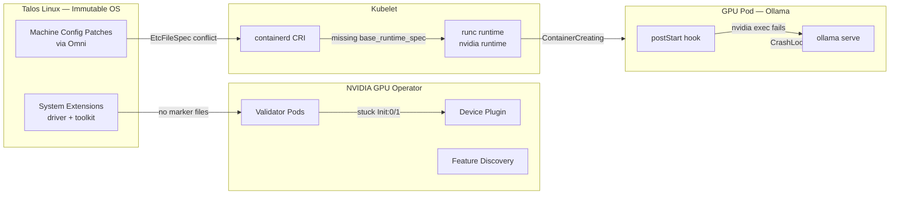

Layer 4 deployed the NVIDIA GPU Operator. Layer 10 deployed Ollama. Between those two milestones lay four distinct issues that kept every GPU container stuck — first at `Init:0/1`, then `ContainerCreating`, then crashing in a 3-second loop. Each issue was specific to the Talos Linux intersection with the NVIDIA stack, and each had to be solved in sequence before a single model ran.



## Issue 1: Validation Markers

After the GPU Operator deployed on gpu-1, every operator pod — device-plugin, feature-discovery, dcgm-exporter, validator — got stuck in `Init:0/1`. Waiting for init containers that check for validation marker files:

```
/run/nvidia/validations/driver-ready
/run/nvidia/validations/toolkit-ready
```

These files are created by the GPU Operator's own driver and toolkit containers. But on Talos, the driver and toolkit are baked into the immutable OS as system extensions. The operator's driver and toolkit are disabled (`driver.enabled: false`, `toolkit.enabled: false`). Nobody creates the validation files.

**The fix:** a DaemonSet that creates and maintains the marker files on GPU nodes:

```yaml
# apps/gpu-operator-extras/manifests/validation-markers.yaml
apiVersion: apps/v1
kind: DaemonSet
metadata:
  name: nvidia-validation-markers
  namespace: gpu-operator
spec:
  selector:
    matchLabels:
      app: nvidia-validation-markers
  template:
    spec:
      nodeSelector:
        nvidia.com/gpu.present: "true"
      hostNetwork: true
      containers:
        - name: marker
          image: busybox:1.37
          command: ["/bin/sh", "-c"]
          args:
            - |
              mkdir -p /run/nvidia/validations
              while true; do
                touch /run/nvidia/validations/driver-ready
                touch /run/nvidia/validations/toolkit-ready
                sleep 30
              done
          volumeMounts:
            - name: run-nvidia
              mountPath: /run/nvidia
      volumes:
        - name: run-nvidia
          hostPath:
            path: /run/nvidia
            type: DirectoryOrCreate
```

The 30-second loop matters. `/run` is a tmpfs on Talos — files there disappear on reboot or containerd restart. Without the loop, a containerd restart clears the markers and blocks the operator pods.

Also disable the operator's built-in validator (more complex logic that also breaks on Talos):

```bash
kubectl label node gpu-1 nvidia.com/gpu.deploy.operator-validator=false
```

## Issue 2: Machine-Specific containerd Patches

With the operator running, Ollama gets scheduled to gpu-1 but stuck at `ContainerCreating`. The container is running inside containerd (`crictl` shows `CONTAINER_RUNNING`) but kubelet cannot track it.

GPU containers on Talos need the nvidia runtime set as default:

```toml
# /etc/cri/conf.d/20-customization.part on gpu-1
[plugins."io.containerd.cri.v1.runtime"]
  cdi_spec_dirs = ["/var/cdi/static", "/var/cdi/dynamic"]
  [plugins."io.containerd.cri.v1.runtime".containerd]
    default_runtime_name = "nvidia"
  [plugins."io.containerd.cri.v1.runtime".containerd.runtimes.nvidia]
    base_runtime_spec = "/etc/cri/conf.d/base-spec.json"
```

This config lives in a Talos machine config patch applied via Omni. The problem: Layer 5 had deployed a **cluster-wide** CDI containerd patch creating the same file path (`/etc/cri/conf.d/20-customization.part`) with CDI directory config only. When both patches target the same file with `op: create`, Talos hits:

```
resource EtcFileSpecs.files.talos.dev already exists
```

The node enters a 35-minute reboot loop. CRI never registers. The node becomes `NotReady`.

**The fix:** replace the cluster-wide CDI patch with machine-specific patches, each scoped by `omni.sidero.dev/cluster-machine` label. Each node gets one patch that covers everything that file needs:

```yaml
# patches/phase05-mini-config/05-mini1-cdi-containerd.yaml
metadata:
    id: 303-mini1-cdi-containerd
    labels:
        omni.sidero.dev/cluster-machine: ce4d0d52-6c10-bdc9-746c-88aedd67681b
spec:
    data: |
        machine:
            files:
                - path: /etc/cri/conf.d/20-customization.part
                  op: create
                  content: |
                      [plugins."io.containerd.cri.v1.runtime"]
                        cdi_spec_dirs = ["/var/cdi/static", "/var/cdi/dynamic"]
```

mini nodes get CDI dirs only. gpu-1 gets CDI dirs plus the nvidia default runtime plus the base runtime spec — all in one patch, one file. No conflict.

**Ordering:** delete the cluster-wide patch **first**, then apply machine-specific ones. Both existing simultaneously on any node triggers the conflict.

## Issue 3: base_runtime_spec for nvidia Runtime

With machine-specific patches and nvidia default runtime set, GPU pods still stuck at `ContainerCreating`. Non-GPU pods on the same node work perfectly. The difference in containerd CRI config:

```
runtimes:
  nvidia:
    runtimeType: io.containerd.runc.v2
    options: {BinaryName: /usr/local/bin/nvidia-container-runtime}
    baseRuntimeSpec: ""                          # missing
  runc:
    runtimeType: io.containerd.runc.v2
    baseRuntimeSpec: /etc/cri/conf.d/base-spec.json  # present
```

The `runc` runtime has a `baseRuntimeSpec` pointing to Talos's OCI base spec. The `nvidia` runtime has an empty one. The base spec contains the OCI process and Linux namespace config that kubelet expects — without it, kubelet cannot track the container lifecycle.

**The fix:** add `base_runtime_spec = "/etc/cri/conf.d/base-spec.json"` to the nvidia runtime config in the Talos patch. After a reboot, GPU pods get IPs and `PodReadyToStartContainers` flips to `True`.

## Issue 4: PostStart Hook + nvidia exec

Ollama finally starts — detects the GPU, reports 15.9 GiB VRAM — and immediately crashes. `CrashLoopBackOff` with exit code 0.

The Helm chart generates a `postStart` hook that pulls models:

```sh
while ! /bin/ollama ps > /dev/null 2>&1; do sleep 5; done
/bin/ollama pull qwen3.5:9b
```

On Talos with the nvidia system extension, the `nvidia-container-cli` OCI hook runs during container exec and fails with `ERROR: init 250 result=11`. This error is non-fatal for the main process (Ollama starts and detects the GPU), but it causes the postStart hook's exec to fail. Kubernetes kills the container when a postStart hook fails.

Logs look normal except for `FailedPostStartHook`. The container exits cleanly (code 0) 2-3 seconds after starting.

**The fix:** remove the model pull from Helm values. Models are pulled after the pod is running:

```yaml
# apps/ollama/values.yaml
ollama:
  models:
    pull: []
```

```bash
kubectl exec -n ollama deploy/ollama -- ollama pull qwen3.5:9b
```

Models persist on the Longhorn PVC, so they survive restarts.

## The Result

```console
$ kubectl exec -n ollama deploy/ollama -- ollama ps
NAME          ID              SIZE      PROCESSOR    CONTEXT    UNTIL
qwen3.5:9b    6488c96fa5fa    8.6 GB    100% GPU     4096       24 hours from now
```

Full GPU inference. The stack — LiteLLM gateway, Ollama, NVIDIA device plugin, containerd nvidia runtime, Talos system extensions — is operational.

## Talos + NVIDIA Gotchas Summary

| Issue | Symptom | Fix |
|-------|---------|-----|
| Validation markers | GPU Operator pods stuck Init:0/1 | DaemonSet creating marker files in a loop |
| EtcFileSpec conflict | Node enters 35-min reboot loop | Machine-specific patches, one `op: create` per file per node |
| Missing base_runtime_spec | GPU pods stuck ContainerCreating | Add `base_runtime_spec` to nvidia runtime config |
| PostStart hook + nvidia exec | Container killed after 2-3 seconds | Remove postStart model pull, use `kubectl exec` |

## Recovery Path

| Symptom | Cause | Fix |
|---------|-------|-----|
| GPU Operator pods stuck Init | Validation markers missing | Check DaemonSet running; verify `/run/nvidia/validations/` exists |
| Node NotReady + reboot loop | EtcFileSpec resource conflict | Delete cluster-wide patch, apply machine-specific, wait for reboot |
| GPU pods stuck ContainerCreating | base_runtime_spec missing for nvidia runtime | Verify containerd CRI config on node |
| Pod exits with FailedPostStartHook | nvidia exec OCI hook fails | Remove postStart hook from Helm values |

## Missteps

| What Happened | Why It Was Wrong | How We Fixed It | Commit |
|---------------|-----------------|-----------------|--------|
| **No validation markers on Talos** — GPU Operator assumes its own driver/toolkit containers create marker files, but Talos provides them as system extensions with those containers disabled | Talos immutable OS vs operator's mutable-filesystem assumptions | DaemonSet that creates and maintains marker files in a loop | `965d2609` |
| **Cluster-wide CDI patch conflicts with gpu-specific nvidia patch** — both target the same file path with `op: create`; Talos cannot merge them | Two ConfigPatches racing for the same EtcFileSpec resource | Machine-specific patches scoped by `cluster-machine` label, one file per node per patch | `bb5456d5` |
| **nvidia runtime missing base_runtime_spec** — kubelet cannot track container lifecycle without OCI base spec | containerd config left `baseRuntimeSpec: ""` for the nvidia runtime | Added `base_runtime_spec` to nvidia runtime block | `bb5456d5` |
| **postStart model pull fails on Talos** — nvidia OCI hook errors on exec, Kubernetes kills container | postStart hook failure is fatal per K8s spec, even if the main process is healthy | Removed postStart hook, pull models on first request via LiteLLM | `7c88dcc4` |

## References

- [AI Workloads on Talos Linux](https://www.siderolabs.com/blog/ai-workloads-on-talos-linux/) — Siderolabs blog
- [NVIDIA GPU Operator](https://docs.nvidia.com/datacenter/cloud-native/gpu-operator/latest/) — Official docs
- [Container Device Interface (CDI)](https://github.com/cncf-tags/container-device-interface) — CNCF spec
- [Talos Containerd Config](https://www.talos.dev/v1.12/reference/configuration/extensions/containerd/) — Talos docs

**Next: [Unified Auth — Authentik SSO](/docs/building/13-unified-auth)**
