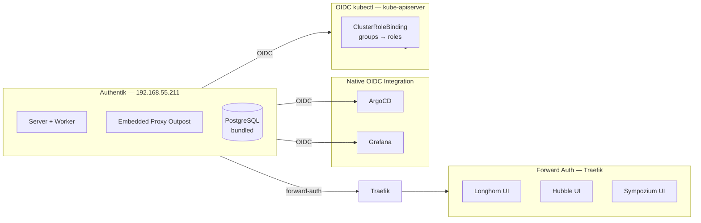

Before this layer, every service on the cluster had its own local admin account. ArgoCD had its built-in admin user. Grafana had `admin/admin`. Infisical had a self-created admin. Longhorn, Hubble, and Sympozium had no authentication at all — anyone on the LAN could access them.

That is fine for one person. It is not fine the moment you add a second person, a CI agent, or want an audit trail for who did what.

Layer 13 fixes this with Authentik — one identity provider for the entire cluster.



## Why Authentik Over Dex or Keycloak

Three reasons:

1. **Proxy outpost** — services with no OIDC support (Longhorn, Hubble, Sympozium) get authentication via a reverse proxy in front of Traefik. No code changes, no sidecars.
2. **Blueprint system** — providers, applications, and groups can be defined as YAML. In theory, this makes configuration declarative and GitOps-friendly. In practice, blueprint YAML syntax is sensitive — see below.
3. **Self-hosted and free** — the open-source edition includes everything: OIDC, proxy providers, group management, admin UI.

## Three Integration Patterns

### Pattern 1: Native OIDC

Services that support OpenID Connect get a dedicated OAuth2 provider in Authentik. The service redirects to Authentik for login, receives a JWT with group claims, and maps groups to roles.

- **ArgoCD** — `oidc.config` in `argocd-cm`, groups mapped via `policy.csv` RBAC
- **Grafana** — `auth.generic_oauth` in `grafana.ini`, JMESPath role mapping from group claims

### Pattern 2: Forward Auth Proxy

Services with no authentication get protected by Authentik's embedded proxy outpost. Traefik uses `forwardAuth` middleware to check every request against the outpost before forwarding to the backend:

1. User navigates to `longhorn.frank.derio.net`
2. Traefik sends a sub-request to the Authentik outpost
3. If no valid session, Authentik redirects to login
4. After login, the outpost returns success to Traefik
5. Traefik forwards the original request

**Critical:** the embedded outpost needs `AUTHENTIK_HOST` set to its own external URL. Without it, the outpost defaults to `http://0.0.0.0:9000` (the container's bind address), and forward-auth redirects send users to an unreachable address:

```yaml
global:
  env:
    - name: AUTHENTIK_HOST
      value: "https://auth.frank.derio.net"
```

Set via `global.env` so it applies to both the server and worker deployments.

### Pattern 3: OIDC kubectl

The kube-apiserver itself validates Authentik-issued tokens via a Talos machine config patch:

```yaml
cluster:
  apiServer:
    extraArgs:
      oidc-issuer-url: https://auth.frank.derio.net/application/o/k8s-agent/
      oidc-client-id: k8s-agent
      oidc-username-claim: preferred_username
      oidc-groups-claim: groups
```

ClusterRoleBindings map Authentik groups to Kubernetes RBAC:

| Authentik Group | K8s ClusterRole |
|----------------|----------------|
| root-admins | cluster-admin |
| root-devops | admin |
| root-developers | view |
| root-agents | cluster-admin |

## Deploying Authentik

Two ArgoCD apps:

- **`authentik`** — Helm chart. Server, worker, embedded PostgreSQL (no env var collision — unlike Infisical's chart). Redis is also embedded. Secret key and PostgreSQL password come from a SOPS-encrypted Secret applied out-of-band.
- **`authentik-extras`** — raw manifests. Blueprint ConfigMaps, Cilium L2 LoadBalancer, ClusterRoleBindings.

Key Helm values:

```yaml
authentik:
  secret_key: ""   # from SOPS Secret
  postgresql:
    password: ""   # from SOPS Secret
  bootstrap_password: ""
```

The bootstrap password creates an `akadmin` user on first boot. After SSO is working, this account becomes the break-glass fallback.

## Blueprints: Declarative (Eventually)

Authentik supports YAML blueprints for defining providers, applications, and groups. The plan was to mount them as ConfigMaps and let Authentik auto-discover.

The groups blueprint worked — three groups materialized on startup. The provider blueprints failed. Auto-discovery found the mounted files but reported `status: error` with no actionable message. Manually triggering blueprint discovery via the API hit `CurrentTaskNotFound` — the endpoint requires a Dramatiq task context that does not exist outside the worker.

After several attempts the initial approach shifted to the Authentik REST API. Every provider, application, and outpost assignment was created via `curl` against `/api/v3/`.

**Later audit:** the blueprint failures were blueprint YAML syntax — not an Authentik bug. With corrected YAML, all provider blueprints work as ConfigMaps in `authentik-extras`:

- `blueprints-groups.yaml` — group hierarchy
- `blueprints-provider-argocd.yaml` — ArgoCD OIDC provider + application
- `blueprints-provider-grafana.yaml` — Grafana OIDC provider + application
- `blueprints-proxy-providers.yaml` — forward-auth proxy providers for Longhorn, Hubble, Sympozium
- `blueprints-agent-auth.yaml` — k8s-agent OAuth2 provider for OIDC-backed kubectl

Layer 13 is now fully declarative. If Authentik's database is lost, all providers, applications, and group mappings are recreated from blueprints on startup.

## ArgoCD: Self-Management

ArgoCD was bootstrapped manually with `helm install` during Layer 0 and never brought under App-of-Apps control. Changing its Helm values to add OIDC config had no declarative path.

The fix was to create an Application CR that adopts the existing release:

```yaml
apiVersion: argoproj.io/v1alpha1
kind: Application
metadata:
  name: argocd
  namespace: argocd
spec:
  project: infrastructure
  sources:
    - repoURL: https://argoproj.github.io/argo-helm
      chart: argo-cd
      targetRevision: "9.4.6"
      helm:
        releaseName: argocd
        valueFiles:
          - $values/apps/argocd/values.yaml
    - repoURL: <git-repo>
      targetRevision: main
      ref: values
```

With `ignoreDifferences` on Secret `/data` and `prune: false`, ArgoCD adopted the existing Helm release without destroying anything.

## Gotchas

### Grafana Secret Key Name Trap

Grafana's OIDC integration uses `envFromSecret` to inject the client secret as an environment variable. The config references it with `${GF_AUTH_GENERIC_OAUTH_CLIENT_SECRET}`.

If the Kubernetes Secret key is `client_secret`, the pod gets an env var called `client_secret` — but the config references `GF_AUTH_GENERIC_OAUTH_CLIENT_SECRET`. No error, just silent auth failure. The Secret key must exactly match the env var name.

Role mapping uses a JMESPath expression on the `groups` claim:

```yaml
role_attribute_path: >-
  contains(groups[*], 'root-admins') && 'Admin'
  || contains(groups[*], 'root-devops') && 'Editor'
  || 'Viewer'
```

### Blueprint YAML Syntax

Auto-discovery reported `status: error` with no actionable message for provider blueprints. Manually triggering discovery via the API returned `CurrentTaskNotFound` — the endpoint needs a Dramatiq task context that only exists inside the worker.

Both problems: the blueprint YAML had subtle syntax issues (indentation, missing fields). After fixing the syntax, all blueprints load cleanly on startup.

### Infisical OIDC Dropped

Infisical's admin UI requires manual OIDC configuration — there is no Helm value or blueprint path. The integration was deprioritized.

## Missteps

| What Happened | Why It Was Wrong | How We Fixed It | Commit |
|---------------|-----------------|-----------------|--------|
| **Forward-auth redirects to unreachable address** — `AUTHENTIK_HOST` not set, outpost defaults to `http://0.0.0.0:9000` | Outpost needs its external URL for correct OAuth2 redirect URIs | Added `AUTHENTIK_HOST: https://auth.frank.derio.net` via `global.env` | `9f1e7c4d` |
| **Provider blueprints silently failed** — auto-discovery reported `status: error` with no actionable message | Blueprint YAML syntax issues (indentation, missing fields) | Worked around with REST API initially; later corrected blueprint YAML | `2a4b6d8f` |
| **Grafana OIDC silent auth failure** — Secret key `client_secret` does not match expected env var name `GF_AUTH_GENERIC_OAUTH_CLIENT_SECRET` | `envFromSecret` maps Secret key names directly to env var names | Renamed Secret key to match Grafana's expected env var | `5c3e8a1b` |
| **ArgoCD not under App-of-Apps** — Helm values changes required manual `helm upgrade` | Bootstrapped manually in Layer 0, never adopted | Created Application CR with `ignoreDifferences` to adopt existing release | `7d1f2b9e` |

## References

- [Authentik Documentation](https://goauthentik.io/docs/) — Installation, blueprints, providers
- [Grafana OIDC Configuration](https://grafana.com/docs/grafana/latest/setup-grafana/configure-security/configure-authentication/generic-oauth/) — Generic OAuth2 setup
- [ArgoCD OIDC Configuration](https://argo-cd.readthedocs.io/en/stable/operator-manual/user-management/) — SSO with OIDC
- `apps/authentik/` — Helm values and ConfigMaps
- `apps/authentik-extras/manifests/` — Blueprints, LoadBalancer, ClusterRoleBindings

**Next: [Multi-tenancy — vCluster](/docs/building/14-multi-tenancy)**
