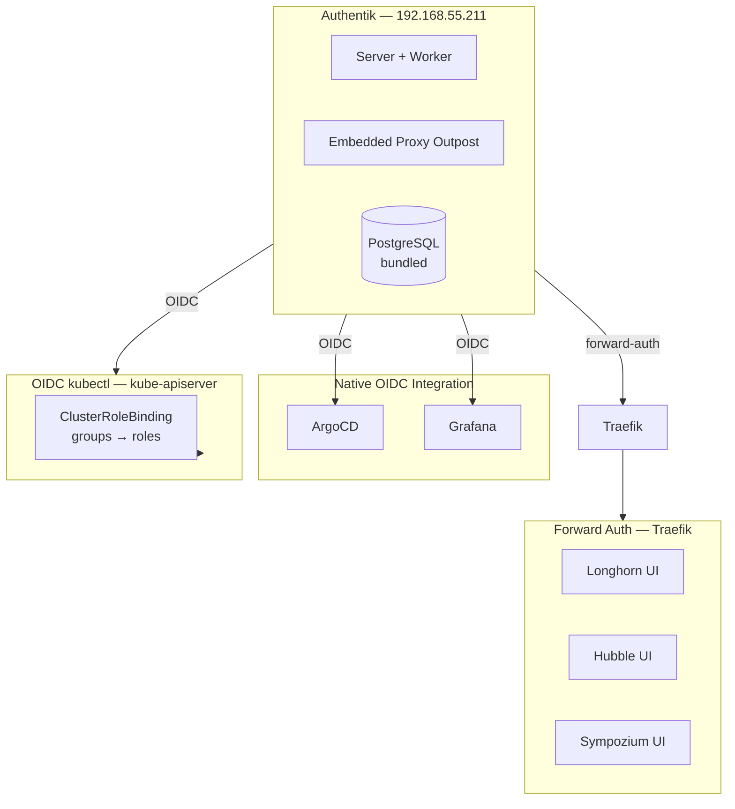

Before this layer, every service on the cluster had its own local admin account. ArgoCD had its built-in admin user. Grafana had `admin/admin`. Infisical had a self-created admin. Longhorn, Hubble, and Sympozium had no authentication at all — anyone on the LAN could access them.

That is fine for one person. It is not fine the moment you add a second person, a CI agent, or want an audit trail for who did what.

Layer 13 fixes this with Authentik — one identity provider for the entire cluster.


```mermaid
flowchart TD
  subgraph IdP[Authentik — 192.168.55.211]
    Server[Server + Worker]
    Outpost[Embedded Proxy Outpost]
    PG[(PostgreSQL<br/>bundled)]
  end
  subgraph OIDC[Native OIDC Integration]
    ArgoCD[ArgoCD]
    Grafana[Grafana]
  end
  subgraph Proxy[Forward Auth — Traefik]
    Longhorn[Longhorn UI]
    Hubble[Hubble UI]
    Sympozium[Sympozium UI]
  end
  subgraph K8s[OIDC kubectl — kube-apiserver]
    RBAC[ClusterRoleBinding<br/>groups → roles]
  end

  IdP -->|OIDC| ArgoCD
  IdP -->|OIDC| Grafana
  IdP -->|forward-auth| Traefik
  Traefik --> Proxy
  IdP -->|OIDC| K8s
  K8s --> RBAC
```

## Why Authentik Over Dex or Keycloak

Three reasons:

1. **Proxy outpost** — services with no  support (Longhorn, Hubble, Sympozium) get authentication via a reverse proxy in front of Traefik. No code changes, no sidecars.
2. **Blueprint system** — providers, applications, and groups can be defined as YAML. In theory, this makes configuration declarative and GitOps-friendly. In practice, blueprint YAML syntax is sensitive — see below.
3. **Self-hosted and free** — the open-source edition includes everything: OIDC, proxy providers, group management, admin UI.

## Three Integration Patterns

### Pattern 1: Native OIDC

Services that support OpenID Connect get a dedicated OAuth2 provider in Authentik. The service redirects to Authentik for login, receives a  with group claims, and maps groups to roles.

- **ArgoCD** — `oidc.config` in `argocd-cm`, groups mapped via `policy.csv` 
- **Grafana** — `auth.generic_oauth` in `grafana.ini`, JMESPath role mapping from group claims

### Pattern 2: Forward Auth Proxy

Services with no authentication get protected by Authentik's embedded proxy outpost. Traefik uses `forwardAuth` middleware to check every request against the outpost before forwarding to the backend:

1. User navigates to `longhorn.cluster.derio.net`
2. Traefik sends a sub-request to the Authentik outpost
3. If no valid session, Authentik redirects to login
4. After login, the outpost returns success to Traefik
5. Traefik forwards the original request

**Critical:** the embedded outpost needs `AUTHENTIK_HOST` set to its own external URL. Without it, the outpost defaults to `http://0.0.0.0:9000` (the container's bind address), and forward-auth redirects send users to an unreachable address:

```yaml
global:
  env:
    - name: AUTHENTIK_HOST
      value: "https://auth.cluster.derio.net"
```

Set via `global.env` so it applies to both the server and worker deployments.

This pattern reaches much further than the three services in the diagram: 18 IngressRoutes in `apps/traefik/manifests/ingressroutes.yaml` carry the `authentik-forwardauth` middleware. Adding a service to that set is one middleware reference plus a proxy provider — which is exactly why the forward-auth path, not native OIDC, is what most of the cluster ended up using.

One trap worth knowing before you add the nineteenth. The outpost matches each incoming request's `Host` header against the `external_host` of a registered provider. A hostname that is routed but *not* registered does not fall through to the backend and does not produce a Traefik error — it returns a 404 from Authentik itself, identifiable by the `x-powered-by: authentik` response header. A 404 that looks like a broken backend is often a missing provider registration.

### Pattern 3: OIDC kubectl

The kube-apiserver itself validates Authentik-issued tokens, configured through a Talos machine config patch. This layer originally used the classic `--oidc-*` apiserver flags, which accept exactly one issuer. That single-issuer limit became the problem: migrating the cluster from `auth.frank.derio.net` to `auth.cluster.derio.net` with one flag means a hard cutover, in which every token minted against the old issuer is rejected the instant the flag flips.

The structured `AuthenticationConfiguration` file replaces those flags and accepts a list of issuers, so both can be trusted at once:

```yaml
# patches/phase13-auth/authn-config.yaml
apiVersion: apiserver.config.k8s.io/v1
kind: AuthenticationConfiguration
jwt:
  - issuer:
      url: https://auth.frank.derio.net/application/o/k8s-agent/
      audiences: [k8s-agent]
    claimMappings:
      username: {claim: preferred_username, prefix: "authentik:"}
      groups:   {claim: groups, prefix: ""}
  - issuer:
      url: https://auth.cluster.derio.net/application/o/k8s-agent/
      audiences: [k8s-agent]
      # ...same claim mappings
```

Talos writes that file to each control-plane node and the apiserver mounts it:

```yaml
# patches/phase13-auth/omni-configpatch.yaml
cluster:
  apiServer:
    extraArgs:
      authentication-config: /etc/kubernetes/authn-config.yaml
    extraVolumes:
      - hostPath: /var/lib/kubernetes/authn-config.yaml
        mountPath: /etc/kubernetes/authn-config.yaml
        readonly: true
```

The two mechanisms are **mutually exclusive** — this is not "add a second issuer flag", it is replacing the `oidc-*` extraArgs entirely. With both issuers trusted, already-issued tokens keep working while new ones carry the new issuer, and the old authenticator is removed only after the longest outstanding token has expired (eight hours, for this provider). No rejection window.

That migration is in progress at the time of writing: the patch above is what the repo declares, and rolling it onto the live control plane is a separate machine-config apply. Treat the file as the intended state, not as a description of what any given apiserver is currently running.

ClusterRoleBindings map Authentik groups to Kubernetes RBAC:

| Authentik Group | K8s ClusterRole |
|----------------|----------------|
| root-admins | cluster-admin |
| root-devops | admin |
| root-developers | view |
| root-agents | cluster-admin |

## Deploying Authentik

Two ArgoCD apps:

- **`authentik`** — Helm chart. Server, worker, embedded PostgreSQL (no env var collision — unlike Infisical's chart). Redis is also embedded. Secret key and PostgreSQL password come from a -encrypted Secret applied out-of-band.
- **`authentik-extras`** — raw manifests. Blueprint ConfigMaps, Cilium L2 LoadBalancer, ClusterRoleBindings.

Key Helm values. Note that none of the three secrets are set as chart values — they are all injected as environment variables from one SOPS-managed Secret, which is why the `authentik:` block looks nearly empty:

```yaml
authentik:
  secret_key: ""   # injected via AUTHENTIK_SECRET_KEY below

global:
  env:
    - name: AUTHENTIK_SECRET_KEY
      valueFrom:
        secretKeyRef: {name: authentik-secrets, key: secret_key}
    - name: AUTHENTIK_BOOTSTRAP_PASSWORD
      valueFrom:
        secretKeyRef: {name: authentik-secrets, key: bootstrap_password}
    - name: AUTHENTIK_POSTGRESQL__PASSWORD
      valueFrom:
        secretKeyRef: {name: authentik-secrets, key: postgresql_password}

# The bundled Bitnami subchart authenticates itself separately
postgresql:
  enabled: true
  auth:
    username: authentik
    database: authentik
    existingSecret: authentik-secrets
    secretKeys:
      userPasswordKey: postgresql_password
```

The database password appears twice on purpose, and it is the kind of duplication that looks like a mistake in review. The Bitnami PostgreSQL subchart reads it via `existingSecret` to initialize its own auth; the Authentik server and worker are separate processes that need the same password in their environment to connect. Same secret, same key, two consumers.

The bootstrap password creates an `akadmin` user on first boot. After  is working, this account becomes the break-glass fallback — the account you need precisely when the identity provider is the thing that is broken.

## Blueprints: Declarative (Eventually)

Authentik supports YAML blueprints for defining providers, applications, and groups. The plan was to mount them as ConfigMaps and let Authentik auto-discover.

The groups blueprint worked — three groups materialized on startup. The provider blueprints failed. Auto-discovery found the mounted files but reported `status: error` with no actionable message. Manually triggering blueprint discovery via the API hit `CurrentTaskNotFound` — the endpoint requires a Dramatiq task context that does not exist outside the worker.

After several attempts the initial approach shifted to the Authentik REST API. Every provider, application, and outpost assignment was created via `curl` against `/api/v3/`.

**Later audit:** the blueprint failures were blueprint YAML syntax — not an Authentik bug. With corrected YAML, all provider blueprints work as ConfigMaps in `authentik-extras`:

Eight ConfigMaps are registered in `apps/authentik/values.yaml` under `blueprints.configMaps`:

- `blueprints-groups.yaml` — group hierarchy
- `blueprints-provider-argocd.yaml` — ArgoCD OIDC provider + application
- `blueprints-provider-grafana.yaml` — Grafana OIDC provider + application
- `blueprints-provider-infisical.yaml` — Infisical OIDC provider + application
- `blueprints-provider-awx.yaml` — AWX OIDC provider + application
- `blueprints-proxy-providers.yaml` — the original forward-auth providers on legacy `.frank` hostnames
- `blueprints-cluster-proxy-providers.yaml` — forward-auth providers on `.cluster` hostnames, roughly fifteen services
- `blueprints-agent-auth.yaml` — k8s-agent OAuth2 provider for OIDC-backed kubectl

The list grew unevenly, and the split between the last two proxy files is the domain migration showing through: new services land in the `cluster` blueprint, while a few older entries (Sympozium among them) still live only in the legacy file. If you are hunting for a provider that "should exist", check both.

Layer 13 is now declarative in the sense that matters: if Authentik's database is lost, providers, applications, and group mappings are recreated from blueprints on startup. Two things do not come back on their own — outpost provider assignment (Authentik's blueprint schema cannot add to an outpost's provider list without replacing it, so it stays a scripted Django ORM step) and the handful of third-party-side toggles noted below.

## ArgoCD: Self-Management

ArgoCD was bootstrapped manually with `helm install` during Layer 0 and never brought under App-of-Apps control. Changing its Helm values to add OIDC config had no declarative path.

The fix was to create an Application  that adopts the existing release:

```yaml
apiVersion: argoproj.io/v1alpha1
kind: Application
metadata:
  name: argocd
  namespace: argocd
spec:
  project: infrastructure
  sources:
    - repoURL: https://argoproj.github.io/argo-helm
      chart: argo-cd
      targetRevision: "9.4.6"
      helm:
        releaseName: argocd
        valueFiles:
          - $values/apps/argocd/values.yaml
    - repoURL: <git-repo>
      targetRevision: main
      ref: values
```

With `ignoreDifferences` on Secret `/data`, and pruning left off, ArgoCD adopted the existing Helm release without destroying anything. The Application's `syncPolicy.automated` block sets only `selfHeal: true`; there is no literal `prune: false` field, because ArgoCD defaults an omitted `automated.prune` to false. Behaviour and intent match, but only the omission is written down — a distinction worth knowing when you go looking for the field and cannot find it.

## Gotchas

### Grafana Secret Key Name Trap

Grafana's OIDC integration uses `envFromSecret` to inject the client secret as an environment variable. The config references it with `${GF_AUTH_GENERIC_OAUTH_CLIENT_SECRET}`.

If the Kubernetes Secret key is `client_secret`, the pod gets an env var called `client_secret` — but the config references `GF_AUTH_GENERIC_OAUTH_CLIENT_SECRET`. No error, just silent auth failure. The Secret key must exactly match the env var name.

Role mapping uses a JMESPath expression on the `groups` claim:

```yaml
role_attribute_path: >-
  contains(groups[*], 'root-admins') && 'Admin'
  || contains(groups[*], 'root-devops') && 'Editor'
  || 'Viewer'
```

### Blueprint YAML Syntax

Auto-discovery reported `status: error` with no actionable message for provider blueprints. Manually triggering discovery via the API returned `CurrentTaskNotFound` — the endpoint needs a Dramatiq task context that only exists inside the worker.

Both problems: the blueprint YAML had subtle syntax issues (indentation, missing fields). After fixing the syntax, all blueprints load cleanly on startup.

### Infisical OIDC: Half Declarative

The Authentik half of this integration is declarative. `blueprints-provider-infisical.yaml` creates the provider and application like any other, and it is registered alongside the rest.

What cannot be declared is the *other* side. Infisical's own SSO configuration lives in its admin UI, with no Helm value and no API path that this layer drives, so issuer URL, client ID, and client secret are entered by hand there. That step is tracked as manual operation `auth-infisical-oidc-config` in `docs/runbooks/manual-operations.yaml`.

This is the general shape of the limit. A blueprint system can make *your* IdP declarative; it cannot make a third-party application accept OIDC declaratively. Every integration is only as GitOps-managed as its least cooperative half.

## Verifying an integration

Routine operations for Authentik — pod health, logs, `ak shell`, token minting, the REST API, OIDC discovery — are in the companion post, [Operating on Frank — Auth](/docs/operating/08-auth). What follows is the narrower question this layer raises: *did the thing I just declared actually take effect?* Three checks, in the order that isolates fastest.

**1. Did the blueprint land?**

A provider that does not exist is the root cause of most "SSO is broken" reports, and blueprints fail quietly. Start by confirming the ConfigMaps are present, since Authentik can only apply what is mounted (captured 2026-08-02):

```console
$ kubectl -n authentik get cm -l app.kubernetes.io/component=blueprint
NAME                                           DATA   AGE
authentik-blueprints-agent-auth                1      132d
authentik-blueprints-cluster-proxy-providers   1      115d
authentik-blueprints-groups                    1      143d
authentik-blueprints-provider-argocd           1      143d
authentik-blueprints-provider-awx              1      61d
authentik-blueprints-provider-grafana          1      132d
authentik-blueprints-provider-infisical        1      132d
authentik-blueprints-proxy-providers           1      132d
```

If your new blueprint is missing here, the problem is upstream of Authentik entirely — the ConfigMap was not created, or it was not added to `blueprints.configMaps` in the Helm values, and Authentik never saw a file to reject. If it *is* listed but the provider still does not exist, only then is it worth reading worker logs for a YAML error.

**2. Do the group mappings still say what you think?**

These four bindings are the whole of the kubectl authorization story, and two of them grant `cluster-admin`:

```console
$ kubectl get clusterrolebinding authentik-root-admins authentik-root-devops \
    authentik-root-developers authentik-root-agents
NAME                        ROLE                        AGE
authentik-root-admins       ClusterRole/cluster-admin   143d
authentik-root-devops       ClusterRole/admin           143d
authentik-root-developers   ClusterRole/view            143d
authentik-root-agents       ClusterRole/cluster-admin   143d
```

Read the ROLE column against your intent, not against your memory. `root-agents` holding `cluster-admin` is a deliberate decision here; on most clusters it would be a finding. A missing binding is the safer failure — the group authenticates and can do nothing. The dangerous direction is a binding that quietly grants more than the group's name suggests.

**3. Is the service actually protected?**

The end-to-end proof, and the only one of the three that tests the request path a user takes. An unauthenticated request to a forward-auth service must not return the application:

```console
$ curl -sI https://longhorn.cluster.derio.net/ | head -3
HTTP/2 302
content-type: text/html; charset=utf-8
location: https://auth.cluster.derio.net/application/o/authorize/?client_id=...
```

Three outcomes, three different repairs:

- **302 to `auth.cluster.derio.net`** — working. The `location` header also confirms which issuer the outpost advertises, which is the fact the domain migration turns on.
- **200 with the application's own page** — the service is exposed with no authentication. The middleware reference is missing from the IngressRoute. This is the outcome to actively look for, because nothing else reports it: the service works perfectly, for everyone.
- **404 carrying `x-powered-by: authentik`** — the request reached the outpost but the `Host` is not registered on any provider. Add it to the blueprint, then to the outpost.

Run the third check whenever you add a service. A forgotten middleware line produces a working, popular, completely open endpoint, and it will not appear in any log as a problem.

## Missteps

| What Happened | Why It Was Wrong | How We Fixed It | Evidence |
|---------------|-----------------|-----------------|----------|
| **Forward-auth redirects to unreachable address** — `AUTHENTIK_HOST` not set, outpost defaults to `http://0.0.0.0:9000` | Outpost needs its external URL for correct OAuth2 redirect  | Set `AUTHENTIK_HOST` via `global.env` so server and worker both get it | `apps/authentik/values.yaml:35-36` |
| **Provider blueprints silently failed** — auto-discovery reported `status: error` with no actionable message | Blueprint YAML syntax issues (indentation, missing fields), misread as an Authentik bug | Worked around with the REST API initially; later corrected the YAML and returned to blueprints | `apps/authentik-extras/manifests/` |
| **Grafana OIDC silent auth failure** — Secret key `client_secret` does not match expected env var name `GF_AUTH_GENERIC_OAUTH_CLIENT_SECRET` | `envFromSecret` maps Secret key names directly to env var names | Renamed Secret key to match Grafana's expected env var | runbook `auth-grafana-oidc-secret` |
| **ArgoCD not under App-of-Apps** — Helm values changes required manual `helm upgrade` | Bootstrapped manually in Layer 0, never adopted | Created Application CR with `ignoreDifferences` to adopt existing release | `apps/root/templates/argocd.yaml` |
| **Single-issuer `--oidc-*` flags made the domain migration a hard cutover** — one issuer means every outstanding token breaks at the flip | The apiserver flag set has no room for a second trust anchor | Replaced the flags with a structured `AuthenticationConfiguration` declaring both issuers | `patches/phase13-auth/authn-config.yaml` |

## What Transfers

The three-pattern split is the reusable idea. Almost every service falls into one of them, and choosing correctly is mostly about how much you are willing to modify the service:

- **Native OIDC** when the app supports it. Best experience, per-app configuration cost.
- **Forward-auth proxy** when it does not. No code changes, and it scales cheaply — this is how 18 of Frank's routes ended up protected, not the two or three you would predict from the diagram.
- **Structured apiserver authentication** for kubectl. Prefer `AuthenticationConfiguration` over the `--oidc-*` flags from the start, even with one issuer. Its value shows up the day you need a second one, and by then the flags have made that a hard cutover.

Two habits generalize past this layer. Secrets injected as environment variables often need to appear more than once for genuinely different consumers, so duplication in a values file is not automatically a smell. And a declarative integration is only as declarative as its least cooperative side — you can put your IdP in Git, but not the third-party admin UI it has to talk to. Write down which half is manual, or you will rediscover it during a restore.

## References

- [Authentik Documentation](https://goauthentik.io/docs/) — Installation, blueprints, providers
- Companion: [Operating on Frank — Auth](/docs/operating/08-auth) — health checks, token minting, troubleshooting
- [Kubernetes structured authentication configuration](https://kubernetes.io/docs/reference/access-authn-authz/authentication/#using-authentication-configuration) — the multi-issuer replacement for `--oidc-*`
- [Grafana OIDC Configuration](https://grafana.com/docs/grafana/latest/setup-grafana/configure-security/configure-authentication/generic-oauth/) — Generic OAuth2 setup
- [ArgoCD OIDC Configuration](https://argo-cd.readthedocs.io/en/stable/operator-manual/user-management/) — SSO with OIDC
- `apps/authentik/` — Helm values and ConfigMaps
- `apps/authentik-extras/manifests/` — Blueprints, LoadBalancer, ClusterRoleBindings

**Next: [Multi-tenancy — vCluster](/docs/building/14-multi-tenancy)**
