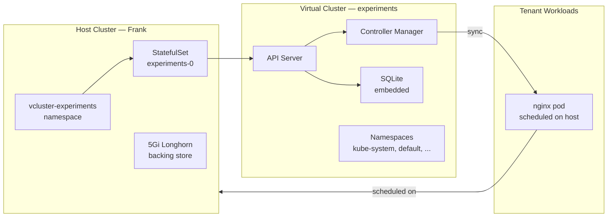

Every experiment on a shared cluster carries risk. Install a CRD that conflicts with production. Deploy a Helm chart that creates cluster-scoped resources you did not expect. Run a fuzz test that fills all available memory. On a homelab with one cluster, the blast radius is everything.

Layer 14 adds vCluster — virtual Kubernetes clusters that run inside Frank. Each one has its own API server, its own namespaces, its own resources. From the inside it looks like a real cluster. From the outside it is a StatefulSet in a namespace.



## What vCluster Actually Is

vCluster runs a virtual Kubernetes control plane (API server + controller manager + backing store) as a StatefulSet. The virtual cluster has its own API endpoint, its own etcd (or SQLite), and its own namespaces. Workloads created inside the virtual cluster get synced to the host cluster for actual scheduling — the virtual cluster does not run its own kubelet or container runtime.

Key properties:

- **API isolation** — a tenant can install CRDs, create cluster-scoped resources, and run `kubectl` without affecting the host
- **Resource isolation** — quotas and limit ranges bound what the tenant can consume
- **Network isolation** — network policies restrict traffic between virtual cluster pods and the host
- **Lifecycle simplicity** — delete the namespace, everything is gone

## The Template Pattern

Adding a vCluster should be as simple as adding a Helm values file and an ArgoCD Application CR. Values are split into two layers:

```
apps/vclusters/
  template/values.yaml        # Base defaults — all vClusters inherit
  experiments/values.yaml     # Instance-specific overrides
```

The ArgoCD Application CR loads both files in order — Helm deep-merges them:

```yaml
helm:
  valueFiles:
    - $values/apps/vclusters/template/values.yaml
    - $values/apps/vclusters/experiments/values.yaml
```

To create a new vCluster: copy the Application CR, point it at a new values file, push.

### Template Defaults

| Setting | Value | Rationale |
|---------|-------|-----------|
| Backing store | SQLite | Open-source vCluster does not support embedded etcd (Pro license); SQLite fine for single-replica at homelab scale |
| Persistence | 5Gi Longhorn | State survives pod restarts |
| Resource quotas | 4 CPU / 8Gi / 50 pods / 20 services | Enough for experiments, bounded to prevent host starvation |
| Network policies | Enabled | Virtual pods cannot reach host services by default |
| Sync rules | Pods, Services, ConfigMaps, Secrets, PVCs, Ingresses → host; Nodes, StorageClasses → virtual | |

## Deploying

One ArgoCD app per vCluster. The `experiments` instance:

```yaml
# apps/vclusters/experiments/application.yaml
apiVersion: argoproj.io/v1alpha1
kind: Application
metadata:
  name: vcluster-experiments
  namespace: argocd
spec:
  project: infrastructure
  sources:
    - repoURL: https://charts.loft.sh
      chart: vcluster
      targetRevision: 0.32.1
      helm:
        releaseName: experiments
        valueFiles:
          - $values/apps/vclusters/template/values.yaml
          - $values/apps/vclusters/experiments/values.yaml
    - repoURL: <git-repo>
      targetRevision: main
      ref: values
  destination:
    namespace: vcluster-experiments
```

## Chart Schema Gotchas

The vCluster chart v0.32.1 has a strict JSON schema. Three things the initial plan got wrong:

1. **`isolation` does not exist** — it is `policies` (with `resourceQuota`, `limitRange`, `networkPolicy`)
2. **`networking.service` does not exist** — the chart does not expose a top-level service type override
3. **Case sensitivity matters** — `configMaps` not `configmaps`, `persistentVolumeClaims` not `persistentvolumeclaims`

Any schema violation produces a template error during ArgoCD sync. The error message is clear, but discovering the correct field names required `helm show values` against the actual chart.

## Verify

Inside the virtual cluster:

```console
$ kubectl get namespaces
NAME              STATUS   AGE
default           Active   3m
kube-node-lease   Active   3m
kube-public       Active   3m
kube-system       Active   3m

$ kubectl get nodes
NAME     STATUS   ROLES           AGE   VERSION
mini-3   Ready    control-plane   3m    v1.35.2

$ kubectl run nginx --image=nginx:alpine
pod/nginx created

$ kubectl get pods
NAME    READY   STATUS    RESTARTS   AGE
nginx   1/1     Running   0          10s
```

On the host, the nginx pod appears in `vcluster-experiments` with a mangled name — the syncer translates between virtual and host namespaces. The pod is scheduled normally by the host's kubelet.

## Missteps

| What Happened | Why It Was Wrong | How We Fixed It | Commit |
|---------------|-----------------|-----------------|--------|
| **Chart schema field name mismatch** — used `isolation` and `networking.service` which do not exist in v0.32.1 schema | Initial config based on outdated docs; chart has strict JSON schema validation | Discovered correct fields (`policies`, no top-level `networking.service`) via `helm show values` | `7cfc11bc` |
| **Case-sensitive sync rule keys** — `configmaps` instead of `configMaps`, `persistentvolumeclaims` instead of `persistentVolumeClaims` | Helm values are case-sensitive; schema rejects wrong casing | Corrected casing in values.yaml | `7cfc11bc` |

## Recovery Path

| Symptom | Cause | Fix |
|---------|-------|-----|
| ArgoCD sync fails with template error | Chart schema violation — wrong field name or casing | Check with `helm template` against the chart version; verify with `helm show values` |
| Virtual cluster pod stuck Pending | Insufficient resources in host namespace | Check resource quotas in `vcluster-experiments` namespace |
| Cannot reach workloads in virtual cluster | Network policies blocking cross-cluster traffic | Verify `policies.networkPolicy` config; add host-side allow rules if needed |
| State lost on pod restart | PVC not created or not bound | Check `kubectl get pvc -n vcluster-experiments` |

## References

- [vCluster Documentation](https://www.vcluster.com/docs) — Installation, configuration, sync rules
- [vCluster Helm Chart](https://charts.loft.sh) — Chart repository
- `apps/vclusters/template/values.yaml` — Base defaults
- `apps/vclusters/experiments/` — Instance-specific config

**Next: [Paperclip — AI Agent Orchestrator](/docs/building/15-paperclip)**
