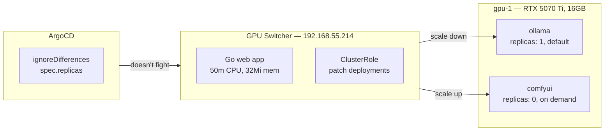

The cluster has one GPU. Layer 10 gave it to Ollama for LLM inference. This layer adds a second consumer — ComfyUI for diffusion-based media generation — and a mechanism to share the hardware between them.



The constraint: the RTX 5070 Ti has 16GB of GDDR7. LTX-2.3 needs 8-12GB. Ollama with a 9B model uses 6-7GB. Both cannot run simultaneously.

The solution is time-sharing: scale one workload to zero, let the other use the full GPU, swap when needed. Both Deployments request `nvidia.com/gpu: 1`, so Kubernetes will not schedule them concurrently.

## The Three Apps

| App | Namespace | IP | Purpose |
|-----|-----------|-----|---------|
| `comfyui` | comfyui | 192.168.55.213:8188 | ComfyUI web UI + API |
| `gpu-switcher` | gpu-switcher | 192.168.55.214:8080 | GPU time-sharing dashboard |
| `ollama` | ollama | _(existing)_ | Modified: `ignoreDifferences` on replicas |

### ComfyUI

[ComfyUI](https://github.com/comfyanonymous/ComfyUI) is a node-based visual editor for diffusion model pipelines. Text-to-video (LTX-2.3), text-to-image (SDXL, Flux), text-to-audio (Stable Audio). Exposes both a visual graph editor and a REST API.

```yaml
containers:
  - name: comfyui
    image: ghcr.io/ai-dock/comfyui:latest
    resources:
      requests:
        nvidia.com/gpu: 1
      limits:
        nvidia.com/gpu: 1
```

Key decisions:
- **100Gi PVC** on Longhorn `gpu-local` — models are large (LTX-2.3 ~4GB, SDXL ~7GB). Mounts at `/workspace`.
- **Starts at 0 replicas** — Ollama is the default. ComfyUI only runs when switched via the GPU Switcher.
- **Node affinity** to gpu-1.

### GPU Switcher

A custom Go web application that manages time-sharing. It reads a `WORKLOADS` env var defining managed workloads:

```
WORKLOADS=ollama:ollama:ollama,comfyui:comfyui:comfyui
```

Format: `name:namespace:deployment`. On each status check, it queries the K8s API for each Deployment's replica count. Activating a workload scales it to 1 and all others to 0.

### The ArgoCD Problem

ArgoCD's self-heal normally detects drift between Git and the live cluster. If Git says `replicas: 0` for ComfyUI but the Switcher just scaled it to 1, ArgoCD would scale it back.

The fix: `ignoreDifferences` on `spec.replicas` in both Application CRs:

```yaml
spec:
  ignoreDifferences:
    - group: apps
      kind: Deployment
      jsonPointers:
        - /spec/replicas
```

This tells ArgoCD that the GPU Switcher, not Git, is the authority for replica counts.

### RBAC

The Switcher's ServiceAccount needs cross-namespace access via ClusterRole:

```yaml
apiVersion: rbac.authorization.k8s.io/v1
kind: ClusterRole
metadata:
  name: gpu-switcher
rules:
  - apiGroups: ["apps"]
    resources: ["deployments", "deployments/scale"]
    verbs: ["get", "list", "patch"]
  - apiGroups: [""]
    resources: ["pods"]
    verbs: ["get", "list"]
```

### Building the Image

Cross-compiling a Go binary for amd64 from an arm64 Mac:

```bash
# Cross-compile natively (no QEMU)
CGO_ENABLED=0 GOOS=linux GOARCH=amd64 go build -ldflags="-s -w" -o gpu-switcher-linux-amd64 .

# Package into amd64 distroless runtime
docker buildx build --platform linux/amd64 \
  -t ghcr.io/derio-net/gpu-switcher:v0.1.1 \
  --push .
```

First attempt used Docker's `--platform` on the full multi-stage build, which ran the Go compiler under QEMU — and crashed with a SIGSEGV in the GC. The working approach: compile natively with `GOARCH=amd64`, then use a single-stage Dockerfile that copies the pre-built binary.

Second attempt pushed an image with `arm64` in its OCI manifest despite containing an amd64 binary — Docker inherits manifest platform from the build host. Explicit `--platform linux/amd64` fixed it.

## Model Downloads

ComfyUI models must be downloaded into the PVC after first deployment:

```bash
kubectl exec -it -n comfyui deploy/comfyui -- bash
cd /workspace/ComfyUI/models
# LTX-2.3 video model
wget -P video_models/ https://huggingface.co/Lightricks/LTX-Video/resolve/main/ltx-video-2b-v0.9.5.safetensors
# SDXL base
wget -P checkpoints/ https://huggingface.co/stabilityai/stable-diffusion-xl-base-1.0/resolve/main/sd_xl_base_1.0.safetensors
```

## Missteps

| What Happened | Why It Was Wrong | How We Fixed It | Commit |
|---------------|-----------------|-----------------|--------|
| **Go cross-compile crashed under QEMU** — `docker buildx build --platform linux/amd64` on a multi-stage Dockerfile ran the Go compiler under emulation, hitting a SIGSEGV | QEMU user-mode emulation has known issues with Go's garbage collector | Compiled Go binary natively with `GOARCH=amd64`, used single-stage Dockerfile | `b3f86231` |
| **Image manifest platform mismatch** — Docker inherited `arm64` from build host despite containing amd64 binary | `docker buildx build` without explicit `--platform` on the `FROM` line | Added explicit `--platform linux/amd64` to build command | `b3f86231` |
| **ArgoCD fighting GPU Switcher** — self-heal reverted replica count changes within minutes | ArgoCD sees drift between Git state and live cluster | Added `ignoreDifferences` on `spec.replicas` for both deployments | `65dcabdb` |
| **ComfyUI models falling into wrong folder paths** — nodes scan specific subdirectories under `models/` | Each custom node registers its own `folder_paths` scan directory; wrong folder means empty dropdown | Documented per-node model placement in gotchas | — |

## Recovery Path

| Symptom | Cause | Fix |
|---------|-------|-----|
| GPU Switcher shows wrong state | ArgoCD reverted replica count | Check `ignoreDifferences` is in place; re-scale via Switcher |
| ComfyUI node shows empty dropdown | Model in wrong `models/` subdirectory | Move model to correct folder path; restart ComfyUI pod |
| Switcher pod crash looping | RBAC missing for deployment patches | Verify ClusterRole has `deployments/scale` + `patch` verbs |
| Can't reach ComfyUI on 192.168.55.213 | GPU not switched yet | Use GPU Switcher to activate ComfyUI (scales Ollama to 0) |

## References

- [ComfyUI](https://github.com/comfyanonymous/ComfyUI) — Node-based diffusion pipeline editor
- [GPU Switcher source](https://github.com/derio-net/frank/tree/main/apps/gpu-switcher) — Custom Go dashboard
- [LTX-Video](https://huggingface.co/Lightricks/LTX-Video) — Video diffusion model

**Next: [Hopping Through the Portal — Hop Edge Cluster](/docs/building/17-public-edge)**
