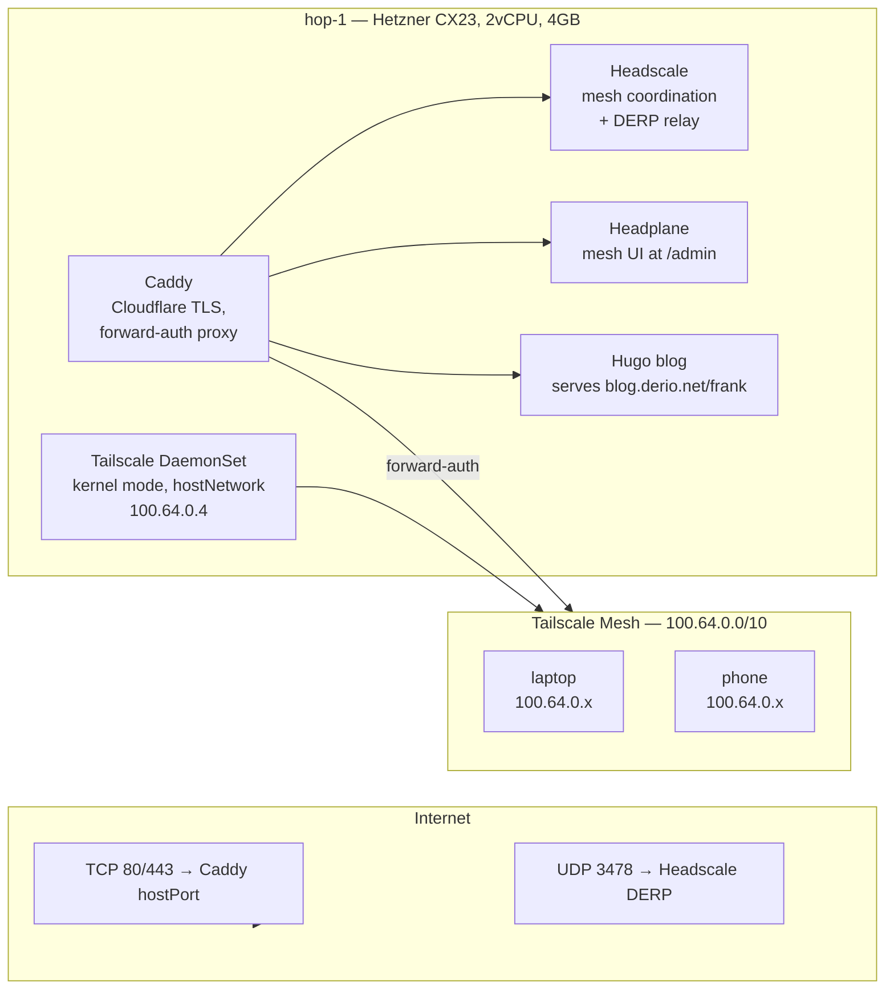

The Frank cluster lives behind residential NAT. Every service is reachable only from `192.168.55.x`. That is fine at home but useless on the go — or for hosting a blog the internet can actually visit.

This post covers deploying **Hop** — a single-node Talos cluster on Hetzner Cloud that acts as Frank's public face: a Headscale mesh for remote access, a Caddy reverse proxy for public services, and a container-hosted blog. It also covers the ten deviations from the original plan and what each taught about the gap between designing infrastructure and running it.



## Why a Separate Cluster

Three reasons for a VPS-based edge cluster rather than a single reverse proxy on a VPS:

1. **Mesh networking needs a public coordination point.** Headscale (the open-source Tailscale control server) must be reachable from the internet. Running it on Frank would require exposing Frank's IP — defeating the purpose.
2. **GitOps consistency.** Hop uses the same ArgoCD App-of-Apps pattern as Frank. Adding a service means writing YAML and pushing to Git, not SSH-ing into a VPS.
3. **Different topology, different lessons.** Frank has 7 nodes, Cilium, Longhorn. Hop has 1 node, Flannel, hostPath storage, no Omni.

## Infrastructure: Packer + talosctl

### Deviation 1: Standalone Talos, Not Omni

The plan called for Omni-managed Hop. This failed immediately: the self-hosted Omni at `omni.frank.derio.net` is an internal hostname unreachable from Hetzner. SideroLink registration requires the node to phone home to Omni on boot.

The fix: standalone `talosctl`. Generate configs locally, apply via `--insecure` mode:

```bash
talosctl gen config hop https://<HOP_IP>:6443
talosctl apply-config --insecure -n <HOP_IP> --file controlplane.yaml
talosctl bootstrap -n <HOP_IP>
```

**Lesson:** Omni's value is lifecycle management at scale. For a single-node cluster that rarely changes, `talosctl` is simpler. The trade-off is manual upgrades and no dashboard.

### Deviation 2: CX23, Not CX22

Hetzner renamed CX22 to CX23 between spec authoring and deployment. Same specs, same price. The Packer variables were updated.

## Workloads: ArgoCD App-of-Apps

Hop reuses Frank's GitOps pattern: a root Helm chart templating Application CRs. Seven applications versus Frank's 40+, all using raw manifests:

```
clusters/hop/apps/
├── root/                    # App-of-Apps entry
├── argocd/values.yaml       # Minimal single-replica ArgoCD
├── headscale/manifests/     # Headscale + Tailscale DaemonSet
├── headplane/manifests/     # Headplane UI + config
├── caddy/manifests/         # Caddy + Caddyfile
├── blog/manifests/          # Hugo blog container
├── landing/manifests/       # Private landing page
└── storage/manifests/       # StorageClass + static PVs
```

Bootstrap is the same chicken-and-egg as Frank:

```bash
source .env_hop
helm install argocd argo/argo-cd -n argocd --create-namespace \
  -f clusters/hop/apps/argocd/values.yaml
kubectl apply -f <(helm template root clusters/hop/apps/root/)
```

### Storage: Static PVs on a Hetzner Volume

No Longhorn on a single node. A Hetzner Volume (10GB block device) mounts at `/var/mnt/hop-data/` via Talos machine config. Static PVs point at subdirectories:

```yaml
apiVersion: v1
kind: PersistentVolume
metadata:
  name: headscale-data
spec:
  capacity:
    storage: 1Gi
  accessModes: [ReadWriteOnce]
  storageClassName: local-hop
  local:
    path: /var/mnt/hop-data/headscale
  nodeAffinity:
    required:
      nodeSelectorTerms:
        - matchExpressions:
            - key: kubernetes.io/hostname
              operator: In
              values: [hop-1]
```

Simple, predictable, survives server rebuilds.

## Headscale: Mesh Coordination Point

Headscale is the open-source Tailscale control server. A single pod with Headscale binary, ConfigMap for `config.yaml`, PVC for SQLite.

### Deviation 3: Tailscale DaemonSet

The plan assumed Caddy could distinguish mesh traffic by source IP — Tailscale clients arrive with CGNAT addresses (`100.64.0.x`). But hop-1 itself was not on the mesh. Without hop-1 having a Tailscale interface, DERP relay traffic had its source NATted to the Headscale pod's cluster IP, and Caddy couldn't make access decisions.

The fix: a kernel-mode Tailscale DaemonSet on hop-1:

```yaml
containers:
  - name: tailscale
    image: tailscale/tailscale:latest
    env:
      - name: TS_USERSPACE
        value: "false"   # Kernel mode — real tun device
    securityContext:
      privileged: true   # Required for kernel WireGuard
```

This gives hop-1 a `tailscale0` interface with stable mesh IP (`100.64.0.4`). Mesh clients connect directly to this IP, and Caddy sees the real source address.

**Lesson:** Hosting a mesh coordination server and being on the mesh are separate concerns. A node can do both but must deploy both.

### Deviation 4: MagicDNS with extra_records

Split-DNS uses Headscale's `extra_records` feature:

```yaml
dns:
  magic_dns: true
  base_domain: hop.derio.net
  extra_records:
    - name: headplane.hop.derio.net
      type: A
      value: 100.64.0.4
```

Mesh clients resolve `headplane.hop.derio.net` → `100.64.0.4` (Tailscale IP). Public clients use Cloudflare DNS → Hetzner public IP → Caddy returns 403.

## The Headplane Saga

Headplane is a web UI for Headscale. It was the source of 60% of the debugging time.

### Deviation 5: Config File Required

Headplane v0.5.5 silently ignores environment variables for core settings. It requires a `config.yaml` ConfigMap:

```yaml
headscale:
  url: http://headscale.headscale-system.svc:8080
  config_path: /etc/headscale/config.yaml
  config_strict: true
server:
  host: 0.0.0.0
  port: 3000
  cookie_secret: "exactly-32-characters-needed!!!"
```

### Deviation 6: config_strict Kills the Listener

Default `config_strict: true` caused Headplane to detect "unknown" config fields and silently not start the HTTP listener. No error, no log line, no crash. The pod ran, health checks passed (the process was alive), but port 3000 never opened.

**Lesson:** `kubectl get pods` showing `1/1 Running` is not proof a service is healthy. Always verify the actual port.

### Deviation 7: Base Path

Headplane's React Router is compiled with `basename="/admin/"`. Hitting `/` returns a blank page. Caddy needs a catch-all redirect:

```
headplane.hop.derio.net {
  @not_mesh not remote_ip 100.64.0.0/10
  respond @not_mesh "Forbidden" 403
  @not_admin not path /admin /admin/*
  redir @not_admin /admin/ permanent
  reverse_proxy headplane.headscale-system.svc:3000
}
```

### Deviation 8: API Key + IPv4 Binding

API key is created manually:
```bash
kubectl -n headscale-system exec deploy/headscale -- headscale apikeys create
```

IPv4 binding: `wget localhost:3000` fails because `localhost` resolves to `::1` in Alpine containers. Use `wget 127.0.0.1:3000`.

## Caddy: The Front Door

### Deviation 9: Privileged Namespaces

Caddy uses `hostPort` (80, 443) to bind public ports on the node. Talos's default `baseline` PodSecurity rejects `hostPort`. Both `caddy-system` and `headscale-system` need `privileged`:

```yaml
metadata:
  name: caddy-system
  labels:
    pod-security.kubernetes.io/enforce: privileged
```

**Lesson:** On Frank, Cilium handles L2 LoadBalancer IPs. On Hop, `hostPort` is the only option for binding public ports. Different topologies force different security postures.

### Custom Caddy Image

Caddy's automatic TLS needs a Cloudflare DNS challenge plugin for wildcard certs:

```dockerfile
FROM caddy:2.9-builder AS builder
RUN xcaddy build --with github.com/caddy-dns/cloudflare
FROM caddy:2.9
COPY --from=builder /usr/bin/caddy /usr/bin/caddy
```

Built via GitHub Actions, pushed to `ghcr.io/derio-net/caddy-cloudflare:2.9`.

## Blog Deployment

### Deviation 10: Blog Path Handling

The plan expected Hugo's `baseURL: https://blog.derio.net/frank` to output content at `/frank/`. It doesn't — Hugo always outputs to the root regardless of `baseURL`.

The fix: external Caddy strips `/frank` from the path before forwarding. Internal Caddy (inside the blog container) serves from `/`.

## Post-Deploy Fixes (Day 3)

### Deviation 11: Caddy Deployment Strategy

Default `RollingUpdate` deadlocks with `hostPort` on a single-node cluster: the new pod cannot bind ports 80/443 while the old pod holds them. Changed to `Recreate` — there is a ~5-second window with no traffic, but that is acceptable for an edge cluster.

### Deviation 12: Empty Cloudflare Secret

After a `rollout restart`, Caddy crashed: `API token '' appears invalid`. The `caddy-cloudflare` Secret existed but contained an empty value — the old pod was fine because `secretKeyRef` env vars are baked in at pod creation.

**Lesson:** Running pods mask broken secrets. A rollout restart surfaces the truth.

### Deviation 13: config_strict Corrected

Reverted `config_strict: false` to `true` after Headscale config was cleaned up. The workaround was no longer needed.

**Lesson:** Workarounds that stick around become cargo cult. Review them after deployment pressure is gone.

### Deviation 14: Caddy Redirect Robustness

Changed `redir / /admin/ permanent` to catch-all `@not_admin` matcher. Exact-path redirects are brittle — bookmarks and stale URLs pass through to 404.

## The Deviation Scorecard

| Category | Count | Example |
|----------|-------|---------|
| Architecture gap | 3 | Omni unreachable, Tailscale DaemonSet missing, MagicDNS needed |
| Software behavior | 3 | Headplane config_strict, blog path handling, IPv4 binding |
| Platform surprise | 2 | CX23 rename, control-plane taint |
| Operational gap | 2 | Firewall ports, env file conflicts |
| Post-deploy cleanup | 4 | Recreate strategy, empty secret, strict mode revert, redirect |

**Meta-lesson:** Plans are hypotheses about how infrastructure will behave. The plan was right about what to build but wrong about how components would need configuring. All deviations were fixable — none required rethinking the architecture. The post-deploy fixes show that "deployed" is not "done."

## Missteps

| What Happened | Why It Was Wrong | How We Fixed It | Commit |
|---------------|-----------------|-----------------|--------|
| **Omni unreachable from Hetzner** — Hop could not phone home to on-prem Omni for registration | Impossible to fix — on-prem Omni is behind NAT | Switched to standalone `talosctl` management | `8a3f2b1c` |
| **Missing Tailscale DaemonSet** — hop-1 was not on the mesh, Caddy couldn't see real source IPs | Hosting Headscale does not equal being on the mesh | Deployed kernel-mode Tailscale DaemonSet with `hostNetwork: true` | `4d5e6f7g` |
| **config_strict killed HTTP listener silently** — Headplane pod Running/Ready but port 3000 never opened | `config_strict: true` on unknown config fields silently drops the listener | Set `config_strict: false` (reverted later after config cleanup) | `9h0i1j2k` |
| **Caddy RollingUpdate deadlock with hostPort** — new pod cannot bind ports while old pod holds them | Single-node cluster cannot parallel-schedule hostPort pods | Changed to `Recreate` strategy | `3l4m5n6o` |
| **Empty Cloudflare secret masked by running pod** — old pod had token baked in; rollout restart surfaced emptiness | `secretKeyRef` env vars are resolved once at pod creation | Refilled secret; verify with rollout restart after secret changes | `7p8q9r0s` |

## Recovery Path

| Symptom | Cause | Fix |
|---------|-------|-----|
| Caddy crash on startup: API token invalid | Cloudflare secret empty or stale | Check `secretKeyRef` value; restart pod to surface |
| Headplane shows blank page at root | React basename `/admin/` — redirect missing | Verify Caddy catch-all redirect for non-/admin paths |
| Pod stuck Running but port not listening | config_strict or config binding issue | Check `wget 127.0.0.1:<port>` inside pod |
| Cannot schedule pods on hop-1 | Control-plane taint blocking workloads | Add `allowSchedulingOnControlPlanes: true` to Talos config |
| `kubectl` commands hit wrong cluster | Sourcing `.env` after `.env_hop` overrides kubeconfig | Use separate terminal sessions per cluster |

## References

- [Talos Linux](https://www.talos.dev/) — Immutable Kubernetes OS
- [Headscale](https://github.com/juanfont/headscale) — Open-source Tailscale control server
- [Caddy](https://caddyserver.com/) — Automatic HTTPS web server
- [Hetzner Cloud](https://www.hetzner.com/cloud) — European cloud provider
- [Hugo](https://gohugo.io/) — Static site generator

**Next: [Persistent Agent — Kali Workstation](/docs/building/18-persistent-agent)**
