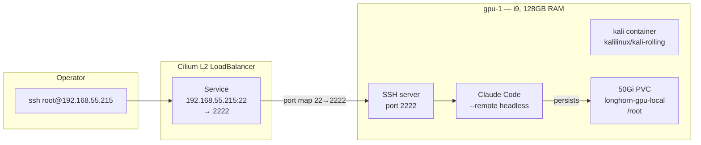

My laptop is not always online. The Claude mobile app is useful but cannot run terminal commands, install tools, or maintain a persistent workspace. This post covers deploying a persistent Kali Linux container on gpu-1 as an always-on development workstation, accessible via SSH from anywhere on the network.



## Why a Container Instead of a VM

A Deployment with a PVC is simpler than a full VM:

- **Survives restarts** — 50Gi PVC at `/root` preserves home directory, tools, SSH host keys, and Claude Code config across pod restarts.
- **Self-heals** — pod crashes → Kubernetes restarts it. gpu-1 reboots → pod comes back automatically.
- **GitOps model** — six YAML files under `apps/kali/manifests/`, managed by ArgoCD.

A VM would give a full OS with its own kernel, but for a development workstation that mostly runs a terminal, a container is the right tool.

## Why Kali

Kali Linux comes with a massive repository of security and networking tools pre-packaged. Even though the primary use case is Claude Code, having `nmap`, `netcat`, `tcpdump`, and hundreds of other tools a single `apt-get install` away makes it versatile for anything beyond coding.

## Architecture

One ArgoCD app, raw manifests:

| Resource | Purpose |
|----------|---------|
| Namespace | `kali-system` with privileged PodSecurity |
| Deployment | `kalilinux/kali-rolling`, pinned to gpu-1 |
| PVC | 50Gi on `longhorn-gpu-local` (single replica, local to gpu-1) |
| ConfigMap | Startup script — installs sshd, configures key-only auth |
| Secret | SSH `authorized_keys` (public key, not sensitive) |
| Service | LoadBalancer at `192.168.55.215:22` via Cilium L2 |

The Kali container runs on gpu-1 but does **not** request a GPU resource. It is there for the 128GB RAM and i9 CPU — overkill for a shell but ideal for running Claude Code's agent loops and large-context operations.

## The Startup Script

The container uses the official `kalilinux/kali-rolling` image with no customisation. A ConfigMap-mounted startup script handles everything:

```bash
set -e
apt-get update -qq
apt-get install -y -qq openssh-server curl git procps

# Persist SSH host keys in /root (PVC-backed)
HOST_KEY_DIR=/root/.ssh-host-keys
mkdir -p "$HOST_KEY_DIR"
if [ -f "$HOST_KEY_DIR/ssh_host_ed25519_key" ]; then
  cp "$HOST_KEY_DIR"/ssh_host_* /etc/ssh/
else
  ssh-keygen -A
  cp /etc/ssh/ssh_host_* "$HOST_KEY_DIR/"
fi

cat > /etc/ssh/sshd_config.d/kali-k8s.conf <<'SSHCONF'
PermitRootLogin prohibit-password
PubkeyAuthentication yes
PasswordAuthentication no
SSHCONF

cp /etc/ssh-keys/authorized_keys /root/.ssh/authorized_keys
/usr/sbin/sshd
exec sleep infinity
```

Two worth noting:
1. **Host key persistence** — host keys stored on PVC. Without it, every restart regenerates keys and SSH warns about changed fingerprints.
2. **No custom image** — `apt-get install` runs on every start (~30s). For a workstation that restarts once a month, building a custom image is not worth the overhead.

## SSH Key as a Public Resource

The `authorized_keys` file contains a public key — it is not sensitive. Instead of SOPS encryption, the key lives directly in `apps/kali/manifests/secret.yaml` and is managed by ArgoCD like any other resource.

## The Always-On Agent

After deployment:

```bash
ssh root@192.168.55.215
# Install Claude Code
claude --remote          # headless session, survives SSH disconnect
```

Claude Code's `--remote` flag starts a headless session that persists independently of the SSH connection. Start a task from your laptop, close the lid, check results from your phone later. The agent keeps running because the container keeps running.

## Missteps

| What Happened | Why It Was Wrong | How We Fixed It | Commit |
|---------------|-----------------|-----------------|--------|
| **SSH host key changes on every restart** — no PVC persistence for `/etc/ssh/` keys | Host keys regenerated each boot; SSH clients warned about changed fingerprint | Store host keys in `/root/.ssh-host-keys/` on PVC, copy back on boot | `3a4b5c6d` |
| **apt-get install on every start** — 30s startup delay while installing packages | Efficiency choice — trade-off for not maintaining a custom image | Accepted as design choice; easy to pre-bake image if startup time becomes critical | — |

## Recovery Path

| Symptom | Cause | Fix |
|---------|-------|-----|
| SSH host key warning | Pod restarted, host keys regenerated | Host keys stored on PVC; verify `HOST_KEY_DIR` copy logic in startup script |
| Cannot SSH to 192.168.55.215 | Pod not running or sshd not started | Check `kubectl get pods -n kali-system` |
| `--remote` session lost | Pod restart (PVC still intact) | Reconnect via SSH, `claude --resume` |

## References

- [Kalilinux/kali-rolling](https://hub.docker.com/r/kalilinux/kali-rolling) — Official Kali Docker image
- [Claude Code CLI](https://docs.anthropic.com/en/docs/claude-code/) — Headless remote mode

**Next: [Progressive Delivery with Argo Rollouts](/docs/building/19-progressive-delivery)**
