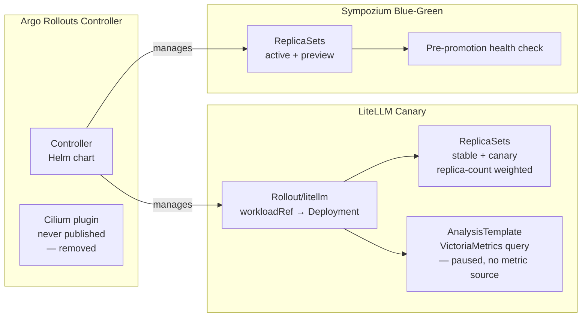
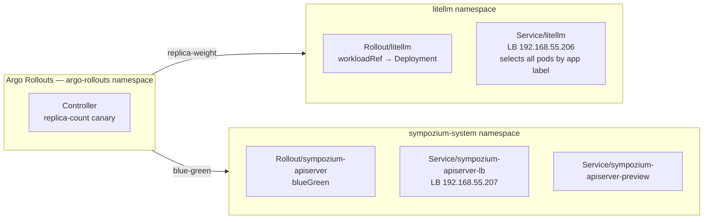

Every previous deployment was a leap of faith. Push YAML, ArgoCD syncs, the old pod dies, the new pod starts. If the new version is broken, you find out when users hit errors. For a homelab that is fine — the "users" are just me. But the whole point of this project is to learn production patterns.

This post adds progressive delivery: gradually shifting traffic to a new version (canary) or running two versions simultaneously and switching atomically (blue-green). And it includes the postmortem of a canary that was deployed for 39 days without ever running — and the remediation cascade that uncovered four more latent bugs.



## Architecture



## Phase 1: Controller Install

Standard Helm chart from the Argo project:

```yaml
# apps/argo-rollouts/values.yaml
controller:
  replicas: 1
dashboard:
  enabled: false
```

Two ArgoCD apps: `argo-rollouts` (Helm chart) and `argo-rollouts-extras` (supplemental RBAC).

### The Cilium Plugin That Never Existed

The original design configured the Cilium traffic-router plugin for L7 traffic splitting. `argoproj-labs/cilium` was **never published as a release artifact** — the download URL returned 404 from day one. The controller crash-looped for 21 days trying to bootstrap it.

The fix was removing the plugin entirely and switching to **replica-count canary**:

```yaml
strategy:
  canary:
    steps:
      - setWeight: 20
      - pause: {}
      - setWeight: 50
      - pause: {}
```

With `replicas: 5`, `setWeight: 20` rounds to 1 canary + 4 stable. The Service selects pods by app label — both stable and canary ReplicaSets inherit those labels from the Deployment template. kube-proxy round-robins across the union, weighted by pod count.

## Phase 2: LiteLLM Canary

### The workloadRef Pattern

LiteLLM is deployed via a Helm chart that owns its `Deployment`. Rather than forking the chart, a `Rollout` object references the chart's Deployment by name. The controller reads the pod template, scales the Deployment to 0, and takes over pod management. The Helm chart stays the source of truth for application config.

### Image Tag Pinning

Original values used `tag: main-stable` with `pullPolicy: Always` — non-deterministic canary. Pinning to a specific tag makes each version change explicit.

### Canary Steps

```yaml
strategy:
  canary:
    stableService: litellm
    steps:
      - setWeight: 20
      - pause: {}
      - setWeight: 50
      - pause: {}
```

Each `pause: {}` waits for manual promotion — intentional for a homelab with sparse traffic. The AnalysisTemplate steps (VictoriaMetrics error-rate queries) were initially included but later removed; the metric source did not exist on this cluster (see postmortem).

### ArgoCD Integration

The `workloadRef` pattern needs `ignoreDifferences` on `spec.replicas` — otherwise ArgoCD fights the Rollout controller:

```yaml
ignoreDifferences:
  - group: apps
    kind: Deployment
    name: litellm
    namespace: litellm
    jsonPointers:
      - /spec/replicas
```

Also needed for blue-green service selectors — the Rollout controller adds `rollouts-pod-template-hash` labels:

```yaml
ignoreDifferences:
  - group: ""
    kind: Service
    name: sympozium-apiserver-lb
    namespace: sympozium-system
    jsonPointers:
      - /spec/selector
```

## Phase 3: Sympozium Blue-Green

Sympozium's API server is stateless — persistent state lives in NATS JetStream. The web UI pod serves on port 8080 with no local storage, making it an ideal blue-green candidate.

```yaml
strategy:
  blueGreen:
    activeService: sympozium-apiserver-lb
    previewService: sympozium-apiserver-preview
    autoPromotionEnabled: false
    prePromotionAnalysis:
      templates:
        - templateName: sympozium-health
```

The controller starts the green stack, runs pre-promotion health analysis (HTTP GET on `/healthz`), then waits for manual promotion.

## Operating Rollouts

### Canary (LiteLLM)

```bash
kubectl argo rollouts get rollout litellm -n litellm --watch
kubectl argo rollouts promote litellm -n litellm           # advance past pause
kubectl argo rollouts abort litellm -n litellm             # roll back to stable
kubectl argo rollouts promote litellm -n litellm --full    # skip to 100%
```

### Blue-Green (Sympozium)

```bash
kubectl argo rollouts get rollout sympozium-apiserver -n sympozium-system --watch
kubectl argo rollouts promote sympozium-apiserver -n sympozium-system
kubectl argo rollouts abort sympozium-apiserver -n sympozium-system
```

## Postmortem: The Canary That Wasn't

The post was published 2026-03-27. On 2026-05-04, we tried to use the canary for the first time. Pre-flight returned:

```
Status:          ◌ Progressing
Message:         waiting for rollout spec update to be observed
  Step:          0/6
  SetWeight:     20
  ActualWeight:  0
```

The operating companion post had this **exact** output as a sample of normal state. We had documented the failure mode as the happy path for 39 days.

### What was happening

- `argoproj-labs/cilium` was never published. The plugin URL returned 404. Always had.
- The controller crash-looped for 21 days trying to bootstrap it. We fixed that on 2026-04-30 by removing the plugin config — but never removed the `trafficRouting.plugins.argoproj-labs/cilium: {}` ref from the Rollout spec.
- The canary stalled at Step 0 with `unable to find plugin` — 10,957 retries by discovery time.
- The Helm Deployment kept running its single pod normally. LiteLLM served traffic the entire time via the standard Deployment controller.
- ArgoCD reported `Synced/Healthy` — its contract ("manifests in git are applied") was satisfied. The Rollout existed. The Deployment existed. The fact that the controller could not actually use the Rollout was outside ArgoCD's awareness.

### Why nothing failed loudly

1. **ArgoCD** — Synced and Healthy. Cannot measure workflows, only manifests.
2. **Pod liveness** — a LiteLLM pod was always running. Consumers got responses.
3. **`kubectl argo rollouts get`** — returned `Progressing` with `Step: 0/6`. That is how a healthy Rollout idles between deploys. The error was in the controller pod's logs, not in any object's `.status`.

### The remediation cascade (4 more bugs)

Fixing the plugin exposed four additional bugs, each masked by the previous:

1. **Over-broad canary Service selector** (caught in code review) — `service-canary.yaml` selected all litellm pods, not just canary ones. Would have double-counted traffic if the L7 design had worked.
2. **`workloadRef.scaleDown` defaults to `never`** — the Rollout never scaled the Helm Deployment to 0. Six pods ran instead of five. The field `workloadRef.scaleDown: onsuccess` was missing.
3. **AnalysisTemplate query only caught 5xx errors** — `status=~"5.."` missed all 4xx errors. A canary serving 100% 4xx would evaluate as 0% error and be auto-promoted as healthy.
4. **The metric source does not exist** — `litellm_request_total` was never exposed. OSS LiteLLM has no `/metrics` endpoint (Enterprise feature). The AnalysisRun panicked on empty result vector.

The fix: pause-only canary with no metric-gating until a real signal source lands. The replica-count approach completed two end-to-end round-trips after these fixes.

### The lesson: declarative is not tested

Three independent green lights, two blog posts, one runbook, 39 days. The mistake was declaring the layer Deployed without ever exercising the workflow. The corrective:

1. Do not mark a layer Deployed until the workflow has been triggered end-to-end.
2. Treat the operating runbook as a test plan.
3. Sample outputs in docs come from real runs, not expected shape.

## Missteps

| What Happened | Why It Was Wrong | How We Fixed It | Commit |
|---------------|-----------------|-----------------|--------|
| **Cilium traffic-router plugin never existed** — download URL returned 404; controller crash-looped for 21 days | Plugin was never published as a release artifact; we configured it from docs without verifying | Removed plugin; switched to replica-count canary | `b3f86231` |
| **`workloadRef.scaleDown` defaulted to `never`** — Helm Deployment stayed at 1 replica alongside Rollout-managed pods | Field defaults to `never`; we assumed `onsuccess` | Added `workloadRef.scaleDown: onsuccess` | PR #214 |
| **AnalysisTemplate query only caught 5xx** — `status=~"5.."` missed all 4xx errors | Original query filtered for 5xx only; 4xx would be silently green-lit | Changed query to `status!~"2..` or `3.."` | PR #216 |
| **Metric source did not exist** — `litellm_request_total` was never exposed; OSS LiteLLM has no `/metrics` | Wrote AnalysisTemplate against nonexistent metric endpoint | Removed analysis steps; pause-only canary | PR #217 |
| **Documented failure mode as happy path** — operating post showed stuck canary output as normal | Never exercised the workflow end-to-end before publishing | Rewrote runbook with real captured output | — |

## Recovery Path

| Symptom | Cause | Fix |
|---------|-------|-----|
| Rollout stuck Step 0/6 with Progressing | Traffic router plugin missing or misconfigured | Remove `trafficRouting` config; use replica-count canary |
| Rollout shows Degraded, canary aborted | AnalysisRun failed — metric source missing or query wrong | Check VictoriaMetrics for metric existence; switch to pause-only |
| Helm Deployment not scaling to 0 | `workloadRef.scaleDown` missing or set to `never` | Add `workloadRef.scaleDown: onsuccess` to Rollout spec |
| ArgoCD fighting Rollout over replicas | Missing `ignoreDifferences` on `spec.replicas` | Add jsonPointer `/spec/replicas` to Application's ignoreDifferences |
| Blue-green service not routing correctly | Rollout controller modifies selector; ArgoCD reverts it | Add `ignoreDifferences` on service `spec.selector` + `RespectIgnoreDifferences=true` |

## References

- [Argo Rollouts documentation](https://argoproj.github.io/argo-rollouts/) — Canary, blue-green, analysis
- [workloadRef feature](https://argoproj.github.io/argo-rollouts/features/workload-references/) — Helm chart compatibility
- [AnalysisTemplate spec](https://argoproj.github.io/argo-rollouts/features/analysis/) — Metric-gated promotion

**Next: [Workflow Automation with n8n](/docs/building/20-workflow-automation)**
