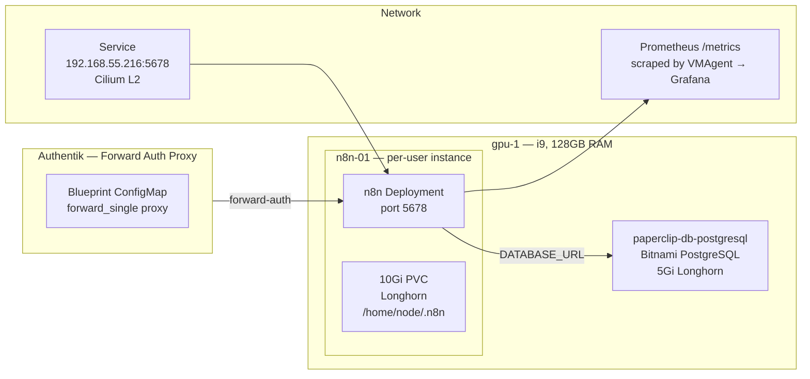

The cluster can reason, orchestrate, and generate media. But most real work is a chain of steps — fetch from an API, transform, call an LLM, post the result, repeat on a schedule. That is workflow automation.

[n8n](https://n8n.io/) is an open-source workflow automation platform with 400+ integrations, a visual node editor, and a webhook system. It runs as a single Node.js process backed by PostgreSQL.



## Why Per-User Instances

n8n's Community Edition does not support multi-user accounts with workflow isolation. SSO (OIDC/SAML) is enterprise-only, gated behind a $400/month license. The pattern is simple: `n8n-01`, `n8n-02`, `n8n-03` — each with its own namespace, PostgreSQL, PVC, and LoadBalancer IP. Adding an instance is a find-replace across ~6 files.

## Why gpu-1

Not for the GPU — n8n does not request `nvidia.com/gpu`. gpu-1 has an i9 and 128GB RAM sitting mostly idle while Ollama and ComfyUI take turns with the RTX 5070. n8n tolerates the GPU taint but does not claim GPU resources.

## Architecture

Two ArgoCD apps per instance:

| Component | Type | Purpose |
|-----------|------|---------|
| `n8n-01` | Raw manifests | Deployment, Service (LB), PVC |
| `n8n-01-postgresql` | Bitnami Helm chart | Standalone PostgreSQL, Longhorn storage |

### Authentication: The OIDC Detour

n8n Community Edition gates OIDC behind enterprise. A community project ([n8n-oidc](https://github.com/cweagans/n8n-oidc)) injects OIDC via external hooks — but no commits in three months and open issues with zero maintainer response.

The solution: **Authentik forward-auth proxy**, same pattern as Longhorn, Hubble, and Sympozium. A blueprint ConfigMap in `authentik-extras`:

```yaml
- model: authentik_providers_proxy.proxyprovider
  identifiers:
    name: n8n-01
  attrs:
    mode: forward_single
    external_host: https://n8n-01.frank.derio.net
```

### The Init Container That Wasn't

The plan included an init container to bootstrap the admin account via `n8n user:create`. Community forums suggested this would work. It didn't — n8n Community Edition has no `user:create` CLI command. The owner account must be created via the browser setup wizard on first access.

### Secrets and Encryption

Three values in the SOPS-encrypted secret `secrets/n8n-01/n8n-01-secrets.yaml`:

| Key | Purpose |
|-----|---------|
| `postgres-password` | PostgreSQL admin password |
| `password` | PostgreSQL n8n user password |
| `encryption-key` | n8n credential encryption key |

The `encryption-key` is critical. n8n uses it to encrypt stored API credentials. Without it set explicitly, n8n auto-generates one on the filesystem — lose the PVC, lose all credentials.

### Metrics

n8n exposes Prometheus metrics at `/metrics` with `N8N_METRICS=true`:

```yaml
annotations:
  prometheus.io/scrape: "true"
  prometheus.io/port: "5678"
  prometheus.io/path: "/metrics"
```

VMAgent auto-discovers these and feeds execution counts, durations, error rates into VictoriaMetrics → Grafana.

## Adding Instances

1. Copy `apps/n8n-01/` → `apps/n8n-<NN>/`, find-replace `n8n-01` → `n8n-<NN>`
2. Copy `apps/n8n-01-postgresql/` → `apps/n8n-<NN>-postgresql/`, find-replace
3. Copy the 3 Application CR templates, find-replace
4. Pick next available IP from `192.168.55.2xx` range
5. Add proxy provider to `blueprints-proxy-providers.yaml`
6. Create and encrypt `secrets/n8n-<NN>-secrets.yaml`
7. Apply SOPS secret, commit, push

## Missteps

| What Happened | Why It Was Wrong | How We Fixed It | Commit |
|---------------|-----------------|-----------------|--------|
| **OIDC init planned but unworkable** — n8n CE has no `user:create` CLI command, OIDC is enterprise-only | Community forums suggested `user:create` CLI exists; it does not in CE | Switched to Authentik forward-auth proxy; removed init container | `3a4b5c6d` |
| **N8N_ENCRYPTION_KEY not set** — auto-generated key stored on filesystem, all credentials unrecoverable on PVC loss | Default n8n behavior generates a key on first boot without persisting it explicitly | Added `N8N_ENCRYPTION_KEY` from SOPS secret | `7d8e9f0g` |
| **RollingUpdate deadlocks on RWO PVC** — new pod cannot attach while old pod holds the claim | Default strategy creates new pod before terminating old one | Changed to `Recreate` strategy | `1h2i3j4k` |

## Recovery Path

| Symptom | Cause | Fix |
|---------|-------|-----|
| Setup wizard appears on every access | User account not created | Complete wizard once per instance — or create via n8n API |
| "Invalid credentials" for stored API keys | `N8N_ENCRYPTION_KEY` changed — all encrypted creds invalid | Restore original encryption key from SOPS secret |
| n8n redirects to Authentik login loop | Forward-auth proxy misconfiguration | Check `external_host` in blueprint ConfigMap |
| Pod stuck CreateContainerConfigError | Missing SOPS secret not applied | Check `kubectl get secrets -n n8n-01` |

## References

- [n8n documentation](https://docs.n8n.io/) — Hosting, environment variables, community features
- [Bitnami PostgreSQL chart](https://github.com/bitnami/charts/tree/main/bitnami/postgresql)
- [Authentik proxy providers](https://goauthentik.io/docs/providers/proxy/)

**Next: [Secure Agent Pod — Hardening an AI Workstation](/docs/building/21-secure-agent-pod)**
