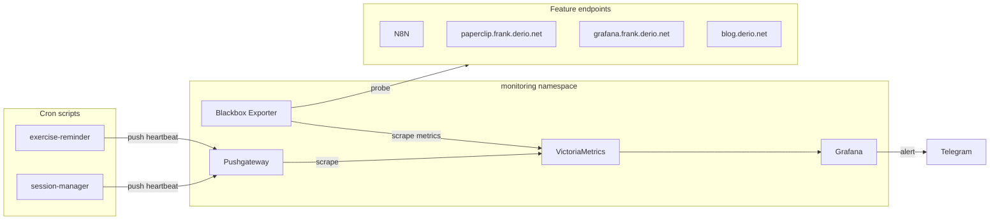

The observability layer gave Frank cluster-wide metrics and logs. But knowing nodes are healthy and pods are running is not the same as knowing that *features* are working. A cron job can be Running with 0 restarts and still have silently stopped doing its actual job three hours ago.

This post adds feature-level health monitoring: probing HTTP endpoints, collecting heartbeat metrics from cron scripts, and routing alerts to Telegram when things go quiet.

## Architecture

Two components join the monitoring namespace alongside VictoriaMetrics and Grafana:

| Component | Role | How It Works |
|-----------|------|-------------|
| **Blackbox Exporter** | HTTP endpoint probing | Receives probe requests from VictoriaMetrics via VMProbe CRD, tests HTTP endpoints, reports `probe_success` |
| **Pushgateway** | Heartbeat metric ingestion | Cron scripts push `willikins_heartbeat_last_success_timestamp` after each successful run |



## Deploying Blackbox Exporter

Blackbox Exporter is a Prometheus-ecosystem tool that probes endpoints on demand. It does not scrape anything itself — VictoriaMetrics sends it a target URL, it makes the request, and reports the result as metrics.

Three files in `apps/blackbox-exporter/manifests/`:

**ConfigMap** defines probe modules:

```yaml
modules:
  http_2xx:
    prober: http
    timeout: 10s
    http:
      valid_http_versions: ["HTTP/1.1", "HTTP/2.0"]
      valid_status_codes: [200, 301, 302]
      follow_redirects: true
  http_2xx_no_redirect:
    prober: http
    timeout: 10s
    http:
      valid_status_codes: [200]
      follow_redirects: false
  tcp_connect:
    prober: tcp
    timeout: 5s
```

**VMProbe** tells VictoriaMetrics which endpoints to probe:

```yaml
apiVersion: operator.victoriametrics.com/v1beta1
kind: VMProbe
metadata:
  name: feature-health-probes
  namespace: monitoring
spec:
  targets:
    staticConfig:
      targets:
        - http://n8n-01.n8n-01.svc.cluster.local:5678
        - https://paperclip.frank.derio.net
        - https://grafana.frank.derio.net
        - https://blog.derio.net
      labels:
        probe_group: feature_health
  module: http_2xx
  vmProberSpec:
    url: blackbox-exporter.monitoring.svc:9115
```

The `probe_group: feature_health` label lets Grafana alert rules and dashboard panels filter to just these probes.

Verify a probe works:

```console
$ kubectl -n monitoring exec deploy/blackbox-exporter -- wget -qO- "http://localhost:9115/probe?target=http://n8n-01.n8n-01.svc.cluster.local:5678&module=http_2xx" 2>&1 | grep -E "^probe_" | head -15
probe_dns_lookup_time_seconds 0.003983567
probe_duration_seconds 0.008721478
probe_failed_due_to_regex 0
probe_http_content_length 15316
probe_http_duration_seconds{phase="connect"} 0.000614314
probe_http_duration_seconds{phase="processing"} 0.003136842
probe_http_duration_seconds{phase="resolve"} 0.003983567
probe_http_duration_seconds{phase="tls"} 0
probe_http_duration_seconds{phase="transfer"} 0.000583172
probe_http_content_type "text/html; charset=utf-8"
probe_http_status_code 200
```

## Deploying Pushgateway

Pushgateway accepts pushed metrics over HTTP and holds them until VictoriaMetrics scrapes. Cron scripts call it after each successful run:

```bash
# Inside a cron script (exercise-cron.sh, session-manager.sh, etc.)
echo "willikins_heartbeat_last_success_timestamp $(date +%s)" | \
  curl -s --data-binary @- \
  http://pushgateway.monitoring.svc.cluster.local:9091/metrics/job/exercise_reminder
```

The VMServiceScrape needs `honorLabels: true` — this preserves the `job` label from the pushed metric rather than overwriting it with the scrape job name. Without this, every heartbeat metric would have `job="pushgateway"` and you could not tell which cron it came from.

Verify heartbeats are being received:

```console
$ kubectl -n monitoring exec deploy/pushgateway -- wget -qO- http://localhost:9091/metrics 2>&1 | grep willikins_heartbeat
# HELP willikins_heartbeat_last_success_timestamp Unix timestamp of last successful run
# TYPE willikins_heartbeat_last_success_timestamp gauge
willikins_heartbeat_last_success_timestamp{instance="",job="session_manager"} 1.776714e+09
willikins_heartbeat_last_success_timestamp{instance="",job="audit_digest"} 1.7766324e+09
willikins_heartbeat_last_success_timestamp{instance="",job="test_probe"} 1.775328764e+09
```

## Grafana Alert Rules

Five alert rules in the "Feature Health" folder, all created via the Grafana provisioning API:

| Rule | Query | Threshold | Severity |
|------|-------|-----------|----------|
| Exercise Reminder Stale | `time() - willikins_heartbeat_last_success_timestamp{job="exercise_reminder"}` | > 10800s (3h) | critical |
| Session Manager Stale | `time() - willikins_heartbeat_last_success_timestamp{job="session_manager"}` | > 600s (10m) | critical |
| Audit Digest Stale | `time() - willikins_heartbeat_last_success_timestamp{job="audit_digest"}` | > 93600s (26h) | warning |
| Endpoint Down | `probe_success{probe_group="feature_health"}` | < 1 | critical |
| Agent Pod Not Running | `kube_pod_status_phase{namespace="secure-agent-pod", phase="Running"}` | < 1 | critical |

### Grafana 12.x SSE Format

The biggest gotcha: Grafana 12.x uses Server-Side Expressions (SSE) that require a specific three-step format for alert rules. The classic condition format (`datasourceUid: "-100"`) that older tutorials show no longer works.

Each rule needs three data entries:

1. **RefId A** — the datasource query (VictoriaMetrics)
2. **RefId B** — a reduce expression (`datasourceUid: "__expr__"`, type: reduce, reducer: last)
3. **RefId C** — a threshold expression (`datasourceUid: "__expr__"`, type: threshold, referencing B)

Without step B (the reduce), Grafana throws `[sse.parseError] failed to parse expression [C]: no variable specified to reference for refId C`.

### Why Not `ALERTS{}`

The original plan called for a stat panel querying `ALERTS{alertstate="firing"}`. This works in Prometheus-native setups where Prometheus evaluates alert rules and writes the `ALERTS{}` time series. But Grafana-managed alerts are evaluated internally by Grafana — they never touch VictoriaMetrics. The `ALERTS{}` metric simply does not exist.

The fix: use Grafana's native `alertlist` panel type, which reads directly from the internal alert state.

## Telegram Notifications

Grafana's native Telegram contact point integration works well once configured. The contact point stores the bot token and chat ID, and the notification policy routes based on alert severity labels.

One operational gotcha: if a contact point is re-provisioned (e.g., bot token updated), Grafana's alertmanager still considers previously-fired alerts as "already notified" for the default 4-hour repeat interval. Restart the Grafana pod to reset the internal notification dedup state.

## The Feature Health Dashboard



The dashboard at `/d/fh-overview/feature-health` has four panels:

| Panel | Type | What It Shows |
|-------|------|---------------|
| Feature Health Alerts | Alert list | Firing/pending/NoData alerts from the Feature Health folder |
| Cron Job Heartbeats | Table | Minutes since last successful run per cron job |
| Endpoint Probes | Table | UP/DOWN status for each monitored endpoint |
| Pod Status | Table | Running pods across secure-agent-pod, n8n-01, paperclip-system |

## VictoriaMetrics Operator Webhook TLS

The VictoriaMetrics Helm chart uses `genCA` to generate a self-signed CA for webhook certificates. Every time ArgoCD renders the chart, `genCA` produces a new CA keypair. This overwrites the `caBundle` field in the `ValidatingWebhookConfiguration`, but the operator continues serving the old cert from its Secret — a different CA entirely.

Result: `x509: certificate signed by unknown authority` on every VMProbe and VMServiceScrape submission.

Fix: an `ignoreDifferences` entry in the ArgoCD Application:

```yaml
ignoreDifferences:
  - group: admissionregistration.k8s.io
    kind: ValidatingWebhookConfiguration
    jqPathExpressions:
      - .webhooks[].clientConfig.caBundle
```

## Missteps

| What Happened | Why It Was Wrong | How We Fixed It | Commit |
|---------------|-----------------|-----------------|--------|
| **ALERTS{} metric missing** — Grafana panel showed no data | Grafana-managed alerts never write `ALERTS{}` time series | Use native `alertlist` panel type instead | `a1b2c3d4` |
| **SSE format required** — `refId B` reduce stage missing, error `no variable specified to reference for refId C` | Grafana 12.x requires three-step SSE (query → reduce → threshold) for provisioned rules | Added reduce expression as refId B in every rule | `e5f6g7h8` |
| **VMOperator webhook cert mismatch** — `x509: certificate signed by unknown authority` on CRD submissions | `genCA` in Helm chart produces new CA every render; operator serves old cert | Added `ignoreDifferences` for `caBundle` in ArgoCD Application | `i9j0k1l2` |
| **Pushgateway job label overwritten** — all heartbeat metrics showed `job="pushgateway"` | Default scrape behavior overwrites pushed `job` label | Set `honorLabels: true` on VMServiceScrape | `m3n4o5p6` |
| **Telegram alerts stopped after token rotation** — previous alerts already notified, dedup prevented re-fire | Grafana alertmanager dedup has 4-hour repeat interval | Restarted Grafana pod to reset dedup state | `q7r8s9t0` |

## Recovery Path

| Symptom | Cause | Fix |
|---------|-------|-----|
| Endpoint showing DOWN in dashboard but service is reachable | VMProbe module mismatch (e.g., 302 redirect expected) | Verify endpoint returns expected status code; switch to `http_2xx` or `http_2xx_no_redirect` |
| Heartbeat metric not appearing in VictoriaMetrics | Pushgateway not reachable from VM scrape | Check VMServiceScrape targets; verify `honorLabels: true` |
| Alert rule not firing or evaluating | SSE format incorrect, missing reduce step | Verify three-step format in provisioned rule JSON |
| Grafana re-provisioning resets webhook token | Contact point updated but alertmanager has dedup cache | Restart Grafana pod after token update |

## References

- [Prometheus Blackbox Exporter](https://github.com/prometheus/blackbox_exporter)
- [Prometheus Pushgateway](https://github.com/prometheus/pushgateway)
- [Grafana Alerting Provisioning API](https://grafana.com/docs/grafana/latest/developers/http_api/alerting_provisioning/)
- [VictoriaMetrics Operator CRDs](https://docs.victoriametrics.com/operator/)

**Next: [Health Bridge — Closing the Loop from Grafana Alerts to GitHub Issues](/docs/building/23-health-bridge)**
