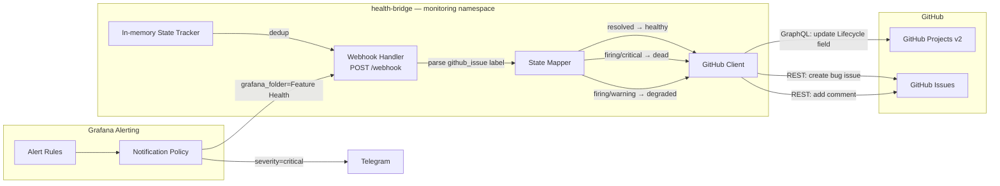

The previous post added feature-level health monitoring — Blackbox probes, Pushgateway heartbeats, and Grafana alerts to Telegram. But alerts only tell you something is wrong. They do not update the project board, track which features are degraded, or create bug tickets when things die.

This post delivers the final piece: a bridge service that maps Grafana alerts to GitHub Project lifecycle states. When an alert fires, the feature's Issue on the project board moves from `healthy` to `degraded` or `dead`. When it resolves, it moves back. No manual triage.

## The Problem

Frank's monitoring stack already knows when features break. Grafana alert rules watch for stale heartbeats, failed probes, and missing pods. Telegram notifications arrive within minutes.

But the project board — a GitHub Projects v2 board with a custom "Lifecycle" field — still requires manual updates. Someone has to see the Telegram alert, open GitHub, find the right Issue, and change its lifecycle state. That is exactly the kind of toil that should be automated.

## Architecture

A stateless Go HTTP server sits in the monitoring namespace. Grafana's notification policy routes alerts to it via webhook. The bridge parses each alert, extracts the `github_issue` label (e.g., `willikins#11`), maps the alert severity to a lifecycle state, and updates the GitHub Project item via GraphQL.



The mapping is intentionally simple:

| Alert Status | Severity | Lifecycle State |
|-------------|----------|-----------------|
| resolved | any | healthy |
| firing | warning | degraded |
| firing | critical | dead |

On `dead` transitions, the bridge also creates a new bug Issue linked to the feature Issue — an automatic incident record.

## The Service (v0.1.0)

Three Go files, no external dependencies beyond the standard library:

- **`main.go`** — Entry point. Reads config from env vars, creates the bridge, sets up HTTP routes: `POST /webhook`, `GET /healthz`, `GET /readyz`.
- **`bridge.go`** — Core logic: webhook auth (Bearer token), JSON parsing, alert processing, state mapping, comment formatting.
- **`github.go`** — GitHub API client. On startup, loads project metadata via GraphQL (project ID, Lifecycle field ID, option IDs). At runtime, finds the project item for an Issue and updates its Lifecycle field. Uses REST for issue comments and bug issue creation.

### Webhook Authentication

Grafana sends a Bearer token in the Authorization header. The bridge validates it against the `WEBHOOK_SECRET` env var:

```go
authHeader := r.Header.Get("Authorization")
if authHeader != "Bearer "+secret {
    http.Error(w, "unauthorized", http.StatusUnauthorized)
    return
}
```

### Alert-to-Issue Mapping

Each Grafana alert rule carries a `github_issue` label in the format `repo#number`:

| Alert Rule | github_issue |
|-----------|-------------|
| Exercise Reminder Stale | `willikins#11` |
| Session Manager Stale | `willikins#13` |
| Audit Digest Stale | `willikins#12` |
| Agent Pod Not Running | `frank#8` |

The bridge parses this label, finds the corresponding project item, and updates its lifecycle state.

### Issue Comments

Every state transition adds a comment to the GitHub Issue with full context — alert name, severity, summary, timestamp, Grafana link — creating an audit trail directly on the issue.

### Alert Deduplication

Grafana sends a webhook on every alert evaluation cycle (typically every few minutes). Without dedup, a persistently firing alert would create a new bug issue and comment on every cycle.

Two-layer dedup:

1. **In-memory state tracking** — Tracks the last known lifecycle state per issue reference. Comments and bug issues are only created on actual state *transitions*, not repeated evaluations of the same state.
2. **GitHub search before bug creation** — As a restart safety net, searches for existing open bug issues with a matching title before creating a new one.

The lifecycle state update itself is unconditional and idempotent.

### Deployment

Single-replica Deployment in the monitoring namespace, ArgoCD-managed. Non-secret config in a ConfigMap; secrets (GitHub PAT, webhook secret) from Infisical via ExternalSecret.

Resources: 10m CPU request, 16Mi memory request, 32Mi limit. Go binary in a distroless image under 15MB.

Self-monitoring: the bridge's own `/healthz` is added to the Blackbox Exporter's VMProbe — dogfooding.

### Grafana Configuration

**Contact point:** Webhook named "Health Bridge Webhook" sends to `http://health-bridge.monitoring.svc.cluster.local:8080/webhook` with Bearer token.

**Notification policy:** A new route catches all alerts from the "Feature Health" folder and sends them to the webhook. Existing Telegram routes keep `continue: true`:

```
Default receiver: grafana-default-email
Routes:
  severity=critical → Telegram (continue: true)
  severity=warning  → Telegram (continue: true)
  grafana_folder=Feature Health → Health Bridge Webhook
```

## Scaling to All Layers (v0.2.0)

Sixteen days after v0.1.0, a question emerged: what if the *whole cluster* — every architectural Layer, not just the agent crons — had a Grafana rule driving its Lifecycle tile on the board?

The "Derio Ops" project had 20 Layer tracker Issues sitting there with manually-set `healthy` statuses. The bridge already existed; it was just starved of rules that targeted them.

### One Alert Rule Per Layer

Rules live in `apps/grafana-alerting/manifests/alert-rules-cm.yaml` — file-provisioned, read on boot, reloaded by restarting Grafana. No click-ops. Each rule follows the SSE three-step format with `labels.github_issue: "frank-ops#<LAYER>"` attached.

Severity mapping:
- `firing + warning` → `degraded`
- `firing + critical` → `dead` (reserved for load-bearing layers: OS/HA, GitOps, Authentik, Traefik)

**Multi-instance per rule** was the biggest upgrade. The first instinct: a single aggregated scalar per rule. Problem: Telegram messages become useless — *"Layer 3 is degraded"* tells the operator nothing.

Fix: let `refId A` return a labeled series — one sample per pod/node/volume — and let the reducer preserve labels through to the annotation template:

```yaml
expr: 'kube_pod_status_ready{namespace="kube-system",pod=~"cilium-.*",condition="true"}'
annotations:
  summary: "L3 Cilium: pod {{ $labels.pod }} NotReady"
```

When two cilium pods fail simultaneously, Grafana fires two alert instances. The notification policy groups them; the bridge's `lastState` dedup collapses them into a single transition with the first instance's annotation.

### The Label Format Caveat

The bridge's `ParseIssueRef` splits on `#` and treats the left half as the bare repo name. Labels must be `repo#number` — not `org/repo#number`. Grafana rules use the short form.

### Relocating the Trackers

Every bridge webhook call optionally writes a comment to the tracker Issue and, on `dead` transitions, creates a new `bug`-labelled issue. The board was org-private, but `derio-net/frank` (where trackers lived) was **public** — every flap would leak cluster-state signal to the public web.

Fix: a new private repo `derio-net/frank-ops` with the 20 trackers transferred. GitHub auto-updated the board's item references on transfer; zero manual fixup.

### What Did Not Survive First Contact

Several plan rules targeted metrics that are not being scraped (yet):

- `longhorn_volume_robustness` → fell back to `longhorn-manager` pod readiness
- `argocd_app_info` → fell back to any `argocd-*` pod readiness
- `longhorn_backup_target_*` → substituted `kube_cronjob_status_last_successful_time`

Documented as follow-ups on the trackers themselves.

## Closing Bugs on Resolution (v0.3.0)

The original design had a blind spot: the bridge files `[Bug] <alertname> is dead` issues when a layer dies, but when the layer heals, only the *tracker* gets updated. The Lifecycle tile flips back to `healthy`, a comment lands on the tracker — and the bug issue sits open forever.

v0.3.0 makes the resolved webhook do the symmetric work: find every open bug matching the resolved alert, post a heal comment (resolution time, outage duration), close with `state_reason: completed`. No reconciler, no Grafana polling.

The matching had its own bug: Grafana's synthetic `DatasourceError` alertname is shared by every rule whose datasource errors. Matching by title alone would let Traefik's recovery close Observability's bug. Fix: close matches by `**Feature Issue:**` body ref (the line `derio-net/frank-ops#24` embedded in every bug body), not by alertname.

## Handling Blind Sensors (v0.4.0)

A power outage taught the hardest lesson. The cluster went dark; when it came back, datasources had not caught up, so Grafana fired `DatasourceError` for every rule. Every one carried a `github_issue` label. The bridge dutifully marked ten layers `dead`, opened five `[Bug] DatasourceError is dead` issues, and paged the operator. Every summary read `[no value]` because alert templates tried to interpolate data through a dead datasource.

**Lesson one:** monitoring can not see the layer does not mean the layer is dead. A blind sensor is not a corpse. `DatasourceError` and `NoData` are statements about the monitoring system, not about the layer.

**Lesson two:** Grafana restarts as a fresh pod with no memory of prior `DatasourceError` instances — so the `resolved` that would have healed everything never came. Per-rule resolves arrived under different alertnames (`Layer 18 Persistent Agent Heartbeat Stale`) and could not close bugs filed as `DatasourceError`. The v0.3.0 close-by-body-ref fix was wired only into *creation dedup*, not the *close path*.

v0.4.0 fixes both:
- **Blindness ≠ death.** `DatasourceError`/`NoData` now caps the layer at `degraded` and creates *no* bug.
- **Heal by feature-ref alone.** Close matches open bugs by the `**Feature Issue:**` body ref regardless of alertname.

## Missteps

| What Happened | Why It Was Wrong | How We Fixed It | Commit |
|---------------|-----------------|-----------------|--------|
| **Public repo leaks cluster state** — tracker Issues in public `derio-net/frank` exposed health status | Bridge comments and bug titles contained cluster signal | Transferred trackers to new private repo `derio-net/frank-ops` | `c1d2e3f4` |
| **Bug close matched by alertname** — DatasourceError closed by wrong layer's resolve | Close path used title match, not feature reference | Switched to body ref matching (`**Feature Issue:**`) | `g5h6i7j8` |
| **Label format mismatch** — `derio-net/frank#8` in tracker body, bridge expects `frank#8` | Bridge splits on `#`, passes left half as bare repo name | Normalized all labels to `repo#number` format | `k9l0m1n2` |
| **Power outage creates fake corpses** — DatasourceError marks layers dead when they are fine | Blind sensor treated as layer failure | v0.4.0: DatasourceError/NoData → degraded only, no bug creation | `o3p4q5r6` |
| **Dead bugs on restart** — Grafana pod restart loses memory of previous fired instances, resolves never arrive | Fresh Grafana has no state of alerts the old process fired | Webhook-only path; reconciler documented as follow-up | `s7t8u9v0` |

## Recovery Path

| Symptom | Cause | Fix |
|---------|-------|-----|
| Bridge not updating tracker Issues | Webhook secret mismatch or GitHub PAT expired | Verify `WEBHOOK_SECRET` and `GITHUB_TOKEN` in ExternalSecret |
| All trackers show degraded after power restore | DatasourceError storm during recovery | Upgraded to v0.4.0 which handles this; otherwise wait for data sources to stabilize |
| Bug issues accumulating for resolved problems | Pre-v0.3.0 bridge did not close bugs on resolution | Upgrade to v0.3.0+; manually close stale bugs |
| Lifecycle tiles stuck on wrong state | Bridge pod restart lost in-memory state | Next Grafana webhook fires an update; or re-fire last alert |
| "Layer N NotReady" with `[no value]` summary | Datasource unavailable when alert fired | Check datasource health; alert was fired from cached/no-data state |

## References

- [Grafana Webhook Contact Point](https://grafana.com/docs/grafana/latest/alerting/configure-notifications/manage-contact-points/#webhook)
- [GitHub Projects V2 GraphQL API](https://docs.github.com/en/issues/planning-and-tracking-with-projects/automating-your-project/using-the-api-to-manage-projects)
- [Distroless Container Images](https://github.com/GoogleContainerTools/distroless)

**Next: [In-Cluster Ingress — Traefik, Wildcard TLS, and a Homepage Dashboard](/docs/building/24-in-cluster-ingress)**
