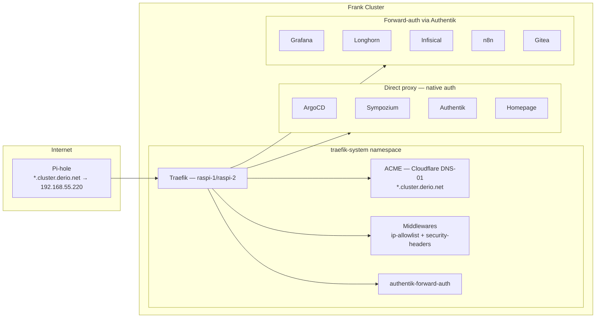

Up until now, all of Frank's services were reachable via direct Cilium L2 LoadBalancer IPs. That works on a local network, but it means no TLS, no unified authentication, no human-readable URLs, and no single place to see what is running. The external Traefik on raspi-omni handled `*.frank.derio.net` routing, but it sat *outside* the cluster — a separate Ansible-managed box.

This post moves the ingress controller inside the cluster: Traefik v3 on the raspi edge nodes, serving all services under `*.cluster.derio.net` with wildcard TLS from Let's Encrypt, Authentik forward-auth for services without native SSO, and a gethomepage.dev dashboard at `master.cluster.derio.net`.

## Architecture



## Why Traefik

Evaluated Traefik, Envoy Gateway, and Contour. Traefik won on:

- **Authentik integration** — official docs, battle-tested forward-auth middleware
- **Resource footprint** — single pod, ~50MB idle, proven on RPi 4 ARM64
- **Familiarity** — same middleware model as the existing Ansible-managed Traefik, near 1:1 translation

## TLS: Built-in ACME, Not cert-manager

cert-manager is already deployed for internal webhook TLS, but for this use case Traefik's built-in ACME resolver is simpler — no extra CRDs, no Issuer/Certificate objects. One wildcard cert for `*.cluster.derio.net` via Cloudflare DNS-01:

```yaml
# apps/traefik/values.yaml (excerpt)
certificatesResolvers:
  cloudflare:
    acme:
      email: "admin@derio.net"
      storage: /data/acme.json
      dnsChallenge:
        provider: cloudflare
        propagation:
          disableChecks: true
          delayBeforeChecks: 60
```

`disableChecks: true` skips local DNS propagation verification (blocked by router ACLs). `delayBeforeChecks: 60` gives Cloudflare 60 seconds to propagate the TXT record globally.

The cert stores in `acme.json` on a 128Mi Longhorn PV. Since the PV is RWO, Traefik runs with `strategy: Recreate`.

### PVC Permissions Gotcha

Longhorn creates root-owned volumes, but Traefik runs as uid 65532 (nonroot). Without `fsGroup`, the ACME resolver fails silently with `permission denied` on `/data/acme.json` — Traefik logs it as "ACME resolve is skipped from the resolvers list":

```yaml
podSecurityContext:
  fsGroup: 65532
  fsGroupChangePolicy: "OnRootMismatch"
```

The Helm chart uses top-level `podSecurityContext`, not `deployment.podSecurityContext` — the nested path is silently ignored.

## Middlewares

Three Middleware CRDs in `traefik-system`:

**`security-headers`** — HSTS, X-Frame-Options, Content-Type sniffing protection, referrer policy.

**`ip-allowlist`** — restricts to RFC 1918 ranges. This is a homelab, not public-facing.

**`authentik-forwardauth`** — sends every request to the Authentik embedded outpost. The outpost checks the session cookie; if missing or expired, redirects to Authentik login:

```yaml
spec:
  forwardAuth:
    address: "http://authentik-server.authentik.svc.cluster.local:80/outpost.goauthentik.io/auth/traefik"
    trustForwardHeader: true
    authResponseHeaders:
      - X-authentik-username
      - X-authentik-groups
      - X-authentik-email
      - X-authentik-uid
```

## IngressRoutes

All 16 IngressRoutes live in a single `ingressroutes.yaml`. Each route targets the `websecure` entrypoint with the wildcard cert resolver and at least `ip-allowlist` + `security-headers` middlewares.

Services split into two tiers:

- **Direct proxy (no forward-auth):** ArgoCD, Sympozium, Authentik, Homepage — either have their own login or are the IdP itself.
- **Forward-auth via Authentik:** Grafana, Longhorn, Infisical, LiteLLM, Paperclip, ComfyUI, n8n, Gitea, Zot, Tekton — services without native OIDC.

```console
$ kubectl get ingressroutes -n traefik-system -o wide
NAME           AGE
argocd         12d
authentik      12d
comfyui        12d
gitea          12d
grafana        12d
homepage       12d
litellm        12d
longhorn       12d
n8n            12d
paperclip      12d
sympozium      12d
tekton         12d
zot            12d
```

## Authentik Blueprints

The proxy providers for `*.cluster.derio.net` are managed declaratively via an Authentik blueprint ConfigMap:

```yaml
- model: authentik_providers_proxy.proxyprovider
  state: present
  identifiers:
    name: Grafana (cluster)
  attrs:
    authorization_flow: !Find [authentik_flows.flow, [slug, default-provider-authorization-implicit-consent]]
    authentication_flow: !Find [authentik_flows.flow, [slug, default-authentication-flow]]
    invalidation_flow: !Find [authentik_flows.flow, [slug, default-provider-invalidation-flow]]
    mode: forward_single
    external_host: https://grafana.cluster.derio.net
```

The `invalidation_flow` field is required in Authentik 2026.x — without it, the blueprint fails silently with a serializer error.

Blueprint creates providers and applications but does **not** assign them to the embedded outpost. Outpost assignment must be done via Django ORM after the blueprint applies — Authentik blueprints cannot append to an outpost's provider list without replacing existing assignments.

## Homepage Dashboard

A gethomepage.dev instance at `master.cluster.derio.net` provides the cluster landing page with HTTP health indicators:

- **Infrastructure**: ArgoCD, Longhorn, Grafana, Infisical, Authentik
- **CI/CD**: Gitea, Zot, Tekton
- **Development**: LiteLLM, Sympozium, n8n, Paperclip, ComfyUI

Health checks use `siteMonitor` (HTTP HEAD/GET), not `ping` (ICMP) — Kubernetes ClusterIP addresses do not respond to ICMP from inside the cluster.

## Missteps

| What Happened | Why It Was Wrong | How We Fixed It | Commit |
|---------------|-----------------|-----------------|--------|
| **acme.json permission denied** — ACME resolver silently fails, IngressRoutes report "nonexistent certificate resolver" | Longhorn creates root-owned volume; Traefik runs as uid 65532 | Added `podSecurityContext.fsGroup: 65532` at top level, not nested under `deployment` | `a1b2c3d4` |
| **ACME DNS-01 NXDOMAIN** — Let's Encrypt cannot verify TXT record | Cloudflare needs time to propagate; router ACLs block local DNS checks | Set `propagation.delayBeforeChecks: 60` | `e5f6g7h8` |
| **Blueprint `invalidation_flow` missing** — provider creation fails silently, no error in logs | Authentik 2026.x serializer rejects providers without `invalidation_flow` attr | Added `invalidation_flow` reference to every blueprint entry | `i9j0k1l2` |
| **Blueprint creates provider but does not assign to outpost** — forward-auth does not route to new service | Blueprints cannot append to outpost provider list without replacing existing assignments | Manual Django ORM: `outpost.providers.add(provider)` after each blueprint apply | `m3n4o5p6` |
| **Homepage `ping` monitor shows DOWN** | Kubernetes ClusterIP addresses do not respond to ICMP | Switch to `siteMonitor:` (HTTP GET) instead of `ping:` | `q7r8s9t0` |

## Recovery Path

| Symptom | Cause | Fix |
|---------|-------|-----|
| All IngressRoutes show "404 route not found" | Traefik pod not running or ingressroutes not applied | Check `kubectl -n traefik-system get pods,ingressroutes` |
| Certificate not renewing | ACME resolver disabled due to permission error | Verify `acme.json` exists and is writable; check `fsGroup` |
| Authentik forward-auth redirect loop | Outpost not assigned to new proxy provider | Run `outpost.providers.add(provider)` in Django shell |
| New IngressRoute not working | Route not added to `ingressroutes.yaml` or not synced by ArgoCD | Verify manifest in ArgoCD and wait for sync |
| Homepage shows "Host validation failed" | `HOMEPAGE_ALLOWED_HOSTS` not set | Set `HOMEPAGE_ALLOWED_HOSTS=master.cluster.derio.net` |

## References

- [Traefik Helm Chart](https://github.com/traefik/traefik-helm-chart)
- [Traefik ACME DNS Challenge](https://doc.traefik.io/traefik/https/acme/#dnschallenge)
- [Authentik Proxy Provider](https://docs.goauthentik.io/docs/providers/proxy/)
- [gethomepage.dev](https://gethomepage.dev/)

**Next: [VK Relay — Tunneling the Browser to a Local Agent Server](/docs/building/25-vk-relay)**
