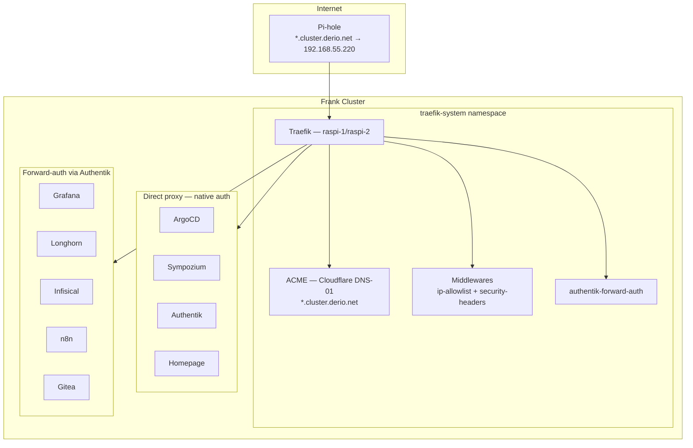

Up until now, all of Frank's services were reachable via direct Cilium L2 LoadBalancer IPs. That works on a local network, but it means no , no unified authentication, no human-readable URLs, and no single place to see what is running. The external Traefik on raspi-omni handled `*.frank.derio.net` routing, but it sat *outside* the cluster — a separate Ansible-managed box.

This post moves the ingress controller inside the cluster: Traefik v3 on the raspi edge nodes, serving all services under `*.cluster.derio.net` with wildcard TLS from Let's Encrypt, Authentik forward-auth for services without native , and a gethomepage.dev dashboard at `master.cluster.derio.net`.

> **Update, August 2026.** The old `*.frank.derio.net` estate is gone — every non-Omni name retired, including the OIDC issuer the kube-apiserver depended on. [Retiring `*.frank.derio.net`](#retiring-frankderionet-2026-08) covers the dual-issuer mechanism that made it a cutover rather than an outage, and the two traps that nearly hid a failure.

## Architecture


```mermaid
flowchart TD
  subgraph Internet
    DNS[Pi-hole<br/>*.cluster.derio.net → 192.168.55.220]
  end
  subgraph Cluster[Frank Cluster]
    subgraph Traefik[traefik-system namespace]
      direction TB
      T[Traefik — raspi-1/raspi-2]
      AC[ACME — Cloudflare DNS-01<br/>*.cluster.derio.net]
      MW[Middlewares<br/>ip-allowlist + security-headers]
      FA[authentik-forward-auth]
    end
    subgraph Direct[Direct proxy — native auth]
      A[ArgoCD]
      S[Sympozium]
      AK[Authentik]
      H[Homepage]
    end
    subgraph SSO[Forward-auth via Authentik]
      G[Grafana]
      L[Longhorn]
      I[Infisical]
      N[n8n]
      GI[Gitea]
    end
  end
  DNS --> T
  T --> AC
  T --> MW
  T --> FA
  T --> Direct
  T --> SSO
```

## Why Traefik

Evaluated Traefik, Envoy Gateway, and Contour. Traefik won on:

- **Authentik integration** — official docs, battle-tested forward-auth middleware
- **Resource footprint** — single pod, ~50MB idle, proven on RPi 4 ARM64
- **Familiarity** — same middleware model as the existing Ansible-managed Traefik, near 1:1 translation

## TLS: Built-in ACME, Not cert-manager

cert-manager is already deployed for internal webhook TLS, but for this use case Traefik's built-in  resolver is simpler — no extra , no Issuer/Certificate objects. One wildcard cert for `*.cluster.derio.net` via Cloudflare DNS-01:

```yaml
# apps/traefik/values.yaml (excerpt)
certificatesResolvers:
  cloudflare:
    acme:
      email: "admin@derio.net"
      storage: /data/acme.json
      dnsChallenge:
        provider: cloudflare
        propagation:
          disableChecks: true
          delayBeforeChecks: 60
```

`disableChecks: true` skips local DNS propagation verification (blocked by router ). `delayBeforeChecks: 60` gives Cloudflare 60 seconds to propagate the TXT record globally.

The cert stores in `acme.json` on a 128Mi Longhorn . Since the PV is , Traefik runs with `strategy: Recreate`.

### PVC Permissions Gotcha

Longhorn creates root-owned volumes, but Traefik runs as uid 65532 (nonroot). Without `fsGroup`, the ACME resolver fails silently with `permission denied` on `/data/acme.json` — Traefik logs it as "ACME resolve is skipped from the resolvers list":

```yaml
podSecurityContext:
  fsGroup: 65532
  fsGroupChangePolicy: "OnRootMismatch"
```

The Helm chart uses top-level `podSecurityContext`, not `deployment.podSecurityContext` — the nested path is silently ignored.

## Middlewares

Three Middleware CRDs in `traefik-system`:

**`security-headers`** — , X-Frame-Options, Content-Type sniffing protection, referrer policy.

**`ip-allowlist`** — restricts to RFC 1918 ranges. This is a homelab, not public-facing.

**`authentik-forwardauth`** — sends every request to the Authentik embedded outpost. The outpost checks the session cookie; if missing or expired, redirects to Authentik login:

```yaml
spec:
  forwardAuth:
    address: "http://authentik-server.authentik.svc.cluster.local:80/outpost.goauthentik.io/auth/traefik"
    trustForwardHeader: true
    authResponseHeaders:
      - X-authentik-username
      - X-authentik-groups
      - X-authentik-email
      - X-authentik-uid
```

## IngressRoutes

All 16 IngressRoutes live in a single `ingressroutes.yaml`. Each route targets the `websecure` entrypoint with the wildcard cert resolver and at least `ip-allowlist` + `security-headers` middlewares.

Services split into two tiers:

- **Direct proxy (no forward-auth):** ArgoCD, Sympozium, Authentik, Homepage — either have their own login or are the IdP itself.
- **Forward-auth via Authentik:** Grafana, Longhorn, Infisical, LiteLLM, Paperclip, ComfyUI, n8n, Gitea, Zot, Tekton — services without native .

```console
$ kubectl get ingressroutes -n traefik-system -o wide
NAME           AGE
argocd         12d
authentik      12d
comfyui        12d
gitea          12d
grafana        12d
homepage       12d
litellm        12d
longhorn       12d
n8n            12d
paperclip      12d
sympozium      12d
tekton         12d
zot            12d
```

## Authentik Blueprints

The proxy providers for `*.cluster.derio.net` are managed declaratively via an Authentik blueprint ConfigMap:

```yaml
- model: authentik_providers_proxy.proxyprovider
  state: present
  identifiers:
    name: Grafana (cluster)
  attrs:
    authorization_flow: !Find [authentik_flows.flow, [slug, default-provider-authorization-implicit-consent]]
    authentication_flow: !Find [authentik_flows.flow, [slug, default-authentication-flow]]
    invalidation_flow: !Find [authentik_flows.flow, [slug, default-provider-invalidation-flow]]
    mode: forward_single
    external_host: https://grafana.cluster.derio.net
```

The `invalidation_flow` field is required in Authentik 2026.x — without it, the blueprint fails silently with a serializer error.

Blueprint creates providers and applications but does **not** assign them to the embedded outpost. Outpost assignment must be done via Django  after the blueprint applies — Authentik blueprints cannot append to an outpost's provider list without replacing existing assignments.

## Homepage Dashboard

A gethomepage.dev instance at `master.cluster.derio.net` provides the cluster landing page with HTTP health indicators:

- **Infrastructure**: ArgoCD, Longhorn, Grafana, Infisical, Authentik
- **CI/CD**: Gitea, Zot, Tekton
- **Development**: LiteLLM, Sympozium, n8n, Paperclip, ComfyUI

Health checks use `siteMonitor` (HTTP HEAD/GET), not `ping` () — Kubernetes ClusterIP addresses do not respond to ICMP from inside the cluster.

## Retiring `*.frank.derio.net` (2026-08)

For four months this layer ran two domains at once. `*.cluster.derio.net` was the new in-cluster Traefik; `*.frank.derio.net` was the old external Traefik on raspi-omni — and after that Pi died in June, a set of nine "compatibility" IngressRoutes re-fronting the dead edge's names on the surviving in-cluster Traefik. Temporary, obviously. Temporary things that work are the hardest to remove.

The hard part was never the routes. It was `auth.frank.derio.net`, because the kube-apiserver trusted it as an  issuer, and an issuer is not a hostname you can simply repoint.

### Structured authentication is what made this survivable

The apiserver originally took `--oidc-issuer-url` and friends: **one** issuer, set by flag, changed only by restarting the API server. Under that model there is no cutover, only an outage.

Kubernetes' structured authentication config replaces those flags with a file listing a *list* of authenticators:

```yaml
# patches/phase13-auth/authn-config.yaml — during the overlap
apiVersion: apiserver.config.k8s.io/v1
kind: AuthenticationConfiguration
jwt:
  - issuer:
      url: https://auth.frank.derio.net/application/o/k8s-agent/   # authenticator A
      audiences: [k8s-agent]
    claimMappings: &mappings
      username: {claim: preferred_username, prefix: "authentik:"}
      groups:   {claim: groups, prefix: ""}
  - issuer:
      url: https://auth.cluster.derio.net/application/o/k8s-agent/ # authenticator B
      audiences: [k8s-agent]
    claimMappings: *mappings
```

Both issuers are trusted simultaneously, and identical `claimMappings` mean a token from either normalises to the same Kubernetes identity — `authentik:ak-Kubernetes Agent Access-client_credentials`. Existing credentials keep working while newly minted ones carry the new issuer. That is the whole trick.

### The eight-hour overlap, and why it is eight

Authentik mints `k8s-agent` tokens with `access_token_validity: hours=8`. Once Authentik advertises the new host, every *new* token carries the new issuer — but tokens already in someone's kubeconfig keep the old one until they expire. So authenticator A has to stay trusted for one full token lifetime after the last old-issuer token was issued:

```
T0    = last old-issuer token minted        2026-08-01 17:56:02Z
T0+8h = earliest safe removal of A          2026-08-02 01:56:02Z
```

Eight hours is not a guess or a safety margin — it is read from the provider and confirmed by decoding a minted token's `exp`. Refresh tokens live 30 days, but a refresh made after the cutover uses the request hostname and so returns a *new*-issuer token, which is why they do not extend the window.

The measurement that mattered was not "has 8 hours passed" but a live one: mint a token through each host and submit both to `TokenReview`. During the overlap both authenticate identically. After authenticator A is removed, the legacy one is rejected and the cluster one is not. That accepted→rejected flip is the only direct evidence the change actually took — and it caught a real mistake, because `omnictl apply` reads a *local* file and cheerfully re-applied a pre-merge config twice from an unpulled checkout, reporting success both times.

### The Omni exception

`omni.frank.derio.net` stays. Omni manages the machines that run the cluster, so retiring its own name from inside the cluster is a circular dependency waiting to bite — and Frank has already lost that Pi once.

It survives on a DNS detail worth knowing: **an explicit CNAME outlives the wildcard it sat under.** Removing the `*.frank.derio.net` wildcard A record took the other names with it and left `omni` resolving through its own CNAME to `omni.frank.lan`. Its certificate is minted by a systemd timer on the Omni host, not by Traefik, so it was never coupled to this layer at all. The Headscale split-DNS entry for the bare `frank.derio.net` zone stays too — a suffix, not a hostname, and easy to delete by accident with a careless regex.

### Deleting a manifest deletes nothing

The retirement PR removed all nine compatibility IngressRoutes from Git. After it merged, all nine were still serving.

Every ArgoCD Application here runs `prune: false` — the right default for a homelab, since a bad render can never cascade into mass deletion. The cost is that **removing a resource from Git makes ArgoCD stop managing it, not remove it.** The app goes `OutOfSync` and the object serves on indefinitely.

It hid well, for three compounding reasons. The routes live in `apps/traefik/manifests` but belong to the Application `traefik-extras`, while the similarly-named `traefik` app is the Helm chart and stayed `Synced/Healthy` throughout. `OutOfSync` is the same status a drifted annotation produces. And the Authentik half of the very same PR *did* remove itself correctly, because those were expressed as blueprint tombstones:

```yaml
- model: authentik_core.application
  state: absent            # declarative deletion — this one really does delete
  identifiers: {slug: longhorn}
```

Half a change disappearing correctly is a strong signal the other half did too. It was not. Deletion under `prune: false` is a manual step: delete the objects, then assert they are *gone*, rather than assert the app is `Synced`.

### Rollback path

The overlap is the rollback. Until authenticator A is removed, reverting is re-adding the legacy issuer block and re-applying the Omni ConfigPatch — the old routes and DNS still exist, so nothing else has to move. After removal the rollback is the same operation in reverse, with the added cost of re-creating the compatibility IngressRoutes and DNS records, and it only matters for credentials no one has re-minted.

The genuinely irreversible moment is not the merge. It is `omnictl apply` of the single-issuer patch, which rolls the three control planes one at a time and, from that point, rejects every legacy token in existence.

## Missteps

| What Happened | Why It Was Wrong | How We Fixed It | Commit |
|---------------|-----------------|-----------------|--------|
| **acme.json permission denied** — ACME resolver silently fails, IngressRoutes report "nonexistent certificate resolver" | Longhorn creates root-owned volume; Traefik runs as uid 65532 | Added `podSecurityContext.fsGroup: 65532` at top level, not nested under `deployment` | `a1b2c3d4` |
| **ACME DNS-01 NXDOMAIN** — Let's Encrypt cannot verify TXT record | Cloudflare needs time to propagate; router ACLs block local DNS checks | Set `propagation.delayBeforeChecks: 60` | `e5f6g7h8` |
| **Blueprint `invalidation_flow` missing** — provider creation fails silently, no error in logs | Authentik 2026.x serializer rejects providers without `invalidation_flow` attr | Added `invalidation_flow` reference to every blueprint entry | `i9j0k1l2` |
| **Blueprint creates provider but does not assign to outpost** — forward-auth does not route to new service | Blueprints cannot append to outpost provider list without replacing existing assignments | Manual Django ORM: `outpost.providers.add(provider)` after each blueprint apply | `m3n4o5p6` |
| **Homepage `ping` monitor shows DOWN** | Kubernetes ClusterIP addresses do not respond to ICMP | Switch to `siteMonitor:` (HTTP GET) instead of `ping:` | `q7r8s9t0` |
| **Deleting nine IngressRoutes from Git deleted none of them** — all nine kept serving after the PR merged | Every Application runs `prune: false`, so removal from Git only stops management. Compounded by the routes belonging to `traefik-extras` while the similarly-named `traefik` app stayed green | Manual `kubectl delete ingressroute`, then assert the objects are gone rather than that the app is `Synced` | `0c094108` |
| **`omnictl apply` reported success twice while applying the old config** | It reads a *local* file and has no idea the checkout is stale — the pre-merge dual-issuer patch was re-applied from an unpulled tree | `git pull` before applying; the legacy-token `TokenReview` check is what exposed it | `99baf9dc` |

## Recovery Path

| Symptom | Cause | Fix |
|---------|-------|-----|
| All IngressRoutes show "404 route not found" | Traefik pod not running or ingressroutes not applied | Check `kubectl -n traefik-system get pods,ingressroutes` |
| Certificate not renewing | ACME resolver disabled due to permission error | Verify `acme.json` exists and is writable; check `fsGroup` |
| Authentik forward-auth redirect loop | Outpost not assigned to new proxy provider | Run `outpost.providers.add(provider)` in Django shell |
| New IngressRoute not working | Route not added to `ingressroutes.yaml` or not synced by ArgoCD | Verify manifest in ArgoCD and wait for sync |
| Homepage shows "Host validation failed" | `HOMEPAGE_ALLOWED_HOSTS` not set | Set `HOMEPAGE_ALLOWED_HOSTS=master.cluster.derio.net` |
| `kubectl` rejects a working kubeconfig after the issuer cutover | The token was minted before the cutover and carries the retired issuer | Re-mint it; the old issuer is no longer trusted by any authenticator |
| A retired `*.frank.derio.net` name still answers | Its IngressRoute was never deleted — `prune: false` does not remove it | `kubectl -n traefik-system delete ingressroute <name>` and verify with `kubectl get` |

## References

- [Traefik Helm Chart](https://github.com/traefik/traefik-helm-chart)
- [Traefik ACME DNS Challenge](https://doc.traefik.io/traefik/https/acme/#dnschallenge)
- [Authentik Proxy Provider](https://docs.goauthentik.io/docs/providers/proxy/)
- [gethomepage.dev](https://gethomepage.dev/)

**Next: [VK Relay — Tunneling the Browser to a Local Agent Server](/docs/building/25-vk-relay)**
