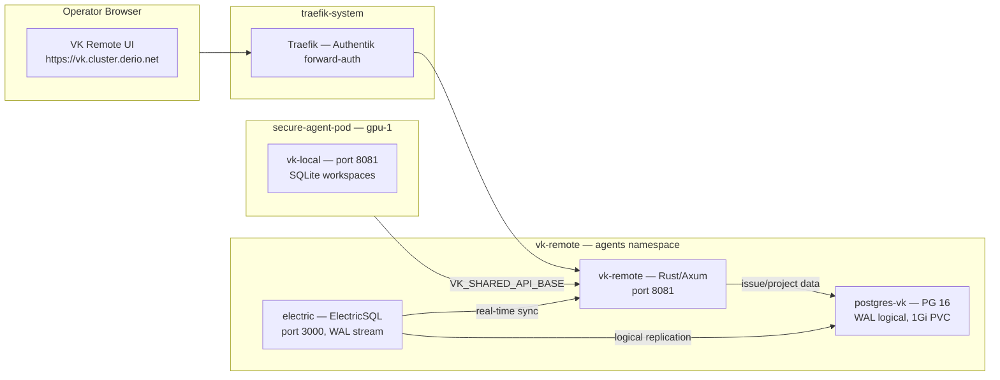

On April 10th, VibeKanban announced it was shutting down. Thirty days. The OAuth flow was already failing — likely early decommissioning. The local VK features (workspaces, sessions, git worktrees, agent spawning) would survive. But the kanban board, issue management, the 33 MCP tools that the agentic workflow depends on — all that lives in the remote crate, backed by a PostgreSQL database that was about to stop existing.

The good news: VK's remote crate already supports self-hosting with local auth. Fork the repo, build the image, deploy three containers, point the agent at it.

## Architecture



Three components, one namespace, zero cloud dependencies:

| Component | Image | Port | Purpose |
|-----------|-------|------|---------|
| **vk-remote** | `ghcr.io/derio-net/vk-remote` (Rust/Axum) | 8081 | Kanban API server |
| **postgres-vk** | `postgres:16-alpine` | 5432 | Issue/project data, WAL logical replication |
| **electric** | `electricsql/electric:1.4.13` | 3000 | Real-time sync engine for frontend |

ElectricSQL reads PostgreSQL's logical replication stream to push live updates to the browser — when an issue changes status, every open tab sees it immediately. That requires `wal_level=logical` and a dedicated PostgreSQL instance.

## Fork and Build

Forked `BloopAI/vibe-kanban` to `derio-net/vibe-kanban`. GitHub Actions workflow builds the remote crate into a container image on every push to `main`:

```yaml
name: Build vk-remote
on:
  push:
    branches: [main]
    paths:
      - 'crates/remote/**'
      - 'Cargo.toml'
      - 'Cargo.lock'
jobs:
  build:
    runs-on: ubuntu-latest
    steps:
      - uses: docker/build-push-action@v6
        with:
          context: .
          file: crates/remote/Dockerfile
          push: true
          tags: |
            ghcr.io/${{ env.IMAGE_NAME }}:${{ github.sha }}
            ghcr.io/${{ env.IMAGE_NAME }}:latest
```

Images pinned by commit SHA in manifests. Own the fork, so patches are possible if upstream disappears.

## PostgreSQL with Logical Replication

Dedicated PG instance with WAL-level logical replication enabled via command-line args:

```yaml
containers:
  - name: postgres
    image: postgres:16-alpine
    args:
      - "-c"
      - "wal_level=logical"
      - "-c"
      - "max_replication_slots=5"
      - "-c"
      - "max_wal_senders=5"
```

Recreate strategy because of RWO PVC.

A PostSync Job creates the ElectricSQL role with replication privileges:

```yaml
annotations:
  argocd.argoproj.io/hook: PostSync
  argocd.argoproj.io/hook-delete-policy: BeforeHookCreation
```

The Job waits for PG startup, then creates the `electric` role with `LOGIN` and `REPLICATION` privileges plus full grants on the `remote` database.

## Auth: Local Only

No OAuth. Single admin user:

```
SELF_HOST_LOCAL_AUTH_EMAIL=admin@localhost
SELF_HOST_LOCAL_AUTH_PASSWORD=<from Infisical>
```

POST to `/v1/auth/local/login` returns JWT tokens. Browser access goes through Authentik forward-auth at Traefik — the VK remote itself does not know about SSO.

## Secrets via Infisical

Four secrets, pulled by External Secrets Operator with same ClusterSecretStore as every other Frank app:

| ExternalSecret Key | Maps To | Purpose |
|---|---|---|
| `VK_REMOTE_JWT_SECRET` | `VIBEKANBAN_REMOTE_JWT_SECRET` | JWT signing key |
| `VK_REMOTE_LOCAL_AUTH_PASSWORD` | `SELF_HOST_LOCAL_AUTH_PASSWORD` | Admin login password |
| `VK_REMOTE_ELECTRIC_PASSWORD` | `ELECTRIC_ROLE_PASSWORD` | ElectricSQL PG role |
| `VK_REMOTE_PG_PASSWORD` | `POSTGRES_PASSWORD` | Main PG user password |

## Connecting the Agent

The secure-agent-pod just needs one env var to switch from cloud to self-hosted:

```yaml
- name: VK_SHARED_API_BASE
  value: "http://vk-remote.agents.svc.cluster.local:8081"
```

The VK binary, MCP server, bridge, and all 33 MCP tools work unchanged — all proxy through the local VK server.

## Domain Deviation

The spec originally called for `vk.frank.derio.net`, but Frank's Traefik wildcard cert covers `*.cluster.derio.net`. Using `vk.cluster.derio.net` avoids provisioning a new certificate. Pragmatism over naming purity.

## Missteps

| What Happened | Why It Was Wrong | How We Fixed It | Commit |
|---------------|-----------------|-----------------|--------|
| **ElectricSQL cannot connect to PG** — `wal_level=logical` not set, no replication slot available | Default PG `wal_level` is `replica`, not `logical` | Added `-c wal_level=logical` to postgres container args | `c3d4e5f6` |
| **PostSync Job backoff limit exhausted** — Job fails if PG takes >5 retries to become ready on cold node | `pg_isready` polling with sleep loop, Job has 5-retry default | Delete failed Job, let ArgoCD re-trigger; or increase backoff limit | `g7h8i9j0` |
| **Blueprint needs manual outpost assignment** — Authentik proxy provider and application created but not assigned to embedded outpost | Blueprints cannot append to outpost provider list without replacing existing assignments | Manual Django ORM: `outpost.providers.add(provider)` | `k1l2m3n4` |
| **Old cloud data inaccessible** — expected migration path, but cloud was already decommissioned by the time self-hosted was ready | 30-day shutdown window, OAuth failing before migration completed | Fresh project, fresh issues, fresh start — no data migration | `o5p6q7r8` |
| **Cross-namespace DNS confusion** — agent pod tried `vk-remote:8081` without FQDN | Pod in `secure-agent-pod` namespace needs `vk-remote.agents.svc.cluster.local` | Updated env var to use FQDN | `s9t0u1v2` |

## Recovery Path

| Symptom | Cause | Fix |
|---------|-------|-----|
| ElectricSQL pod crashlooping | PG not ready yet or WAL level incorrect | Check PG logs; verify `wal_level=logical` in container args |
| VK remote API returns 500 on login | JWT secret mismatch or local auth password incorrect | Verify ExternalSecret values match Infisical |
| Agent cannot reach VK remote | Wrong DNS or port | Verify `VK_SHARED_API_BASE` uses FQDN: `vk-remote.agents.svc.cluster.local:8081` |
| VK remote UI shows no data | ElectricSQL not syncing | Check electric pod logs; verify PG role `electric` exists with `REPLICATION` |
| PostSync Job stuck | PG not ready within job backoff limit | Delete job, let ArgoCD recreate on next sync |

## References

- [VibeKanban](https://github.com/BloopAI/vibe-kanban) — agent orchestration tool
- [ElectricSQL](https://electric-sql.com/) — real-time sync for PostgreSQL

**Next: [CI/CD Platform — Gitea, Tekton, Zot, and Cosign](/docs/building/27-cicd-platform)**
