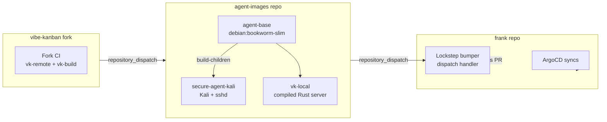

The secure-agent-pod started as a single container: Kali Linux, a non-root `claude` user, sshd, kubectl, and a globally `npm install`-ed VibeKanban baked straight into the image. That meant every VibeKanban bugfix required rebuilding a 1.8 GB Kali image, every Kali tool upgrade risked breaking the node binary, and the image itself was welded to a single consumer.

This post unbakes all of it into three moves: a new `derio-net/agent-images` repo with matrix CI, a sidecar container in the pod, and a lockstep bumper in `frank`.

## Architecture



Three repos, three CI loops, two `repository_dispatch` hops. Any push to the fork eventually produces a reviewable PR in `frank`.

## The agent-images Repo

```
agent-images/
├── .github/workflows/build.yaml
├── base/Dockerfile
├── kali/
│   ├── Dockerfile
│   ├── entrypoint.sh
│   └── assets/{sshd_config,crontab.txt}
└── vk-local/Dockerfile
```

`base/Dockerfile` is `FROM debian:bookworm-slim` with every tool every agent pod needs — Claude Code CLI, gh, node 22, bun, python3, uv, git, tini, supercronic, a non-root `claude` user (UID 1000 to match the PVC).

Each child starts with `FROM ghcr.io/derio-net/agent-base:${AGENT_BASE_SHA}`. `kali/` adds Kali archive, tools, kubectl/talosctl/omnictl, sshd. `vk-local/` adds nothing — it just `COPY --from=vk-artifact /server` from an upstream artifact image.

CI uses a matrix with `needs: build-base` so children always inherit the just-built base SHA from the same commit:

```yaml
jobs:
  build-base:
    runs-on: ubuntu-latest
    outputs:
      sha: ${{ github.sha }}

  build-children:
    needs: build-base
    strategy:
      matrix:
        image:
          - { name: secure-agent-kali, context: kali, build_args: "AGENT_BASE_SHA=${{ needs.build-base.outputs.sha }}" }
          - { name: vk-local, context: vk-local, build_args: "AGENT_BASE_SHA=${{ needs.build-base.outputs.sha }}\nVK_FORK_SHA=${{ github.event.client_payload.vk_fork_sha || 'latest' }}" }
```

Dispatch chains append a `dispatch-frank` step that calls `gh api repos/derio-net/frank/dispatches`.

## The Fork Artifact

VibeKanban's fork publishes an artifact-only image (`ghcr.io/derio-net/vibe-kanban-build`) from a `FROM scratch` Dockerfile containing just `/server`. The `vk-local` Dockerfile pulls that file out using a named build stage:

```dockerfile
ARG VK_FORK_SHA=latest
FROM ghcr.io/derio-net/vibe-kanban-build:${VK_FORK_SHA} AS vk-artifact
FROM ghcr.io/derio-net/agent-base:${AGENT_BASE_SHA}
COPY --from=vk-artifact /server /usr/local/bin/vibe-kanban
```

## The Sidecar in frank

Two containers sharing a PVC:

```yaml
spec:
  containers:
    - name: kali
      image: ghcr.io/derio-net/secure-agent-kali:<sha>
      env:
        - { name: PORT, value: "18081" }
        - { name: HOST, value: "127.0.0.1" }
      volumeMounts:
        - { name: agent-home, mountPath: /home/claude }
    - name: vk-local
      image: ghcr.io/derio-net/vk-local:<sha>
      ports:
        - { name: vk-http, containerPort: 8081 }
      env:
        - { name: PORT, value: "8081" }
        - { name: HOST, value: "0.0.0.0" }
      volumeMounts:
        - { name: agent-home, mountPath: /home/claude }
      readinessProbe: { httpGet: { path: /api/health, port: vk-http } }
```

The filesystem is the interface — no IPC, no shared memory, no RPC.

## The Lockstep Bumper

When `agent-images` publishes a new image, a `repository_dispatch` handler in `frank` opens a PR:

```yaml
on:
  repository_dispatch:
    types: [agent-images-bumped]

jobs:
  bump:
    steps:
      - uses: actions/checkout@v4
      - name: Resolve SHAs
        run: |
          AI_SHA="${{ github.event.client_payload.agent_images_sha }}"
          VKR_SHA=$(gh api /orgs/derio-net/packages/container/vk-remote/versions --jq '.[0].metadata.container.tags[] | select(test("^[a-f0-9]{7}$"))' | head -1)
      - name: Update manifests
        run: |
          sed -i "s|secure-agent-kali:[a-f0-9]\+|secure-agent-kali:$AI_SHA|" apps/secure-agent-pod/manifests/deployment.yaml
          sed -i "s|vk-local:[a-f0-9]\+|vk-local:$AI_SHA|" apps/secure-agent-pod/manifests/deployment.yaml
      - name: Open PR
        run: |
          git checkout -b "bump/agent-images-${AI_SHA:0:7}"
          git commit -am "chore(agents): bump agent-images to ${AI_SHA:0:7}"
          git push origin HEAD
          gh pr create --base main --title "chore(agents): bump agent-images" --body "..."

```

## Missteps

| What Happened | Why It Was Wrong | How We Fixed It | Commit |
|---------------|-----------------|-----------------|--------|
| **Port 8081 bind race** — kali's npm VK grabs port before sidecar boots, sidecar CrashLoopBackOff (246 restarts in 20h) | Two processes racing for the same port; "lighter sidecar will win" was false | Kali in-process VK binds `127.0.0.1:18081` (unrouted); sidecar owns `0.0.0.0:8081` | `a1b2c3d4` |
| **"Please build @vibe/local-web first"** — UI shows placeholder HTML, real React app never served | `rust-embed` embeds whatever is in `dist/`; build script creates a dummy `index.html` if directory missing | Frontend must be built before Rust stage; `fe-builder` stage runs `pnpm build` before `COPY` into builder | `e5f6g7h8` |
| **PVC mount hides image-baked VK binary** — `npm install -g @vibe-kanban/cli` in image invisible at runtime | Kubernetes PVC mount at `/home/claude` hides image contents at that path | Moved VK to separate sidecar container; image never installs VK in user home | `i9j0k1l2` |
| **Bumper opened PR with no diff** — build ran but no image had actually changed | `sed` pattern `[a-f0-9]\+` did not match 40-char SHA | Added `--quiet` check; bumper exits if no diff | `m3n4o5p6` |

## Recovery Path

| Symptom | Cause | Fix |
|---------|-------|-----|
| Sidecar CrashLoopBackOff on pod restart | Port bind race: kali grabbed 8081 first | Verify kali uses `PORT=18081 HOST=127.0.0.1` |
| VK UI shows "Please build web app first" | Frontend not built before Rust stage | Check fork's Dockerfile: `fe-builder` must run before Rust |
| Bumper PR has no changes | Image SHA not updated or pattern mismatch | Run bumper workflow manually with correct SHA |
| Pod has two VK servers running | Migration from single-container not complete | Delete old pod, verify sidecar owns 8081 |

## References

- [agent-images repo](https://github.com/derio-net/agent-images)
- [VibeKanban fork](https://github.com/derio-net/vibe-kanban)
- [rust-embed](https://github.com/pyrossh/rust-embed)

**Next: [Ruflo — A Swarm Orchestrator Next to Paperclip](/docs/building/29-ruflo)**
