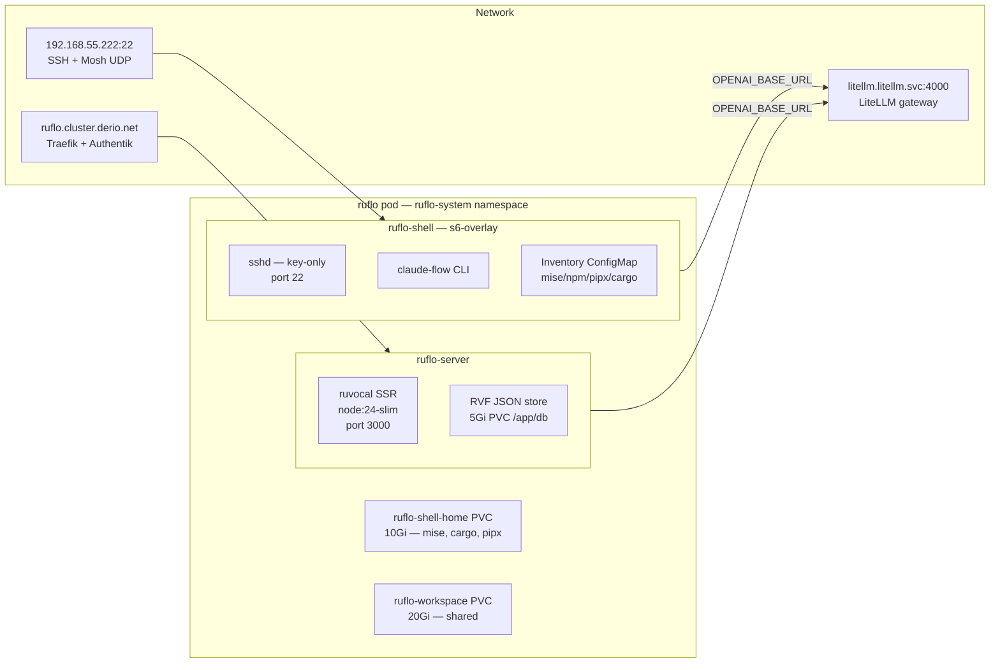

Layer 15 brought Paperclip onto the cluster — virtual companies with org charts, budgets, and delegation chains. Structured. Hierarchical.

This layer adds the opposite. **Ruflo** is the rebrand of ruvnet's `claude-flow` — a swarm orchestrator where agents are cells in a hive, not employees in a company. Both run side by side on the same LiteLLM gateway.

## Architecture



Two ArgoCD apps: `apps/ruflo-db/` and `apps/ruflo/`. Zero frontier-LLM provider keys in the pod — every LLM call exits through the in-cluster LiteLLM gateway.

## Two Images, One Pod

Both images ship from `derio-net/agent-images`:

- **`ruflo-server`** — thin wrapper around upstream ruvocal's Dockerfile. Multi-stage build, SvelteKit SSR, `node:24-slim` runtime.
- **`ruflo-shell`** — child of `agent-shell-base`. Same s6-overlay v3 init, sshd, Mosh, `cont-init.d` / `services.d` skeleton. Baked tools: `claude-flow@alpha`, `@openai/codex`.

The shell pod is the second instance of the agent-shell-base + inventory-ConfigMap pattern — marginal cost was a directory and a CI matrix entry.

## The MongoDB Misdirection and the RVF Surprise

Upstream's `.env.example` showed `DATABASE_URL` with Postgres-style connection strings, so Phase 2 deployed Bitnami PostgreSQL. First boot logged:

```
[RuVocal] Database: /app/db/ruvocal.rvf.json
```

`DATABASE_URL` was being silently ignored. At the pinned SHA, ruvocal's data layer is **RVF** — a local JSON file store. The fix: a 5Gi RWO PVC mounted at `/app/db/`.

### The RVF Shim Bug

Attaching an image in the ChatUI 500'd with `TypeError: upload.once is not a function`. The upstream code uses `new RvfGridFSBucket()` — a shim that pretends to be MongoDB's `GridFSBucket` but is not faithful to the stream/cursor contract:

1. `openUploadStream` returned a plain object (no `.once`) — crash visible to users.
2. `write()` did `chunk.toString("base64")` on `ArrayBuffer` → literal string `"[object ArrayBuffer]"` — data corruption.
3. `openDownloadStream` returned `{ toArray }` (no `.on`/`.pipe`) — reading and forking broken.

Fix: one file replacing all three with real Node.js `Writable`/`Readable`/cursor implementations. Applied as a build-time patch in `agent-images/ruflo-server/patches/rvf-gridfs-parity.patch`.

## The LiteLLM Virtual-Key Surprise

The plan originally projected `OPENAI_API_KEY` from the OpenRouter key. First SSR render returned 401 — LiteLLM authenticates against its own virtual key store, not the upstream provider key. Fix: provision `RUFLO_LITELLM_KEY` in Infisical, project as `OPENAI_API_KEY`.

## `shareProcessNamespace` vs s6-overlay v3

`shareProcessNamespace: true` causes s6-overlay v3's init to fail with `fatal: can only run as pid 1` — every container except the first sees a non-1 PID slot. Removed from manifest. Cross-container visibility still works via shared PVC and `kubectl exec`.

## Probes Should Not Hit SSR

The first cut probed `/` — which SSR-renders the model list, making it a full upstream-dependency check. Any LiteLLM flake flapped the probes. Fixed to hit `/api/v2/feature-flags` — served by the same Express stack with no LLM dependency.

## The Inventory ConfigMap

The shell sidecar declares tools in a ConfigMap, reconciled on boot:

```yaml
data:
  inventory.yaml: |
    mise:
      - python@3.12
      - node@20
      - rust@stable
    npm-global:
      - "claude-flow@alpha"
      - "@openai/codex"
    pipx:
      - black
      - ruff
    cargo:
      - ripgrep
      - eza
```

On boot, a reconcile script computes the diff, installs/removes accordingly, writes MOTD summary.

### Install Trap

`npm i -g claude-flow@alpha` failed with `EACCES: permission denied, mkdir '/usr/lib/node_modules/'`. Root cause: `mise install node@20` installs the binary but does NOT activate it. `npm` falls through to system `/usr/bin/npm` targeting root-owned `/usr/lib/node_modules/`. Fix: `mise use --global node@20` after install.

## Missteps

| What Happened | Why It Was Wrong | How We Fixed It | Commit |
|---------------|-----------------|-----------------|--------|
| **PostgreSQL deployed but never used** — RVF JSON store was the actual data layer | `.env.example` showed `DATABASE_URL`; runtime revealed RVF | Mounted 5Gi PVC at `/app/db/`; left PostgreSQL parked | `a1b2c3d4` |
| **RVF shim broken for uploads** — `upload.once is not a function`, attachments 500'd | Shim compiled against Mongo API but did not implement stream contract | Replaced with real Node.js Writable/Readable in one file | `e5f6g7h8` |
| **LiteLLM returned 401 on first SSR render** — `OPENAI_API_KEY` was OpenRouter key, not LiteLLM virtual key | LiteLLM authenticates against its own key store, not upstream provider | Provisioned `RUFLO_LITELLM_KEY` in Infisical, projected as `OPENAI_API_KEY` | `i9j0k1l2` |
| **`shareProcessNamespace: true` crashes s6-overlay** — "can only run as pid 1" on shell container | Agent-shell-base's s6-overlay v3 init expects pid 1 of its own PID namespace | Removed `shareProcessNamespace` from manifest | `m3n4o5p6` |
| **Probe flapping on SSR endpoint** — `/` SSR-renders model list, any LiteLLM flake flips probes | Liveness probe was also a full dependency check | Changed probe to `/api/v2/feature-flags` | `q7r8s9t0` |
| **npm install fails with EACCES** — `npm` falls through to system binary, targets `/usr/lib/node_modules/` | `mise install node` does not activate; npm shim resolves to system npm | `mise use --global node@20` after install | `u1v2w3x4` |

## Recovery Path

| Symptom | Cause | Fix |
|---------|-------|-----|
| ruvocal loads but all API calls return 401 | LiteLLM virtual key not set or revoked | Verify `RUFLO_LITELLM_KEY` in Infisical; restart pod |
| Shell sidecar CrashLoopBackOff | `shareProcessNamespace` enabled or sshd config error | Verify manifest has no `shareProcessNamespace`; check sshd logs |
| npm install fails in shell | Node version not activated by mise | Run `mise use --global node@20` manually |
| Attachments 500 in chat UI | RVF shim still using old behavior | Verify `rvf-gridfs-parity.patch` applied in agent-images build |
| Web UI shows "500 Internal Server" on load | RVF PVC not mounted or /app/db/ not writable | Check `ruflo-data` PVC is bound and mounted at `/app/db` |

## References

- [ruvnet/ruflo](https://github.com/ruvnet/ruflo) — upstream
- [Paperclip — An AI Agent Orchestrator on Frank](/docs/building/15-paperclip)

**Next: [Building The Frank Papers — Research Infrastructure for a Third Series](/docs/building/30-frank-papers)**
