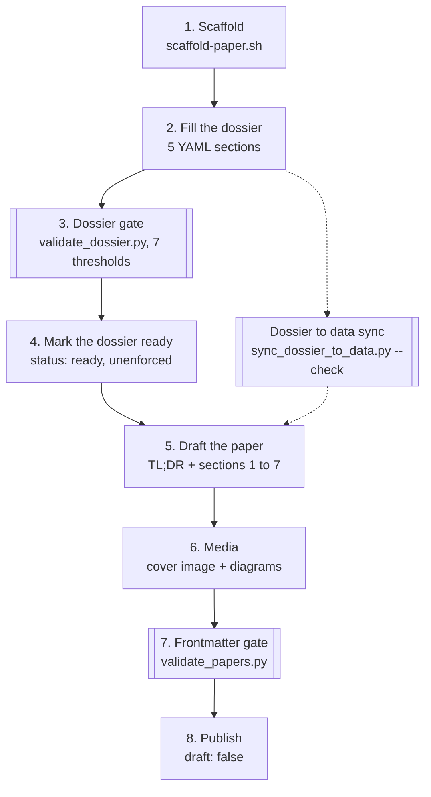

The cluster has two voices already. The Building series answers *how*. The Operating series answers *how to run*. Neither answers *why this and not the other twelve options*.

**The Frank Papers** are research-grade landscape reviews. Each paper maps the vendor space for one capability, grades the options, then returns to Frank's choice as a worked case study — honest about where that choice would not generalize. Every paper carries a ≤150-word TL;DR.

This post is about the infrastructure that makes a paper legal to ship. Phase 0 produces no published content — it produces the toolchain.

## Why a Third Series

Building and Operating both center Frank. The narrative arc is "I tried this, here is what broke."

That voice is wrong for a decision-maker weighing Authentik against Keycloak. They want the landscape and trade-offs that hold across orgs. Frank's experience is one data point.

- **Building** — first person, narrative. ~3000 words.
- **Operating** — imperative, reference. ~1500 words.
- **Papers** — third person, analytical, with a worked-example coda. ~5000 words plus TL;DR.

## The Pipeline, and Who Actually Enforces It

Eight steps get a paper from nothing to published. Exactly two of them are enforced by a script, plus one consistency check that runs alongside. The rest are me — including one the rule file calls a "gate". Doubled boxes are machine-checked in CI; plain boxes are a human deciding they are done.



Step 4 is the interesting one. `agents/rules/repo-papers.md` calls it a human gate, and it is human all the way down: `blog/scripts/dossier_parser.py` strips the frontmatter block before parsing, so no validator ever sees `status:` on a dossier. The scaffolded dossier does not even have a frontmatter block to put it in. It is a convention I keep, not a thing the repo can check — and calling it a gate in the rule file makes it sound like the second one.

## The Dossier Gate

The load-bearing piece of Phase 0 is the one gate that is real. `blog/scripts/validate_dossier.py` reads the dossier's `##` sections as YAML and checks seven thresholds pulled from `content_types.papers.gate` in `.blog-craft.yaml` — nothing is hardcoded in the script. A freshly scaffolded dossier, one `TODO` entry per section, fails exactly as intended:

```console
$ python3 blog/scripts/validate_dossier.py --config .blog-craft.yaml \
    docs/papers-dossiers/04-gpu-operators/dossier.md
DOSSIER GATE FAILED: docs/papers-dossiers/04-gpu-operators/dossier.md
  x vendors: need >=3, got 1
  x primary_sources: need >=5, got 1
  x primary_sources: need >=3 distinct types, got 1
  x artefacts: need >=3, got 1
  x artefacts: need >=2 distinct kinds, got 1
```

Filled in, it says `DOSSIER GATE PASSED` and exits 0. The thresholds:

| Threshold | Value | What it forces |
|-----------|-------|----------------|
| `min_vendors` | 3 | No one-vendor review. |
| `min_sources` | 5 | A bibliography, not a link. |
| `min_source_types` | 3 | Not five pages of the same vendor's docs. |
| `min_artefacts` | 3 | Claims tied to operational evidence. |
| `min_artefact_kinds` | 2 | Not three screenshots of one dashboard. |
| `min_gaps` | 1 | The question I could not answer. |
| `min_counterargs` | 1 | The opposing view, named. |

The two "distinct" thresholds are the ones that bite. Five sources are easy if they can all be vendor docs; five sources across three of `{vendor-docs, paper, postmortem, talk, benchmark}` means going and finding a postmortem. Same for artefact kinds — a `yaml` and an `incident` are a different claim from two `yaml`s.

The last two rows are why the gate exists at all. The structure forces naming the opposing view at dossier time, before the paper's argument has hardened around a conclusion.

The dossier is a structured Markdown file whose five `##` sections the validator locates by token, so `## Frank artefacts (>=3)` and `## Artefacts` both resolve. This is what the scaffold writes:

```markdown
## Vendors in scope (>=3)
- {name: "TODO", positioning: "TODO one-line claim", primary_url: "https://TODO"}

## Primary sources (>=5, >=3 distinct type values)
- {title: "TODO", type: vendor-docs, url: "https://TODO", relevance: "one sentence"}

## Artefacts (>=3, >=2 distinct kind values)
- {kind: yaml, path_or_url: "TODO", date: "2026-08-03", demonstrates: "one sentence"}

## Named gaps (>=1)
- "TODO: gap description"

## Counter-arguments considered (>=1)
- "TODO: counter-argument"
```

**What enforces it.** Phase 0 built the gate as a `.githooks/pre-commit` hook. What enforces it today is CI: `.github/workflows/blog-ci.yml` syncs the dossier data, then runs the dossier gate over every `docs/papers-dossiers/*/dossier.md` and the frontmatter validator over every paper. The hook did not survive a later repo reorganisation — see Missteps. The two consequences the gate was built for survive either way: the dossier ships with the paper on the same SHA, and an agent dispatched to research has something to push against.

## The Scaffold Script

```console
$ blog/scripts/scaffold-paper.sh --config .blog-craft.yaml 04 gpu-operators
Scaffolded paper 04:
  bundle:  content/docs/papers/04-gpu-operators/
  dossier: docs/papers-dossiers/04-gpu-operators/dossier.md
```

`--config` is mandatory, not optional decoration: the script reads `weight_offset`, `dossier_dir` and the papers series key out of `.blog-craft.yaml` rather than hardcoding them. That is also where the `weight = paper_number + 1` offset comes from — Paper 04 scaffolds with `weight: 5`, because Hugo sorts `weight: 0` last and a Paper 00 would otherwise land at the bottom of the sidebar.

One sharp edge: the script resolves its output root from the directory holding the config, but only the dossier path goes through `dossier_dir`. The bundle is written to `<root>/content/docs/papers/`, and Frank keeps `.blog-craft.yaml` at the repo root with the Hugo site one level down in `blog/` — so the bundle lands beside the site rather than inside it, and has to be moved into `blog/content/docs/papers/`. The printed `bundle:` line is honest about where it went; it just is not where a Frank paper lives.

Both files land with section skeletons. The Hugo `index.md` gets complete frontmatter, a `TL;DR` block, and the `§1`–`§7` outline with each section's word budget and expected diagram type written in as an italic note. The dossier gets its five section headers with one `TODO` entry each — the exact input that produced the gate failure above.

## Hugo Foundation

Three taxonomies, one nav entry:

```toml
[taxonomies]
  series = "series"
  capabilities = "capabilities"
  references = "references"

[[menu.main]]
  identifier = "papers"
  name = "Papers"
  pageRef = "/docs/papers"
  weight = 3
```

`series` is what the backlink partial queries. `capabilities` gives "show me all Papers tagged auth" navigation. `references` collects bibliography entries.

## Visual System

Phase 0 gave Papers their own look by scoping everything to a single class. The Mermaid init it shipped keyed the diagram palette to Frank's colours, on Papers pages only:

```javascript
mermaid.initialize({
  theme: 'base',
  themeVariables: {
    primaryColor: '#1f2937',
    primaryTextColor: '#f3f4f6',
    primaryBorderColor: '#0d9488',
    lineColor: '#fb923c',
  }
});
```

The palette itself did not survive: a later  change replaced the site's whole Mermaid bootstrap with an external, theme-following one that applies to every series. The *scoping mechanism* did, and it is the part worth copying. `blog/layouts/docs/single.html` appends a `paper-post` class to the article element when `in .Params.series "papers"`, and every Papers-specific rule in `custom.css` hangs off `.paper-post`. Building and Operating posts inherit nothing, and no rule anywhere has to know which pages are Papers.

## Six Shortcodes

| Shortcode | Where |
|-----------|-------|
| `pullquote` | §3 architecture comparison |
| `scar` | §4 operational evidence |
| `capability-matrix` | §2 vendor landscape — feature grid |
| `landscape` | §2 vendor landscape — Mermaid quadrantChart |
| `dossier-link` | section header — dossier chip |
| `references-index` | §8 bibliography — reads the synced dossier data |

All six are registered in `content_types.papers.shortcodes` and live in `blog/layouts/shortcodes/papers/`. `references-index` is the one that closes the loop on the dossier: the sync script writes each dossier's primary sources to `blog/data/papers/<slug>.yaml`, and the shortcode renders them as the paper's bibliography. The sources you had to find to pass the gate become the sources the reader sees.

`landscape` wraps a Mermaid `quadrantChart`:

```go-html-template

```

## Cross-Series Linking — Zero Retrofit Writes

29 Building posts and 24 Operating posts already exist. Retrofitting links onto each would be a write-multiplier nightmare. The linking is single-sourced from the **Paper's** frontmatter:

```yaml
related_building: "docs/building/10-local-inference"
related_operating: "docs/operating/07-inference"
```

Two partials read these keys:

- **`papers-forwardlinks.html`** — on Papers pages, renders chips to related Building/Operating posts.
- **`papers-backlink.html`** — on non-Papers pages, iterates all Papers, matches by path, renders a chip.

Wired into `single.html`. Existing `index.md` files are untouched forever. Adding a new Paper is a one-line frontmatter add; Hugo picks up the backlink at render time.

## Banner Images

Series banner needed three iterations: first pass Frank in green shirt (blended with skin), second pass fixed composition but still green-on-green, third pass explicit "Frank in white dress shirt" — that is the production version.

Per-series reference images live under `.reference-pool/papers/` (refactored from a single shared reference in PR #380).

## Agent Docs

The Papers workflow runs end-to-end through agents. Two files make that possible:

- **`agents/rules/repo-papers.md`** — lifecycle, frontmatter schema, dossier format, diagram-types-by-section table. Always loaded, so an agent working in the repo has the conventions without being told.
- **The `papers` skill**, invoked as `/blog-craft:papers` — scaffolds the bundle and dossier and walks the lifecycle. It is not a repo-local skill: it ships in the external `blog-craft` plugin alongside `/blog-craft:blog-post` and `/blog-craft:media`, which is why the same workflow works on blogs that are not Frank.

## What Got Reverted

Paper 00 (prologue) landed three commits depending on phase-0 surface that had not merged yet — `validate-dossier.py` and cover-image tooling did not exist on `main`. `3cd2f78` reverts cleanly. Lesson: a paper cannot depend on infrastructure not yet on `main`.

## Missteps

| What Happened | Why It Was Wrong | How We Fixed It | Commit |
|---------------|-----------------|-----------------|--------|
| **Paper 00 landed before Phase 0** — pre-commit hook tried to run validator that did not exist | Two branches open simultaneously; merge order followed writing energy, not dependency arrow | Reverted Paper 00 phases 1-3; re-landed after Phase 0 completed | `3cd2f78` |
| **Banner image Frank blended with background** — green shirt on green background, silhouette unreadable | Prompt did not specify shirt color; Gemini defaulted to green | Explicit "white dress shirt" in prompt text | `a6a83cb` |
| **Dossier link rendered twice** — both inline shortcode and automatic footer injection fired | `single.html` auto-injects dossier chip; shortcode in body adds a second | Documented gotcha: use either the shortcode or the auto-injection, not both | — |
| **Spec referenced old file paths** — `.claude/rules/` and `.claude/skills/` moved to `agents/` | Blog refactored between spec (April) and Phase 0 (May) | Translated paths during implementation | — |
| **The pre-commit hook outlived its validators** — the blog-craft cutover moved the papers validators to `blog/scripts/` with underscored names, leaving `.githooks/pre-commit` calling `scripts/validate-dossier.py`, `scripts/validate-papers.py` and `scripts/sync-dossier-to-data.py`, none of which exist | The gate had already moved to CI, so nothing failed and nothing noticed. A gate you believe in but that cannot run is worse than no gate — it buys the confidence without doing the work | Not fixed here, recorded: CI is the enforcement of record | `bd0415e6` |

## Recovery Path

| Symptom | Cause | Fix |
|---------|-------|-----|
| CI fails `DOSSIER GATE FAILED` on a paper with no dossier | Paper committed without a matching `docs/papers-dossiers/<NN-slug>/dossier.md` | Run `blog/scripts/scaffold-paper.sh --config .blog-craft.yaml <NN> <slug>` and fill the five sections |
| `x vendors: need >=3, got 1` | Only one or two vendors in scope | Add entries to the dossier's Vendors in scope section |
| `x primary_sources: need >=3 distinct types, got 1` | Five sources, all `vendor-docs` | Find a postmortem, a talk or a benchmark — the count is satisfied, the spread is not |
| CI fails `weight` on a new paper | `weight` was set to `paper_number`, not `paper_number + 1` | Hugo sorts `weight: 0` last; the offset is `content_types.papers.weight_offset` |
| §8 bibliography renders empty | `blog/data/papers/<slug>.yaml` is missing or stale | Run `blog/scripts/sync_dossier_to_data.py --config .blog-craft.yaml`; CI catches it with `--check` |
| Papers-only CSS not applying | Page is missing the `paper-post` class | Check `blog/layouts/docs/single.html` — the class is added when `in .Params.series "papers"`, so `series` must contain `papers` |
| Backlink chips not appearing on Building posts | Paper's `related_building` path does not match post path | Verify path in Paper frontmatter matches the actual file path |

## References

- [Hextra theme](https://imfing.github.io/hextra/) — taxonomies, cards, custom CSS scoping
- [Mermaid theming guide](https://mermaid.js.org/config/theming.html)

**Next: [Edge Observability — Watching Frank's Edge Without Watching Frank's Edge Burn](/docs/building/31-edge-observability)**
