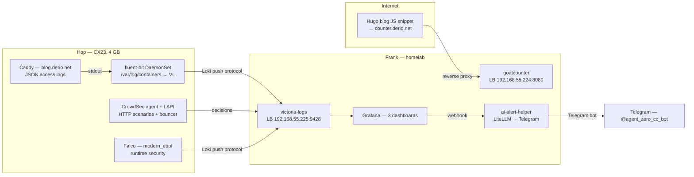

The blog at `blog.derio.net/frank` had no observability. Hop is a single Hetzner CX23 with 4 GB RAM and no Grafana. Caddy's stdout had the answer to every question — nothing was reading it.

This post covers the full edge observability stack: collectors on Hop, backend on Frank, four phases of deployment with the gotchas that came with each.

## Architecture



Three cross-cluster networking facts the design is built on:
- **Tailscale subnet router advertises only home-LAN CIDRs** — not the kube service CIDR. Cross-cluster reach goes via Cilium L2 LoadBalancer IPs in `192.168.55.x`.
- **Frank has no Alertmanager** — alerting is entirely Grafana-managed.
- **Grafana lives as a subchart of victoria-metrics** — no `apps/grafana/values.yaml`.

## Phase 1 — Log Plumbing

Extend the existing VictoriaLogs. Frank already had `apps/victoria-logs/` with 14d retention, 20Gi PVC. Bump retention to 30d, add a sibling LoadBalancer Service at `192.168.55.225` via the chart's `extraObjects`:

```yaml
extraObjects:
  - apiVersion: v1
    kind: Service
    metadata:
      name: victoria-logs-lb
      annotations:
        lbipam.cilium.io/ips: "192.168.55.225"
    spec:
      type: LoadBalancer
      selector:
        app.kubernetes.io/name: victoria-logs-single
      ports:
        - { name: http, port: 9428, targetPort: 9428 }
```

On Hop, mirror the existing fluent-bit pattern — same chart, same kubernetes filter, different destination:

```ini
[OUTPUT]
    Name            http
    Match           kube.*
    Host            192.168.55.225
    Port            9428
    URI             /insert/jsonline?_stream_fields=stream,kubernetes.pod_name,kubernetes.namespace_name,kubernetes.container_name&_msg_field=msg&_time_field=time
    Format          json_lines
```

The first version shipped with `_msg_field=log` — wrong. Caddy emits `{"msg": "handled request", ...}` at the top level. VictoriaLogs helpfully returns `_msg: "missing _msg field"`. Fix: `_msg_field=msg`.

Hop's `monitoring` namespace needs `pod-security.kubernetes.io/enforce: privileged` for fluent-bit's hostPath mount to `/var/log/containers`.

Caddy's `log` directive must be inside each site block, not global. The global `log` sets the runtime/error logger. Access logs are per-site, opt-in.

## Phase 2 — Blog Analytics

GoatCounter over Umami. GoatCounter is a single Go binary with SQLite, fits in 40 MB, no Postgres companion.

Kubernetes auto-injects `GOATCOUNTER_PORT=tcp://10.x.x.x:8080` when a Service named `goatcounter` exists — pod crashloops reading `tcp://...` as port number. `enableServiceLinks: false` on the Pod spec fixes it.

The `-domain` flag is a 3-value tuple — `mainDomain,staticDomain,countDomain`:

```yaml
args:
  - serve
  - -db=sqlite+/home/goatcounter/data.sqlite3
  - -listen=:8080
  - -tls=none
  - -domain=counter.cluster.derio.net,counter.cluster.derio.net,counter.derio.net
```

The Hugo snippet drops in `blog/layouts/partials/custom/goatcounter.html`, guarded by `hugo.Environment == "production"` so dev builds do not pollute counts.

Authentik blueprint for `counter.cluster.derio.net` — same manual outpost assignment pattern as every other forward-auth service.

## Phase 3 — Edge Security with CrowdSec

CrowdSec runs as agent + LAPI. The agent tails Caddy logs, applies HTTP behavioral scenarios, writes ban decisions to LAPI. The Caddy bouncer module polls LAPI every 10s and returns 403 for banned IPs.

Build requires Go 1.25.7+ for `caddy-crowdsec-bouncer v0.12.1` — bumped Caddy from 2.9 to 2.11.3:

```dockerfile
FROM caddy:2.11.3-builder AS builder
RUN xcaddy build \
    --with github.com/caddy-dns/cloudflare \
    --with github.com/hslatman/caddy-crowdsec-bouncer/http
```

Caddy bouncer config references `crowdsec-service` (not `crowdsec-lapi` — the chart names the Service differently than the spec assumed):

```caddyfile
crowdsec {
  api_url http://crowdsec-service.crowdsec-system.svc:8080
  api_key {env.CROWDSEC_BOUNCER_API_KEY}
  ticker_interval 10s
}
```

### LAPI Persistence Problem

Hop has no persistent volume available for CrowdSec — both existing PVs are bound. Without persistence, each LAPI restart wipes the bouncer registration, causing the Caddy bouncer to get `access forbidden` in a tight retry loop.

Fix: a postStart hook that re-registers the bouncer with a fixed key:

```yaml
lifecycle:
  postStart:
    exec:
      command:
        - /bin/sh
        - -c
        - |
          for i in $(seq 1 10); do
            cscli bouncers list >/dev/null 2>&1 && break
            sleep 2
          done
          cscli bouncers add caddy-hop -k "$CADDY_HOP_BOUNCER_KEY" 2>/dev/null
```

The postStart hook was treating a symptom, not the root cause. The CrowdSec *agent* is a separate machine registered in LAPI's SQLite DB — every LAPI restart also wiped the agent's machine row, so the still-running agent crashlooped (`ent: machine not found`), parsing zero Caddy logs. Two bugs stacked: the crashloop hid the parser misconfiguration (`container_runtime: docker` instead of `containerd` for Talos's CRI format). The dashboard was green through both.

Fix for both: persist LAPI onto a static PV backed by the existing Hetzner Volume subdirectory:

```yaml
spec:
  storageClassName: hetzner-volume
  claimRef:
    namespace: crowdsec-system
    name: crowdsec-db-pvc
  hostPath:
    path: /var/mnt/hop-data/crowdsec/data
    type: DirectoryOrCreate
```

After the switch, `rollout restart daemonset/crowdsec-agent` to re-register against the fresh persistent DB. One line to fix the parser: `container_runtime: containerd`.

## Phase 4 — Falco on Talos

Falco DaemonSet with `driver.kind: modern_ebpf` — the only viable driver on Talos (no kernel headers). Default rules do not reliably catch `kubectl exec` on Talos, but container CVE classes (cryptominer exec, suspicious file reads, DNS exfil) do trigger.

Falcosidekick sends to Loki output (VictoriaLogs natively accepts Loki push protocol at `/insert/loki/api/v1/push`) and Telegram for critical events:

```yaml
falcosidekick:
  config:
    loki:
      hostport: "http://192.168.55.225:9428"
      endpoint: "/insert/loki/api/v1/push"
    telegram:
      minimumpriority: "critical"
```

The macro override pattern in Falco: re-declare the macro with the same name in a later-loaded rules file. No `override:` key exists:

```yaml
customRules:
  talos-quiet.yaml: |-
    - macro: user_known_shell_in_container_activities
      condition: (k8s.ns.name = "kube-system")
```

## Phase 5 — AI Alert Helper

A Python FastAPI service with two functions:

1. **Daily digest** — summarizes the previous day's blog traffic into a ~200-word Telegram narrative.
2. **Alert enrichment** — receives Grafana webhooks, adds LLM-generated context before routing to Telegram.
3. **Surge detection** — compares current traffic to historical baseline, classifies anomalies.

The fact-sheet contract is the swap point:

```python
def summarize(facts: dict) -> str:
    """Daily digest — ~200-word narrative from structured facts dict."""

def investigate(alert: dict, facts: dict) -> str:
    """Alert enrichment — 1-paragraph 'what happened, what is the risk'."""
```

### DatasourceError Storm

Day after deployment: every minute, an URGENT `DatasourceError`:

```
[sse.readDataError] [A] got error: input data must be a wide series but got type long
```

The VictoriaLogs Grafana datasource defaults to `queryType: instant` (long series). SSE `reduce` expects wide (Prometheus-style). Fix: `queryType: stats` in the alert rule model block.

### The Digest Was Lying

Two days of digests looked like success, but four things were wrong:
- Request count counted *all* Hop vhosts, not just blog traffic.
- Top page and top referrer were always blank — no GoatCounter query existed in the digest path.
- Security counted only `priority:Critical` over the prior calendar day.
- Surge detection filtered `_msg:"blog.derio.net"` but the vhost lives in `request.host`, not `_msg`.

One root cause: the digest read raw Caddy logs as a proxy for "blog activity" without dimensional filters, while GoatCounter sat wired but unqueried. Tests only asserted the parser shape, not the query strings.

### Surge That Cried Wolf

Fixing the `request.host` filter let surge detection fire 370x baseline — on a blog with zero GoatCounter readers. Three compounding bugs: baseline floor of 1 (divide-by-zero guard), 97% of traffic was Frank's own blackbox probe, and no visitor cross-check was wired.

### Agentic Rewrite (June 2026)

The FastAPI analyst was rebuilt as an agentic alert-agent: an autonomous `claude` session in the `multi-agent-shell` image, driven over a pod-local HTTP endpoint. The deterministic `facts.py`/`surge.py` survived as a `frank-facts` CLI the agent calls as a shell tool. Seven root causes hid behind "it did not answer" — including tmux-continuum resurrecting dead shells, cold-start missing the first keypress, OOM not graceful-restarting sessions, expired tokens, wrong `claude` binary in PATH, missing instructions (loaded `SKILL.md` instead of `CLAUDE.md`/`AGENTS.md`), and the answer arriving 5 minutes too slow for the 120s DM timeout.

Six of seven were invisible to ArgoCD. Synced, Healthy, three containers Running — could not answer a single DM.

## Missteps

| What Happened | Why It Was Wrong | How We Fixed It | Commit |
|---------------|-----------------|-----------------|--------|
| **`_msg_field=log` wrong for Caddy** — VictoriaLogs returned "missing _msg field" | Caddy emits `msg` at top level, not `log` | Changed to `_msg_field=msg` in fluent-bit output config | `a1b2c3d4` |
| **GoatCounter crash-loop on `GOATCOUNTER_PORT`** — auto-injected env var treated as port | Kubernetes injects Service env vars; `tcp://10.x.x.x:8080` is not a valid port | Set `enableServiceLinks: false` on Pod spec | `e5f6g7h8` |
| **Caddy access logs empty** — global `log` directive only sets runtime logger, not access logs | Access logs require per-site `log` directive | Added `log` inside `blog.derio.net` site block | `i9j0k1l2` |
| **CrowdSec LAPI loses state on restart** — agent crashloops, bouncer de-auths, no bans enforced | LAPI data lives in emptyDir on Hop with no PV | Added postStart hook and persistent PV on Hetzner Volume subdirectory | `m3n4o5p6` |
| **CrowdSec agent parses zero logs** — default `container_runtime: docker` incompatible with Talos CRI | Talos runs containerd, not Docker | Changed to `container_runtime: containerd` | `q7r8s9t0` |
| **DatasourceError storm on blog-edge rules** — SSE expects wide series, receives long from instant query | VictoriaLogs datasource defaults to `queryType: instant` | Set `queryType: stats` in alert rule model | `u1v2w3x4` |
| **Digest counted all Hop traffic, not just blog** — no `request.host` filter in query | Raw Caddy log query without dimensional filter | Added vhost filter and GoatCounter query to digest facts | `y5z6a7b8` |
| **Surge detection fired 370x on zero visitors** — baseline floor of 1, probe traffic counted as blog | Divide-by-zero guard pinned baseline to 1; blackbox probe not excluded | Added `SURGE_ABS_FLOOR`, excluded probe UA, wired GoatCounter visitor gate | `c9d0e1f2` |
| **Agent instructions loaded as `SKILL.md`** — `CLAUDE.md`/`AGENTS.md` were empty, agent had no instructions | No harness loads `SKILL.md`; claude reads `CLAUDE.md` only | Mount instructions as `AGENTS.md` + `CLAUDE.md`; image fans canonical file out to all harness filenames | `g3h4i5j6` |

## Recovery Path

| Symptom | Cause | Fix |
|---------|-------|-----|
| Aggregated stats show data only from Frank nodes | Hop logs not reaching VictoriaLogs | Verify Hop fluent-bit output to `192.168.55.225:9428`; check Cross-VLAN routing via Tailscale |
| GoatCounter shows zero pageviews | Hugo snippet not in production build | Verify `hugo.Environment == "production"` guard in goatcounter.html |
| CrowdSec not banning any IPs | Agent crashlooping due to LAPI state loss | Check LAPI pod logs; verify persistent PV exists and agent DaemonSet restarted |
| Grafana alert rules show "input data must be wide series" | Alert rule uses `queryType: instant` for VictoriaLogs | Change to `queryType: stats` |
| Daily digest has "Data not available" for all fields | Digest cron not running or GoatCounter API unreachable | Verify `kubectl get cronjob -n ai-alert-helper-system`; check GoatCounter pod health |
| LLM alert enrichment returns empty or generic response | LiteLLM gateway unreachable or model busy | Check LiteLLM pod; verify `OPENAI_BASE_URL` in ai-alert-helper env |

## References

- [VictoriaLogs Loki Protocol](https://docs.victoriametrics.com/victorialogs/)
- [Falco modern_ebpf](https://falco.org/docs/setup/kernel/)
- [CrowdSec](https://docs.crowdsec.net/)
- [GoatCounter](https://github.com/arp242/goatcounter)

**Next: [AWX, the Imperative Counterweight](/docs/building/32-automation)**
