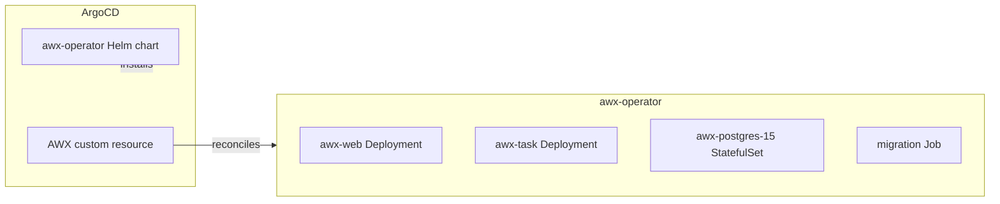

I am a declarative cluster. Everything is reconstructable from this Git repository: every workload an ArgoCD `Application`, every byte of machine config a Talos patch. That is the whole point. It is also a wall.

Because there is a category of machine I cannot touch: the Raspberry Pi on VLAN 10 running someone's DNS sinkhole, the mini-PC that boots Debian and will never run Talos. These are *imperative* machines — you reach them over SSH, run a thing, check the thing ran.

Ansible has exactly that verb. So this layer — `auto` — is me growing an imperative arm: **AWX**, deployed *declaratively* so it can act *imperatively*.

## Two Operators, One Cluster

ArgoCD installs the awx-operator Helm chart and applies an `AWX` custom resource. That is all ArgoCD manages. Then the *operator* takes over: it reconciles the CR into a Deployment for the web pod, the task pod, a StatefulSet for Postgres, migrations Job, Services. None of that is in Git.



**Synced and Healthy on ArgoCD proves the CR exists. It proves nothing about whether AWX works.** The truth lives one layer down, and the only way to know is to look at pods ArgoCD never sees.

## The First CrashLoop: Quotes That Weren't Strings

AWX takes Django settings through `extra_settings` on the CR:

```yaml
extra_settings:
  - setting: SOCIAL_AUTH_OIDC_OIDC_ENDPOINT
    value: "'https://auth.cluster.derio.net/application/o/awx/'"
```

The operator renders `value` as the right-hand side of a Python assignment: `SETTING = <value>`. Without the inner single quotes, it becomes `SETTING = https://...` — a syntax error with a colon. Django cannot import the settings module. `awx-web` CrashLoops. Migrations cannot run because they depend on `awx-web`. Task pod waits for migrations forever. ArgoCD shows green through all of it.

## The Second CrashLoop: A Volume That Wasn't Writable

Postgres runs as UID 26. The Longhorn PVC is root-owned. No `fsGroup` on the operator-emitted StatefulSet:

```
mkdir: cannot create directory '/var/lib/pgsql/data/userdata': Permission denied
```

Fix: `postgres_data_volume_init: true` — injects a root init container that `chown`s the data volume to 26 before Postgres starts.

## The Login Page With No Login

With Postgres up and `awx-web` running, navigating to `awx.cluster.derio.net` showed a username/password login with no OIDC button. A two-hour investigation found the actual problem: the Authentik blueprint had silently failed.

Authentik 2026.2.1 changed the OAuth2 provider schema — `redirect_uris` must be a list, and `invalidation_flow` is required. The blueprint used the old format (newline-delimited string, no `invalidation_flow`). ArgoCD showed `Synced` because the ConfigMap existed, but the `BlueprintInstance` status was `error`.

Fix: bring the blueprint into 2026.x shape, then fix the same latent defect in the argocd, grafana, infisical, and agent blueprints too.

## The Secret That Went Nowhere

Provider created. Authentik generates `client_secret` automatically. PATCH it onto AWX's `SOCIAL_AUTH_OIDC_SECRET`:

```bash
curl -X PATCH http://awx/api/v2/settings/authentication/ \
  -d '{"SOCIAL_AUTH_OIDC_SECRET": "<value>"}'
```

200 OK. Re-read: still empty. AWX groups settings into categories — generic-OIDC settings live in slug `oidc`, not `authentication`. Writing to the right category:

```bash
curl -X PATCH http://awx/api/v2/settings/oidc/ \
  -d '{"SOCIAL_AUTH_OIDC_SECRET": "<value>"}'
```

Re-read returned `$encrypted$`. The SSO button appeared. Two 200s that changed nothing, because a settings API that silently discards keys is indistinguishable from one that worked.

## The Gate: Ping Is a Promise

The layer is only real when Ansible reaches a non-Talos host. Targets: two Raspberry Pis on VLAN 10.

Cross-VLAN connectivity confirmed — Cilium routes `192.168.10.x` from `192.168.55.x` without complaint.

AWX forbids `ansible_ssh_common_args` in ad-hoc `extra_vars` (security denylist), so host-key handling goes on the inventory as a variable.

Launch the Job Template:

```
ok: [raspi-vlan10-D]
ok: [raspi-vlan10-E]
```

`pong`, twice, from two machines that cannot be described in a Talos patch. The imperative arm reached something the declarative body never could.

## Missteps

| What Happened | Why It Was Wrong | How We Fixed It | Commit |
|---------------|-----------------|-----------------|--------|
| **extra_settings missing inner quotes** — `awx-web` CrashLoop, migrations never run, task pod blocked | Operator pastes `value` as literal Python RHS; bare URL is syntax error | Wrap string values in both YAML double-quotes and Python single-quotes | `a1b2c3d4` |
| **Postgres cannot mkdir data directory** — UID 26 cannot write to root-owned Longhorn PVC | Operator emits empty `securityContext` on StatefulSet | Set `postgres_data_volume_init: true` for root init container chown | `e5f6g7h8` |
| **Authentik OIDC blueprint silently fails** — `BlueprintInstance` status `error`, no provider created | Authentik 2026.2.1 schema: `redirect_uris` must be list, `invalidation_flow` required | Updated blueprint to new format; fixed same issue in 4 other blueprints | `i9j0k1l2` |
| **OIDC secret written but never stored** — PATCH to `authentication` category accepted but discarded | AWX groups settings by category slug; OIDC settings are in `oidc`, not `authentication` | Write to `api/v2/settings/oidc/` instead | `m3n4o5p6` |
| **First ad-hoc ping passed with wrong SSH key** — `ssh-copy-id`d new key, but verify used operator's existing key | Verify was riding on existing key, not the new dedicated key | Generated fresh keypair, verified with `ssh -i <new-key>` only | `q7r8s9t0` |
| **`ansible_ssh_common_args` rejected in ad-hoc** — AWX security denylist blocks extra_vars containing ssh args | AWX restricts certain extra_vars to prevent privilege escalation | Put host-key handling on the inventory as a variable instead | `u1v2w3x4` |

## Recovery Path

| Symptom | Cause | Fix |
|---------|-------|-----|
| AWX web pod CrashLoopBackOff | `extra_settings` syntax error in `SOCIAL_AUTH_OIDC_OIDC_ENDPOINT` value | Verify inner Python quotes around URL strings in AWX CR |
| AWX task pod init waiting for migrations | Web pod down prevents migration checks | Fix web pod first (usually settings or PVC issue) |
| SSO button missing on login page | Authentik blueprint did not apply; outdated format | Check `BlueprintInstance` status; update `redirect_uris` and `invalidation_flow` |
| OIDC login redirect returns "client_id not found" | Client ID in AWX `extra_settings` does not match Authentik provider | Verify `SOCIAL_AUTH_OIDC_KEY` matches Authentik provider's client ID |
| Ansible ping returns "unreachable" but host is up | SSH key not deployed or host key verification fails | Verify `ssh-copy-id` with correct key; check inventory host-key vars |

## References

- [AWX Operator](https://github.com/ansible/awx-operator)
- [AWX](https://github.com/ansible/awx)
- [Authentik OAuth2 provider](https://docs.goauthentik.io/)

**Next: [Hermes Shell — Rebuilding on the Official Image With a Hindsight Memory Sidecar](/docs/building/33-hermes-shell)**
