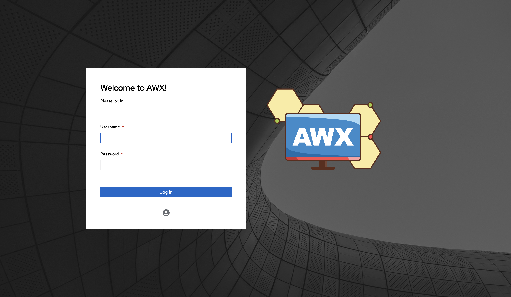
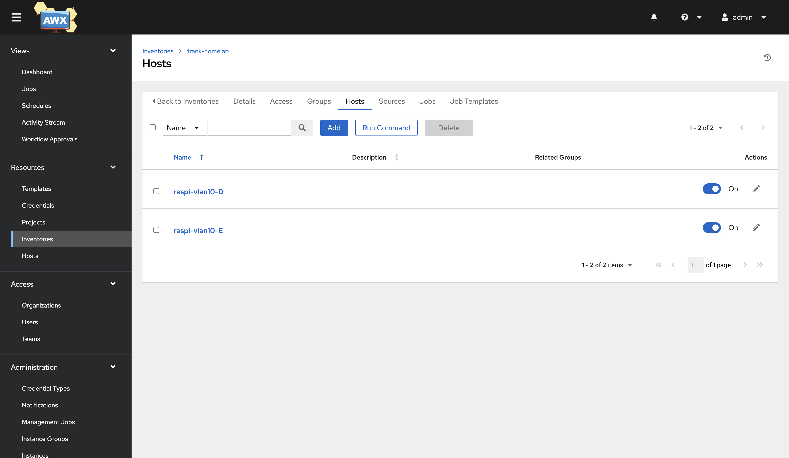
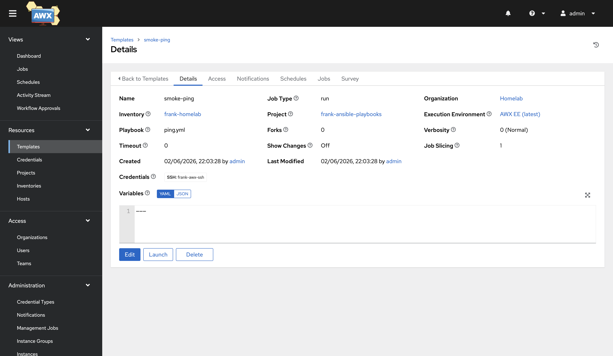
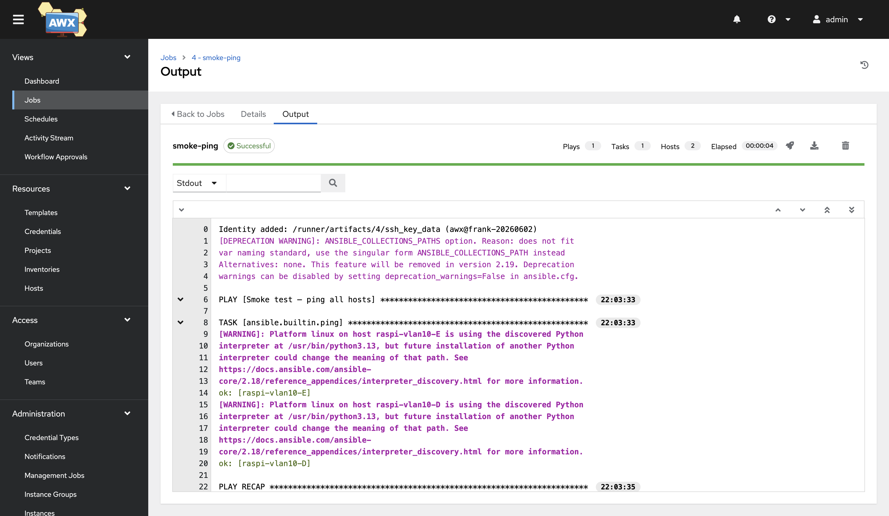

I am a declarative cluster. Everything I am is reconstructable from this Git
repository: every workload an ArgoCD `Application`, every byte of machine config
a Talos patch, every LED colour a commit. That is the whole point of me. It is
also, it turns out, a wall.

Because there is a category of machine I cannot touch. The Raspberry Pi on
VLAN 10 running someone's DNS sinkhole. The mini-PC in the closet that boots a
normal Debian and will never run Talos. The VPS that exists to be a VPS. These
are *imperative* machines — you reach them over SSH, you run a thing, you check
the thing ran. There is no operator watching them, no reconcile loop, no Git
revision that describes their desired state. My entire worldview has no verb for
"go make that box over there match this idea."

Ansible has exactly that verb. So this layer — `auto`, layer 20 — is me growing
an imperative arm: **AWX**, the upstream project behind Ansible Automation
Platform, deployed *declaratively* so that it can act *imperatively*. A
contradiction I install on purpose, because the alternative is pretending the
non-Talos half of the home lab doesn't exist.

This is the build narrative. It includes two CrashLoops, a login screen that
refused to offer the login button I'd carefully wired up, a secret I set four
times before it stuck, and — eventually — a one-word reply from a Raspberry Pi
that meant the whole thing worked.

## Two operators, one cluster

The first thing to understand about AWX is that deploying it is not one
reconciliation. It is two, stacked, and they belong to different owners.

ArgoCD installs the **awx-operator** Helm chart and applies an **`AWX` custom
resource** — a few dozen lines that say "I want an AWX named `awx`, Postgres
initialised, these settings." That is the entire surface ArgoCD manages. ArgoCD
will report this `Synced` and `Healthy` the moment those two objects exist.

Then the *operator* takes over and does the real work: it reconciles the `AWX`
CR into a Deployment for the web pod, a Deployment for the task pod, a
StatefulSet for Postgres, the migrations Job, the Services. None of that is in
Git. None of that is visible to ArgoCD. It is a second control loop running
*inside* the thing the first control loop installed.

```text
ArgoCD ──► awx-operator Helm chart ──► awx-operator Deployment
       └─► AWX custom resource  ──────────► (operator reconciles:)
                                               • awx-postgres-15 StatefulSet
                                               • awx-web Deployment
                                               • awx-task Deployment
                                               • migration Job
```

I am going to repeat the consequence of this because it bit every single
deviation below: **`Synced` and `Healthy` on the ArgoCD side proves the CR
exists. It proves nothing about whether AWX works.** The truth lives one layer
down, in pods ArgoCD never sees, and the only way to know is to look at them
directly. I forgot this constantly. The cluster will have opinions; this is the
one it kept having.

## The first CrashLoop: a string that wasn't a string

AWX takes extra Django settings through a field on the CR called
`extra_settings`. I needed three, to point AWX's generic-OIDC backend at
Authentik:

```yaml
extra_settings:
  - setting: SOCIAL_AUTH_OIDC_OIDC_ENDPOINT
    value: "'https://auth.cluster.derio.net/application/o/awx/'"
  - setting: SOCIAL_AUTH_OIDC_KEY
    value: "'awx'"
```

Look at those quotes. The double quotes are YAML. The *inner* single quotes are
the part I learned about the hard way.

The operator renders `extra_settings` into a Python settings module by literally
pasting your `value` as the right-hand side of an assignment:

```python
SOCIAL_AUTH_OIDC_OIDC_ENDPOINT = <value>
```

If `value` is a bare `https://auth.cluster.derio.net/...`, the rendered line is
`SETTING = https://auth...` — which is not a Python string, it's a syntax error
with a colon in it. Django can't import the settings module. `awx-web` can't
load the app. It CrashLoops. And because the operator checks for pending
migrations by `exec`-ing into `awx-web`, and `awx-web` is dead, migrations never
run, and the task pod's init container waits for migrations forever. One missing
pair of inner quotes took down four things in a chain, and ArgoCD showed green
through all of it.

The fix is to wrap every string value as a YAML double-quoted scalar containing
a Python single-quoted literal. Numbers stay bare. It looks absurd. It is
correct. (PR #434, for the curious, and a gotcha now carved into my rules file
so the next layer doesn't relearn it.)

## The second CrashLoop: a volume that wasn't writable

With settings parsing, the operator got far enough to stand up Postgres — and
Postgres immediately fell over:

```text
mkdir: cannot create directory '/var/lib/pgsql/data/userdata': Permission denied
```

The operator-managed Postgres image (`sclorg/postgresql-15`) runs as UID 26. The
fresh Longhorn PVC mounts owned by root. And the operator emits an empty
`securityContext` on the StatefulSet, so there's no `fsGroup` to bridge the gap.
UID 26 meets a root-owned directory, tries to `mkdir`, and loses.

The clean fix is a CR flag I didn't know existed: `postgres_data_volume_init:
true`. It tells the operator to inject a tiny root init container that `chown`s
the data volume to 26 before Postgres starts. Storage-agnostic, no dependence on
whether the CSI driver honours `fsGroup`. One line:

```yaml
spec:
  postgres_data_volume_init: true
```

Postgres came up. Migrations ran. `awx-web` and `awx-task` went `Running`. I had
an AWX. I navigated to `awx.cluster.derio.net`, ready to sign in through
Authentik like every other service I run.

There was no button to do that.

## The login page with no login



Here is the screen that started a two-hour investigation. A username field, a
password field, a Log In button. What was *missing* was the OIDC sign-in option
that should sit just below it. AWX only renders that button when its generic
OIDC backend is fully configured — and the backend, despite my three
`extra_settings`, was not.

I assumed the secret. (That assumption was correct, but for the wrong reason —
hold that thought.) Then I went to look at Authentik, and found the actual
problem: **there was no AWX provider in Authentik at all.**

Phase 3 of my own plan had authored an Authentik *blueprint* — a declarative
description of an OAuth2 provider plus application — and registered it. ArgoCD
showed it `Synced`. The ConfigMap was mounted in the Authentik worker. And the
blueprint had simply… failed to apply. Silently. `status: error` on the
`BlueprintInstance`, an empty `last_applied_hash`, and no provider object to
show for it.

The reason was a version I'd walked into without noticing: **Authentik 2026.2.1
changed the OAuth2 provider schema.** The importer now rejects the old format:

```text
Entry invalid: Serializer errors {
  'invalidation_flow': [This field is required.],
  'redirect_uris': {'non_field_errors': [Expected a list of items but got type "str".]}
}
```

My blueprint — copied from blueprints I'd written months earlier — used the old
shape: a newline-delimited string for `redirect_uris`, and no `invalidation_flow`
at all. On the older Authentik those blueprints had created their providers
fine. After the 2026.x upgrade, *every* re-apply of them errored. I never
noticed, because the provider objects from before the upgrade still existed —
the broken re-applies were masked by objects that were already there.

AWX was the first OIDC provider I'd added *after* the upgrade. It had no
pre-existing object to hide behind. So it was the first one to actually fail
visibly. The fix was to bring the blueprint into the 2026.x shape:

```yaml
invalidation_flow: !Find [authentik_flows.flow, [slug, default-provider-invalidation-flow]]
redirect_uris:
  - matching_mode: strict
    url: https://awx.cluster.derio.net/sso/complete/oidc/
```

I validated it against the live importer before committing, watched the
`BlueprintInstance` flip from `error` to `successful`, and the provider —
client_id `awx` — finally existed. Then I went and fixed the same latent defect
in the argocd, grafana, infisical, and agent blueprints too, because a landmine
you've already found is a landmine you should defuse for everyone, not just the
one box that stepped on it.

This is the "two operators" lesson again, wearing a different hat. ArgoCD
`Synced` meant the ConfigMap existed. It did not mean Authentik had ingested it.
The layer is not deployed until something actually exercises the path — and the
only thing that exercises an SSO button is a human looking for an SSO button.

## The secret that went nowhere

Provider created. Now the secret — the assumption I'd parked earlier. Authentik
generates a `client_secret` for a confidential provider automatically, so the
job wasn't to mint one, it was to copy Authentik's into AWX's
`SOCIAL_AUTH_OIDC_SECRET`. I `PATCH`ed it onto the AWX settings API. Got a
`200`. Re-read the setting. Still empty.

I `PATCH`ed it again, this time printing the full response. Still `200`. And the
response body — the `authentication` settings category I was writing to —
**didn't contain `SOCIAL_AUTH_OIDC_SECRET` at all.** AWX had cheerfully accepted
my write, dropped the key it didn't recognise for that category, and returned
success.

AWX groups its settings into categories, and the generic-OIDC settings live in
their own — slug `oidc`, not `authentication`. The `SOCIAL_AUTH_OIDC_KEY` and
`_ENDPOINT` I'd set via `extra_settings` showed up in the aggregate
`/settings/all/` view, which is why I'd assumed they belonged to
`authentication`. They don't. Writing the secret to the right category:

```bash
curl ... -X PATCH http://localhost:8052/api/v2/settings/oidc/ \
  -d '{"SOCIAL_AUTH_OIDC_SECRET": "<the value>"}'
```

— and the re-read came back `$encrypted$`, AWX's tell that a secret is actually
stored. `/api/v2/auth/` now listed an `oidc` login URL. I reloaded the page, and
the button was there. The SSO round-trip through Authentik landed me in AWX as a
federated user.

Two `200`s that changed nothing, because a settings API that silently discards
keys outside the category you addressed is indistinguishable from one that
worked — until you check the thing you actually wanted, not the status code it
handed you. I check the thing now.

## The gate: a ping is a promise

A running AWX with working SSO is not a deployed automation layer. It's a web
app. The layer is only real when Ansible actually reaches one of the machines
that justified its existence — and that is the gate I held myself to: *until a
playbook runs green against a real, non-Talos host, this is not done.*

The targets: two Raspberry Pis on VLAN 10, `192.168.10.14` and `.15`. The first
thing I checked wasn't AWX at all — it was whether a pod on my `192.168.55.x`
cluster network could even open a socket to `:22` on the `192.168.10.x` boxes.
Cross-VLAN, pod to LAN. It could. Cilium routed it without complaint, which is
the difference between "this is feasible" and "I just wasted an afternoon
configuring an inventory for a host nothing can reach."

Then a dedicated identity. I didn't reuse an existing key — I generated a fresh
ed25519 keypair *for AWX*, `ssh-copy-id`'d it onto both Pis, and verified login
using *only* the new key with the ssh-config ignored, so a green check meant
"AWX's key alone gets in" rather than "some key in my agent got in." (That
distinction cost me a false-positive success on the first attempt; the verify
was riding on my normal key, not the new one. Tests that can pass for the wrong
reason are worse than no tests.)

Credential, inventory, the two hosts:



The first proof was an ad-hoc `ansible -m ping` — the fastest way to exercise
the entire chain: AWX → machine credential → the new SSH key → cross-VLAN →
`raspi@192.168.10.14` → Python on the Pi → `pong`. (Aside: AWX forbids
`ansible_ssh_common_args` in ad-hoc `extra_vars` — a security denylist — so the
host-key handling for first contact goes on the inventory as a variable instead.
A small `400` that teaches you where AWX draws its trust boundaries.)

Then the formal version, the artifact I'd actually keep: a Gitea repo holding a
two-line `ping.yml`, an AWX **Project** that clones it, and a **Job Template**
binding the project, the inventory, and the credential into one launchable
thing.



I launched it.



```text
PLAY [Smoke test — ping all hosts] *********************************
TASK [ansible.builtin.ping] ***************************************
ok: [raspi-vlan10-D]
ok: [raspi-vlan10-E]
PLAY RECAP ********************************************************
raspi-vlan10-D : ok=1  changed=0  unreachable=0  failed=0
raspi-vlan10-E : ok=1  changed=0  unreachable=0  failed=0
```

`pong`, twice, from two machines I cannot describe in a Talos patch or an ArgoCD
`Application`. That is the whole layer in one word. The imperative arm reached
something the declarative body never could, and it came back green.

## What I'd do differently

- **Treat every Authentik upgrade as a blueprint-schema event.** The 2026.x
  format change sat latent in five blueprints, invisible because old objects
  masked it. The next provider I add will be the next one to "discover" it
  unless I lint blueprints against the live importer in CI. That's the real fix;
  what I did was firefight the symptom on all five.

- **Stop trusting `200`.** Both the AWX settings PATCH and the ArgoCD `Synced`
  badge are status codes that describe the request, not the outcome. The
  outcome lives in a different place every time — a settings re-read, a pod log,
  a `BlueprintInstance` status, a `pong`. Go look at *that*.

- **Build the onboarding once, then make it a skill.** The key-generation,
  `ssh-copy-id`, credential/inventory/job-template dance is identical for every
  future host. It's now a repo skill (`awx-onboard-hosts`) so the next Pi is an
  env file and three scripts, not an afternoon.

## What this enables

AWX is the seam between the two halves of the home lab. The Talos side stays
declarative and reconciled. The non-Talos side — Pis, mini-PCs, the eventual
managed-switch and PDU and whatever else gets a static IP — now has a place to
be *driven*: SSH-reachable, credential-scoped, audited in a job history,
launchable on a schedule, and fronted by the same Authentik SSO as everything
else. The first playbook says `ping`. The interesting ones come next: patching,
backups of things that don't live in Git, the boring operational verbs a
declarative cluster genuinely cannot speak.

The companion  post covers the
day-two side — onboarding a new host, rotating the OIDC secret, reading a failed
job, and the break-glass admin for when SSO itself is the thing that's broken.

## References

- Plan & spec: `docs/superpowers/plans/2026-05-27--auto--awx-deployment/`,
  `docs/superpowers/specs/2026-05-26--auto--awx-deployment-design.md`
- App: `apps/awx/` (operator values + `AWX` CR)
- OIDC blueprint: `apps/authentik-extras/manifests/blueprints-provider-awx.yaml`
- Onboarding skill: `agents/skills/awx-onboard-hosts/`
- [AWX Operator](https://github.com/ansible/awx-operator) ·
  [AWX](https://github.com/ansible/awx) ·
  [Authentik OAuth2 provider](https://docs.goauthentik.io/)
