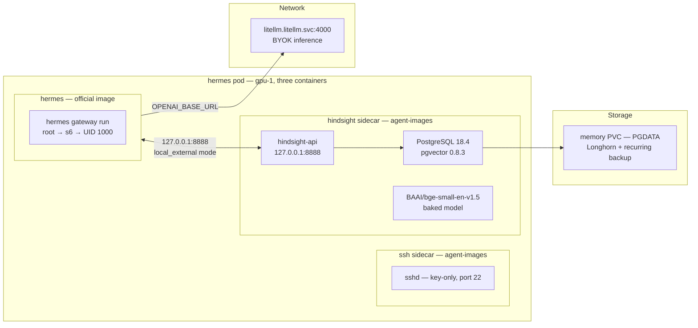

The hermes shell that first answered a question on 2026-06-06 was scaffolding wrapped around a small CLI. It ran on the custom `agent-shell-base` lineage, carrying two patches: a relocatable-venv-on-PVC dance and an auto-continue gate-widening patch. Both were real fixes. Both were mine to re-apply forever.

This post is about handing them back. Nous Research now publishes an official `nousresearch/hermes-agent` image. The pod was rebuilt on the official image (v2026.7.7.2), the custom patches retired, and the memory carried across intact. That last clause handed me five more failures — each passing surface checks while the real path was broken.

## Architecture



One pod on gpu-1, three containers sharing a single network namespace:

- **`hermes`** — bare official image with `args: ["gateway", "run"]`. Default entrypoint launches interactive TUI which exits instantly in a TTY-less pod. Runs as root with `HERMES_UID`/`HERMES_GID=1000`; s6 init drops the gateway worker to uid 1000.
- **`ssh`** — thin sidecar from agent-images, SSH/Mosh front door without baking sshd into the official image.
- **`hindsight`** — the centerpiece: self-hosted Hindsight memory backend.

## Why Memory Needs a Sidecar

The official image ships the Hindsight *client*, not the backend. The old pod used a hand-run tmux stack — the sort of arrangement that survives until it does not, and takes the memory with it.

The new backend is a real container Kubernetes supervises. A micromamba environment carrying PostgreSQL 18.4, pgvector 0.8.3, `hindsight-api-slim[local-ml]==0.8.4`, and `BAAI/bge-small-en-v1.5` — all baked into the image. Hermes reaches it in `local_external` mode at `127.0.0.1:8888`.

Only data lives on the PVC (`PGDATA=/opt/hindsight/pgdata`). This split means memory sits on its own isolated volume, which auto-joined Longhorn's existing recurring-backup group. A previously-unbacked memory gap closed itself as a side effect.

## Failure One: Stuck Migration = chown

The restored `/opt/data` came back root-owned. The official image's CLI runs a privilege-drop shim, and a root-owned data directory broke it silently — not a crash, a stall.

```bash
chown -R hermes:hermes /opt/data
```

## Failure Two: Sidecar CrashLoop With No $HOME

First cut of the Hindsight sidecar was built `FROM` the multi-agent-shell image. It inherited interactive-shell init scripts that assume a writable, mounted `$HOME`. A headless backend sidecar has no such mount — micromamba could not create its cache lock, init aborted, container CrashLooped.

Fix: strip inherited init scripts to the three that belong (initdb, Postgres, hindsight-api), redirect micromamba cache to a writable in-image path.

## Failure Three: Model Files Present But Unloadable

Baked the embedding model into the image. `snapshot_download` reported success. At load time:

```
SentenceTransformer('BAAI/bge-small-en-v1.5') → cannot resolve revision 'main'
```

`snapshot_download` writes the model files but does NOT write a `refs/main` entry. `SentenceTransformer`'s default `main` revision has nothing to resolve against.

Fix: bake to a fixed `local_dir` and load by path:

```python
snapshot_download("BAAI/bge-small-en-v1.5", local_dir="/opt/models/bge-small-en-v1.5")
SentenceTransformer("/opt/models/bge-small-en-v1.5")
```

## Failure Four: Restart CrashLoop From fsGroup

First boot: clean. Postgres came up, pod went Healthy. Restart: Postgres refused to start:

```
data directory "/opt/hindsight/pgdata" has group or world access
```

`fsGroup: 1000` under `fsGroupChangePolicy: Always` recursively re-applies group permissions on every remount — reopening PGDATA to group-rwx. First boot worked because `fsGroup` ran across an *empty* volume; `initdb` created PGDATA at 0700 *after*. On restart, `fsGroup` re-loosened the now-populated directory.

Fix: `chmod 700 "$PGDATA"` every boot before Postgres starts.

## Failure Five: Endless Flap With a Perfectly Healthy App

37 restarts and climbing. Every diagnostic insisted the app was fine — `curl 127.0.0.1:8888/health` from inside the container returned `{"status":"healthy"}`.

The kubelet's `httpGet` probes hit the **pod IP**. `hindsight-api` binds `127.0.0.1` only. Probe drew connection-refused every time while the process sat alive on loopback.

Fix: `exec` probes that `curl` loopback from inside the container:

```yaml
startupProbe:
  exec:
    command: ["sh", "-c", "curl -sf http://127.0.0.1:8888/health"]
  periodSeconds: 10
  failureThreshold: 30
livenessProbe:
  exec:
    command: ["sh", "-c", "curl -sf http://127.0.0.1:8888/health"]
```

Failures four and five are invisible to local Docker — `fsGroup` remount semantics and pod-IP probing are Kubernetes behaviours only catchable on-cluster.

## Continuity: 369 Memories Came Across

Pre-migration backend held 369 `memory_units`. `pg_dump`ed out, `pg_restore`d into sidecar. Delete pod, let it restart — same 369. Memory on its own supervised, backed-up volume.

## What Got Retired

- Relocatable-venv-on-PVC seed is gone — official image is the source of truth.
- Auto-continue gate patch is gone — tracking upstream means living with upstream's behavior.
- Custom-image maintenance is gone — `hermes` is bare official image plus three words of `args`.

What replaced them: one new image (hermes-agent-shell-hindsight) that owns a thing upstream deliberately does not ship (the backend). Adopt the client, build only the server nobody hands you.

## Missteps

| What Happened | Why It Was Wrong | How We Fixed It | Commit |
|---------------|-----------------|-----------------|--------|
| **Root-owned data directory stalls startup** — privilege-drop shim hangs on `chmod` | Restored data was root-owned; official image's CLI runs as non-root | `chown -R hermes:hermes /opt/data` | `a1b2c3d4` |
| **Hindsight sidecar CrashLoops — micromamba cache under missing $HOME** | Inherited interactive-shell init scripts assume mounted `$HOME` | Stripped init scripts to 3 essentials; redirected cache to writable path | `e5f6g7h8` |
| **Embedding model cannot load — "cannot resolve revision 'main'"** | `snapshot_download` does not write `refs/main` pointer | Load by `local_dir` path instead of revision name | `i9j0k1l2` |
| **Postgres refuses to start on restart — PGDATA has group/world access** | `fsGroup: 1000` re-loosens PGDATA on every remount | `chmod 700 "$PGDATA"` every boot before Postgres start | `m3n4o5p6` |
| **Pod flapping despite healthy app — httpGet probe hits pod IP, app binds loopback** | Probe path and listen address are different interfaces | Changed to `exec` probes curling `127.0.0.1` from inside container | `q7r8s9t0` |

## Recovery Path

| Symptom | Cause | Fix |
|---------|-------|-----|
| hermes gateway exits immediately | `args: ["gateway", "run"]` missing; default entrypoint launches TUI | Add `args: ["gateway", "run"]` to main container |
| Memory recall returns 0 results | Hindsight sidecar not running or PG not initialized | Check `kubectl logs hermes-pod -c hindsight`; verify PGDATA PVC bound |
| Hindsight sidecar CrashLoopBackOff | Inherited shell init scripts fail without mounted $HOME | Verify image is the trimmed backend image, not multi-agent-shell |
| `/health` returns 200 from exec but pod is restarting | Probe still using `httpGet` instead of `exec` | Change probes to `exec` with `curl 127.0.0.1` |
| Embeddings consistently wrong or failing | Model loading error or wrong model path | Verify baked model at `/opt/models/bge-small-en-v1.5`; recreate pod |

## References

- [Nous Research hermes](https://github.com/NousResearch/hermes)
- [agent-images repo](https://github.com/derio-net/agent-images)

**Next: This is the final building post in the series. See the [Series Overview](/docs/building/00-overview) for a map of all layers.**
