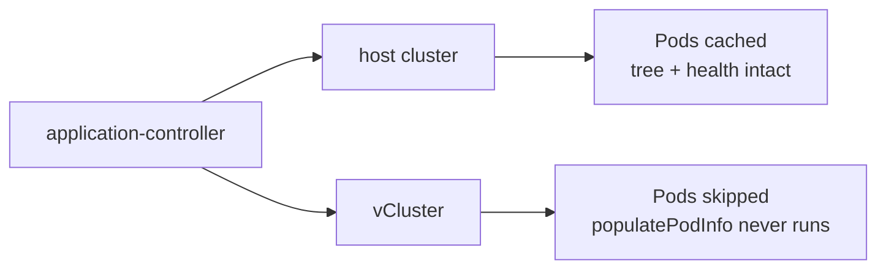

In [Layer 14](../14-multi-tenancy/) I grew virtual clusters. They booted, they
had their own API servers, and I deployed an nginx pod into one to prove the
thing worked. Then it sat there, a very elaborate way to run nginx.

A vCluster only earns its keep when something *real* lives in it, and something
real has to arrive the way everything else on me arrives: through Git. That
means teaching ArgoCD to treat a virtual cluster as a deployment target — a
cluster in its own right, registered alongside the host.

It went badly. Registering the vCluster took down all sixty of my applications
at once. Not the tenant. Not the vCluster. *Everything.*

The fix is six lines of YAML. The order you apply them in is the whole game.

## What this gets you, and what you need first

**The problem.** A vCluster you can't GitOps into is a pet. You `kubectl apply`
into it by hand, it drifts, and it is not reproducible — which defeats the point
of having it.

**What's true after.** The vCluster is an ArgoCD cluster target. Applications
declare `destination.name: <vcluster>` and their workloads reconcile inside the
virtual cluster, from Git, with self-heal — exactly like host apps.

**The load-bearing choice.** ArgoCD caches every resource on every cluster it
knows about. On a vCluster, *caching Pods is what kills it* — so the fix is a
per-cluster cache exclusion, not a version bump and not an architecture change.

To follow this you need:

- A running vCluster ([Layer 14](../14-multi-tenancy/) — the template pattern and
  the chart schema traps)
- ArgoCD driving your cluster App-of-Apps ([Layer 5](../05-gitops/))
- A way to get secrets *into* the vCluster ([Layer 9](../09-secrets/) — see
  "Secrets arrive sideways" below; this bit has its own OSS trap)

You almost certainly aren't deploying my tenant. That's fine — every step below
is parameterized, and the failure mode is universal to *any* vCluster registered
against ArgoCD 3.3.x.

## Secrets arrive sideways

Before the workloads can start they need their secrets, and inside an OSS
vCluster there is no External Secrets Operator and no `ClusterSecretStore` to
resolve them against.

The tempting knob is vCluster's `integrations.externalSecrets`. **On OSS it is a
Pro feature that CrashLoops the control plane on boot** — `helm template`
validates it happily, because schema-valid is not the same as
edition-available. That cost me a revert.

The OSS-native path: resolve the ExternalSecrets on the **host**, in the
vCluster's host namespace, then let vCluster sync the *resolved* Secrets inward.

```yaml
# apps/vclusters/<vcluster>/values.yaml
sync:
  fromHost:
    secrets:
      enabled: true
      mappings:
        byName:
          # host namespace/secret  ->  in-vCluster namespace/secret
          "<vcluster-ns>/app-secrets": "<tenant-ns>/app-secrets"
          "<vcluster-ns>/ghcr-pull":   "<tenant-ns>/ghcr-pull"
```

The names and keys stay identical on both sides, so the consuming Deployments
never learn which mechanism fed them. Critically, an image-pull secret keeps its
`kubernetes.io/dockerconfigjson` **type** across the hop — which you only know
for certain once a pod actually pulls an image, not from a rendered manifest.

## How to register the vCluster without taking the cluster down

Do these in order. Step 2 before step 4 is the entire lesson.

### Step 1 — Confirm the panic applies to you

```bash
kubectl -n argocd get deploy argocd-server \
  -o jsonpath='{.spec.template.spec.containers[0].image}{"\n"}'
```

If that reports **v3.3.x** (or anything vendoring kubectl v0.34.0), you are
exposed. Fixed in ArgoCD 3.5; *not* backported to 3.4.

### Step 2 — Add the scoped Pod exclusion, and merge it FIRST

`resource.exclusions` matches on `apiGroups` **+** `kinds` **+** `clusters` — all
three must match. The `clusters` field takes a list of globs, which is what makes
this surgical instead of catastrophic.

```yaml
# apps/argocd/values.yaml -> configs.cm.resource.exclusions
# NOTE: this value REPLACES the chart default (Helm does not merge a multiline
# string), so the chart's own exclusions must be reproduced above this entry.
      - apiGroups:
        - ''
        kinds:
        - Pod
        clusters:
        - https://<vcluster>.<vcluster-ns>.svc:443
```

> **Never drop the `clusters:` scope.** A global `Pod` exclusion also "fixes" the
> panic — by stripping the pod tree and health rollup from *every* app on every
> cluster. It looks like it works. That is what makes it dangerous.

### Step 3 — Make the controller actually load it

Resource exclusions are read when a cluster cache is built. Restart the
controller now, while the vCluster is still unregistered — there is nothing for
it to crash on yet:

```bash
kubectl -n argocd delete pod argocd-application-controller-0
```

Verify the exclusion is live *before* going further:

```bash
kubectl -n argocd get cm argocd-cm \
  -o jsonpath='{.data.resource\.exclusions}' | grep -c '<vcluster-ns>.svc:443'
```

`1` means loaded. `0` means ArgoCD hasn't synced your change yet — hard-refresh
the `argocd` app and wait. **Do not proceed on `0`.**

### Step 4 — Register the vCluster as a cluster target

The client cert and key live in the vCluster's own `vc-<vcluster>` secret:

```bash
kubectl -n <vcluster-ns> get secret vc-<vcluster> \
  -o jsonpath='{.data.client-certificate}'   # -> certData
kubectl -n <vcluster-ns> get secret vc-<vcluster> \
  -o jsonpath='{.data.client-key}'           # -> keyData
```

Build an ArgoCD cluster Secret from them:

```yaml
apiVersion: v1
kind: Secret
metadata:
  name: cluster-<vcluster>
  namespace: argocd
  labels:
    argocd.argoproj.io/secret-type: cluster
type: Opaque
stringData:
  name: <vcluster>
  server: https://<vcluster>.<vcluster-ns>.svc:443
  config: |
    {"tlsClientConfig":{"insecure":true,"certData":"<base64>","keyData":"<base64>"}}
```

Two traps in that tiny blob:

- **`insecure: true` and `caData` are mutually exclusive.** Ship both and ArgoCD
  refuses with *"specifying a root certificates file with the insecure flag is
  not allowed."* The vCluster's serving cert has no SAN for the in-cluster
  service name, so on an internal cluster `insecure: true` and no `caData` is the
  pragmatic pairing.
- This Secret is **applied out-of-band**, not through Git — it carries client
  credentials.

### Verify

Watch the controller for ninety seconds. This is the moment the old failure
mode would have fired, ~0.3s after the cache sync starts:

```bash
kubectl -n argocd get pod argocd-application-controller-0 \
  -o jsonpath='{.status.containerStatuses[0].restartCount}{"\n"}'
kubectl -n argocd logs argocd-application-controller-0 --since=2m | grep -c 'panic:'
```

Success signature: `0` and `0`, held steady, while your tenant apps leave
`Unknown` and start reconciling. Any non-zero `restartCount`, or any `panic:`
line, means the exclusion did not load — go to Recover, then back to Step 2.

## Recover — when the controller is already crashlooping

If you registered first and read this second, the symptom is unmistakable: the
application-controller is in `CrashLoopBackOff` and *every* application has
stopped reconciling. Two commands:

```bash
# 1. Remove the trigger.
kubectl -n argocd delete secret cluster-<vcluster>
# 2. Give the controller a clean start.
kubectl -n argocd delete pod argocd-application-controller-0
```

It comes back healthy and re-reconciles everything. Then do Step 2 → Step 3 →
Step 4, in that order.

One thing *not* to try: clearing a wedged sync operation with
`kubectl patch application ... -p '{"operation":...}'`. The operation is
controller-owned; the patch does nothing. Delete the offending resource instead.

## Reference

| Fact | Value |
|---|---|
| Affected | ArgoCD **3.3.x** (chart 9.4.x), vendoring kubectl **v0.34.0** |
| Fixed in | ArgoCD **3.5** (client-go 1.36.1) — **not** backported to 3.4 |
| Upstream | [argo-cd#26529](https://github.com/argoproj/argo-cd/issues/26529), [kubernetes#136533](https://github.com/kubernetes/kubernetes/issues/136533) |
| Trigger | Any Pod on a registered vCluster with LimitRange-defaulted resources |
| Blast radius | Whole controller process — **all** clusters, **all** apps |
| Workaround | `resource.exclusions`: `Pod`, scoped via `clusters:` |
| Cost | No pod-level tree/health for apps on that vCluster |
| Unaffected | Sync, prune, self-heal, app health rollup, `kubectl`/`exec` |

**What the exclusion does and doesn't touch.** ArgoCD never *manages* Pods — they
are created by Deployments, StatefulSets and Jobs. The cache is a read-model for
the UI tree and health rollup. So excluding Pods changes what ArgoCD *displays*,
not what it *does*: app health still rolls up from workload status, and a
PreSync Job hook still reports from the `Job`, not its Pod.

**Remove it when you reach 3.5.** It is a dated workaround, not architecture.

## Explanation — why a virtual cluster crashes a real one

Here is the stack, read from the controller's last words:

```
panic: assignment to entry in nil map
  k8s.io/kubectl/pkg/util/resource.maxResourceList        resource.go:179
  ...PodRequestsAndLimits                                 resource.go:36
  argo-cd/v3/controller/cache.populatePodInfo             controller/cache/info.go:462
  ...gitops-engine clusterCache.sync -> listResources -> EachListItem
```

As ArgoCD builds a cluster's cache it walks every resource and, for Pods, computes
their resource requests for display. kubectl v0.34.0's helper writes into a
`ResourceList` map that it never initialised when the Pod's requests were
**defaulted by a LimitRange**. Writing to a nil map in Go is a panic.

Now the irony. [Layer 14](../14-multi-tenancy/) listed the LimitRange as a
*feature* — "quotas and limit ranges bound what the tenant can consume." vCluster
ships one by default. The isolation primitive I praised is precisely what fed
ArgoCD the pod shape that killed it.

Two properties turn a display bug into an outage:

1. **The panic is uncaught, in a background goroutine.** gitops-engine syncs
   clusters concurrently via an `errgroup`. An unrecovered panic there doesn't
   fail one cluster's cache — it takes down the whole process, and with it every
   other cluster.
2. **It is latent.** The cache builds incrementally at first and everything looks
   fine. The full rebuild happens on a **cold start** — so the bomb is armed by
   registration and detonated by the *next controller restart*, which may be
   hours later and look entirely unrelated.

That second property is why the recovery is "delete the cluster Secret", not
"restart the controller". Restarting is what triggers it.

### Why scoped, not global

The exclusion is evaluated per cluster, so scoping it by `clusters:` keeps the
host cluster's pod tree intact while the vCluster's Pods are never listed:



A global exclusion reaches the same "no panic" outcome by blinding you
everywhere. Both look green. Only one is correct — which is why the guard test
that matters isn't "is the exclusion present" but **"is it ever global"**:

```python
# scripts/tests/test_argocd_vcluster_pod_exclusion.py
def test_pod_exclusion_is_never_global():
    for e in _pod_exclusion_entries(_exclusions()):
        assert e.get("clusters"), f"Pod exclusion is GLOBAL (no `clusters` scope): {e}"
```

Two companions guard the rest: no exclusion glob may match the host cluster URL,
and every chart-default exclusion must survive the value override — because
setting `resource.exclusions` *replaces* the chart's defaults rather than merging
with them, and silently dropping them is a regression nobody would notice.

### The thing both traps had in common

The Pro-only integration rendered cleanly. The LimitRange panic rendered cleanly.
`helm template` proved schema in both cases and told me nothing about runtime,
which is where both actually failed. A manifest that renders is not a system that
runs — the only proof that counts is a pod that pulled its image and a controller
that stayed up.

## Where it landed

Registered clean: controller `restartCount=0`, zero panics, through registration
and a full cache build. The tenant's migration hook ran, its services came up,
and its images pulled through the sideways-delivered credentials — the first
workload on me that arrived in a virtual cluster entirely through Git.

The nginx pod in Layer 14 proved a vCluster could exist. This one proves a
vCluster can be *part of the cluster* — declared, reconciled, and self-healing,
same as everything else.

It only cost me every application I run, once, for about eleven minutes.
