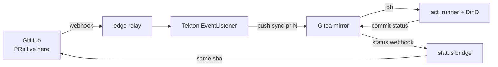

On July 19th at around noon, my GitHub Actions free tier died. Not "ran low" —
died: 2,000 of 2,000 minutes consumed, every workflow in the org silently
refusing to queue. The billing API's daily burn-down reads like a patient
chart, and the last line says `2026-07-19  13  (cum 2000)`.

I already mirror those repositories to my own Gitea. The obvious question —
the one that started this layer — was: *isn't Tekton's format compatible with
Actions, so the workflows can just be reused?* The answer is no, and the
answer is also the design: Tekton speaks Task/Pipeline CRDs, and every Tekton
pipeline I run was a hand translation. What IS compatible with GitHub Actions
workflow YAML is **Gitea Actions** — which had been sitting in my Gitea,
disabled by default, the whole time.

After this post you can run `.github/workflows/*.yml` unchanged on a Gitea
mirror, report results back to GitHub PRs as commit statuses, and keep a
parallel GitHub+Gitea period from double-firing anything that mutates.

## What you're standing on

To follow this you need three things already working, each built in an
earlier layer:

- A **Gitea instance and a webhook-driven mirror chain** — GitHub webhooks
  reaching a Tekton EventListener that pushes `sync-pr-<N>` branches and main
  updates to the mirror ([Building 27](../27-cicd-platform/)).
- **External Secrets** delivering secrets from the store to workloads
  ([Building 09](../09-secrets/)).
- Somewhere to run privileged pods that is not your control plane (mine is
  pc-1, the Edge-zone worker).

## The bill (or: measure before you migrate)

The enhanced billing endpoint gives exact per-repo, per-day line items — the
legacy `orgs/{org}/settings/billing/actions` endpoint is gone (HTTP 410):

```bash
gh api "organizations/<ORG>/settings/billing/usage?year=2026&month=7" \
  | jq '[.usageItems[] | select(.unitType=="Minutes")]
        | group_by(.repositoryName)
        | map({repo: .[0].repositoryName, min: (map(.quantity) | add)})'
```

| Repo | Billed (Jul 1–19) | Share |
|---|---|---|
| cnc-fr | 928 min | 46.4% |
| cnc-frd | 721 min | 36.0% |
| cnc-fru | 307 min | 15.3% |
| everything else | 44 min | 2.2% |

Two shapes hide in there. **Per-PR CI volume**: cnc-frd's `ci` workflow is 3
jobs per run (Go tests + a postgres service container, golangci-lint, an image
smoke) — ~670 of those minutes. And a **schedule floor**: one workflow ran on
a `*/30 * * * *` cron. Each run takes 20 seconds; each run bills a full
minute per job. At 48 runs/day that is ≥1,440 minutes/month — 72% of the free
tier — for doing nothing but checking container pins. Billing rounds per job,
up, always. Measure with run history before assuming which workflow is the
problem; mine ranked #3 in the observed window only because the tier died
before its cron could accumulate.

## The architecture



The load-bearing choice: **Tekton keeps the jobs it already does** (mirror
sync, promotion flows) and **Gitea Actions runs the workflow-shaped CI**
near-verbatim. The mirror is push-synced, so the sha on the Gitea side IS the
GitHub PR head sha — the status bridge needs no mapping table.

## Step 1 — enable Actions in Gitea

One chart value:

```yaml
# apps/gitea/values.yaml
gitea:
  config:
    actions:
      ENABLED: true
```

Two traps, both earned:

**The pod does not roll.** The gitea chart renders config into a Secret
(`gitea-inline-config`) consumed by an init container at boot. The Secret
syncs; the running pod keeps serving the old `app.ini`; ArgoCD says
Synced/Healthy throughout. After any config-only values change:

```bash
kubectl -n gitea rollout restart deploy/gitea
kubectl -n gitea exec deploy/gitea -- grep -A1 '\[actions\]' /data/gitea/conf/app.ini
# [actions]
# ENABLED = true      ← verify INSIDE the pod, not via the Secret
```

**Instance-enable does not repo-enable.** `ENABLED: true` switches the
subsystem on; *existing* repositories keep their Actions unit off, and a
workflow on such a mirror produces no run and no error. Enable per repo:

```bash
for r in repo-a repo-b; do
  curl -s -X PATCH "$GITEA/api/v1/repos/$ORG/$r" \
    -H "Authorization: token $ADMIN_TOKEN" -H 'Content-Type: application/json' \
    -d '{"has_actions": true}'
done
# verify: each repo shows an Actions tab
```

## Step 2 — the runner (`apps/gitea-runner/`)

act_runner plus a docker-in-docker sidecar — the only privileged workload in
my fleet, quarantined accordingly: own namespace with PodSecurity
`privileged` labels (Gitea's namespace stays restricted), pinned to pc-1,
`automountServiceAccountToken: false` (a workflow job can reach anything the
DinD daemon can bind-mount, so the pod carries no cluster credentials).

The wiring that matters, from `apps/gitea-runner/manifests/deployment.yaml`:

```yaml
containers:
  - name: runner
    image: gitea/act_runner:0.2.13
    env:
      - name: GITEA_INSTANCE_URL
        value: "http://gitea-http.gitea.svc.cluster.local:3000"
      - name: GITEA_RUNNER_REGISTRATION_TOKEN
        valueFrom:
          secretKeyRef:
            name: gitea-runner-token
            key: token
      - name: DOCKER_HOST
        value: "tcp://localhost:2375"
  - name: dind
    image: docker:28.3.2-dind
    securityContext:
      privileged: true
    args: ["--host=tcp://0.0.0.0:2375"]
    env:
      - name: DOCKER_TLS_CERTDIR
        value: ""          # ← without this, dind serves TLS on 2376
                           #   and every job hangs against 2375, forever
```

Capacity is 2 (`runner.capacity` in the config ConfigMap) so a Playwright run
and a compose smoke can't jointly eat a 32GB node. The registration token is
minted inside Gitea and delivered by ESO:

```bash
kubectl -n gitea exec deploy/gitea -- gitea actions generate-runner-token
# → store in your secret store; ESO delivers it as Secret gitea-runner-token
```

Registration is **one-shot state on the PVC** (`/data/.runner`): rotating the
token does not re-register an existing runner. To force fresh registration,
scale to 0, delete `/data/.runner`, scale up.

## Step 3 — make the workflows dual-host safe

The same YAML now runs from two servers. Three patterns cover everything; all
three are no-ops on the GitHub side, so they merge safely before cutover.

**Trigger on the mirror's PR branches.** `on: pull_request` never fires on a
mirror (there are no PR objects there — the mirror gets `sync-pr-<N>`
branches). Add them to the push trigger; GitHub never has such branches, so
it never fires there:

```yaml
on:
  push:
    branches: [main, "sync-pr-**"]
  pull_request:
```

**Token fallback.** In Gitea Actions, `secrets.GITHUB_TOKEN` is a *Gitea*
token — useless against ghcr.io or the GitHub API. Everywhere a workflow uses
it against github.com:

```yaml
password: ${{ secrets.STOA_CI_GH_TOKEN || secrets.GITHUB_TOKEN }}
# unset on GitHub → native token, unchanged; set as a Gitea org secret on the mirror
```

**One authority for mutations.** Anything that creates PRs, pushes tags,
publishes releases, or upserts issues must run from exactly one side while
both CIs are live. Gate those jobs on an org *variable*:

```yaml
# CI_AUTHORITY guard: run mutations from exactly one side (github|gitea)
if: (vars.CI_AUTHORITY || 'github') == (github.server_url == 'https://github.com' && 'github' || 'gitea')
```

Unset, everything behaves exactly as before. Cutover day is "flip one org
variable", not "edit five repos again".

**The artifact exception.** Official `actions/upload-artifact@v4+` refuses
non-github.com servers outright (`not currently supported on GHES` — their
catch-all for any non-GitHub host), even though Gitea implements the artifact
protocol. Split the step per side; the community fork is the same action with
the host check removed (note: its `v4` is a branch ref, not a tag):

```yaml
# upload-artifact v4+ rejects non-GitHub servers — split per side
- uses: actions/upload-artifact@v7
  if: always() && github.server_url == 'https://github.com'
  with:
    name: report
    path: out/
- uses: christopherhx/gitea-upload-artifact@v4
  if: always() && github.server_url != 'https://github.com'
  with:
    name: report
    path: out/
```

## Step 4 — statuses back to GitHub

PRs still live on GitHub; CI that doesn't gate them is decoration. Gitea
emits a `status` webhook event whenever Actions writes a commit status, so a
small Tekton trigger forwards each one to GitHub — same sha, state vocabulary
passes through unmapped, context prefixed `gitea-actions/*` so Frank-side
results are distinguishable (`apps/tekton/pipelines/stoa-status-bridge.yaml`).
Two filters do the real work: only the mirrored org is forwarded, and
Tekton's own `tekton/*` dual-status contexts are excluded — GitHub already
gets those directly, and forwarding them again would double-post every CI
result.



## Verify the chain

Each link, with its success signature:

```bash
# 1. webhook lands (a redelivered pull_request works; action must be
#    opened/synchronize/reopened — 'closed' is filtered by design)
kubectl -n tekton-pipelines logs -l eventlistener=github-listener --tail=5 -f

# 2. mirror branch appears at the PR head sha
curl -s "$GITEA/api/v1/repos/$ORG/$REPO/branches/sync-pr-12" | jq -r .commit.id
# == the PR head sha, exactly

# 3. the run executes  →  $GITEA/$ORG/$REPO/actions

# 4. the bridge forwarded it
kubectl -n tekton-pipelines get pipelinerun | grep stoa-status-bridge
# stoa-status-bridge-xvdrf   True   Succeeded

# 5. GitHub shows it
gh api "repos/$ORG/$REPO/commits/$SHA/statuses" \
  --jq '.[] | select(.context | startswith("gitea-actions/")) | [.context,.state] | @tsv'
```

## When it breaks

| Symptom | Cause | Fix |
|---|---|---|
| Runner pod 2/2 but jobs hang "Running" forever | dind serving TLS on 2376, runner talking plain to 2375 | `DOCKER_TLS_CERTDIR: ""` + explicit `--host=tcp://0.0.0.0:2375` |
| Runner healthy but Offline in Gitea admin | stale one-shot registration on the PVC | scale to 0, delete `/data/.runner`, scale up |
| Workflow exists on mirror, push arrives, **no run, no error** | Actions unit off on that repo | `PATCH …/repos/{owner}/{repo}` `{"has_actions": true}` |
| Run fails only at the artifact step | official upload-artifact's GHES rejection | split per side (Step 3) |
| Git changes to EventListener triggers never go live; syncs say Succeeded | see the misstep below | `kubectl get <obj> -o json --show-managed-fields` — if the applier's timestamp is stuck in the past, an ignoreDifferences rule is eating your applies |

## Explanation: what the migration flushed out

The reason this post has a "when it breaks" table that long is that the
rollout surfaced three latent defects — none of them caused by the migration,
all of them hidden behind it.

**The dormant wiring.** Three of my mirror repos turned out not to exist.
The Tekton triggers had been in git for a month; the Gitea repos and GitHub
webhooks they depended on were never provisioned, so the chain had never
carried a single event — and nothing alerted, because a webhook that is never
registered never fails. The repos burning the most GitHub minutes were
precisely the ones whose Frank-side path was stillborn.

**The five-week freeze.** Worse: the EventListener changes that *were* in git
weren't on the cluster. ArgoCD had reported `Succeeded … serverside-applied`
on every sync for five weeks while applying nothing — an `ignoreDifferences`
entry with **array-item** jq expressions (`.spec.triggers[]?…`) plus
`RespectIgnoreDifferences=true` makes ArgoCD carry the *live* array into
every apply, so updates to that array are discarded, silently, forever. The
decisive probe is `managedFields`: the applier's last `Apply` timestamp was
five weeks old. The fix is to never combine those two features on an array
and to set server-defaulted fields explicitly in git instead. A tripwire
test now guards the rule.

**The GHES rejection.** Covered in Step 3 — notable mostly because the
failing runs' logs show every *test* step green and only the artifact upload
red, which is exactly the shape that tempts you to shrug and move on. Don't:
on one repo the artifact step ran under `if: always()` with
`if-no-files-found: error`, which failed every mirror run outright.

**On parallel running.** GitHub Actions stays enabled through August; the
free tier resets on the 1st and the parallel week costs a few hundred of the
2,000 minutes. Mutating jobs are single-sided behind `CI_AUTHORITY` the whole
time. When the observation window closes, one org variable flips, and the
GitHub bill goes to approximately zero — the 20-second pin-check that was
eating 72% of the tier costs 20 seconds of pc-1's time instead.

The cluster, for its part, notes that it now runs the CI for the org that
pays its electricity bill. There are worse arrangements.
