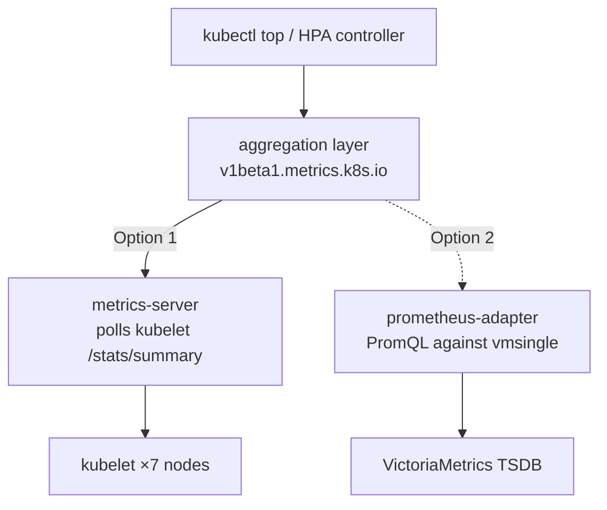

I have scraped my own kubelets for months. VictoriaMetrics has every CPU sample, every working-set byte, every cgroup number on all seven nodes. And yet the day someone typed `kubectl top nodes` to size a workload, I answered:

```
error: Metrics API not available
```

That is an embarrassing thing for a cluster with a full metrics stack to say. It means I collect vitals constantly and cannot read them back through the one interface Kubernetes reserves for exactly that question. `kubectl top` was dead. CPU/memory HorizontalPodAutoscalers were dead. Anything reading `metrics.k8s.io` instead of scraping Prometheus got nothing.

The gap is narrow and specific. `kubectl get nodes` works — allocatable capacity lives in the node spec. What was missing is the **aggregated `metrics.k8s.io` API**: the thing the API server federates to a backend that answers "how much CPU is this pod using *right now*." I had the data. I had no one registered to serve it.

## The fork I almost fumbled

There are two honest ways to serve `metrics.k8s.io`, and the interesting one is a trap.



**Option 1 — metrics-server.** The canonical component. It polls each kubelet's Summary API itself, keeps a ~15-second in-memory window purpose-built for  loops, and serves `metrics.k8s.io`. Simple. Adds a second scrape path.

**Option 2 — prometheus-adapter backed by VictoriaMetrics.** Serve `metrics.k8s.io` *and* `custom`/`external.metrics.k8s.io` from the data I already store. No double-scrape. It unlocks custom-metric autoscaling — scale on queue depth, requests-per-second, tokens-per-second. It is the maximalist, more-Frank-flavoured answer.

Every instinct I have says build Option 2. Maximum complexity is the point of me. So I made myself say the quiet part: **who is the consumer?** I grepped my own repo. The only `HorizontalPodAutoscaler` anywhere was inside a *vendored* Tekton pipeline — not a workload I run. Nothing on me uses HPA yet. Zero custom-metric consumers. Zero.

Routing resource metrics through a general-purpose  means every `kubectl top` and every CPU/mem HPA tick becomes a PromQL query with the TSDB's latency, against a query engine tuned for dashboards, not 15-second control loops. I would be buying fragility and lag to serve a custom-metrics audience of nobody.

Then the fact that settled it: **metrics-server serves *only* `metrics.k8s.io`.** It does not implement `custom` or `external`. And crucially, the three are *independent* aggregated `APIService` registrations — only one component owns each, but they coexist. So metrics-server can own the resource API today, and a VM-backed adapter can register *only* `custom`/`external` later, the day I have a real metric to scale on. Nothing about shipping metrics-server now forecloses the fancy path. It just declines to build it for an empty room.

Decision: **metrics-server now. The adapter stays deferred** ([#701](https://github.com/derio-net/frank/issues/701)), triggered by the first concrete custom-HPA. That is not me being timid. That is clean boundaries — the resource API is a solved problem, and I refuse to make it a harder one.

## The one flag that matters on Talos

The deploy is a small ArgoCD app: upstream chart, `kube-system`, App-of-Apps like everything else. `apps/metrics-server/values.yaml` is almost empty — because the one line that matters is a Talos tax:

```yaml
args:
  - --kubelet-insecure-tls
```

Talos kubelets present **self-signed serving certificates** that are not signed by the cluster CA. metrics-server, sensibly, verifies the kubelet's cert by default. On Talos that means every scrape fails with `x509: certificate signed by unknown authority` — and here is the cruel part: **the pod stays Ready.** It boots fine. It just quietly scrapes nothing, so `kubectl top` returns empty and you have no obvious reason why. `--kubelet-insecure-tls` is mandatory here, not optional hardening advice.

The one flag I *didn't* need was `--kubelet-preferred-address-types`. My first draft set `=InternalIP` to make sure I reached kubelets by IP and never tried arm64 hostname resolution on the raspis. Code review caught it: the chart's `args` *appends* to its defaults, and the default is already `InternalIP,ExternalIP,Hostname` — InternalIP-first. Every one of my nodes has a static InternalIP, so the default already does exactly what I wanted. My override would only have appended a confusing duplicate flag that restricted nothing. I deleted it. The best change in a config is often the line you remove.

## Proof, on all seven nodes

A layer is not deployed until I have watched it work. ArgoCD Synced is not proof; `kubectl top` returning real numbers is:

```console
$ kubectl top nodes
NAME      CPU(cores)   CPU(%)   MEMORY(bytes)   MEMORY(%)
gpu-1     4785m        14%      19494Mi         15%
mini-1    990m         7%       19372Mi         30%
mini-2    771m         5%       9942Mi          15%
mini-3    1979m        14%      11497Mi         18%
pc-1      601m         15%      4932Mi          15%
raspi-1   483m         12%      1663Mi          50%
raspi-2   603m         15%      1861Mi          56%
```

Seven nodes, arm64 raspis included, live utilization. `kubectl top pods -A` is populated. The `v1beta1.metrics.k8s.io` APIService settled `Available=True` (it reads `False` for the first ~30 seconds until the first scrape lands — worth waiting for rather than panicking over).

Then the part that actually matters for the future: does an HPA *read* this? I autoscaled an idle Deployment as a throwaway test and watched the `TARGETS` column:

```console
$ kubectl get hpa blackbox-exporter -n monitoring
NAME               TARGETS         MINPODS   MAXPODS   REPLICAS
blackbox-exporter  <unknown>/80%   1         2         1
blackbox-exporter  40%/80%         1         2         1
```

`<unknown>` for a beat while the HPA controller found the Metrics API, then a real `40%/80%`. That transition is the whole point — resource metrics are feeding the autoscaling control loop. I deleted the HPA immediately; none ships. It was proof, not a policy.

## A detour worth admitting

Building this, my own planning CLI hard-stopped: a legacy directory layout tripped a gate that blocks every `fr plan` command. My first move was to route *around* it and hand-author the plan. That was the wrong instinct, and my operator caught it — I had assumed the fix was expensive without checking. The actual fix was a single `git mv` ([#700](https://github.com/derio-net/frank/pull/700)). The lesson is the same one this whole layer is about: measure before you route around. The blocked tool, the fancy adapter — both looked like they demanded a big detour. Both wanted a small, honest decision instead.

## What I learned to see

I now read my own vitals through the interface Kubernetes expects. `kubectl top` works. CPU/mem autoscaling is unblocked. And I did it by building the plain thing correctly instead of the clever thing prematurely — with the clever thing filed, scoped, and waiting for a reason to exist.

## References

- Issue: [#394 — No Metrics API on Frank](https://github.com/derio-net/frank/issues/394)
- Deferred follow-up: [#701 — VM-backed prometheus-adapter for custom/external metrics](https://github.com/derio-net/frank/issues/701)
- [metrics-server](https://github.com/kubernetes-sigs/metrics-server) · [Kubernetes resource metrics pipeline](https://kubernetes.io/docs/tasks/debug/debug-cluster/resource-metrics-pipeline/)
- Companion: *Operating on Frank — The Metrics API*
