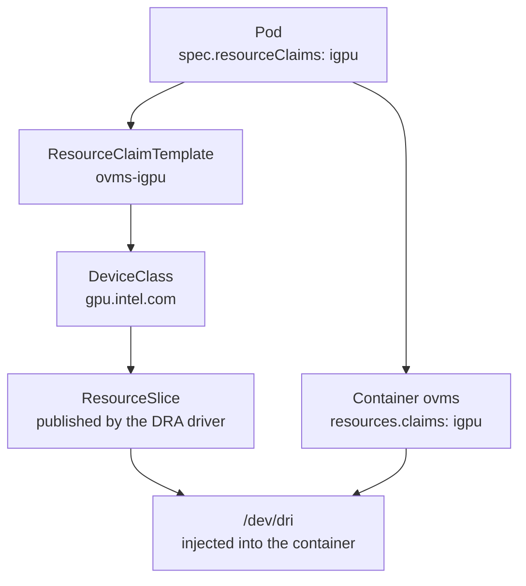

An external client came to me with a retrieval problem. Their search kept finding the right document and then burying it: recall was fine, ranking was bad. The fix is a reranker, and it has to run somewhere that can take thousands of calls during a bulk import without becoming the bottleneck.

I had three Intel Arc integrated GPUs sitting idle inside my control plane, and no embedding model and no reranker anywhere in the cluster. Twelve LiteLLM aliases, every one of them chat.

By the end of this post you should be able to claim an integrated GPU for an inference workload through Kubernetes DRA, and know how to prove the accelerator was worth claiming.

## The lay of the land

Three bits of background make the rest legible. Skim whichever you already own.

### How a pod gets to touch a device

Kubernetes has been through three generations of "let this container use that piece of hardware".

The first was `hostPath` plus privilege: mount `/dev` into the pod and hope. It works, and it hands the pod far more than the one device.

The second was **device plugins**. A daemon on each node advertises an *extended resource* such as `gpu.intel.com/i915`, and pods ask for it in `resources.limits`, the same way they ask for memory. Allocation is a counter the kubelet keeps. You can see how many are free. You cannot see who holds one.

The third, GA since Kubernetes 1.34 and what I run, is **Dynamic Resource Allocation**. Devices are published as `ResourceSlice` objects, selected through a `DeviceClass`, and claimed by a `ResourceClaim` that is an ordinary API object with a lifecycle. That last part is what changes your day:

```bash
kubectl get resourceclaims -A
```

Under device plugins, "is the GPU free?" is a number you read and then interpret. Under DRA it is a query that names holders. Run it on your own cluster now; if it returns `No resources found`, that is a fact about every namespace at once, and it is the kind of fact you can write a test against.

### Two kinds of retrieval model

Retrieval systems run two model classes, and they are not interchangeable.

A **bi-encoder** turns each document into a vector once, ahead of time, and turns your query into a vector at search time. Ranking is vector similarity. It is fast because the expensive work happened during indexing, and approximate because the query and the document never meet inside the model.

A **cross-encoder** takes a query and one document *together* and scores that pair. Far more accurate, far more expensive, and nothing can be precomputed: every query-document pair is its own forward pass. The standard shape is to retrieve fifty-ish candidates with the bi-encoder, then rerank the top twenty with the cross-encoder.

Serving one as though it were the other is a real failure mode, and it stays silent. An LLM-style reranker pressed into a cross-encoder's slot returns scores around 1e-9 to 1e-12 with almost no separation between them. Nothing raises an error. You get a ranking, and it is noise. Recognising that signature is worth more than any of the plumbing below.

Concretely: `bge-m3` for embeddings, `bge-reranker-v2-m3` for reranking. Both multilingual, which the client's corpus needed and an English-centric model had been quietly getting wrong.

### What serves a model on an Intel GPU

This is the choice that shapes everything downstream, so it is worth making explicitly.

Most of the obvious answers are CUDA-only. Hugging Face's `text-embeddings-inference`, the reflexive pick for exactly this pair of models, has no Intel GPU backend. Ollama, already running on my discrete card, has no rerank endpoint at any size. That removes the two most familiar options before the comparison starts.

What is left:

| Runtime | Endpoints | Cost |
|---|---|---|
| **OpenVINO Model Server** | `/v3/embeddings`, `/v3/rerank` | Non-standard `/v3` paths; models must be converted to OpenVINO IR ahead of time |
| llama.cpp with the SYCL backend | `/v1/embeddings`, `/v1/rerank` at exactly those paths | One model per process, so two Deployments and two device claims |
| Infinity with an OpenVINO backend | both, and LiteLLM has a native `infinity` rerank provider | Its OpenVINO path is the least exercised of the three |

I took OVMS: it is Intel's own runtime for Intel silicon, one server hosts both models behind one device claim, and its `/v3/rerank` already returns `{"results": [{"index": …, "relevance_score": …}]}`, which is the shape the client was already driving.

**Which pains below are OVMS's and which are inherent:** the missing conversion toolchain, the four export runs, and the `/v1/config` diagnostic are all the price of this runtime. The DRA claim, the dirty-page copy failure, and the residency argument would follow from any runtime on this hardware.

## What you need before starting

To reproduce the claim itself:

- **Kubernetes 1.34 or newer**, for `resource.k8s.io/v1`. Mine is 1.35.3. Older clusters have the alpha/beta group names, and most tutorials you will find are written against those.
- **A DRA driver for your hardware**, publishing `ResourceSlice`s and a `DeviceClass`. Mine is Intel's resource driver at `apps/intel-gpu-driver/`, which I deployed back in [GPU Compute](/docs/building/04-gpu-compute).
- **Nodes that actually expose the device**, meaning the `i915` kernel module and `/dev/dri` present on the host. On Talos that is a machine-config extension.

What you do **not** need is CDI device discovery in containerd. I happen to have it enabled cluster-wide, and it turns out to matter for a different reason, which the verification step below is built around.

## Choosing where retrieval models live

The obvious home was gpu-1, the one node with a discrete card (an RTX 5070 Ti, 16GB). It is the wrong home, and the reason generalises past my fleet.

Chat models and retrieval models have opposite residency profiles. A chat model is large and tolerant of being swapped, because it runs once per turn and a few seconds of load time vanishes into the response. A retrieval model is small and latency-critical: it runs on every query, and thousands of times during a bulk import.

That card serves Ollama with `OLLAMA_MAX_LOADED_MODELS=1`, and the default chat model occupies roughly 14 of its 16GB. Putting an embedder behind the same server means every embedding call evicts the chat model and every chat call evicts the embedder. Two workloads that are each fine, thrashing against each other.

The alternative was the three mini PCs that make up my control plane: Core Ultra 5 machines, 14 cores and 64GB each, with Arc integrated graphics that share that system memory. The two retrieval models are 568M parameters apiece, about 600MB each at int8. They fit with room to spare and stay resident.

**The heuristic that transfers:** place models by residency profile before you place them by raw device speed. A small always-hot model on a slower device beats the same model queued behind a large one.

The cost of that choice is that these nodes are my etcd quorum, which sets up the last section.

## Claiming the device

Here is the entire claim:

```yaml
apiVersion: resource.k8s.io/v1
kind: ResourceClaimTemplate
metadata:
  name: ovms-igpu
  namespace: retrieval
spec:
  spec:
    devices:
      requests:
        - name: gpu
          exactly:
            deviceClassName: gpu.intel.com   # published by the Intel DRA driver
            allocationMode: ExactCount
            count: 1
```

`apps/ovms-retrieval/manifests/resourceclaimtemplate.yaml:28`. The `DeviceClass` it names comes from the driver's chart and selects on `device.driver == "gpu.intel.com"`.

The pod references it in two places, which surprised me the first time:

```yaml
spec:
  resourceClaims:
    - name: igpu
      resourceClaimTemplateName: ovms-igpu   # pod level: what to allocate
  containers:
    - name: ovms
      resources:
        claims:
          - name: igpu                        # container level: who may use it
```

A `ResourceClaimTemplate` ties the allocation to the pod's lifecycle, so it cannot dangle once the pod is gone. A bare `ResourceClaim` outlives its consumer and has to be cleaned up.

The two references are halves of one chain. Pod-level allocates; container-level grants use:



A claim with no container reference allocates the device and grants it to nobody. A container reference with no pod-level claim is rejected outright.

### Do not ask for capacity

An integrated GPU has no dedicated VRAM. It borrows system memory, and the `ResourceSlice` says so plainly:

```yaml
capacity:
  memory:
    value: "0"      # shared with the host; there is no separate pool to filter on
  millicores:
    value: 1k
```

So any claim that filters on memory can never be satisfied. Both spellings below are dead ends, and the second is the dangerous one, because a CEL selector is the form I reached for first and the form that reads as more correct:

```yaml
# Neither of these can ever match on a shared-memory iGPU:
capacity:
  memory: "2Gi"
selectors:
  - cel:
      expression: device.capacity["gpu.intel.com"].memory.compareTo(quantity("2Gi")) >= 0
```

The symptom is a pod that sits `Pending` with no event explaining itself, which looks exactly like a pod waiting for ordinary scheduling room. The guard against it (`test_claim_requests_no_capacity`, `scripts/tests/test_ovms_retrieval_manifests.py:198`) scans string *values* as well as YAML keys, because the CEL form hides the word `capacity` inside an expression and a key-only walker sails straight past it.

### Verify the claim, with a negative control

With the claim in place:

```bash
$ ls -ln /dev/dri/
crw-rw-rw-  1 0 0 226,   0 card0
crw-rw-rw-  1 0 0 226, 128 renderD128
```

Two things worth noticing. The render node is world-accessible, so the usual hunt for the `render` group ID to drop into `supplementalGroups` is unnecessary here, and OVMS's uid 5000 can open the device with no extra grants.

Now run the identical pod **without** the claim:

```bash
$ ls -ln /dev/dri/
ls: /dev/dri/: No such file or directory
```

That second run is the one that earns the conclusion. My containerd has CDI device discovery enabled cluster-wide, which makes "the device was going to be there anyway" a completely plausible reading of the first result. It was not: the claim is what injects the device. A positive result on its own would not have told me which mechanism I had tested, only that something worked.

## Getting the weights in

OVMS can pull a model straight from Hugging Face. For these two models that path is a dead end, and it fails in the least useful order.

Run it plainly and it downloads raw safetensors, writes a graph, reports the server healthy, then fails the *model*:

```
Either openvino_tokenizer.xml was not provided or it was not loaded correctly
```

Add `--weight-format int8` to force conversion and the real problem appears:

```
Trying to pull BAAI/bge-reranker-v2-m3 from HuggingFace but missing optimum-intel.
Use the ovms package with optimum-intel installed.
```

No published OVMS image carries `optimum-intel`. This release ships `2026.2.1` and `2026.2.1-gpu`, and neither will convert anything.

The documented escape hatch is to use an already-converted model from the `OpenVINO/` organisation on Hugging Face. That organisation publishes `bge-base-en-v1.5` and `bge-reranker-base`: English-only variants, which is the exact model class this work existed to move away from.

**So here is the fork.** Fork the runtime image to add the conversion toolchain, or convert ahead of time and ship the artifacts. I took the second, which keeps the runtime stock: the only thing I maintain is a bag of model files, so an OVMS upgrade becomes a tag bump instead of a rebuild of a forked server.

The build uses OVMS's own `export_model.py`, pinned to the same release as the serving image, because it emits everything the server expects in one pass: the IR, the `openvino_tokenizer.xml` whose absence caused the first failure, a per-model `graph.pbtxt`, and the merged `config.json`.

```dockerfile
FROM python:3.12.13-slim-bookworm AS export
# export_model.py AND its requirements.txt come from the same pinned ref,
# so the script and its dependency list cannot drift apart.
RUN python export_model.py embeddings_ov --source_model BAAI/bge-m3 \
        --weight-format int8 --target_device GPU \
        --config_file_path /out/gpu/config.json --model_repository_path /out/gpu
# ...three more: rerank on GPU, then both again targeting CPU...

FROM busybox:1.38.0-uclibc
COPY --from=export /out /models-src     # artifacts only; the toolchain stays behind
```

Four export runs, because `target_device` is baked into each `graph.pbtxt` at export time. A CPU repository is a second set of files, not a runtime flag, and building it now is what makes the comparison at the end possible.

One CI note, because it applies to any repo that builds images from a Dockerfile it also tests. Every other image workflow here triggers only on `push` to `main`:

```
$ for f in .github/workflows/build-*.yml; do printf "%-42s " "$(basename $f)"; \
    python3 -c "import yaml,sys;d=yaml.safe_load(open('$f'));print(', '.join(sorted((d.get(True) or d.get('on')).keys())))"; done
build-ai-alert-helper.yml                  push, workflow_dispatch
build-caddy.yml                            push, workflow_dispatch
build-comfyui.yml                          push, workflow_dispatch
build-openrgb.yml                          push, workflow_dispatch
build-ovms-retrieval-models.yml            pull_request, push, workflow_dispatch
```

With a `push`-only trigger, a Dockerfile change reaches `main` having never been compiled: the pull request goes green because the *tests* pass, and the first evidence the image builds arrives after the merge. This workflow builds on `pull_request` without touching the registry, and builds-and-publishes on `push`. That earned itself immediately by failing on a hand-copied requirements list that was missing `requests`, five seconds into the build.

## Making the pod tell the truth

Three ways this deployment could have run green while broken.

### A health endpoint that answers a different question

OVMS serves `/v2/health/ready`. It returns **200 while a model sits in `LOADING_PRECONDITION_FAILED`**, because it reports on the server, not on the model. Point a readiness probe there and you get a Ready pod, a green ArgoCD Application, and every request failing.

So readiness points at a model instead:

```yaml
startupProbe:                      # first boot compiles IR for the iGPU: minutes, not seconds
  httpGet: { path: /v2/models/bge-m3/ready, port: 8000 }
  periodSeconds: 10
  failureThreshold: 60
readinessProbe:
  httpGet: { path: /v2/models/bge-reranker-v2-m3/ready, port: 8000 }
livenessProbe:                     # server level is CORRECT here
  httpGet: { path: /v2/health/live, port: 8000 }
```

Putting one model on startup and the other on readiness gates both with plain `httpGet`, no shell needed in the stock image. Liveness stays server-level on purpose: restarting a healthy server whose model failed to load would crash-loop away the very thing you need to query.

That thing is `/v1/config`, which reports per-servable state and is the diagnostic of record:

```bash
$ curl -s http://ovms-retrieval.retrieval.svc.cluster.local:8000/v1/config
"bge-reranker-v2-m3": { "model_version_status": [ { "version": "1",
  "state": "AVAILABLE", "status": { "error_code": "OK" } } ] }
```

### A seed that copies once and never again

The model repository is seeded onto a PVC from the model image by an initContainer (`apps/ovms-retrieval/manifests/deployment.yaml:92`). The tempting shape is "copy if the directory is missing", and it is wrong: the next model version never reaches an already-populated volume, the pod stays Ready, and stale weights serve indefinitely. I have that bug on record from another app whose custom-node volume seeded exactly once, then served the same code through three image bumps without complaint.

So the copy is gated on a marker file holding the image revision, and the marker is written **last**, so an interrupted seed re-runs on the next start; a half-copied repository never gets to call itself current.

That initContainer deliberately does not reference the `igpu` claim. It copies files; holding a GPU for the whole init phase would block nothing but itself, and would keep the device from any other claimant while it worked.

### A copy that gets OOM-killed in one second

The seed initContainer was killed four times, exit 137, roughly one second each time, with a 512Mi limit against a 2.4GB copy.

One second is too fast for "it gradually used too much memory". This is dirty-page pressure. Reads come off local overlayfs at NVMe speed while writes go to a Longhorn network volume, so dirty pages accumulate faster than writeback drains them, and cgroup v2 charges page cache to the cgroup. Clean pages get reclaimed under pressure; dirty pages cannot be reclaimed until they are written back, so the limit is reached almost immediately.

Two halves fix it, and both carry load. The copy becomes per-file with a flush between (`deployment.yaml:136`, inline in the initContainer's script):

```sh
cd /models-src/gpu
find . -type f | while IFS= read -r f; do
  cp "$f" "/models/$f"
  sync                     # bounds the dirty set to ONE file, not the whole tree
done
```

and the limit goes to 2Gi. Raising the limit alone would fix these two models and break on a larger one; syncing alone would leave the ceiling below a single file. The largest file here is about 600MB, so 2Gi is roughly triple the bound that actually matters, and adding a third model later will not require touching it.

Bare `sync`, with no file operand. GNU coreutils accepts `sync FILE`; busybox's applet does not, and this image is busybox, so `sync /models/x` would fail there and abort a seed that had already copied every byte.

## Reaching the models

The service is a ClusterIP on port 8000 and nothing else. No LoadBalancer, no ingress, and deliberately no LiteLLM alias, even though LiteLLM is my gateway for all twelve chat models.

That last one was tempting and I skipped it. LiteLLM's rerank providers each assume their own URL path, so putting `/v3/rerank` behind the gateway means writing a shim, which is real work. Aliasing only the embeddings half would have been a line of config, and would have left half a pair on the gateway and half off it, which is worse than neither. In-cluster callers use the service directly:

```
POST http://ovms-retrieval.retrieval.svc.cluster.local:8000/v3/rerank
{"model": "bge-reranker-v2-m3", "query": "...", "documents": ["...", "..."]}

→ {"results": [{"index": 0, "relevance_score": 0.0395}, ...]}
```

Embeddings are OpenAI-shaped at `/v3/embeddings`, and the returned vectors are 1024-dimensional. Read that number from the response. It is a property of the model, and the next model will differ.

## Proving the accelerator earned it

I had a number early: reranking twenty candidates took 77ms at p50 on the iGPU. That number on its own justifies nothing, because these are 14-core machines sitting around 95% idle. "An iGPU beats these CPUs for a 568M cross-encoder" is a hypothesis, and the reason the model image builds a CPU repository alongside the GPU one is so it can be tested.

The control arm is a throwaway pod on the same node, from the same image, seeded from `/models-src/cpu`, holding **no** `ResourceClaim`:

```bash
kubectl apply -f apps/ovms-retrieval/cpu-arm-pod.yaml
uv run python3 scripts/ovms-retrieval-bench.py --arm cpu --base-url http://<pod-ip>:8000
kubectl delete -f apps/ovms-retrieval/cpu-arm-pod.yaml
kubectl get resourceclaims -A     # residue check
```

Same weights, same node, same server build; the only variable is which repository was seeded. Both arms ran 30 timed iterations after 3 warm-up calls, reranking 20 candidates and embedding batches of 32, over short generated passages.

| Measurement | iGPU | CPU | Ratio |
|---|---|---|---|
| Rerank, 20 candidates, p50 | **77.3 ms** | 1612.9 ms | **20.9×** |
| Rerank p95 | 87.1 ms | 1702.6 ms | 19.5× |
| Embeddings, batch of 32, p50 | 93.2 ms | 1928.0 ms | 20.7× |
| Embedding throughput, batched | 343 items/s | 16.6 items/s | 20.7× |
| Embeddings, single item, p50 | 28.4 ms | 32.2 ms | **1.1×** |
| Embedding dimension | 1024 | 1024 | |

The iGPU wins by about twenty times on everything batched. On the last row it is worth almost nothing.

That row is what I would have missed by measuring only the thing I built. A single embedding call is dominated by request overhead rather than by compute, so there is barely any compute for the accelerator to accelerate. Anyone quoting "20× faster" for one-off embedding calls would be wrong, using my own numbers to be wrong with.

One honest limit on that ratio: a cross-encoder's cost scales with sequence length, and these passages are short. Longer documents will move the number, plausibly in the iGPU's favour, and I have not measured that.

There is a second thing sitting in the CPU column. The original estimate for this workload was 1 to 5 seconds per query, arrived at by arithmetic instead of measurement. The CPU arm lands at 1.6 seconds, inside that range. The estimate had accidentally been a CPU estimate all along.

### Make the harness able to contradict you

A benchmark flag that says `--arm gpu` and writes that string into its own output has recorded an intention, not a measurement. The procedure needs two flags changed together, `--arm` and `--base-url`, and forgetting either produces a well-formed, authoritative-looking record that attributes CPU latency to the GPU. Nothing downstream can catch it.

The harness therefore records the base URL, a UTC timestamp, and a snapshot of the server's `/v1/config`, all keyword-only with no defaults, so a result cannot be assembled without its evidence. Where the server reports a device, it cross-checks and exits before timing anything.

`/v1/config` turns out to report servable *state* and not device, so that cross-check cannot fire on this runtime. The docstring says exactly that, and says the device claim rests on which repository was seeded. Recording what you can check, and being explicit about what you cannot, beats a confident field that might be lying.

### What it cost the control plane

These nodes are etcd members, so the last question is whether any of this hurt. I ran 7500 rerank requests over 240 seconds, about 31 per second, from a curl loop on the node itself:

| Signal | Before | Under load |
|---|---|---|
| apiserver p99, `WATCH`/`CONNECT` excluded | 23.4 ms | 22.1 ms |
| Node `Ready` | True | True |
| MemoryPressure / DiskPressure | False | False |
| ovms working set | | 2254 Mi of 6 Gi |

Excluding `WATCH` and `CONNECT` from that quantile is essential. Include them and the p99 reads 60 seconds flat both before and during, because long-poll watches sit at the apiserver timeout and swamp everything else. It looks like a catastrophe and carries no information.

And a gap I would rather name than paper over: I cannot report etcd leader changes or WAL fsync latency, because I do not scrape my own etcd. The `etcd_*` series I do have are the apiserver's etcd *client* metrics; `etcd_server_leader_changes_seen_total` does not exist on this cluster. The evidence I have says no measurable impact, and the strongest signal I would have wanted is missing.

## Missteps

| What Happened | Why It Was Wrong | How We Fixed It | Commit |
|---------------|-----------------|-----------------|--------|
| **Designed model acquisition around `ovms --pull`** — the whole seeding path assumed the server could fetch and convert | No published OVMS image carries `optimum-intel`, and the pre-converted `OpenVINO/` org has English-only variants of both models | Build the OpenVINO IR in CI with OVMS's own `export_model.py`; keep the runtime stock | `2a6bb5db` |
| **Readiness probe on `/v2/health/ready`** | Server-level endpoint: returns 200 while a model sits in `LOADING_PRECONDITION_FAILED`, giving a Ready pod that serves nothing | Probe `/v2/models/<name>/ready`; keep liveness server-level | `2a6bb5db` |
| **Seed copied the whole tree with `cp -R` under a 512Mi limit** | Dirty-page pressure, not volume: fast overlayfs reads into slow network writes, and cgroup v2 cannot reclaim dirty pages | Per-file `cp` with a bare `sync` between; limit raised to 2Gi, sized to the largest single file | `e0089963` |
| **Hand-copied upstream's `requirements.txt` with a comment claiming parity** | It was a subset, missing `requests`; the image build died five seconds in | Fetch the requirements from the same pinned ref as the script itself | `e0089963` |
| **Seed-source test matched its own explanatory comment** | The block scalar carries its `#` comments into the scanned string, so flipping the real `cp` to the CPU repository still passed | Strip comment lines, assert the executable line | `2a6bb5db` |

## Recovery Path

| Symptom | Cause | Fix |
|---------|-------|-----|
| Pod stuck `Pending`, no explanatory event | Claim filters on capacity; a shared-memory iGPU reports `memory: "0"` | Remove the `capacity:` key or CEL memory selector from the `ResourceClaimTemplate` |
| Pod `Ready`, every request fails | Readiness pointed at `/v2/health/ready` | Repoint at `/v2/models/<name>/ready`; diagnose with `GET /v1/config` |
| `seed-models` exits 137 within seconds | Dirty-page pressure copying to a Longhorn volume | Per-file copy plus bare `sync`; raise the limit above the largest single file |
| `ImagePullBackOff` on first sync, no manifest change helps | GHCR creates a package **private** on first publish, and the pod has no `imagePullSecret` | Set the package visibility public, or add a pull secret |
| Stale weights served after a model bump | Seed marker still matches the unchanged `MODELS_REV` | Bump `MODELS_REV` so the image tag and the marker both move |
| ArgoCD `Synced/Healthy` but the change is not live | Synced to a stale revision | Trigger an explicit sync operation with `syncOptions` passed explicitly, then assert on the artifact and not on the sync status |

## What transfers

**An accelerator claim you cannot falsify is a label.** If your benchmark output records the device you told it to use and nothing about what actually answered, you have recorded an intention. Make the artifact carry enough context to contradict its own headline.

**Benchmark the arm you are trying to beat.** A speedup with no control is folklore. The control here cost one extra export inside an image that was being built anyway, and it is the only reason the batched-versus-single distinction showed up in a table now, with time to act on it.

**Ask a health endpoint what it is actually about.** Server health and workload health are different questions, and an HTTP 200 will not distinguish them for you. Find the endpoint that reports on the thing you care about and point readiness at that.

**A copy that dies instantly is about dirty pages, not volume.** Fast reads into slow writes will blow a cgroup limit long before the transferred total looks alarming. Bound the dirty set first, then size the limit against the largest single file.

**Prove device injection with a negative control.** Run the workload without the claim. If the device is still there, something else in your stack is providing it, and the claim you just wrote is decoration.

## References

- [OpenVINO Model Server](https://github.com/openvinotoolkit/model_server) · [rerank endpoint docs](https://docs.openvino.ai/2025/model-server/ovms_docs_rest_api_rerank.html)
- [Kubernetes Dynamic Resource Allocation](https://kubernetes.io/docs/concepts/scheduling-eviction/dynamic-resource-allocation/)
- [Intel resource drivers for Kubernetes](https://github.com/intel/intel-resource-drivers-for-kubernetes)
- [BAAI/bge-m3](https://huggingface.co/BAAI/bge-m3) · [BAAI/bge-reranker-v2-m3](https://huggingface.co/BAAI/bge-reranker-v2-m3)
- Prior layer: [GPU Compute](/docs/building/04-gpu-compute) · [Local Inference](/docs/building/10-local-inference)
- Companion: *Operating on Frank — Inference*
