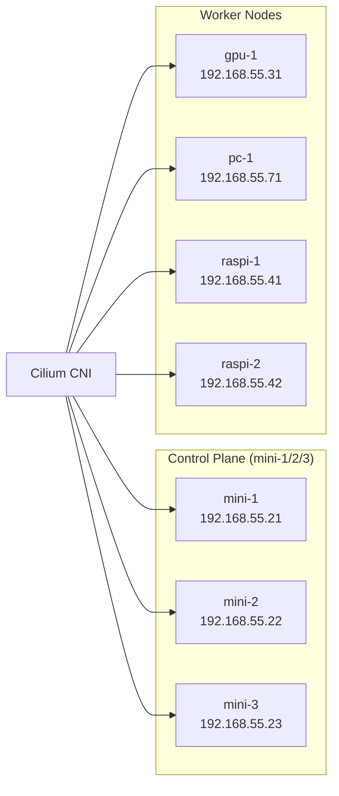



This is the operational companion to [Building the Foundation](). That post covers *why* we chose Talos and Cilium and how they were deployed. This one covers what you type when something looks off — node health, networking diagnostics, config patches, and the failure patterns that have bitten us more than once.

Before any of the commands below, source the environment:

```bash
source .env          # sets KUBECONFIG, TALOSCONFIG
source .env_devops   # sets OMNICONFIG + service account for omnictl
```

## What Healthy Looks Like

A healthy Frank means all seven nodes are `Ready`, every Cilium agent pod is running, and Hubble is collecting flows. That is the baseline you check against.

```console
$ kubectl get nodes -o wide
NAME      STATUS   ROLES           AGE   VERSION   INTERNAL-IP     EXTERNAL-IP   OS-IMAGE          KERNEL-VERSION   CONTAINER-RUNTIME
gpu-1     Ready    <none>          49d   v1.35.3   192.168.55.31   <none>        Talos (v1.12.6)   6.18.18-talos    containerd://2.1.6
mini-1    Ready    control-plane   49d   v1.35.3   192.168.55.21   <none>        Talos (v1.12.6)   6.18.18-talos    containerd://2.1.6
mini-2    Ready    control-plane   49d   v1.35.3   192.168.55.22   <none>        Talos (v1.12.6)   6.18.18-talos    containerd://2.1.6
mini-3    Ready    control-plane   49d   v1.35.3   192.168.55.23   <none>        Talos (v1.12.6)   6.18.18-talos    containerd://2.1.6
pc-1      Ready    <none>          49d   v1.35.3   192.168.55.71   <none>        Talos (v1.12.6)   6.18.18-talos    containerd://2.1.6
raspi-1   Ready    <none>          49d   v1.35.3   192.168.55.41   <none>        Talos (v1.12.6)   6.18.18-talos    containerd://2.1.6
raspi-2   Ready    <none>          49d   v1.35.3   192.168.55.42   <none>        Talos (v1.12.6)   6.18.18-talos    containerd://2.1.6

$ cilium status --wait=false | head -25
    /¯¯\
 /¯¯\__/¯¯\    Cilium:             OK
 \__/¯¯\__/    Operator:           OK
 /¯¯\__/¯¯\    Envoy DaemonSet:    OK
 \__/¯¯\__/    Hubble Relay:       OK
    \__/       ClusterMesh:        disabled

DaemonSet              cilium                   Desired: 7, Ready: 7/7, Available: 7/7
DaemonSet              cilium-envoy             Desired: 7, Ready: 7/7, Available: 7/7
Deployment             cilium-operator          Desired: 2, Ready: 2/2, Available: 2/2
Deployment             hubble-relay             Desired: 1, Ready: 1/1, Available: 1/1
Deployment             hubble-ui                Desired: 1, Ready: 1/1, Available: 1/1
Containers:            cilium                   Running: 7
                       cilium-envoy             Running: 7
                       cilium-operator          Running: 2
                       hubble-relay             Running: 1
                       hubble-ui                Running: 1
Cluster Pods:          135/135 managed by Cilium
```



### Verify

All nodes `Ready`, all Cilium components `OK`, all daemonsets at `Ready: 7/7`. Run the two commands above (`kubectl get nodes -o wide` and `cilium status --wait=false`) — if any node is `NotReady` or any Cilium component is not `OK`, proceed to the Runbook section below.

## Observing State

### Cluster and Node Health

Start with the big picture. Talos has a built-in health check that validates etcd, the API server, kubelet, and node readiness in one shot against any control-plane node:

```bash
talosctl health --nodes 192.168.55.21
```

For a quick view of all nodes and their status, IPs, and kernel versions:

```bash
kubectl get nodes -o wide
```

To check which Talos version each node is running (useful before and after upgrades):

```bash
talosctl version --nodes 192.168.55.21,192.168.55.22,192.168.55.23
```

If a Raspberry Pi drops to `NotReady`, they occasionally take longer to rejoin after a network blip — give it a minute before digging deeper.

### Cilium and Networking

```bash
cilium status
```

Look for `OK` next to each component. The `KubeProxyReplacement` line should show `True` — Frank runs Cilium as a full kube-proxy replacement (`apps/cilium/values.yaml:4`, `kubeProxyReplacement: true`).

To watch live network flows between pods:

```bash
hubble observe
```

Filter by namespace, pod, or verdict:

```bash
hubble observe --namespace longhorn-system
hubble observe --verdict DROPPED
```



### Node-Level Diagnostics

Talos has no SSH. These are your only window into what the OS is doing:

```bash
# Kernel messages (equivalent to dmesg)
talosctl dmesg --nodes 192.168.55.31

# Service logs (kubelet, containerd, etcd, etc.)
talosctl logs kubelet --nodes 192.168.55.21
talosctl logs containerd --nodes 192.168.55.31

# Check which Talos extensions are loaded
talosctl -n 192.168.55.31 get extensions
```

## Routine Operations

### Upgrading Talos

Talos upgrades are applied node by node. The node reboots into the new version, and workloads are drained and rescheduled automatically:

```bash
talosctl upgrade --nodes 192.168.55.21 \
  --image ghcr.io/siderolabs/installer:v1.9.5
```

Control-plane nodes one at a time — wait for each to rejoin before proceeding. Upgrading all three simultaneously will take down etcd quorum.

When managing through Omni, upgrades can also be triggered from the dashboard or via `omnictl`:

```bash
omnictl get machines
```

This shows each machine's current OS version, connected status, and cluster membership.

### Applying Config Patches

All node customization on Frank flows through Omni config patches (`patches/phase01-node-config/README.md:27`). To apply a new or updated patch:

```bash
omnictl apply -f patches/phase01-node-config/03-labels-mini-1.yaml
```

Omni merges the patch into the node's machine config. Depending on the change, the node may reboot automatically:

```bash
talosctl reboot --nodes 192.168.55.21
```

To roll back a patch:

```bash
omnictl delete configpatch <patch-id>
```

**Gotcha:** On UKI-booted machines (gpu-1 with SecureBoot), `ConfigPatches` with `machine.install.extraKernelArgs` is **inert** — the UKI cmdline is baked into the signed image and `extraKernelArgs` doesn't change the schematic ID, so Omni never reinstalls. Use `KernelArgs.omni.sidero.dev` instead (`patches/phase04-gpu/403-gpu1-pcie-aspm.yaml:38`):

```bash
omnictl get kernelargsstatus <machine-id>
```

### Cleaning Up Stale Pods

Completed and Failed pods accumulate because Helm chart Jobs rarely set `ttlSecondsAfterFinished`. They consume no CPU or memory, but they clutter `kubectl get pods` and burn etcd space (~2–4 KB per pod object).

To clean them up:

```bash
# Delete all Succeeded pods cluster-wide
kubectl get pods -A --field-selector=status.phase==Succeeded \
  -o json | kubectl delete -f -

# Delete all Failed pods cluster-wide
kubectl get pods -A --field-selector=status.phase==Failed \
  -o json | kubectl delete -f -
```

The cluster-wide terminated-pod garbage collector threshold is 12,500 pods, so on a homelab they accumulate indefinitely without periodic cleanup.

### Rebooting Nodes

```bash
talosctl reboot --nodes 192.168.55.31
```

The node drains itself before rebooting. For control-plane nodes, make sure etcd quorum will survive (at least two of three must remain up).

## Runbook

### Node NotReady

If `kubectl get nodes` shows a node as `NotReady`:

1. **Check Talos health** from a working control-plane node:
   ```bash
   talosctl health --nodes 192.168.55.21
   ```

2. **Check kernel messages** for hardware or driver errors:
   ```bash
   talosctl dmesg --nodes <problem-node-IP>
   ```

3. **Check etcd** if it is a control-plane node:
   ```bash
   talosctl etcd status --nodes 192.168.55.21
   talosctl etcd members --nodes 192.168.55.21
   ```

4. **Check kubelet logs** for registration or certificate issues:
   ```bash
   talosctl logs kubelet --nodes <problem-node-IP>
   ```

#### Recovery: DNS boot hang

A node that pings but never reaches `Ready` (ICMP replies, `apid:50000` refuses, Omni shows `CONNECTED: false`) is likely stuck on the time-sync gate. The root cause: a static interface with no nameservers falls back to public DNS (`1.1.1.1`, `8.8.8.8`), which the homelab ACL blocks → NTP never syncs → `apid`/`kubelet` hang.

Fix: Apply the cluster-wide nameservers patch:

```bash
omnictl apply -f patches/phase01-node-config/02-cluster-wide-nameservers.yaml
```

This sets `machine.network.nameservers: [192.168.10.11, 192.168.10.12]` (see `patches/phase01-node-config/02-cluster-wide-nameservers.yaml:28-30`). Temporarily, ACL-allow `1.1.1.1:53` for the affected host to unstick it.

**Verify:** `talosctl dmesg --nodes <IP> | grep -i ntp` should show sync success; `kubectl get nodes <IP>` eventually returns `Ready`.

### Pod Networking Issues

When pods cannot reach each other or external services:

1. **Run the Cilium connectivity test:**
   ```bash
   cilium connectivity test
   ```
   This deploys test pods and checks DNS, pod-to-pod, pod-to-service, and egress flows.

2. **Observe flows for a specific pod:**
   ```bash
   hubble observe --pod <namespace>/<pod-name>
   hubble observe --pod default/my-app --verdict DROPPED
   ```

3. **Check Cilium endpoint status:**
   ```bash
   cilium endpoint list
   ```
   Endpoints in a state other than `ready` indicate the agent has not finished programming BPF for that pod.

#### Recovery: restart the Cilium agent

If `cilium status --brief` shows degradation but the pod is `Running`:

```bash
kubectl logs -n kube-system ds/cilium -c cilium-agent --tail=100 | grep -Ei 'direct routing|datapath|node config'
```

Then restart the agent:

```bash
kubectl rollout restart -n kube-system ds/cilium
```

Common causes on Talos: missing security capabilities (`IPC_LOCK`, `SYS_RESOURCE`) or cgroup mount conflicts — our `cilium-values.yaml` sets `cgroup.autoMount.enabled: false` and `cgroup.hostRoot: /sys/fs/cgroup` (`apps/cilium/values.yaml:28-31`) to match Talos's layout.

### Cilium Agent Crashing

```bash
kubectl logs -n kube-system ds/cilium -c cilium-agent --tail=100
kubectl get pods -n kube-system -l k8s-app=cilium
```

#### Recovery: NIC link-flap

If all pod traffic on one node drops (SSH-via-LB dies, `kubectl exec` still works) and the Cilium agent logs contain `"IPv4 direct routing device IP not found"` or `"Failed to initialize datapath, retrying later"`, a physical NIC link-flap has stripped the node IP off Cilium's direct-routing device (`docs/runbooks/frank-gotchas/networking.md:62-143`).

```bash
# Check for link flaps
talosctl -n <IP> dmesg | grep 'Link is'
```

Recovery is physical — reseat the cable or replace the NIC. Do **not** drain the node if it carries hard-pinned GPU workloads; restarting the Cilium agent pod on that node may restore datapath without a full node drain.

### Omni Unreachable

If `omnictl` commands return gRPC 500s or the browser shows a TLS error:

#### Recovery: cert expiry

Omni's TLS leaf cert has expired. The snap-installed `certbot` timer scans `/etc/letsencrypt/` but Omni uses a custom `--config-dir`, so automatic renewal does not fire (`docs/investigations/2026-05-11--omni--cert-expiry-incident.md`).

```bash
ssh frank-omni
certbot renew --config-dir /opt/manual_install/certbot/config \
  --deploy-hook 'docker restart omni'
```

#### Recovery: wedged reconcile runtime

After a cold-boot clock-jump, Omni's reconcile loop can freeze — it serves cached reads but applies nothing. No config patches take effect even though `configuptodate: true`. Fix (`docs/runbooks/frank-gotchas/omni.md:45-106`):

```bash
ssh frank-omni
docker restart omni
```

Then refresh your Talos config:

```bash
omnictl talosconfig .talos/Frank_Talos_Config.yaml -c frank -f --merge=false
```

## Missteps

| What we assumed | Why it was wrong | What it cost |
|-----------------|------------------|-------------|
| `ConfigPatches` `machine.install.extraKernelArgs` works on UKI machines | The UKI cmdline is baked into the signed image; `extraKernelArgs` doesn't change the schematic ID, so Omni never reinstalls | Hours debugging why PCIe ASPM args wouldn't stick on gpu-1. Fixed via `KernelArgs.omni.sidero.dev` resource (`patches/phase04-gpu/403-gpu1-pcie-aspm.yaml`). |
| Omni cert auto-renews via snap's certbot timer | The snap certbot scans `/etc/letsencrypt/`; Omni's install uses a custom `--config-dir` | Cert expired silently for 30+ days, taking down the management plane. Fixed via dedicated systemd unit (`omni/certbot/certbot.md`). |
| Omni reconcile is resilient to clock jumps | A cold-boot clock skew freezes the reconcile runtime — Omni serves cached reads but applies nothing | Config patches silently unapplied; reboot of affected nodes did nothing. Fixed by `docker restart omni`. |
| Static-IP nodes get DNS from DHCP | Static `dhcp: false` → Talos falls back to public resolvers blocked by homelab ACL | Nodes ping but never reach `Ready` (time-sync gate). Fixed fleet-wide by cluster-wide nameservers patch (`patches/phase01-node-config/02-cluster-wide-nameservers.yaml`). |

## Quick Reference

| Command | What It Does |
|---------|-------------|
| `source .env && source .env_devops` | Set up kubectl, talosctl, and omnictl contexts |
| `talosctl health --nodes <IP>` | Full cluster health check via a single node |
| `kubectl get nodes -o wide` | List all nodes with status, IPs, versions |
| `talosctl version --nodes <IP>` | Show Talos OS version on a node |
| `talosctl dmesg --nodes <IP>` | Kernel messages (like dmesg over SSH) |
| `talosctl logs <svc> --nodes <IP>` | Service logs (kubelet, containerd, etcd) |
| `talosctl -n <IP> get extensions` | List loaded Talos extensions |
| `talosctl upgrade --nodes <IP> --image ` | Upgrade Talos on a node |
| `talosctl reboot --nodes <IP>` | Graceful node reboot with drain |
| `talosctl etcd status --nodes <IP>` | etcd cluster health |
| `talosctl etcd members --nodes <IP>` | List etcd members |
| `omnictl get machines` | Show all machines managed by Omni |
| `omnictl get clustermachinestatus` | Machine READY/reconciling status |
| `omnictl apply -f <patch>` | Apply a Talos config patch through Omni |
| `omnictl delete configpatch <id>` | Roll back a config patch |
| `omnictl get kernelargsstatus <machine-id>` | Verify kernel args applied (UKI machines) |
| `cilium status` | Cilium agent and operator health |
| `cilium connectivity test` | End-to-end networking validation |
| `cilium endpoint list` | List all Cilium-managed pod endpoints |
| `hubble observe` | Stream live network flows |
| `hubble observe --verdict DROPPED` | Show only dropped flows |
| `kubectl rollout restart -n kube-system ds/cilium` | Restart Cilium agent across all nodes |
| `kubectl logs -n kube-system ds/cilium -c cilium-agent --tail=100` | Cilium agent logs |
| `kubectl get pods -A --field-selector=status.phase==Succeeded -o json \| kubectl delete -f -` | Delete all Completed pods |
| `kubectl get pods -A --field-selector=status.phase==Failed -o json \| kubectl delete -f -` | Delete all Failed pods |
| `docker restart omni` | Revive wedged Omni reconcile runtime |
| `certbot renew --config-dir /opt/manual_install/certbot/config --deploy-hook 'docker restart omni'` | Renew Omni TLS cert |

## Explanation

This post covers the subset of cluster operations that happen outside ArgoCD — things you reach for when a node won't come back, Cilium drops traffic, or Omni stops applying patches. The building companion post covers why we chose these components; this one covers what to do when they misbehave.

The failure patterns in the Runbook section are not hypothetical. Each one bit us in production — the DNS boot hang took down gpu-1 for hours during a cold boot, the Omni cert expiry silently locked us out of the management plane for a month, and the inert `extraKernelArgs` on UKI cost days of debugging. We have documented each in the gotcha runbooks (`docs/runbooks/frank-gotchas/`); this section is the quick-access version.

## References

- [Talos CLI Reference](https://www.talos.dev/v1.9/reference/cli/) — Full `talosctl` command documentation
- [Cilium Operations Guide](https://docs.cilium.io/en/stable/operations/) — Day-2 operations for Cilium
- [Hubble Documentation](https://docs.cilium.io/en/stable/observability/hubble/) — Network observability CLI and UI
- [Omni Documentation](https://omni.siderolabs.com/docs/) — Sidero Omni machine management
- [Frank Gotchas — Networking](https://github.com/derio-net/frank/blob/main/docs/runbooks/frank-gotchas/networking.md) — Frank-specific networking failure playbooks
- [Frank Gotchas — Omni](https://github.com/derio-net/frank/blob/main/docs/runbooks/frank-gotchas/omni.md) — Frank-specific Omni failure playbooks
- [Patches README](https://github.com/derio-net/frank/blob/main/patches/README.md) — Machine ID to hostname to IP mapping
- [Frank Infrastructure](https://github.com/derio-net/frank/blob/main/agents/rules/frank-infrastructure.md) — Node IP/hardware inventory and service LB IPs
