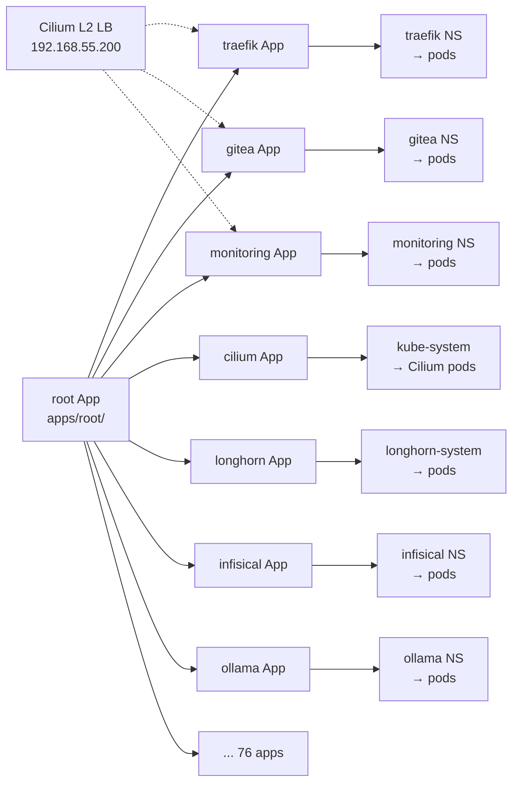



This post covers day-to-day ArgoCD operations on Frank. For how the App-of-Apps was set up and why, see [GitOps Everything with ArgoCD](). For the deep-dive drift classification taxonomy, see [Operating on ArgoCD Drift Detective]().

Source your environment before running commands:

```bash
source .env   # sets KUBECONFIG
```

All `argocd` CLI commands use port-forwarding since there is no public ingress. Every command includes `--port-forward --port-forward-namespace argocd`. To save typing:

```bash
alias argocd='argocd --port-forward --port-forward-namespace argocd'
```

## Overview

ArgoCD runs at `http://192.168.55.200` on a Cilium L2 LoadBalancer. **Note: the UI is plain HTTP** — `https://192.168.55.200` gives a TLS reset (`docs/runbooks/frank-gotchas/argocd.md:64-68`).

A single root Application in `apps/root/` renders 76 child Application CRs — one per component. Key configuration:

- **`application.resourceTrackingMethod: annotation`** (`apps/argocd/values.yaml:109`) — avoids Helm label conflicts for adoption
- **`ServerSideApply=true`** on every app — avoids the 256KB annotation limit and enables resource adoption
- **`selfHeal: true`** on every app — automatically corrects drift from the desired Git state
- **`prune: false`** (default) — resources removed from Git are not deleted. Intentional — accidental deletion of a CNI or storage controller would be catastrophic.



### Verify

```bash
# Check overall application health
kubectl get applications -n argocd -o 'custom-columns=NAME:.metadata.name,SYNC:.status.sync.status,HEALTH:.status.health.status'
```

All applications should show `SYNC: Synced` and `HEALTH: Healthy`. A `Degraded` or `OutOfSync` app needs investigation.

```bash
# Quick check — any apps with comparison errors?
kubectl -n argocd get applications -o json | jq '.items[] | select(.status.conditions[]? | .type=="ComparisonError") | .metadata.name'
```

If this returns any names, the repo has a comparison error (often an out-of-bounds symlink) — see Runbook below.

## Observing State

### List All Applications

```bash
argocd app list --port-forward --port-forward-namespace argocd
```

This shows every application, its sync status (`Synced`, `OutOfSync`), health status (`Healthy`, `Degraded`, `Progressing`), and the target revision.

```console
$ kubectl get application -n argocd -o wide 2>&1 | head -35
NAME                   SYNC STATUS   HEALTH STATUS   REVISION                                   PROJECT
argo-rollouts          Synced        Healthy                                                    infrastructure
argo-rollouts-extras   Synced        Healthy         fe5f5900e397c6bda7158e9add7a7853007535d7   infrastructure
argocd                 Synced        Healthy                                                    infrastructure
# ... (76 total applications)
```

### Inspect a Single Application

```bash
argocd app get cilium --port-forward --port-forward-namespace argocd
```

Returns the full resource tree — every Deployment, DaemonSet, Service, ConfigMap, and Secret that ArgoCD tracks for that application. Resources with sync issues are flagged individually.

### Watch Sync Events

```bash
argocd app get cilium --port-forward --port-forward-namespace argocd --show-operation
```

The `--show-operation` flag shows the last sync operation result — which resources were created, updated, or pruned and how long the operation took.

## Routine Operations

### Force Sync an Application

```bash
argocd app sync cilium --port-forward --port-forward-namespace argocd
```

To sync all applications at once, sync the root app:

```bash
argocd app sync root --port-forward --port-forward-namespace argocd
```

This re-renders the root Helm chart, which may discover new child Applications or updated chart versions.

### Hard Refresh

ArgoCD caches the Git repo and Helm chart index. If it still shows old state after a push:

```bash
argocd app get cilium --port-forward --port-forward-namespace argocd --hard-refresh
```

### Check Diff Before Syncing

```bash
argocd app diff cilium --port-forward --port-forward-namespace argocd
```

This is the GitOps equivalent of `terraform plan`. Review the diff, then sync if it looks right.

### Add a New Application

1. Create `apps/<app-name>/values.yaml` with Helm values.
2. Create `apps/root/templates/<app-name>.yaml` with the Application CR.
3. Optionally add `apps/<app-name>/manifests/` for raw Kubernetes manifests.
4. Commit, push.

ArgoCD discovers the new Application CR from the root chart and begins syncing it automatically.

### Manage ArgoCD Itself

After editing `apps/argocd/values.yaml`:

```bash
argocd app sync argocd --port-forward --port-forward-namespace argocd
```

Since ArgoCD is updating itself, the CLI connection will drop momentarily and reconnect.

## Runbook

### Application Degraded

An app showing `Degraded` usually means one or more of its resources failed to reach a healthy state:

```bash
argocd app get <app> --port-forward --port-forward-namespace argocd
```

Look for resources marked `Degraded` or `Missing`. Then check Kubernetes events:

```bash
kubectl describe deployment <name> -n <namespace>
kubectl get events -n <namespace> --sort-by=.lastTimestamp | tail -20
```

Common causes: image pull failures, resource limits too low, missing secrets, or nodes lacking the right taints/tolerations.

#### Recovery: stale appTree health

After a source change, the appTree may show `Degraded` even though all resources are healthy. This cosmetic state masks real health changes until the controller re-evaluates. Wait for the next sync cycle or restart the controller (`docs/runbooks/frank-gotchas/argocd.md:70-91`).

### Sync Failed

When a sync operation fails:

```bash
argocd app get <app> --port-forward --port-forward-namespace argocd --show-operation
```

The operation result shows exactly which resource failed and why. Two frequent culprits:

- **Annotation size limit.** Kubernetes has a 256KB limit on annotation values. Large CRDs (Cilium's etc.) can exceed this. `ServerSideApply=true` in syncOptions avoids this — every Frank app uses it.
- **Finalizer deadlocks.** A resource with a finalizer referencing a deleted controller hangs forever. Check `metadata.finalizers` and remove the offending entry.

#### Recovery: manual sync drops syncOptions

When a manual sync (via `argocd app sync` or `kubectl patch`) doesn't pass `ServerSideApply=true`, large ConfigMaps (>250KB) hit the annotation limit. Always include syncOptions:

```bash
kubectl patch application <app> -n argocd --type=merge \
  -p '{"operation":{"sync":{"revision":"HEAD","syncOptions":["ServerSideApply=true","RespectIgnoreDifferences=true"]}}}'
```

This is the canonical pattern when `selfHeal` is disabled for debugging (`docs/runbooks/frank-gotchas/argocd.md:28-37`).

### OutOfSync but Correct

Some resources appear `OutOfSync` even though the live state is correct. Controllers mutate resources after ArgoCD applies them. Kubernetes Secrets are the classic example — controllers encode or rotate secret data.

Fix: add `ignoreDifferences` in the Application spec:

```yaml
ignoreDifferences:
  - group: ""
    kind: Secret
    jsonPointers:
      - /data
```

Frank already applies this to applications managing auto-generated secrets (Cilium, cert-manager). For new cases, add the entry to `apps/root/templates/<app>.yaml`.

#### Recovery: root re-templates leaf specs

The root application re-templates every leaf Application CR on every sync. A live `kubectl patch application` (e.g. for a feature branch) reverts within the sync window because the root chart overwrites the patched field. When testing a PR-branch change on a leaf:

1. Suspend root selfHeal: `argocd app set root --self-heal=false`
2. Patch the leaf with the branch revision.
3. After testing, restore root selfHeal to `true`.

Without suspending root selfHeal, the leaf reverts before you can observe the result (`agents/rules/frank-argocd.md:40-63`).

### Orphaned Resources

With `prune: false` (default on Frank), ArgoCD never deletes resources that disappear from Git:

```bash
argocd app resources <app> --port-forward --port-forward-namespace argocd --orphaned
```

Review the list and delete manually if sure:

```bash
kubectl delete <kind> <name> -n <namespace>
```

#### Recovery: out-of-bounds symlink

An out-of-bounds symlink in the repo causes every app to show a `ComparisonError`. Nothing syncs, but the cluster runs on the last-known-good cache.

```bash
# Find the symlink
find . -type l -lname '*../../..*'

# Fix it, commit, and re-sync the root app
```

After fixing, all apps should return to `Synced` (`docs/runbooks/frank-gotchas/argocd.md:14-26`).

### Notifications Silent

ArgoCD notifications use Telegram for sync events. If notifications drop silently, the `notifications.yaml` config may use the wrong subscription format. The correct pattern uses the service name directly, not `webhook`:

```yaml
# Correct
subscribe:
  on-sync-running.telegram: ""

# Wrong — drops silently
subscribe:
  on-sync-running.webhook:
    telegram: ""
```

The webhook notifier type is named after the service (`telegram`), not the type name (`webhook`). (`docs/runbooks/frank-gotchas/argocd.md:5-12`)

## Missteps

| What we assumed | Why it was wrong | What it cost |
|-----------------|------------------|-------------|
| `kubectl patch application` with a feature-branch revision survives the sync window | Root re-templates every leaf on every sync. Without suspending root selfHeal, the patch reverts within seconds | Feature-branch testing requires a self-heal suspend cycle (`agents/rules/frank-argocd.md:40-63`). |
| `argocd app sync` passes `ServerSideApply=true` automatically | Manual syncs via the CLI or `kubectl patch` **drop** the syncOptions from the Application spec | Large ConfigMaps (>250KB) hit the annotation limit. Must pass syncOptions explicitly in the operation patch. |
| HTTP is fine for the ArgoCD UI | The UI is served over plain HTTP, not HTTPS. Browser auto-upgrades to HTTPS, which gives a TLS reset | New operators waste time debugging the TLS error (`docs/runbooks/frank-gotchas/argocd.md:64-68`). |
| Telegram notification webhooks follow the standard format | The ArgoCD notification config uses the service name (`telegram`), not the type name (`webhook`), in the subscription block | Notifications silently dropped until the config was corrected. |
| An out-of-bounds symlink only breaks one app | ArgoCD's comparison phase follows symlinks — a single bad symlink breaks every app on the cluster | All apps show `ComparisonError`, nothing syncs, cluster runs on last-known-good cache (`docs/runbooks/frank-gotchas/argocd.md:14-26`). |
| Controller-normalized fields can be ignored | Fields like `syncRequestedAt`, `restartedAt`, `enabled`, `authRefs` are rewritten by controllers on every reconciliation | Permanent `OutOfSync` on Longhorn, Sympozium, vCluster, and Tekton until `ignoreDifferences` entries were added (`docs/superpowers/debugging/2026-07-06-cluster-status-drift.md`). |

## Quick Reference

| Task | Command |
|------|---------|
| List all apps | `kubectl get applications -n argocd -o wide` |
| List all apps (columnar status) | `kubectl get applications -n argocd -o 'custom-columns=NAME:.metadata.name,SYNC:.status.sync.status,HEALTH:.status.health.status'` |
| Find comparison errors | `kubectl -n argocd get applications -o json \| jq '.items[] \| select(.status.conditions[]? \| .type=="ComparisonError") \| .metadata.name'` |
| List apps (argocd CLI) | `argocd app list --port-forward --port-forward-namespace argocd` |
| Get app detail | `argocd app get <app> --port-forward --port-forward-namespace argocd` |
| Sync one app | `argocd app sync <app> --port-forward --port-forward-namespace argocd` |
| Sync root (everything) | `argocd app sync root --port-forward --port-forward-namespace argocd` |
| Check diff | `argocd app diff <app> --port-forward --port-forward-namespace argocd` |
| Hard refresh | `argocd app get <app> --port-forward --port-forward-namespace argocd --hard-refresh` |
| Show last sync | `argocd app get <app> --port-forward --port-forward-namespace argocd --show-operation` |
| Manual sync with syncOptions | `kubectl patch application <app> -n argocd --type=merge -p '{"operation":{"sync":{"revision":"HEAD","syncOptions":["ServerSideApply=true","RespectIgnoreDifferences=true"]}}}'` |
| List orphans | `argocd app resources <app> --port-forward --port-forward-namespace argocd --orphaned` |
| Delete an app | `argocd app delete <app> --port-forward --port-forward-namespace argocd` |
| Find out-of-bounds symlinks | `find . -type l -lname '*../../..*'` |
| Find non-running pods | `kubectl get pods -A --field-selector=status.phase!=Running,status.phase!=Succeeded` |
| ArgoCD UI | `http://192.168.55.200` |

## Explanation

This post consolidates the day-to-day ArgoCD operations that are spread across four separate sources: the basic CLI commands, the gotcha runbook, the agent rules for app management, and the drift-debugging post. The failure patterns in the Runbook section are the ones that have actually broken Frank's GitOps pipeline — the symlink blast that took down every app, the stale appTree that masked a real health change, and the self-heal constraint that made feature-branch testing unreliable.

The companion posts cover the building (how the App-of-Apps is structured) and the drift taxonomy (the 7-class classification for OutOfSync). This post covers what you type when an app is Degraded, a sync fails, or notifications go quiet.

## References

- [ArgoCD Documentation](https://argo-cd.readthedocs.io/en/stable/) — Official reference for all CLI commands and concepts
- [ArgoCD Sync Options](https://argo-cd.readthedocs.io/en/stable/user-guide/sync-options/) — ServerSideApply, selfHeal, prune, and ignoreDifferences
- [GitOps Everything with ArgoCD]() — How the App-of-Apps was built on Frank
- [ArgoCD Drift Detective]() — Deep-dive drift classification taxonomy
- [Frank Gotchas — ArgoCD](https://github.com/derio-net/frank/blob/main/docs/runbooks/frank-gotchas/argocd.md) — Frank-specific ArgoCD failure playbooks
- [Frank ArgoCD Workflow](https://github.com/derio-net/frank/blob/main/agents/rules/frank-argocd.md) — Add-a-new-app workflow and self-heal suspend pattern
- [Cluster Status Drift Incident](https://github.com/derio-net/frank/blob/main/docs/superpowers/debugging/2026-07-06-cluster-status-drift.md) — Controller-normalized fields and the `ignoreDifferences` fixes
