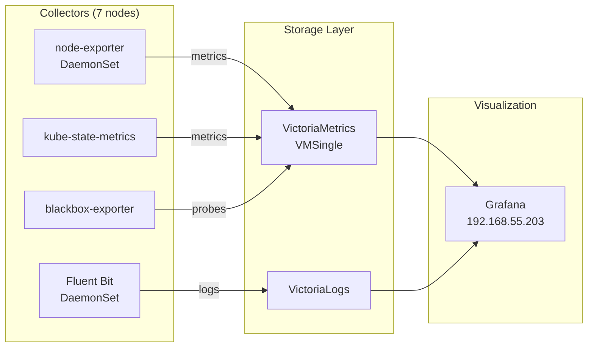



This is the operational companion to [Building Observability](). That post covers the architecture decisions and deployment gotchas. This one covers what you actually type when a dashboard is empty, an alert didn't fire, or logs are missing — and the failure patterns that have bitten us more than once.

Before any of the commands below, source the environment:

```bash
source .env          # sets KUBECONFIG, TALOSCONFIG
source .env_devops   # sets OMNICONFIG + service accounts
```

## What Healthy Looks Like

Frank's observability stack has four moving parts:

- **VictoriaMetrics** (VMSingle + vmagent) — time-series metrics database and scraping engine (`monitoring` namespace, 20Gi Longhorn PVC, 1-month retention)
- **Grafana** at `http://192.168.55.203` — dashboards and exploration, OIDC auth via Authentik
- **Fluent Bit** — DaemonSet on all 7 nodes (including tainted control-plane and GPU nodes), shipping container logs
- **VictoriaLogs** — log storage with 30-day retention, queryable through Grafana's Explore tab

Supporting collectors: **node-exporter** (hardware metrics on all nodes), **kube-state-metrics** (Kubernetes object metrics), **blackbox-exporter** (endpoint probes for alerting).

All four pieces running means the stack is healthy:

```bash
kubectl get pods -n monitoring | head -20
```

Expected output shows `Running` for `vmsingle`, `victoria-logs`, `grafana`, `vmagent`, `fluent-bit`, `node-exporter`, and `kube-state-metrics` pods.



## Verify

### Grafana Dashboards

Open `http://192.168.55.203` in a browser. The stack ships with pre-built dashboards under the "VictoriaMetrics" folder:

- **Node Exporter Full** — per-node CPU, memory, disk I/O, network, filesystem
- **Kubernetes / Compute Resources / Cluster** — cluster-wide CPU and memory requests vs limits vs actual usage
- **Kubernetes / Compute Resources / Namespace** — the same, broken down by namespace
- **VMAgent** — scrape targets, samples/sec, queue depth

These dashboards are provisioned by the Helm chart and survive Grafana pod restarts because Grafana's 1Gi Longhorn PVC preserves them.



### Querying Metrics with MetricsQL

Port-forward to VMSingle and use its built-in UI:

```bash
kubectl port-forward -n monitoring svc/vmsingle-victoria-metrics-victoria-metrics-k8s-stack 8429:8429
```

Then open `http://localhost:8429/vmui` in your browser. MetricsQL is a superset of PromQL — any PromQL query works, plus extensions like `keep_metric_names` and `range_median`.

Starter queries:

```promql
# CPU usage by node (1m average)
100 - (avg by(instance) (rate(node_cpu_seconds_total{mode="idle"}[1m])) * 100)

# Memory usage percentage by node
(1 - node_memory_MemAvailable_bytes / node_memory_MemTotal_bytes) * 100

# Pod restart counts in the last hour
increase(kube_pod_container_status_restarts_total[1h]) > 0

# Disk usage on Longhorn volumes
kubelet_volume_stats_used_bytes / kubelet_volume_stats_capacity_bytes * 100
```

From the CLI:

```bash
kubectl port-forward -n monitoring svc/vmsingle-victoria-metrics-victoria-metrics-k8s-stack 8429:8429 &
curl -s 'http://localhost:8429/api/v1/query?query=up' | jq '.data.result[] | {instance: .metric.instance, up: .value[1]}'
```

### Querying Logs with VictoriaLogs

Logs are queryable through Grafana's Explore tab — select the "VictoriaLogs" datasource and use LogsQL:

```text
# All logs from ArgoCD
{kubernetes_namespace_name="argocd"}

# Logs from VictoriaMetrics pods
{kubernetes_pod_name=~"victoria-metrics.*"}

# Error lines across the entire cluster
{kubernetes_namespace_name=~".+"} |= "error"

# Logs from the GPU node
{kubernetes_host="gpu-1"} | level:error
```

For CLI access, port-forward to VictoriaLogs:

```bash
kubectl port-forward -n monitoring svc/victoria-logs-victoria-logs-single-server 9428:9428
curl -s 'http://localhost:9428/select/logsql/query?query={kubernetes_namespace_name="monitoring"}&limit=10' | jq .
```

### Checking Pipeline Health

```bash
# vmagent is scraping
kubectl get pods -n monitoring -l app.kubernetes.io/name=vmagent
kubectl logs -n monitoring -l app.kubernetes.io/name=vmagent --tail=5

# Fluent Bit is running on all nodes
kubectl get ds -n monitoring fluent-bit
# DESIRED and READY should match (7 nodes)

# VictoriaLogs is accepting writes
kubectl logs -n monitoring -l app=victoria-logs-single-server --tail=5
```

## Steps

### Creating and Importing Grafana Dashboards

To import a community dashboard (e.g. ID 1860 for Node Exporter Full):

1. Open Grafana at `http://192.168.55.203`
2. Go to Dashboards > Import
3. Enter the dashboard ID and click Load
4. Select the VictoriaMetrics datasource and click Import

Imported dashboards are saved to the 1Gi Longhorn PVC and survive pod restarts. One gotcha: because that PVC is `ReadWriteOnce`, we pinned Grafana's deployment strategy to `Recreate` (commit `e40c952d`). A `RollingUpdate` with a RWO volume means the new pod can't attach the PVC on a different node until the old pod releases it — which doesn't happen cleanly, so the rollout stalls for ~2 hours.

### Adjusting Retention

Metrics retention (1 month) is set in `apps/victoria-metrics/values.yaml`:

```yaml
vmsingle:
  spec:
    retentionPeriod: "1"
```

Log retention (30 days) is in `apps/victoria-logs/values.yaml`:

```yaml
server:
  retentionPeriod: 30d
```

We bumped logs from 14d to 30d alongside the cross-cluster shipping fix in `d8de469c`. Change the value, commit, and let ArgoCD sync. Existing data outside the new window is garbage-collected on the next retention pass.

### Checking What vmagent Is Scraping

```bash
kubectl port-forward -n monitoring svc/vmagent-victoria-metrics-victoria-metrics-k8s-stack 8429:8429
```

Open `http://localhost:8429/targets` to see every scrape target, its status (up/down), last scrape time, and error messages. This is the first place to look when a metric is missing.

### Exploring Available Metrics

```bash
# List all metric names
curl -s 'http://localhost:8429/api/v1/label/__name__/values' | jq '.data[:20]'

# Search for metrics by keyword
curl -s 'http://localhost:8429/api/v1/label/__name__/values' | jq '.data[] | select(test("gpu|nvidia"))'
```

## Recover

### Missing Metrics — the cardinality labeldrop

If a metric you expect is missing from VMSingle but the exporter is running, the most likely cause is **high-cardinality labels hitting the series limit**. VictoriaMetrics' default `-maxLabelsPerTimeseries=40` silently drops series that exceed it.

We hit this in May 2026 (commit `193c3890`). The amd64 nodes' node-exporter metrics carried 60–135 labels each — NFD CPU feature labels (`feature_node_kubernetes_io_*`), Talos extension labels (`extensions_talos_dev_*`), NVIDIA driver labels (`nvidia_com_*`). The raspi nodes had ~33 labels and passed; the 5 amd64 nodes were silently dropped. VMSingle logged `ignoring series with N labels...` but no alert fired.

The fix was to drop those high-cardinality label groups in `apps/victoria-metrics/values.yaml`:

```yaml
kubelet:
  metricRelabelConfigs:
  - action: labeldrop
    regex: ^(uid|id)$
  - action: labeldrop
    regex: ^(name)$
  - action: labeldrop
    regex: ^(feature_node_kubernetes_io_.*|extensions_talos_dev_.*|nvidia_com_.*|beta_kubernetes_io_.*)$
  - action: drop
    regex: rest_client_request_duration_seconds_(bucket|sum|count)
```

The key choice: we dropped the labels rather than bumping `-maxLabelsPerTimeseries`. Bumping the limit would absorb the bloat temporarily but push the cardinality bomb downstream — the series count would keep growing until it hit storage or query limits. Dropping the labels at scrape time is the correct fix.

In general, when a metric is missing:

1. **Check the exporter pod is running**:
   ```bash
   kubectl get pods -n monitoring -l app.kubernetes.io/name=node-exporter
   kubectl get pods -n monitoring -l app.kubernetes.io/name=kube-state-metrics
   ```

2. **Check vmagent targets** at `http://localhost:8429/targets` — is it scraping the endpoint?

3. **Check the VMServiceMonitor exists and matches labels**:
   ```bash
   kubectl get vmservicemonitors -n monitoring
   kubectl describe vmservicemonitor <name> -n monitoring
   ```

4. **Check the exporter directly**:
   ```bash
   kubectl port-forward -n monitoring <exporter-pod> <port>:<port>
   curl http://localhost:<port>/metrics | grep <metric-name>
   ```

### Fluent Bit Not Shipping Logs

If logs are not appearing in VictoriaLogs:

1. **Check Fluent Bit pods** are running on all nodes:
   ```bash
   kubectl get ds -n monitoring fluent-bit
   kubectl get pods -n monitoring -l app.kubernetes.io/name=fluent-bit -o wide
   ```

2. **Check Fluent Bit logs** for output errors:
   ```bash
   kubectl logs -n monitoring -l app.kubernetes.io/name=fluent-bit --tail=50
   ```
   Look for `retry` lines. Silent retries with no error detail usually mean DNS resolution failure — the output hostname is wrong or the target service is down.

3. **Verify the destination hostname resolves**:
   ```bash
   kubectl exec -n monitoring <fluent-bit-pod> -- nslookup \
     victoria-logs-victoria-logs-single-server.monitoring.svc.cluster.local
   ```

4. **Check tail file positions** — Fluent Bit tracks where it left off. Stale positions mean it may be re-reading or skipping:
   ```bash
   kubectl exec -n monitoring <fluent-bit-pod> -- ls -la /var/log/flb_kube.db
   ```

### Grafana Rollout Stuck

If you're changing Grafana config and the rollout hangs:

```bash
kubectl rollout status -n monitoring deployment grafana
```

If it stalls for more than a few minutes, check whether the strategy is `Recreate` — it should be (commit `e40c952d`). If it's `RollingUpdate`, the RWO Longhorn PVC will block the new pod from starting until the old pod terminates, and Kubernetes won't terminate the old pod until the new one starts. Either change the strategy back to `Recreate` or scale the old replica to zero:

```bash
kubectl scale deployment -n monitoring grafana --replicas=0
# wait, then
kubectl scale deployment -n monitoring grafana --replicas=1
```

### Alert Didn't Fire — Telegram formatting failures

If an alert rule fires but nobody gets notified, check the contact point. We've had three distinct Telegram delivery failures:

1. **Markdown parsed `_` as italic** — `job=session_manager` rendered as `sessionmanager`, so incident triage was routed to the wrong handler. Fixed by removing `parse_mode: Markdown` from the Telegram contact point (commit `cc239cf9`).

2. **HTML annotation values rejected** — annotation values contained `<node-ip>` and `>6`. Telegram's HTML parser rejected `<node-ip>` as an invalid HTML tag. The message dispatched but Telegram returned HTTP 400 — silently (commit `c866a85e`). Fixed by stripping `<>&` from annotations.

3. **Trailing newline in bot token** — the Telegram bot token from Infisical had a trailing newline, causing HTTP 404 on `sendMessage` — also silent (commit `f7d8f189`). Fixed by defensive credential stripping at the secret level.

If you suspect a silent delivery failure, check the Grafana Alerting log:

```bash
kubectl logs -n monitoring deployment/grafana --tail=100 | grep -i "telegram\|failed\|error\|400\|404"
```

### False Positives from Completed Pods

Some layer alerts fire for namespaces that run Tekton pipelines, Argo Workflows, or other Jobs/CronJobs. `kube_pod_status_ready{condition="true"}` reports `0` for pods in `Completed` or `Error` state — those are by-design not-Ready post-completion.

If a namespace with active CI accumulates such pods, a `reduce.last` on the per-pod series can pick one and trip the threshold. The fix (commit `8068eedd`) was to exclude completed pods from the layer-8 observability alert:

```promql
kube_pod_status_ready{namespace="monitoring"}
  unless on(namespace,pod)
    kube_pod_status_phase{phase=~"Succeeded|Failed"} == 1
```

For layer alerts on CI namespaces, switch to Deployment-based queries:

```promql
kube_deployment_status_replicas_unavailable{namespace=~"tekton|workflows|…"}
```

Deployments are long-running; Job pods aren't owned by Deployments, so they're excluded naturally.

### High Cardinality

If VMSingle memory usage is climbing or queries are slow, high cardinality labels are the usual cause:

```bash
# Check top series by cardinality
curl -s 'http://localhost:8429/api/v1/status/tsdb' | jq '.data.seriesCountByMetricName[:10]'
```

If a metric has an unbounded label (request ID, session token), either drop the label in vmagent's relabeling config or exclude the metric entirely.

### VictoriaLogs Query Returns No Results

1. **Check VictoriaLogs is receiving data**:
   ```bash
   kubectl port-forward -n monitoring svc/victoria-logs-victoria-logs-single-server 9428:9428
   curl -s 'http://localhost:9428/select/logsql/query?query=*&limit=5' | jq .
   ```
   If results come back, the problem is your query syntax, not the pipeline.

2. **Check the Grafana datasource** — the VictoriaLogs datasource must point to `http://victoria-logs-victoria-logs-single-server.monitoring.svc.cluster.local:9428`. Go to Grafana > Configuration > Data Sources and verify. If the `queryType` is not set to `stats`, queries against long series will fail with a DatasourceError (commit `a6651c4f` — the fix was setting `queryType: stats` to hit `/select/logsql/stats_query` instead of `/select/logsql/query`).

3. **Check retention** — if logs are older than 30 days, they have been garbage-collected.

## Missteps

| What we assumed | Why it was wrong | What it cost |
|---|---|---|
| The default Helm scrape configs would capture all node metrics without issue | amd64 nodes carry 60-135 labels/series from NFD CPU features, Talos extensions, and NVIDIA driver labels — exceeding VictoriaMetrics' default `-maxLabelsPerTimeseries=40`. The raspi nodes (33 labels) passed silently, masking the failure. | 5/7 nodes' cadvisor data was silently dropped for weeks. No alert fired. Discovered during a routine dashboard review. |
| `RollingUpdate` is the safe default for Grafana, even with a RWO PVC | A new Grafana pod on a different node can't attach the Longhorn PVC until the old pod releases it — but K8s won't terminate the old pod until the new one is healthy. The rollout deadlocks for ~2 hours. | ~2h deployment stalls on every config change until someone force-scales. |
| A NIC is either up or down — binary link-state monitoring is sufficient | Flapping NICs that go up-down-up within 5m are invisible to binary-down-state rules with `for: 5m`. On June 8 2026, gpu-1's enp3s0 flapped 76 times over ~8 hours — 0 alerts fired. | An 8-hour networking blind spot on the GPU node during active inference workloads. |
| Telegram contact point annotations are opaque strings — any format works | Telegram's HTML parser rejects `<node-ip>` as an invalid HTML tag, returning HTTP 400 — which Grafana logs as "sent" with no error. Similarly, Markdown `parse_mode` silently strips underscores in label values. | Alert state changed to Firing in Grafana, the Telegram message dispatched, but the operator never saw it. Silent delivery failures are worse than no alert — they create a false sense of coverage. |

## Quick Reference

| Command | What It Does |
|---------|-------------|
| `kubectl port-forward -n monitoring svc/vmsingle-... 8429:8429` | Access VMSingle UI and API |
| `kubectl port-forward -n monitoring svc/victoria-logs-...-server 9428:9428` | Access VictoriaLogs API |
| `kubectl get ds -n monitoring fluent-bit` | Check Fluent Bit DaemonSet status |
| `kubectl logs -n monitoring -l app.kubernetes.io/name=fluent-bit --tail=50` | Fluent Bit output logs |
| `kubectl logs -n monitoring -l app.kubernetes.io/name=vmagent --tail=50` | vmagent scrape logs |
| `kubectl get vmservicemonitors -n monitoring` | List all metric scrape configs |
| `curl localhost:8429/api/v1/query?query=up` | Query metrics via API |
| `curl localhost:9428/select/logsql/query?query=*&limit=10` | Query logs via API |
| `curl localhost:8429/targets` | List vmagent scrape targets |
| `curl localhost:8429/api/v1/status/tsdb` | TSDB cardinality stats |

## References

- [VictoriaMetrics Documentation](https://docs.victoriametrics.com/) — MetricsQL reference, VMSingle operations, retention
- [VictoriaLogs Documentation](https://docs.victoriametrics.com/victorialogs/) — LogsQL syntax, ingestion API
- [Grafana Documentation](https://grafana.com/docs/grafana/latest/) — Dashboard management, datasource provisioning
- [Fluent Bit Documentation](https://docs.fluentbit.io/) — Pipeline debugging, tail input, HTTP output
- [Building Observability]() — Architecture decisions and deployment gotchas
