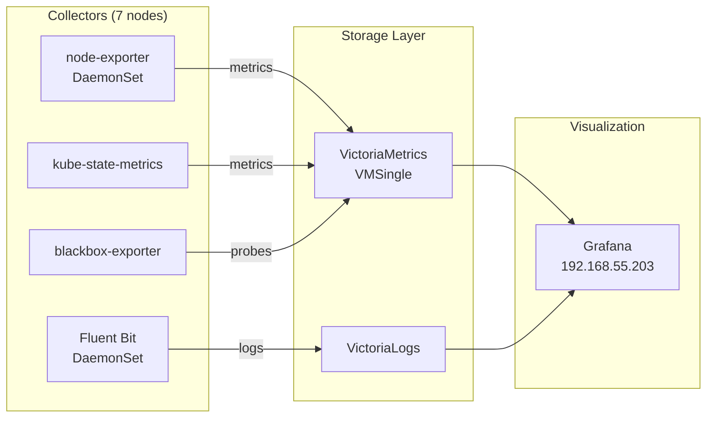



This is the operational companion to [Building Observability](). That post covers the architecture decisions and deployment gotchas. This one covers what you actually type when a dashboard is empty, an alert didn't fire, or logs are missing — and the failure patterns that have bitten us more than once.

Before any of the commands below, source the environment:

```bash
source .env          # sets KUBECONFIG, TALOSCONFIG
source .env_devops   # sets OMNICONFIG + service accounts
```

## What Healthy Looks Like

Frank's observability stack has four moving parts:

- **VictoriaMetrics** (VMSingle + vmagent) — time-series metrics database and scraping engine (`monitoring` namespace, 20Gi Longhorn , 1-month retention)
- **Grafana** at `http://192.168.55.203` — dashboards and exploration,  auth via Authentik
- **Fluent Bit** — DaemonSet on all 7 nodes (including tainted control-plane and GPU nodes), shipping container logs
- **VictoriaLogs** — log storage with 30-day retention, queryable through Grafana's Explore tab

Supporting collectors: **node-exporter** (hardware metrics on all nodes), **kube-state-metrics** (Kubernetes object metrics), **blackbox-exporter** (endpoint probes for alerting), and the three control-plane **etcd** members, scraped directly on their dedicated metrics listener (see [Checking the etcd Scrape](#checking-the-etcd-scrape) — healthy is three `up` series, not zero).

All four pieces running means the stack is healthy:

```bash
kubectl get pods -n monitoring | head -20
```

Expected output shows `Running` for `vmsingle`, `victoria-logs`, `grafana`, `vmagent`, `fluent-bit`, `node-exporter`, and `kube-state-metrics` pods.


```mermaid
graph LR
  subgraph COLL["Collectors (7 nodes)"]
    FB["Fluent Bit<br/>DaemonSet"]
    NE["node-exporter<br/>DaemonSet"]
    KSM["kube-state-metrics"]
    BB["blackbox-exporter"]
  end
  subgraph STORE["Storage Layer"]
    VM["VictoriaMetrics<br/>VMSingle"]
    VL["VictoriaLogs"]
  end
  subgraph UI["Visualization"]
    GF["Grafana<br/>192.168.55.203"]
  end
  FB -->|"logs"| VL
  NE -->|"metrics"| VM
  KSM -->|"metrics"| VM
  BB -->|"probes"| VM
  VM --> GF
  VL --> GF
```

## Verify

### Grafana Dashboards

Open `http://192.168.55.203` in a browser. The stack ships with pre-built dashboards under the "VictoriaMetrics" folder:

- **Node Exporter Full** — per-node CPU, memory, disk I/O, network, filesystem
- **Kubernetes / Compute Resources / Cluster** — cluster-wide CPU and memory requests vs limits vs actual usage
- **Kubernetes / Compute Resources / Namespace** — the same, broken down by namespace
- **VMAgent** — scrape targets, samples/sec, queue depth

These dashboards are provisioned by the Helm chart and survive Grafana pod restarts because Grafana's 1Gi Longhorn PVC preserves them.



### Querying Metrics with MetricsQL

Port-forward to VMSingle and use its built-in UI:

```bash
kubectl port-forward -n monitoring svc/vmsingle-victoria-metrics-victoria-metrics-k8s-stack 8429:8429
```

Then open `http://localhost:8429/vmui` in your browser. MetricsQL is a superset of PromQL — any PromQL query works, plus extensions like `keep_metric_names` and `range_median`.

Starter queries:

```promql
# CPU usage by node (1m average)
100 - (avg by(instance) (rate(node_cpu_seconds_total{mode="idle"}[1m])) * 100)

# Memory usage percentage by node
(1 - node_memory_MemAvailable_bytes / node_memory_MemTotal_bytes) * 100

# Pod restart counts in the last hour
increase(kube_pod_container_status_restarts_total[1h]) > 0

# Disk usage on Longhorn volumes
kubelet_volume_stats_used_bytes / kubelet_volume_stats_capacity_bytes * 100
```

From the CLI:

```bash
kubectl port-forward -n monitoring svc/vmsingle-victoria-metrics-victoria-metrics-k8s-stack 8429:8429 &
curl -s 'http://localhost:8429/api/v1/query?query=up' | jq '.data.result[] | {instance: .metric.instance, up: .value[1]}'
```

### Querying Logs with VictoriaLogs

Logs are queryable through Grafana's Explore tab — select the "VictoriaLogs" datasource and use LogsQL:

```text
# All logs from ArgoCD
{kubernetes_namespace_name="argocd"}

# Logs from VictoriaMetrics pods
{kubernetes_pod_name=~"victoria-metrics.*"}

# Error lines across the entire cluster
{kubernetes_namespace_name=~".+"} |= "error"

# Logs from the GPU node
{kubernetes_host="gpu-1"} | level:error
```

For CLI access, port-forward to VictoriaLogs:

```bash
kubectl port-forward -n monitoring svc/victoria-logs-victoria-logs-single-server 9428:9428
curl -s 'http://localhost:9428/select/logsql/query?query={kubernetes_namespace_name="monitoring"}&limit=10' | jq .
```

### Checking Pipeline Health

```bash
# vmagent is scraping
kubectl get pods -n monitoring -l app.kubernetes.io/name=vmagent
kubectl logs -n monitoring -l app.kubernetes.io/name=vmagent --tail=5

# Fluent Bit is running on all nodes
kubectl get ds -n monitoring fluent-bit
# DESIRED and READY should match (7 nodes)

# VictoriaLogs is accepting writes
kubectl logs -n monitoring -l app=victoria-logs-single-server --tail=5
```

## Steps

### Creating and Importing Grafana Dashboards

To import a community dashboard (e.g. ID 1860 for Node Exporter Full):

1. Open Grafana at `http://192.168.55.203`
2. Go to Dashboards > Import
3. Enter the dashboard ID and click Load
4. Select the VictoriaMetrics datasource and click Import

Imported dashboards are saved to the 1Gi Longhorn PVC and survive pod restarts. One gotcha: because that PVC is `ReadWriteOnce`, we pinned Grafana's deployment strategy to `Recreate` (commit `e40c952d`). A `RollingUpdate` with a  volume means the new pod can't attach the PVC on a different node until the old pod releases it — which doesn't happen cleanly, so the rollout stalls for ~2 hours.

### Adjusting Retention

Metrics retention (1 month) is set in `apps/victoria-metrics/values.yaml`:

```yaml
vmsingle:
  spec:
    retentionPeriod: "1"
```

Log retention (30 days) is in `apps/victoria-logs/values.yaml`:

```yaml
server:
  retentionPeriod: 30d
```

We bumped logs from 14d to 30d alongside the cross-cluster shipping fix in `d8de469c`. Change the value, commit, and let ArgoCD sync. Existing data outside the new window is garbage-collected on the next retention pass.

### Checking What vmagent Is Scraping

```bash
kubectl port-forward -n monitoring svc/vmagent-victoria-metrics-victoria-metrics-k8s-stack 8429:8429
```

Open `http://localhost:8429/targets` to see every scrape target, its status (up/down), last scrape time, and error messages. This is the first place to look when a metric is missing.

### Checking the etcd Scrape

Frank scrapes its own etcd on the control-plane minis, on etcd's dedicated metrics listener (`:2381`, plain HTTP, read-only). It did not for the first 148 days of this stack's life — the scrape was enabled by chart default with a pod selector that can never match on Talos, so the `Endpoints` object was empty and nothing anywhere said so. See [Building Observability]() Gotcha 4 for the mechanism.

The consequence for day-to-day operation is that **`Endpoints` is the object to read**, not the Service and not the scrape config:

```bash
# An empty ENDPOINTS column is the whole signal. The Service and the
# VMServiceScrape look correct while the scrape is producing nothing.
kubectl -n kube-system get endpoints | grep -E 'etcd|scheduler|controller-manager'

# The label key CHANGES with this layer. Once the static Endpoints object is
# deployed the chart labels it k8s-app; before that the endpoint controller
# creates it and copies the Service's labels, so the key is jobLabel. Each
# selector returns nothing in the other era — which reads as "the object is
# gone" at exactly the moment you are asking whether it is. When unsure, list
# without a selector (above).
kubectl -n kube-system get endpoints -l k8s-app=kube-etcd -o yaml
```

**Reading `ENDPOINTS` is only half the check.** It finds a scrape with *no
targets*; it says nothing about a scrape whose targets never answer. That second
failure is live on this cluster right now:

```promql
# Scrapes that resolved targets and then failed them.
count(up == 0) by (job)          # -> {job="kube-scheduler"} 3
up{job="kube-scheduler"}         # 0 on all three, since the cluster was built
```

`kube-scheduler` has three healthy-looking endpoints (Talos runs it as a static
pod, so the chart's selector works) and three failing scrapes — Talos binds
10259 with TLS and auth the chart default does not satisfy, so there have been
**zero `scheduler_*` series** for as long as there were zero etcd ones. It is a
known, unfixed gap, of a different species from etcd's: an absent series and a
series reading `0` are different states, and only the first is `NoData`. Run
both checks; neither finds the other's failure.

Is anything listening? Ask from inside the cluster, not from a laptop:

```bash
VMAGENT=$(kubectl -n monitoring get pod -l app.kubernetes.io/name=vmagent -o name | head -1)
for ip in 192.168.55.21 192.168.55.22 192.168.55.23; do
  kubectl -n monitoring exec "$VMAGENT" -c vmagent -- wget -qO- "http://$ip:2381/metrics" | head -1
done
```

Then the queries that matter. On a healthy cluster the first returns **three series, all `1`**:

```promql
# Is the scrape alive? One series per control-plane member.
up{job="kube-etcd"}

# Does the quorum have a leader? 1 = yes, per member.
etcd_server_has_leader

# Leader-change churn over the last hour. Steady state is 0.
increase(etcd_server_leader_changes_seen_total[1h])

# WAL fsync p99 — how disk-bound etcd's commits are.
histogram_quantile(0.99, sum by (le, instance) (rate(etcd_disk_wal_fsync_duration_seconds_bucket[5m])))

# Backend size against the member's own advertised quota (0–1).
etcd_mvcc_db_total_size_in_bytes / etcd_server_quota_backend_bytes
```

**The trap: `etcd_request_duration_seconds`, `etcd_request_errors_total`, `etcd_requests_total`, `etcd_lease_object_counts` and `etcd_bookmark_counts` are NOT etcd.** They are the apiserver's storage *client*, exported from inside the apiserver, and they are present whether or not etcd is scraped at all — they were present for all 148 blind days. If you are ever tempted to repair a broken etcd rule by repointing it at a metric that "has data", that is the metric you will reach for, and the rule will go green while measuring the wrong process. Only `etcd_server_*`, `etcd_disk_*`, `etcd_mvcc_*` and `etcd_network_*` are evidence.

The same five signals are on the **`Frank Layer 2 — etcd (curated)`** dashboard (uid `frank-l2-etcd`): has-leader per node, leader changes per hour, WAL fsync p99, database size against quota, and peer round-trip p99.

Grafana also carries a second board simply titled **`etcd`**. That one is rendered by the chart, cannot be disabled independently of the scrape itself, and is not the curated one — **do not resolve the duplicate by deleting the Frank board.** The same applies to alerts: the chart renders a `VMRule` with 15 upstream etcd alerts which never evaluate, because `vmalert` is disabled here and alerting is Grafana-managed. The live rules are the six `layer-2-etcd-*` ones below.

### What the etcd Alerts Mean When They Fire

Only the first two reach Telegram. The other four go to the health bridge and become tracked bugs that auto-close on heal.

| Alert | Pages? | What it means | First move |
|---|---|---|---|
| **etcd Quorum Has No Leader** | yes | `etcd_server_has_leader` is 0 for 10m. The quorum is not serving writes; the cluster's API is effectively read-only or worse. | `talosctl -n <mini-ip> etcd status` — expect 3 members, exactly one leader. Then `talosctl -n <mini-ip> service etcd status`. |
| **etcd Member Down** | yes | `up{job="kube-etcd"}` is 0 for a member for 10m. Two of three still holds quorum, so this is not an outage — it is one failure away from one. | Same as above, plus check the `:2381` listener is still open on that node (a re-applied or reverted Talos config can close it). |
| **etcd Scrape Absent** | no (bridge) | `absent(up{job="kube-etcd"})` — the scrape produced *no series at all* for 15m. Every other etcd rule is now blind and reading OK. | Read `ENDPOINTS`, not the Service. No `subsets` means the chart reverted to pod-selector discovery. |
| **etcd Leader Change Churn** | no (bridge) | More than 3 leader changes in an hour. The quorum is re-electing, usually under disk or peer-network pressure. | Compare WAL fsync p99 and peer round-trip on the curated dashboard; correlate with workloads pinned to the control-plane minis. |
| **etcd WAL Fsync Slow** | no (bridge) | Fsync p99 above 50 ms for 15m — etcd's commits are disk-bound, which is what precedes leader elections. | Check disk pressure and Longhorn replica traffic on that mini. The 50 ms threshold is a provisional first-pass value, to be tightened once the dashboard has a baseline. |
| **etcd Database Approaching Quota** | no (bridge) | Backend above 80% of its advertised quota. At 100% etcd raises a `NOSPACE` alarm and refuses writes **cluster-wide**. | `talosctl -n <mini-ip> etcd status` shows DB size. Defragment and revise compaction well before the quota is reached — there is a long runway at 80%, which is why this window is deliberately slow. |

Two windows are load-bearing. The 10m on both paging rules exists because a planned Talos rolling reboot takes one member down and elects a new leader entirely legitimately — the August 2026 control-plane roll took roughly seven minutes and produced 48 alerts against a completely healthy cluster. An etcd alert that fires on every planned roll gets muted inside a month, and a muted alert is worse than no alert because it still looks like coverage.

The 15m on the `absent()` watchdog is its *only* tolerance: `absent()` has no `for`-like patience of its own, so the window is what absorbs a vmagent restart or a rolling etcd apply without paging a false alarm.

### Exploring Available Metrics

```bash
# List all metric names
curl -s 'http://localhost:8429/api/v1/label/__name__/values' | jq '.data[:20]'

# Search for metrics by keyword
curl -s 'http://localhost:8429/api/v1/label/__name__/values' | jq '.data[] | select(test("gpu|nvidia"))'
```

## Recover

### Missing Metrics — the cardinality labeldrop

If a metric you expect is missing from VMSingle but the exporter is running, the most likely cause is **high-cardinality labels hitting the series limit**. VictoriaMetrics' default `-maxLabelsPerTimeseries=40` silently drops series that exceed it.

We hit this in May 2026 (commit `193c3890`). The amd64 nodes' node-exporter metrics carried 60–135 labels each —  CPU feature labels (`feature_node_kubernetes_io_*`), Talos extension labels (`extensions_talos_dev_*`), NVIDIA driver labels (`nvidia_com_*`). The raspi nodes had ~33 labels and passed; the 5 amd64 nodes were silently dropped. VMSingle logged `ignoring series with N labels...` but no alert fired.

The fix was to drop those high-cardinality label groups in `apps/victoria-metrics/values.yaml`:

```yaml
kubelet:
  metricRelabelConfigs:
  - action: labeldrop
    regex: ^(uid|id)$
  - action: labeldrop
    regex: ^(name)$
  - action: labeldrop
    regex: ^(feature_node_kubernetes_io_.*|extensions_talos_dev_.*|nvidia_com_.*|beta_kubernetes_io_.*)$
  - action: drop
    regex: rest_client_request_duration_seconds_(bucket|sum|count)
```

The key choice: we dropped the labels rather than bumping `-maxLabelsPerTimeseries`. Bumping the limit would absorb the bloat temporarily but push the cardinality bomb downstream — the series count would keep growing until it hit storage or query limits. Dropping the labels at scrape time is the correct fix.

In general, when a metric is missing:

1. **Check the exporter pod is running**:
   ```bash
   kubectl get pods -n monitoring -l app.kubernetes.io/name=node-exporter
   kubectl get pods -n monitoring -l app.kubernetes.io/name=kube-state-metrics
   ```

2. **Check vmagent targets** at `http://localhost:8429/targets` — is it scraping the endpoint?

3. **Check the VMServiceMonitor exists and matches labels**:
   ```bash
   kubectl get vmservicemonitors -n monitoring
   kubectl describe vmservicemonitor <name> -n monitoring
   ```

4. **Check the exporter directly**:
   ```bash
   kubectl port-forward -n monitoring <exporter-pod> <port>:<port>
   curl http://localhost:<port>/metrics | grep <metric-name>
   ```

### Fluent Bit Not Shipping Logs

If logs are not appearing in VictoriaLogs:

1. **Check Fluent Bit pods** are running on all nodes:
   ```bash
   kubectl get ds -n monitoring fluent-bit
   kubectl get pods -n monitoring -l app.kubernetes.io/name=fluent-bit -o wide
   ```

2. **Check Fluent Bit logs** for output errors:
   ```bash
   kubectl logs -n monitoring -l app.kubernetes.io/name=fluent-bit --tail=50
   ```
   Look for `retry` lines. Silent retries with no error detail usually mean DNS resolution failure — the output hostname is wrong or the target service is down.

3. **Verify the destination hostname resolves**:
   ```bash
   kubectl exec -n monitoring <fluent-bit-pod> -- nslookup \
     victoria-logs-victoria-logs-single-server.monitoring.svc.cluster.local
   ```

4. **Check tail file positions** — Fluent Bit tracks where it left off. Stale positions mean it may be re-reading or skipping:
   ```bash
   kubectl exec -n monitoring <fluent-bit-pod> -- ls -la /var/log/flb_kube.db
   ```

### Grafana Rollout Stuck

If you're changing Grafana config and the rollout hangs:

```bash
kubectl rollout status -n monitoring deployment grafana
```

If it stalls for more than a few minutes, check whether the strategy is `Recreate` — it should be (commit `e40c952d`). If it's `RollingUpdate`, the RWO Longhorn PVC will block the new pod from starting until the old pod terminates, and Kubernetes won't terminate the old pod until the new one starts. Either change the strategy back to `Recreate` or scale the old replica to zero:

```bash
kubectl scale deployment -n monitoring grafana --replicas=0
# wait, then
kubectl scale deployment -n monitoring grafana --replicas=1
```

### Alert Didn't Fire — Telegram formatting failures

If an alert rule fires but nobody gets notified, check the contact point. We've had three distinct Telegram delivery failures:

1. **Markdown parsed `_` as italic** — `job=session_manager` rendered as `sessionmanager`, so incident triage was routed to the wrong handler. Fixed by removing `parse_mode: Markdown` from the Telegram contact point (commit `cc239cf9`).

2. **HTML annotation values rejected** — annotation values contained `<node-ip>` and `>6`. Telegram's HTML parser rejected `<node-ip>` as an invalid HTML tag. The message dispatched but Telegram returned HTTP 400 — silently (commit `c866a85e`). Fixed by stripping `<>&` from annotations.

3. **Trailing newline in bot token** — the Telegram bot token from Infisical had a trailing newline, causing HTTP 404 on `sendMessage` — also silent (commit `f7d8f189`). Fixed by defensive credential stripping at the secret level.

If you suspect a silent delivery failure, check the Grafana Alerting log:

```bash
kubectl logs -n monitoring deployment/grafana --tail=100 | grep -i "telegram\|failed\|error\|400\|404"
```

### The Watcher Also Goes Silent — Credential Expiry

The Telegram bot for the persistent agent (`alert-agent`) authenticates with a
Claude OAuth token that expires on a hard ~30-day clock. In July 2026 it expired
unnoticed: the pod stayed `3/3 Running`, ArgoCD stayed green, and the failure
(`Login expired · Please run /login`) lived inside a tmux pane — invisible to
every probe. The bot was dead for three days before anyone noticed.

The fix is a daily in-container check (`cred-expiry-check`, 09:00) that reads the
token's `refreshTokenExpiresAt` and:

- **warns Telegram** when ≤7 / ≤3 / ≤1 days remain (wording sharpens as it
  nears), so a re-login is a scheduled chore, not a scramble;
- **emits a heartbeat line** (`cred-expiry-check days_left=N tier=…`) that a
  Grafana dead-man rule (`alert-agent-cred-expiry-heartbeat-stale`) watches — if
  the check itself stops, that rule pages directly.

Day-to-day: you'll get a Telegram nudge roughly monthly; re-login by attaching the
agent's tmux and running `/login` (runbook: `obs-alert-agent-claude-login`). To
see the heartbeat:

```bash
# the last heartbeat line
kubectl exec -n alert-agent deploy/alert-agent -c agent -- \
  /opt/alert-agent-bin/cred-expiry-check
```

One trap worth recording: Frank's VictoriaLogs carries the message in the `_msg`
field, but Hop's fluent-bit uses `log` — so the dead-man rule's LogsQL had to use
`_msg:"cred-expiry-check"`; the Hop CrowdSec canary's `log:"…"` form returns 0 on
Frank and would have left the watchdog permanently blind. Same lesson as the
silent Telegram failures above: **a monitor that Synced is not a monitor that
fires — you have to observe it end to end.**

### False Positives from Completed Pods

Some layer alerts fire for namespaces that run Tekton pipelines, Argo Workflows, or other Jobs/CronJobs. `kube_pod_status_ready{condition="true"}` reports `0` for pods in `Completed` or `Error` state — those are by-design not-Ready post-completion.

If a namespace with active CI accumulates such pods, a `reduce.last` on the per-pod series can pick one and trip the threshold. The fix (commit `8068eedd`) was to exclude completed pods from the layer-8 observability alert:

```promql
kube_pod_status_ready{namespace="monitoring"}
  unless on(namespace,pod)
    kube_pod_status_phase{phase=~"Succeeded|Failed"} == 1
```

For layer alerts on CI namespaces, switch to Deployment-based queries:

```promql
kube_deployment_status_replicas_unavailable{namespace=~"tekton|workflows|…"}
```

Deployments are long-running; Job pods aren't owned by Deployments, so they're excluded naturally.

### High Cardinality

If VMSingle memory usage is climbing or queries are slow, high cardinality labels are the usual cause:

```bash
# Check top series by cardinality
curl -s 'http://localhost:8429/api/v1/status/tsdb' | jq '.data.seriesCountByMetricName[:10]'
```

If a metric has an unbounded label (request ID, session token), either drop the label in vmagent's relabeling config or exclude the metric entirely.

### VictoriaLogs Query Returns No Results

1. **Check VictoriaLogs is receiving data**:
   ```bash
   kubectl port-forward -n monitoring svc/victoria-logs-victoria-logs-single-server 9428:9428
   curl -s 'http://localhost:9428/select/logsql/query?query=*&limit=5' | jq .
   ```
   If results come back, the problem is your query syntax, not the pipeline.

2. **Check the Grafana datasource** — the VictoriaLogs datasource must point to `http://victoria-logs-victoria-logs-single-server.monitoring.svc.cluster.local:9428`. Go to Grafana > Configuration > Data Sources and verify. If the `queryType` is not set to `stats`, queries against long series will fail with a DatasourceError (commit `a6651c4f` — the fix was setting `queryType: stats` to hit `/select/logsql/stats_query` instead of `/select/logsql/query`).

3. **Check retention** — if logs are older than 30 days, they have been garbage-collected.

## Missteps

| What we assumed | Why it was wrong | What it cost |
|---|---|---|
| The default Helm scrape configs would capture all node metrics without issue | amd64 nodes carry 60-135 labels/series from NFD CPU features, Talos extensions, and NVIDIA driver labels — exceeding VictoriaMetrics' default `-maxLabelsPerTimeseries=40`. The raspi nodes (33 labels) passed silently, masking the failure. | 5/7 nodes' cadvisor data was silently dropped for weeks. No alert fired. Discovered during a routine dashboard review. |
| `RollingUpdate` is the safe default for Grafana, even with a RWO PVC | A new Grafana pod on a different node can't attach the Longhorn PVC until the old pod releases it — but K8s won't terminate the old pod until the new one is healthy. The rollout deadlocks for ~2 hours. | ~2h deployment stalls on every config change until someone force-scales. |
| A  is either up or down — binary link-state monitoring is sufficient | Flapping NICs that go up-down-up within 5m are invisible to binary-down-state rules with `for: 5m`. On June 8 2026, gpu-1's enp3s0 flapped 76 times over ~8 hours — 0 alerts fired. | An 8-hour networking blind spot on the GPU node during active inference workloads. |
| Telegram contact point annotations are opaque strings — any format works | Telegram's HTML parser rejects `<node-ip>` as an invalid HTML tag, returning HTTP 400 — which Grafana logs as "sent" with no error. Similarly, Markdown `parse_mode` silently strips underscores in label values. | Alert state changed to Firing in Grafana, the Telegram message dispatched, but the operator never saw it. Silent delivery failures are worse than no alert — they create a false sense of coverage. |
| `etcd_*` series exist in VMSingle, so etcd is monitored | Those are the **apiserver's storage client** metrics, exported by the apiserver about its own calls into etcd. They are present whether or not etcd is scraped at all. The chart's etcd scrape had been enabled by default and inert since day one, because its Service selects pods labelled `component: etcd` and Talos runs etcd as a host system service — an `Endpoints` object empty for 148 days, with a Service and a `VMServiceScrape` that both looked correct. | 148 days with no leader, leader-change, WAL-fsync or database-size data on the cluster's own quorum. Discovered only when an unrelated acceptance question needed it. Nothing reports an empty `Endpoints` object as a fault. |

## Quick Reference

| Command | What It Does |
|---------|-------------|
| `kubectl port-forward -n monitoring svc/vmsingle-... 8429:8429` | Access VMSingle UI and API |
| `kubectl port-forward -n monitoring svc/victoria-logs-...-server 9428:9428` | Access VictoriaLogs API |
| `kubectl get ds -n monitoring fluent-bit` | Check Fluent Bit DaemonSet status |
| `kubectl logs -n monitoring -l app.kubernetes.io/name=fluent-bit --tail=50` | Fluent Bit output logs |
| `kubectl logs -n monitoring -l app.kubernetes.io/name=vmagent --tail=50` | vmagent scrape logs |
| `kubectl get vmservicemonitors -n monitoring` | List all metric scrape configs |
| `curl localhost:8429/api/v1/query?query=up` | Query metrics via API |
| `curl localhost:9428/select/logsql/query?query=*&limit=10` | Query logs via API |
| `curl localhost:8429/targets` | List vmagent scrape targets |
| `curl localhost:8429/api/v1/status/tsdb` |  cardinality stats |
| `kubectl -n kube-system get endpoints \| grep -E 'etcd\|scheduler'` | Is a control-plane scrape wired at all? Empty `ENDPOINTS` = no targets (list bare — the label key differs before/after this layer) |
| `count(up == 0) by (job)` | The other half: scrapes that resolved targets and then failed them. Currently returns `kube-scheduler` (3), a known unfixed gap |
| `up{job="kube-etcd"}` | etcd scrape liveness — 3 series, all `1`, when healthy |
| `up{job="kube-scheduler"}` | `0` on all three — the scheduler scrape has never succeeded on this cluster |
| `etcd_server_has_leader` | Does the quorum have a leader? Per member, `1` = yes |

## References

- [VictoriaMetrics Documentation](https://docs.victoriametrics.com/) — MetricsQL reference, VMSingle operations, retention
- [VictoriaLogs Documentation](https://docs.victoriametrics.com/victorialogs/) — LogsQL syntax, ingestion API
- [Grafana Documentation](https://grafana.com/docs/grafana/latest/) — Dashboard management, datasource provisioning
- [Fluent Bit Documentation](https://docs.fluentbit.io/) — Pipeline debugging, tail input, HTTP output
- [Building Observability]() — Architecture decisions and deployment gotchas
