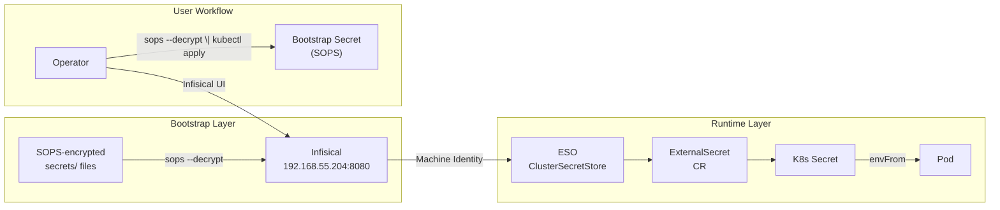



This is the operational companion to [Building Secrets Management](). That post covers the architecture decisions and the three chart bugs that nearly sank the deployment. This one covers what you actually type when an ExternalSecret shows `SecretSyncedError`, a rotated credential isn't picked up, or a SOPS file refuses to decrypt — plus the gotchas we discovered the hard way.

Before any of the commands below, source the environment:

```bash
source .env          # sets KUBECONFIG, TALOSCONFIG
source .env_devops   # sets OMNICONFIG + service accounts
```

## What Healthy Looks Like

Secrets on Frank flow through two layers:

**Runtime secrets** live in Infisical. Applications never touch them directly. External Secrets Operator watches `ExternalSecret` resources, fetches values from Infisical via the `ClusterSecretStore`, and materializes them as native Kubernetes Secrets. The default refresh interval is 5 minutes.

**Bootstrap secrets** are the credentials Infisical and ESO themselves need to start — database passwords, Redis passwords, Machine Identity credentials. These are SOPS-encrypted with age, stored in `secrets/`, and applied manually. They exist outside ArgoCD because ArgoCD cannot decrypt SOPS secrets during ServerSideApply.

The rule: if a secret is needed before Infisical is running, it's a SOPS bootstrap secret. Everything else goes into Infisical.

A healthy secrets layer means every ExternalSecret in every namespace shows `STATUS: SecretSynced` and `READY: True`:

```bash
kubectl get externalsecrets -A
```

```console
$ kubectl get externalsecrets -A
NAMESPACE          NAME                       STORE       REFRESH INTERVAL   STATUS         READY
agents             vk-remote-secrets          infisical   5m                 SecretSynced   True
gitea              gitea-secrets              infisical   5m                 SecretSynced   True
monitoring         grafana-alerting-secrets   infisical   5m                 SecretSynced   True
paperclip-system   paperclip-anthropic        infisical   5m                 SecretSynced   True
paperclip-system   paperclip-auth             infisical   5m                 SecretSynced   True
tekton-pipelines   cosign-key                 infisical   5m                 SecretSynced   True
zot                zot-secrets                infisical   5m                 SecretSynced   True
```

And the `ClusterSecretStore` shows `READY: True`:

```bash
kubectl get clustersecretstore
```



## Verify

### ESO Sync Status

Inspect a specific ExternalSecret for detailed sync history:

```bash
kubectl describe externalsecret <name> -n <namespace>
```

The `Events` section shows recent sync attempts and any error messages. If an ExternalSecret shows `SecretSyncedError`, the first place to look is the `Events` output.

### ClusterSecretStore Health

The `ClusterSecretStore` is the single connection point between ESO and Infisical. If it is unhealthy, no secrets sync:

```bash
kubectl describe clustersecretstore infisical
```

Look for `Ready: True` and `Status: Valid`. Errors here mean the Infisical API is unreachable or the Machine Identity credentials are wrong.

### Infisical UI

The Infisical dashboard at `http://192.168.55.204:8080` shows all secrets in the `frank-cluster` project, organized by environment. The audit log (Project Settings) records who changed what and when — the fastest way to verify a secret's current value or check rotation history.



## Steps

### Adding a New Secret

1. Go to the Infisical UI, navigate to the `frank-cluster` project, `prod` environment
2. Add the key-value pair
3. Create an `ExternalSecret` manifest in the consuming app's manifests directory:

```yaml
apiVersion: external-secrets.io/v1
kind: ExternalSecret
metadata:
  name: my-app-secrets
  namespace: my-app
spec:
  refreshInterval: 5m
  secretStoreRef:
    name: infisical
    kind: ClusterSecretStore
  target:
    name: my-app-secrets
  data:
    - secretKey: MY_SECRET_KEY
      remoteRef:
        key: MY_SECRET_KEY
        conversionStrategy: Default
        decodingStrategy: None
        metadataPolicy: None
```

We always set `conversionStrategy`, `decodingStrategy`, and `metadataPolicy` explicitly now — omitting them caused perpetual ArgoCD OutOfSync because the CRD defaults them on the live object but git had no value (commit `ea842e7b`).

4. Commit and push — ArgoCD syncs the ExternalSecret, ESO fetches the value from Infisical.

### Rotating a Secret

Update the value in the Infisical UI. ESO picks up the change on the next refresh cycle (typically 5m). If the consuming pod reads secrets from environment variables — not files — it needs a restart to see the new value:

```bash
kubectl rollout restart deployment/<app> -n <namespace>
```

If you can't wait for the refresh interval, force an immediate sync:

```bash
kubectl annotate externalsecret <name> -n <namespace> \
  force-sync=$(date +%s) --overwrite
```

### Applying SOPS Bootstrap Secrets

Bootstrap secrets are applied manually whenever they change or after a fresh cluster build:

```bash
sops --decrypt secrets/infisical/infisical-secrets.yaml | kubectl apply -f -
sops --decrypt secrets/infisical/eso-credentials.yaml | kubectl apply -f -
```

To verify a SOPS-encrypted file decrypts correctly without applying:

```bash
sops --decrypt secrets/infisical/infisical-secrets.yaml
```

## Recover

### ESO Sync Failed (SecretSyncedError)

If an ExternalSecret shows `SecretSyncedError`:

1. **Check the ClusterSecretStore** — one unhealthy store breaks all syncs:
   ```bash
   kubectl get clustersecretstore
   kubectl describe clustersecretstore infisical
   ```

2. **Check the ESO controller logs** for API errors:
   ```bash
   kubectl logs -n external-secrets deployment/external-secrets --tail=50
   ```

3. **Verify Infisical is reachable** from the cluster:
   ```bash
   kubectl run curl-test --rm -it --image=curlimages/curl -- \
     curl -s http://192.168.55.204:8080/api/status
   ```

4. **Check the Machine Identity credentials** — the `infisical-credentials` Secret in the `external-secrets` namespace must contain valid `clientId` and `clientSecret`:
   ```bash
   kubectl get secret infisical-credentials -n external-secrets -o yaml
   ```

### The Project Slug Problem

If the ClusterSecretStore returns 404 errors, the project slug is wrong. Infisical auto-generates a URL-safe slug that differs from the display name — `frank-cluster` is the display name, but the actual slug is `frank-cluster-iwpg`.

We hit this during the initial deployment (commits `aefa7916` / `b228e2b5`). The `eso-cluster-reader` Machine Identity has only the Viewer role, which cannot list workspaces via the API — so there's no way to discover the slug programmatically. It must be read from the Infisical UI (Project Settings → General tab) and committed.

If you're setting up a new Infisical project and the slug is unknown, give the identity a higher role temporarily, call `GET /api/v1/workspace`, read the slug, then restore the Viewer role.

The slug lives in `apps/infisical/manifests/cluster-secret-store.yaml`:

```yaml
spec:
  provider:
    infisical:
      auth:
        universalAuthCredentials:
          clientId:
            secretRef:
              ...
          clientSecret:
            secretRef:
              ...
      projectSlug: frank-cluster-iwpg
      environmentSlug: prod
      secretsPath: /
```

### Secret Not Updating After Rotation

If you changed a value in Infisical but the Kubernetes Secret still has the old value:

1. **Check the refresh interval** — the default is 5m, but Tekton's ExternalSecrets use 1h:
   ```bash
   kubectl get externalsecret <name> -n <namespace> -o yaml | grep refreshInterval
   ```

2. **Force a sync** to rule out timing:
   ```bash
   kubectl annotate externalsecret <name> -n <namespace> \
     force-sync=$(date +%s) --overwrite
   ```

3. **Check whether the pod needs a restart** — env vars are read at startup, not live-reloaded:
   ```bash
   kubectl rollout restart deployment/<app> -n <namespace>
   ```

### Pod Blocked at CreateContainerConfigError

If a pod is stuck at `CreateContainerConfigError` and the ESO sync looks healthy, check whether the pod's `envFrom` references a secret key that doesn't exist in Infisical. A non-optional `envFrom` blocks the pod from starting when the referenced key is missing.

We hit this with the alert-agent (commit `eb8328a2`): `OBS_GOATCOUNTER_API_TOKEN` was never seeded into Infisical, so the 404 on the ExternalSecret fetch blocked the entire pod — including the Telegram secrets that were present. The fix was to split GoatCounter into its own ExternalSecret and mark all `envFrom` as `optional: true`.

To check:

```bash
kubectl describe pod <name> -n <namespace>
```

Look for `CreateContainerConfigError` in the Conditions or Events. If an ExternalSecret exists but its target Secret is missing keys, the envFrom will fail:

```bash
kubectl get secret <name> -n <namespace> -o yaml | head -20
```

### SOPS Decrypt Errors

If `sops --decrypt` fails with an age-related error:

1. **Check that the age key is available** — SOPS looks in `$SOPS_AGE_KEY_FILE` or `~/.config/sops/age/keys.txt`:
   ```bash
   echo $SOPS_AGE_KEY_FILE
   ls -la ~/.config/sops/age/keys.txt
   ```

2. **Verify the `.sops.yaml` config** points to the correct age public key:
   ```bash
   cat .sops.yaml
   ```

3. **Check that the file was encrypted for the right key** — the age recipient in the file header must match your key:
   ```bash
   head -5 secrets/infisical/infisical-secrets.yaml
   ```

The Frank cluster uses a single age key `age1ufxvcn4us3cue5dglwn4uk8ctjfpuaw6dqlwu4hjzszf2g4htpcqkszjne` defined in `.sops.yaml`. It has never been rotated.

### ESO Generator Ignores secretRef.Namespace

If you're using an ESO `GithubAccessToken` generator (or any `ClusterGenerator`) and it fails to find its private key:

ESO v2.1.0 resolves the `ClusterGenerator`'s `secretRef` in the **consuming ExternalSecret's namespace**, ignoring the `namespace` field in the secret reference. If the private key Secret lives in `external-secrets` but the ExternalSecret consuming it is in `secure-agent-pod`, the generator fails.

The fix (commit `eb5fa217`) is to move the SOPS-encrypted key Secret to the consuming namespace and drop the misleading `namespace` field. Force a re-sync afterward:

```bash
kubectl annotate externalsecret <name> -n <namespace> \
  force-sync=$(date +%s) --overwrite
```

This clears the cached `generatorState` and triggers a fresh generation.

## Missteps

| What we assumed | Why it was wrong | What it cost |
|---|---|---|
| The Infisical project display name is the same as its API slug | Infisical auto-generates a URL-safe slug (`frank-cluster-iwpg`) from the display name (`frank-cluster`). The Viewer-scoped Machine Identity can't list workspaces to discover it. | ~33 minutes of 404 debugging across 3 sequential fix commits. |
| Omitting defaults from an ExternalSecret manifest keeps it clean | CRDs apply default values for `conversionStrategy`, `decodingStrategy`, and `metadataPolicy` on the live object. Without them in git, ArgoCD detects perpetual drift and shows OutOfSync. | Every ExternalSecret perpetually OutOfSync until the fix. |
| A missing secret key in Infisical would fail gracefully — the pod would start without that one env var | ESO creates the target Secret with only the keys that exist in Infisical. A non-optional `envFrom` referencing the Secret blocks the pod at `CreateContainerConfigError` — including the keys that *are* present. | The alert-agent pod was wedged, blocking Telegram credential delivery, during an active incident. |
| `secretRef.namespace` in an ESO generator applies to the secret's location | ESO v2.1.0 resolves the `ClusterGenerator`'s secret reference in the consuming ExternalSecret's namespace, ignoring the `namespace` field entirely. | Generator silently failed; had to move the private key Secret to the consumer namespace. |

## Quick Reference

| Command | What It Does |
|---------|-------------|
| `kubectl get externalsecrets -A` | Show all ExternalSecrets and their sync status |
| `kubectl describe externalsecret <name> -n <ns>` | Detailed sync status with events |
| `kubectl get clustersecretstore` | ClusterSecretStore health check |
| `kubectl describe clustersecretstore infisical` | Detailed store status and errors |
| `kubectl annotate es <name> -n <ns> force-sync=$(date +%s) --overwrite` | Force immediate ESO sync |
| `kubectl rollout restart deployment/<app> -n <ns>` | Restart pods to pick up rotated secrets |
| `kubectl logs -n external-secrets deployment/external-secrets --tail=50` | ESO controller logs |
| `sops --decrypt <file> \| kubectl apply -f -` | Apply a SOPS-encrypted bootstrap secret |
| `sops --decrypt <file>` | Verify SOPS decryption without applying |

## References

- [Infisical Documentation](https://infisical.com/docs) — Self-hosted setup, Machine Identities, audit logs
- [External Secrets Operator Documentation](https://external-secrets.io/latest/) — ClusterSecretStore, ExternalSecret v1 API
- [ESO Infisical Provider](https://external-secrets.io/latest/provider/infisical/) — Provider-specific configuration and auth
- [SOPS Documentation](https://github.com/getsops/sops) — age encryption, `.sops.yaml` configuration
- [Secrets Management — Infisical + ESO]() — Building post covering architecture and deployment
