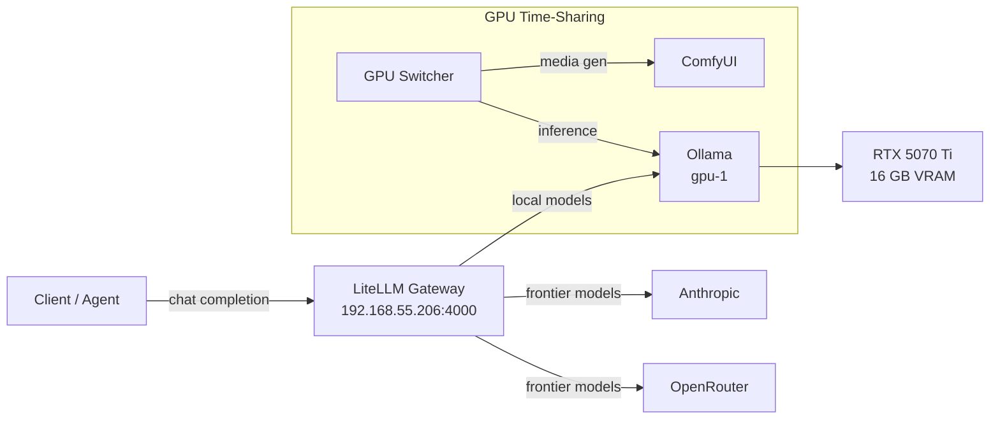



This is the operational companion to [Local Inference](). That post covers the architecture and deployment. This one is what you type when a model won't load, LiteLLM returns 404, or the GPU shows plenty of free  but Ollama insists there's not enough memory — and the probes that keep the ops board honest about a time-shared GPU.

Before any of the commands below, source the environment:

```bash
source .env          # sets KUBECONFIG, TALOSCONFIG
source .env_devops   # sets OMNICONFIG + service accounts
```

## What Healthy Looks Like

The inference stack is healthy when Ollama is running on gpu-1 with at least one model loaded, LiteLLM at `192.168.55.206:4000` is responding, and requests route correctly to either the local GPU or a paid frontier key.

**The end-to-end probe.** gpu-1 time-shares its single GPU between Ollama (inference) and ComfyUI (media generation), so inference is down by design whenever the GPU is handed to ComfyUI — that is not an outage. The ops board reads the real state from a blackbox probe that runs an actual chat completion through LiteLLM: `probe_success{layer="11"}` is `1` only when a completion truly succeeds. A `0` with ComfyUI holding the GPU is expected-quiet-degraded; a `0` with **both** GPU time-share probes at `0` is the only condition that pages (`gpu-node-both-down`). Check GPU ownership with `kubectl -n ollama get deploy ollama` — `0/0` replicas means it yielded the GPU.

> `kube_pod_status_ready` is not a valid inference health check — it is blind to Ollama scaled to 0.



## Verify

### Ollama Status

```bash
# Check the Ollama pod is running
kubectl get pods -n ollama

# List loaded models
kubectl exec -n ollama deploy/ollama -- ollama list

# Check which model is currently in memory
kubectl exec -n ollama deploy/ollama -- ollama ps

# Check GPU memory usage
kubectl exec -n ollama deploy/ollama -- nvidia-smi
```

### LiteLLM Gateway

```bash
# Health check
curl -s http://192.168.55.206:4000/health | jq

# List available models (both local and cloud)
curl -s http://192.168.55.206:4000/v1/models | jq '.data[].id'

# Check LiteLLM pod logs
kubectl logs -n litellm deploy/litellm --tail=50
```

```console
$ curl -s http://192.168.55.206:4000/health/liveliness
"I'm alive!"
$ kubectl -n litellm get pods -o wide
NAME                       READY   STATUS    RESTARTS   AGE   IP              NODE
litellm-84d78cd556-rglgl   1/1     Running   0          25d   10.244.8.237    mini-3
litellm-postgresql-0       1/1     Running   0          28d   10.244.12.161   mini-1
```

## Steps

### Pull or Remove Models

```bash
# Pull a new model
kubectl exec -n ollama deploy/ollama -- ollama pull qwen3:14b

# Remove a model to free disk space
kubectl exec -n ollama deploy/ollama -- ollama rm qwen2.5-coder:14b-instruct-q6_K
```

Never use `postStart` hooks for model pulls on Talos — the nvidia-container-runtime exec hooks fail there (commit `7c88dcc4`). Always pull via `kubectl exec` after the pod is running.

### Test Inference

```bash
# Quick test via LiteLLM
curl -s http://192.168.55.206:4000/v1/chat/completions \
  -H "Authorization: Bearer $LITELLM_MASTER_KEY" \
  -H "Content-Type: application/json" \
  -d '{
    "model": "mistral-small-24b",
    "messages": [{"role": "user", "content": "Hello, one sentence reply."}],
    "max_tokens": 50
  }' | jq '.choices[0].message.content'

# Direct Ollama test (bypassing LiteLLM)
kubectl exec -n ollama deploy/ollama -- curl -s http://localhost:11434/api/generate \
  -d '{"model": "mistral-small3.2:24b", "prompt": "Hello", "stream": false}' | jq '.response'
```

### Check LiteLLM Routing

```bash
# See which models route where
kubectl get configmap -n litellm litellm-config -o yaml | grep -A 5 'model_name'
```

### OpenRouter Free Models (retired)

The cluster no longer routes to OpenRouter free models (commit `46f19ca2`). The policy is local Ollama or a paid frontier key only. If your config still lists `openrouter/*:free` models, remove them.

### Retrieval Endpoints (embeddings + rerank)

The retrieval pair runs separately from Ollama, on a mini's Arc iGPU, and is
deliberately **not** behind LiteLLM. Callers use the service directly.

```bash
# Both servables must read AVAILABLE. This is the diagnostic of record --
# /v2/health/ready is SERVER-level and answers 200 with a dead model.
kubectl -n retrieval exec deploy/ovms-retrieval -c ovms -- \
  curl -s http://127.0.0.1:8000/v1/config | grep -c AVAILABLE     # expect 2

# Confirm the iGPU is enumerated, not just present
kubectl -n retrieval logs deploy/ovms-retrieval -c ovms | grep "Available devices"
# -> Available devices for Open VINO: CPU, GPU

# Who holds the iGPU right now
kubectl get resourceclaims -A
```

```bash
# Rerank: scores must be well separated. Clustered values around 1e-9..1e-12
# mean the wrong model class is being served, and nothing will error.
kubectl -n retrieval exec deploy/ovms-retrieval -c ovms -- curl -s \
  -X POST http://127.0.0.1:8000/v3/rerank -H 'Content-Type: application/json' \
  -d '{"model":"bge-reranker-v2-m3","query":"pruning fruit trees",
       "documents":["Prune apple trees while dormant.","Lima is the capital of Peru."]}'
```

Measured on the iGPU: rerank of 20 candidates runs ~77 ms p50, ~87 ms p95.
Embeddings are 1024-dimensional. A CPU-only arm of the same models on the same
node runs ~1613 ms p50, so a sudden jump into the 1.5-2 s range is the signature
of the GPU repository not being the one that loaded.

## Recover

### Ollama Not Responding

```bash
# Check pod status and events
kubectl describe pod -n ollama -l app.kubernetes.io/name=ollama

# Check if GPU is allocated
kubectl describe node gpu-1 | grep -A 5 "nvidia.com/gpu"

# Check Ollama logs
kubectl logs -n ollama deploy/ollama --tail=100
```

### Out of Memory: Which Kind?

Ollama emits **two error patterns** that both look like "out of memory" but have different root causes. Mis-identify which one you're hitting and you'll waste time trying smaller quants when the issue is something else.

**Pattern A — VRAM exhaustion** (real GPU ). The model genuinely doesn't fit in the RTX 5070 Ti's 16 GB , or you're loading two models at once:

```bash
kubectl exec -n ollama deploy/ollama -- nvidia-smi --query-gpu=memory.used,memory.free --format=csv
```

If `memory.free` is under 1 GB, stop the current model and switch:

```bash
kubectl exec -n ollama deploy/ollama -- ollama stop mistral-small3.2:24b
kubectl exec -n ollama deploy/ollama -- ollama pull qwen2.5-coder:14b-instruct-q4_K_M
```

**Pattern B — container cgroup RAM exhaustion** (the misleading one). The error reads `model requires more system memory (X GiB) than is available (Y MiB)`. "System memory" here means **container RAM**, not VRAM — `nvidia-smi` will show plenty of VRAM free. With `OLLAMA_KEEP_ALIVE=24h`, page cache from previously-loaded model files pins the container near its `resources.limits.memory` ceiling, leaving no room for new-model load buffers.

```bash
kubectl exec -n ollama deploy/ollama -- sh -c 'cat /sys/fs/cgroup/memory.current; echo; cat /sys/fs/cgroup/memory.max'
```

If `memory.current` is within 1–2 GiB of `memory.max`, that's the constraint. We bumped the limit to 64 GiB to fit 24B+ models (commit `8a135bcc`). Reducing `num_ctx` via a derived Modelfile will **not** help here — the bottleneck is at-load buffers, not the  cache.

### Reconciling LiteLLM Aliases vs. Ollama Tags

Two name spaces are in play. LiteLLM **aliases** (`mistral-small-24b`, `gemma-12b`) live in `apps/litellm/values.yaml` under `model_list[].model_name` — consumers send these. Ollama **tags** (`mistral-small3.2:24b`) live under `model_list[].litellm_params.model` — these are what Ollama pulls and runs.

If a request returns "model not found", check both:

```bash
# What aliases does LiteLLM advertise?
curl -s http://192.168.55.206:4000/v1/models \
  -H "Authorization: Bearer $LITELLM_MASTER_KEY" | jq '.data[].id'

# What Ollama tags actually exist on disk?
kubectl exec -n ollama deploy/ollama -- ollama list
```

A second gotcha: we switched the local routing prefix from `ollama/` to `ollama_chat/` (commit `8277c154`) to get native stream-safe tool calling. If existing consumers are still sending `ollama/model` they'll get 404s — update them to `ollama_chat/model`.

### LiteLLM Routing Errors

```bash
# Check LiteLLM logs for routing failures
kubectl logs -n litellm deploy/litellm --tail=100 | grep -i error

# Verify Ollama is reachable from LiteLLM
kubectl exec -n litellm deploy/litellm -- curl -s http://ollama.ollama.svc:11434/api/tags | jq '.models[].name'
```

### Model Loading Very Slow

Large models take 30-60 seconds to load into VRAM. If `nvidia-smi` shows no memory being allocated, the model is falling back to CPU — extremely slow. Check Ollama logs for "no compatible  device" or similar.

### Retrieval Model Not Serving

| Symptom | Cause | Fix |
|---------|-------|-----|
| Pod `Ready`, every retrieval request fails | Readiness was pointed at `/v2/health/ready`, which reports server not model | Check `GET /v1/config`; probes belong on `/v2/models/<name>/ready` |
| `seed-models` initContainer exit 137 in seconds | Dirty-page pressure copying the repository to Longhorn | Per-file `cp` with a bare `sync`; limit above the largest single file |
| Pod stuck `Pending`, no events | The `ResourceClaimTemplate` filters on capacity; the iGPU reports `memory: "0"` | Remove any capacity or CEL memory selector |
| Stale weights after a model bump | Seed marker still matches an unchanged `MODELS_REV` | Bump `MODELS_REV` so tag and marker both move |
| Rerank scores all ~1e-9, no error | Wrong model class being served | Confirm the reranker is a cross-encoder, not an LLM-style reranker |

## Missteps

| What we assumed | Why it was wrong | What it cost |
|---|---|---|
| PostStart hooks are a fine place to pull models | Talos' nvidia-container-runtime doesn't support exec hooks inside the container at startup — the hook fails silently before Ollama starts, causing a CrashLoopBackOff. | Every deployment of a new model version required a manual post-fix workaround until we removed the hooks. |
| Bumping container `resources.limits.memory` was unnecessary — 24B+ models would fit in the default limit | `OLLAMA_KEEP_ALIVE=24h` causes page cache from previously-loaded models to accumulate, leaving no room for new-model load buffers. The error looks like a VRAM problem but `nvidia-smi` shows free GPU memory. | Several rounds of quant-size debugging before discovering the cgroup was the constraint. |
| LiteLLM's `ollama/` model prefix would work for tool-calling agents | The `ollama/` route prefix doesn't support native stream-safe tool calling — agents that called tools through it got garbled responses. | A cluster-wide consumption pattern fix (`ollama/` → `ollama_chat/`, commit `8277c154`) once the tool-calling use case emerged. |
| OpenRouter free-tier models would provide a useful fallback | Free models had unreliable availability, inconsistent quality, and changing rate limits — they broke silently more often than they worked. | Retired entirely (commit `46f19ca2`). The complexity of managing the model list wasn't worth the never-working fallback. |

## Quick Reference

| Command | What It Does |
|---------|-------------|
| `kubectl exec -n ollama deploy/ollama -- ollama list` | List downloaded models |
| `kubectl exec -n ollama deploy/ollama -- ollama ps` | Show model currently in memory |
| `kubectl exec -n ollama deploy/ollama -- ollama pull <model>` | Download a model |
| `kubectl exec -n ollama deploy/ollama -- ollama rm <model>` | Delete a model |
| `kubectl exec -n ollama deploy/ollama -- nvidia-smi` | Check GPU memory usage |
| `curl http://192.168.55.206:4000/health` | LiteLLM health check |
| `curl http://192.168.55.206:4000/v1/models` | List available models |
| `kubectl logs -n litellm deploy/litellm` | LiteLLM proxy logs |
| `kubectl logs -n ollama deploy/ollama` | Ollama server logs |
| `kubectl -n retrieval exec deploy/ovms-retrieval -c ovms -- curl -s http://127.0.0.1:8000/v1/config` | Per-servable state of the retrieval models |
| `kubectl get resourceclaims -A` | Who currently holds a DRA-claimed device |
| `kubectl -n retrieval logs deploy/ovms-retrieval -c seed-models` | Model-repository seed log (skip vs reseed) |

## References

- [Ollama API Reference](https://github.com/ollama/ollama/blob/main/docs/api.md)
- [LiteLLM Documentation](https://docs.litellm.ai/)
- [Building Post — Local Inference]()
- [Building Post — Retrieval on the Idle iGPUs]()
