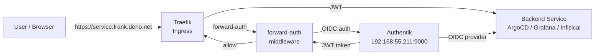



This is the operational companion to [Unified Auth](). That post covers the OIDC provider setup and forward auth proxy configuration. This one is what you type when users can't log in, the login page loops, or clicking a forward-auth-protected service redirects your browser to `http://0.0.0.0:9000` — a bug we shipped and fixed.

Before any of the commands below, source the environment:

```bash
source .env          # sets KUBECONFIG, TALOSCONFIG
source .env_devops   # sets OMNICONFIG + service accounts
```

## What Healthy Looks Like

Authentication is healthy when Authentik at `192.168.55.211:9000` is responding, all OIDC providers show valid status in the admin UI, and users can log into ArgoCD, Grafana, and Infisical via SSO without errors. Forward auth passes requests through for Longhorn UI, Hubble UI, and Sympozium without redirect loops.





## Verify

### Authentik Status

```bash
# Check Authentik pods
kubectl get pods -n authentik

# Check server and worker logs
kubectl logs -n authentik deploy/authentik-server --tail=50
kubectl logs -n authentik deploy/authentik-worker --tail=50
```

### API Access

Authentik API requires a Bearer token. Create one via the Django shell:

```bash
# Get a shell into the Authentik server
kubectl exec -n authentik deploy/authentik-server -it -- ak shell
```

```python
from authentik.core.models import Token, TokenIntents, User
user = User.objects.get(username="akadmin")
token, created = Token.objects.get_or_create(
    identifier="api-ops",
    defaults={"user": user, "intent": TokenIntents.INTENT_API}
)
print(token.key)
```

```bash
# List providers via API
curl -s -H "Authorization: Bearer <token>" \
  http://192.168.55.211:9000/api/v3/providers/all/ | jq '.results[].name'

# List users
curl -s -H "Authorization: Bearer <token>" \
  http://192.168.55.211:9000/api/v3/core/users/ | jq '.results[] | {username, email, is_active}'
```

## Steps

### Add Users and Groups

```bash
# Create a user via API
curl -s -X POST -H "Authorization: Bearer <token>" \
  -H "Content-Type: application/json" \
  http://192.168.55.211:9000/api/v3/core/users/ \
  -d '{"username": "newuser", "name": "New User", "email": "user@example.com", "is_active": true}'

# List groups
curl -s -H "Authorization: Bearer <token>" \
  http://192.168.55.211:9000/api/v3/core/groups/ | jq '.results[] | {name, pk}'
```

The Authentik admin UI at `http://192.168.55.211:9000/if/admin/` is often faster for one-off changes.

### Rotate OIDC Client Secrets

1. Generate a new secret in Authentik admin UI under the provider settings
2. Update the secret in Infisical (the source of truth)
3. Force ESO to resync: `kubectl annotate es <name> -n <ns> force-sync=$(date +%s) --overwrite`
4. Restart the affected service to pick up the new secret

For Grafana specifically, the secret key name must be exactly `GF_AUTH_GENERIC_OAUTH_CLIENT_SECRET` in the Kubernetes Secret — not `client_secret` or `clientSecret`. Authentik sets it one way; Grafana's envFrom reads it by that exact key.

### Manage API Tokens

```bash
# List API tokens via Django shell
kubectl exec -n authentik deploy/authentik-server -it -- ak shell
```

```python
from authentik.core.models import Token
for t in Token.objects.filter(intent="api"):
    print(f"{t.identifier}: {t.user.username} expires={t.expires}")
```

## Recover

### Forward Auth Redirects to `0.0.0.0`

If clicking a forward-auth-protected service (e.g., Longhorn, Hubble, the dashboard) redirects the browser to `http://0.0.0.0:9000/...` instead of `https://auth.frank.derio.net/...`:

The embedded outpost doesn't know its own external URL. We fixed this in commit `abaae01d` by setting `AUTHENTIK_HOST` in `apps/authentik/values.yaml`:

```yaml
global:
  env:
    - name: AUTHENTIK_HOST
      value: "https://auth.frank.derio.net"
```

After updating the values file, ArgoCD syncs the change. Verify:

```bash
# Check that the env var is set on the server pods
kubectl get deploy -n authentik authentik-server \
  -o jsonpath='{.spec.template.spec.containers[0].env[?(@.name=="AUTHENTIK_HOST")].value}'
# Expected: https://auth.frank.derio.net

# Test that forward-auth now redirects correctly
curl -sk -o /dev/null -w "%{redirect_url}\n" https://longhorn.frank.derio.net/
# Expected: https://auth.frank.derio.net/outpost.goauthentik.io/... (not 0.0.0.0)
```

### OIDC Login Loop

If a service redirects back and forth between the login page:

```bash
# Check Authentik server logs for OIDC errors
kubectl logs -n authentik deploy/authentik-server --tail=100 | grep -i "oauth\|oidc\|redirect"

# Verify redirect URIs match exactly
curl -s -H "Authorization: Bearer <token>" \
  http://192.168.55.211:9000/api/v3/providers/oauth2/ | jq '.results[] | {name, redirect_uris}'
```

Common causes:
- Redirect URI mismatch — must be exact, including trailing slash
- `redirect_uris` must be a list in the Authentik 2026.x API (not a single string)
- Missing `invalidation_flow` in provider config (required in 2026.x)

### Forward Auth 403

```bash
# Check the forward auth outpost logs
kubectl logs -n authentik -l app.kubernetes.io/component=outpost --tail=50

# Verify the outpost can reach the Authentik server
kubectl exec -n authentik -l app.kubernetes.io/component=outpost -- \
  curl -s http://authentik-server.authentik.svc:9000/api/v3/root/config/
```

### Grafana Secret Key Mismatch

If Grafana shows "login error" after OIDC redirect:

```bash
# Verify the secret key name in the K8s Secret
kubectl get secret -n grafana grafana-oidc -o jsonpath='{.data}' | jq 'keys'

# Must contain: GF_AUTH_GENERIC_OAUTH_CLIENT_SECRET
# NOT: client_secret or clientSecret
```

### Token Validation Failures

```bash
# Test the OIDC well-known endpoint
curl -s http://192.168.55.211:9000/application/o/<provider-slug>/.well-known/openid-configuration | jq

# Check token endpoint manually
curl -s -X POST http://192.168.55.211:9000/application/o/token/ \
  -d "grant_type=client_credentials&client_id=<id>&client_secret=<secret>"
```

## Missteps

| What we assumed | Why it was wrong | What it cost |
|---|---|---|
| The embedded forward-auth outpost would resolve its own external URL from context | Authentik's outpost doesn't know the external-facing hostname without the `AUTHENTIK_HOST` env var — it defaults to `0.0.0.0:9000` internally. | Every forward-auth-protected service redirected to `0.0.0.0:9000` until `abaae01d` added the explicit env var. |
| The K8s Secret key name for Grafana OIDC would match what Authentik sends | Authentik sends the secret as a key-value pair, but `envFromSecret` reads it by the key name `GF_AUTH_GENERIC_OAUTH_CLIENT_SECRET` — not `client_secret` or `clientSecret`. | Grafana's OIDC login showed a generic "login error" with no useful log message until the key name mismatch was traced. |
| Forward auth works the same way for every protected service | Some services (like the Hermes agent shell dashboard) don't interact well with Authentik's forward auth at all — the redirect loop or 403 can't be fixed with config alone. | Dashboard access was switched to basic auth instead (commits `7b3ad79f`, `8438ec39`). |

## Quick Reference

| Command | What It Does |
|---------|-------------|
| `kubectl get pods -n authentik` | Check Authentik pod status |
| `kubectl logs -n authentik deploy/authentik-server` | Server logs |
| `kubectl logs -n authentik deploy/authentik-worker` | Worker logs |
| `kubectl exec -n authentik deploy/authentik-server -it -- ak shell` | Django admin shell |
| `curl -H "Authorization: Bearer <token>" .../api/v3/core/users/` | List users via API |
| `curl .../api/v3/providers/oauth2/` | List OIDC providers |
| `curl .../.well-known/openid-configuration` | Test OIDC discovery |

## References

- [Authentik Documentation](https://docs.goauthentik.io/docs/)
- [Authentik API Reference](https://docs.goauthentik.io/developer-docs/api/)
- [Building Post — Unified Auth]()
