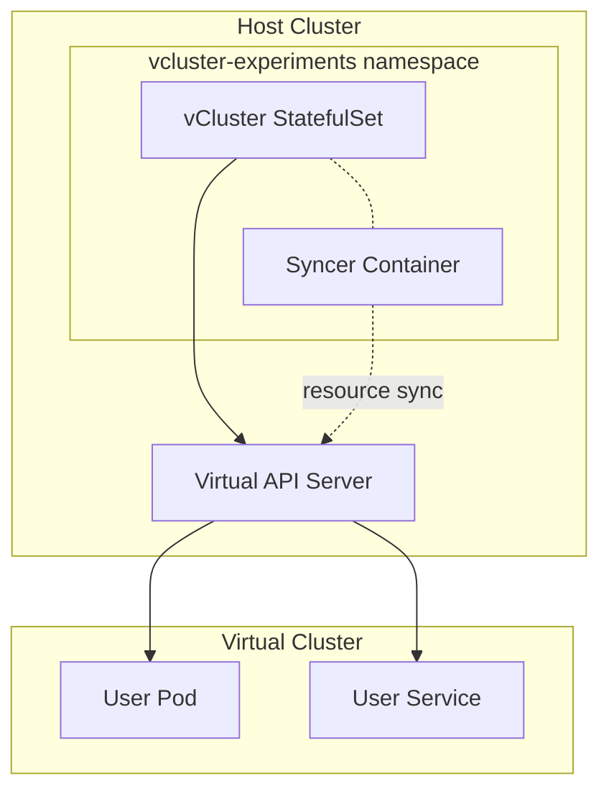



This is the operational companion to [Multi-tenancy](). That post covers the architecture and template pattern. This one is what you type when a virtual cluster's API server isn't responding, resources aren't syncing, or a tenant hit their quota.

Before any commands below, source the environment:

```bash
source .env          # sets KUBECONFIG, TALOSCONFIG
source .env_devops   # sets OMNICONFIG + service accounts
```

## What Healthy Looks Like

All vCluster StatefulSets are running, each virtual cluster's API server is responding, and resources sync correctly between virtual and host clusters. ArgoCD applications for each vCluster show `Synced` and `Healthy`.



## Verify

### List Virtual Clusters

```bash
# Using vcluster CLI
vcluster list

# Check vCluster pods on the host
kubectl get pods -A -l app=vcluster

# Check ArgoCD status for vCluster apps
argocd app list --port-forward --port-forward-namespace argocd | grep vcluster
```

```console
$ vcluster list

     NAME     |      NAMESPACE       | STATUS  | VERSION | CONNECTED | AGE
  ------------+----------------------+---------+---------+-----------+------
    experiments | vcluster-experiments | Running | 0.32.1  |           | 39d

$ kubectl get statefulset -A -l app=vcluster
NAMESPACE              NAME          READY   AGE
vcluster-experiments   experiments   1/1     39d
```

### Connect to a Virtual Cluster

```bash
# Connect and switch kubectl context
vcluster connect <name> --namespace <namespace>

# Verify you are in the virtual cluster
kubectl get nodes
kubectl get namespaces

# Disconnect when done
vcluster disconnect
```

### Check Synced Resources

```bash
# From the host cluster, check what the syncer is doing
kubectl logs -n <vcluster-namespace> <vcluster-pod> -c syncer --tail=50

# Check resource sync status
kubectl get pods -n <vcluster-namespace> -l vcluster.loft.sh/managed-by
```

## Steps

### Create a New Virtual Cluster

New vClusters follow the template pattern:

```bash
cp -r apps/vclusters/template/ apps/vclusters/<new-name>/
```

2. Customize `apps/vclusters/<new-name>/values.yaml` — set the name, resource quotas, and any specific configuration.
3. Add the ArgoCD Application CR in `apps/root/templates/vcluster-<new-name>.yaml` following the existing pattern.
4. Commit and push — ArgoCD picks it up automatically.

### Delete a Virtual Cluster

Since `prune: false`, removing a vCluster requires manual cleanup:

```bash
# Delete the ArgoCD application
argocd app delete vcluster-<name> --port-forward --port-forward-namespace argocd

# Verify the namespace is cleaned up
kubectl get ns <vcluster-namespace>
```

Then remove the files from `apps/vclusters/<name>/` and `apps/root/templates/vcluster-<name>.yaml`.

### Manage Resource Quotas

```bash
# Check current quotas from inside the virtual cluster
vcluster connect <name> --namespace <namespace>
kubectl get resourcequota -A

# Check host-level resource usage for the vCluster namespace
vcluster disconnect
kubectl top pods -n <vcluster-namespace>
```

To adjust quotas, update the values in `apps/vclusters/<name>/values.yaml` and let ArgoCD sync.

## Recover

### Virtual API Server Not Responding

```bash
# Check the StatefulSet
kubectl get statefulset -n <vcluster-namespace>
kubectl describe statefulset -n <vcluster-namespace> <vcluster-name>

# Check the PVC for the virtual etcd
kubectl get pvc -n <vcluster-namespace>

# Check pod logs
kubectl logs -n <vcluster-namespace> <vcluster-pod> -c vcluster --tail=100
```

Common causes: PVC stuck pending (storage class issue), resource limits too low for the API server, or the host node where the StatefulSet is scheduled is under pressure.

### Resources Not Syncing

```bash
# Check syncer logs for errors
kubectl logs -n <vcluster-namespace> <vcluster-pod> -c syncer --tail=100 | grep -i error

# Verify sync configuration in values.yaml
kubectl get configmap -n <vcluster-namespace> -l app=vcluster -o yaml | grep -A 20 sync
```

### Resource Quota Exceeded

```bash
# Connect to the virtual cluster and check
vcluster connect <name> --namespace <namespace>
kubectl describe resourcequota -A

# Check which pods are consuming the most
kubectl top pods -A --sort-by=memory
vcluster disconnect
```

### Network Connectivity Issues

```bash
# Test DNS from inside the virtual cluster
vcluster connect <name> --namespace <namespace>
kubectl run test --image=busybox --rm -it --restart=Never -- nslookup kubernetes.default

# Test connectivity to a host service
kubectl run test --image=busybox --rm -it --restart=Never -- wget -qO- http://<host-service>
vcluster disconnect
```

## Missteps

| What we assumed | Why it was wrong | What it cost |
|---|---|---|
| The template pattern means creating a new vCluster is a simple copy-and-commit | Each vCluster needs unique resource quotas, sync config, and ArgoCD Application CR. Forgetting any of the three registration points leaves the vCluster orphaned or misconfigured. | Repeated manual fixes until a checklist was formalized. |
| `prune: false` means we can delete vCluster manifests without side effects | ArgoCD won't clean up the namespace or resources when the Application is removed — they must be cleaned manually or they accumulate. | Stale namespaces and PVCs left behind after vCluster deletion. |

## Quick Reference

| Command | What It Does |
|---------|-------------|
| `vcluster list` | List all virtual clusters |
| `vcluster connect <name> -n <ns>` | Switch kubectl to virtual cluster |
| `vcluster disconnect` | Return to host cluster context |
| `kubectl get pods -A -l app=vcluster` | Check vCluster pods on host |
| `kubectl logs -n <ns> <pod> -c syncer` | Check resource sync logs |
| `kubectl logs -n <ns> <pod> -c vcluster` | Check virtual API server logs |
| `kubectl get pvc -n <ns>` | Check virtual etcd storage |
| `argocd app list \| grep vcluster` | ArgoCD status for vClusters |

## References

- [vCluster Documentation](https://www.vcluster.com/docs)
- [vCluster CLI Reference](https://www.vcluster.com/docs/vcluster/reference/vcluster-cli)
- [Building Post — Multi-tenancy]()
